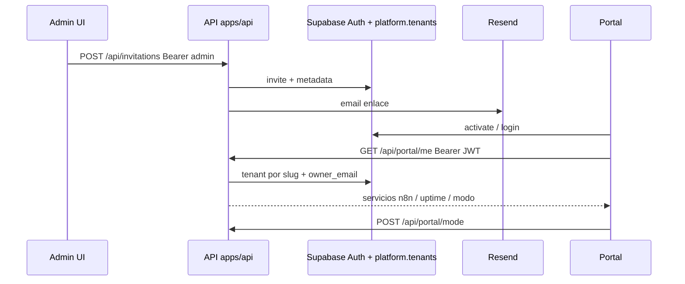
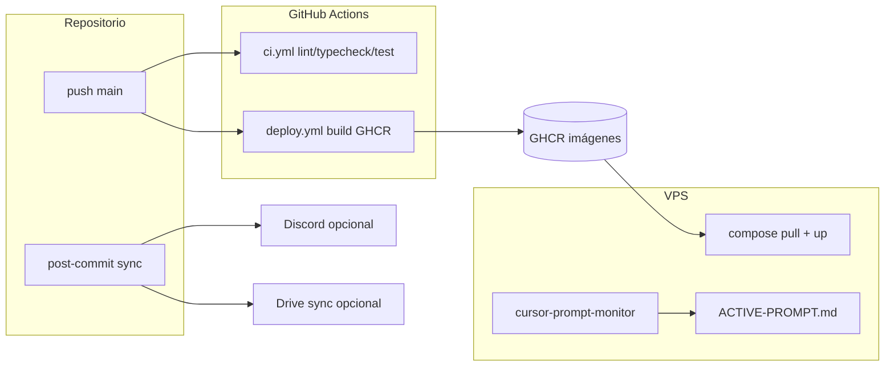
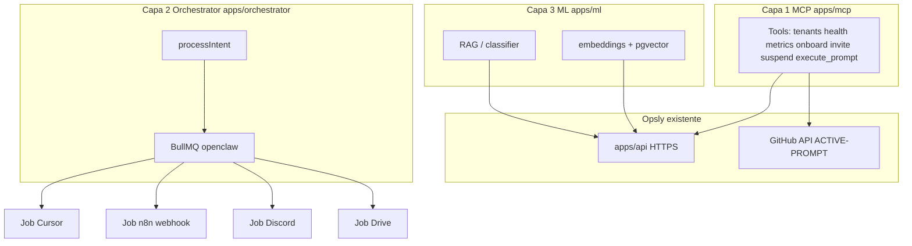

# Opsly — Contexto del Agente

> Fuente de verdad para cada sesión nueva.
> Al iniciar: lee este archivo completo antes de cualquier acción.
> Al terminar: actualiza las secciones marcadas con 🔄.

---

## Flujo de sesión (humano + Cursor)

**Al abrir una sesión nueva conmigo (otro agente / otro dispositivo):**

1. Asegúrate de que `AGENTS.md` en `main` está actualizado (último commit en GitHub).
2. **Contexto:** lee `VISION.md` una vez (el norte del producto); lee `AGENTS.md` siempre (estado de la sesión); para arquitectura, consulta `docs/adr/`. Ante decisiones nuevas, verifica alineación con `VISION.md` y documéntalas aquí (y ADR si aplica).
3. Pega en el chat la **URL raw** del archivo para que el agente lo cargue sin clonar:
   - Formato: `https://raw.githubusercontent.com/<org>/<repo>/<branch>/AGENTS.md`
   - Ejemplo: `https://raw.githubusercontent.com/cloudsysops/opsly/main/AGENTS.md`
   - Si la raw da **404** pese a repo público: revisar org/repo/rama (`main`), probar vista web `https://github.com/cloudsysops/opsly/blob/main/AGENTS.md`, o **adjuntar / pegar** este archivo completo en el chat (alternativa válida).
4. Pide explícitamente: *«Lee el contenido de esa URL y actúa según AGENTS.md»*.

**Al cerrar la sesión con Cursor — copiar/pegar esto:**

```
Flujo de cierre:
1. Actualiza AGENTS.md (todas las secciones 🔄).
2. Commit y push a main (mensaje claro, ej. docs(agents): estado sesión YYYY-MM-DD).
   Con `core.hooksPath=.githooks`, el post-commit copia AGENTS y system_state a `.github/` (revisa `git status` por si hace falta un commit extra).
   Alternativa: `./scripts/update-agents.sh` para espejar AGENTS, VISION y `context/system_state.json` y pushear.
3. Respóndeme con la URL raw de AGENTS.md en main para que la pegue al abrir la próxima sesión.

https://raw.githubusercontent.com/cloudsysops/opsly/main/AGENTS.md
```

**Resumen:** Cursor deja `AGENTS.md` al día → commit/push a `main` → tú pegas la URL raw al iniciar la próxima sesión con el agente → listo.

### Flujo con Claude (multi-agente)

1. **Contexto:** misma **URL raw** de `AGENTS.md` (arriba) y, si aplica, `VISION.md` — referencias en `.claude/CLAUDE.md`.
2. **Prompt operativo en VPS (opcional):** `docs/ACTIVE-PROMPT.md` — tras `git pull` en `/opt/opsly`, el servicio **`cursor-prompt-monitor`** (`scripts/cursor-prompt-monitor.sh`, unidad `infra/systemd/cursor-prompt-monitor.service`) detecta cambios cada **30 s** y ejecuta el contenido filtrado como shell. **Solo** líneas que no empiezan por `#` ni `---`; si todo es comentario, no ejecuta nada. **Riesgo RCE** si alguien no confiable puede editar ese archivo.
3. **Logs en VPS:** `/opt/opsly/logs/cursor-prompt-monitor.log` (directorio `logs/` ignorado en git).
4. **Docs de apoyo:** `docs/CLAUDE-WORKFLOW-OPTIMIZATION.md`, `docs/OPENCLAW-ARCHITECTURE.md`.
5. **Espejo Google Drive (opcional):** `docs/GOOGLE-DRIVE-SYNC.md`, lista `docs/opsly-drive-files.list`, config `.opsly-drive-config.json` — útil si Claude (u otro asistente) tiene Drive conectado; la fuente de verdad sigue siendo git/GitHub.

---

## Rol

Eres el arquitecto senior de **Opsly** — plataforma multi-tenant SaaS
que despliega stacks de agentes autónomos (n8n, Uptime Kuma) por cliente,
con facturación Stripe, backups automáticos y dashboard de administración.

---

## Fase 4 — Multi-agente Opsly (plan de trabajo)

**Ámbito:** orquestación y operación con **varios agentes** (Cursor, Claude, automatismos) sobre un **único contexto** (`AGENTS.md`, `VISION.md`, `config/opsly.config.json`), sin cambiar las decisiones fijas de infra (Compose, Traefik v3, Doppler, Supabase).

| Objetivo | Entregable / nota |
|----------|-------------------|
| Modelo de orquestación | `docs/OPENCLAW-ARCHITECTURE.md` — Redis, motor de decisiones, costos |
| Eficiencia de sesiones | `docs/CLAUDE-WORKFLOW-OPTIMIZATION.md` — 10 técnicas de flujo |
| Contexto siempre publicado | URL raw de `AGENTS.md` + hooks; opcional `scripts/auto-push-watcher.sh` y/o `docs/ACTIVE-PROMPT.md` + `cursor-prompt-monitor` en VPS |
| Criterios de salida (borrador) | ADR si hay cola/orquestador nuevo; métricas de jobs; runbook de incidentes multi-agente |

**Automatización opcional (VPS):** unidad `infra/systemd/opsly-watcher.service` y guía `docs/AUTO-PUSH-WATCHER.md`. No sustituye revisión humana ni política de secretos.

**Relación con `VISION.md`:** las fases 1–3 del producto siguen siendo el norte comercial; la **Fase 4** aquí nombra la **capa de trabajo multi-agente y documentación operativa** que las alimenta.

---

## 🔄 Estado actual

<!-- Actualizar al final de cada sesión -->

**Fecha última actualización:** 2026-04-07 — **Sesión Cursor (automation pipeline v1 + autodiagnóstico):** Fase 0 audit completada y versionada en `docs/reports/audit-2026-04-07.md` (VPS `cursor-prompt-monitor`/`opsly-watcher` activos; Doppler OK para `DISCORD_WEBHOOK_URL`, `RESEND_API_KEY`, `PLATFORM_ADMIN_TOKEN`; faltan `GOOGLE_DRIVE_TOKEN` y `GITHUB_TOKEN_N8N`). Fase 1 plan versionado en `docs/AUTOMATION-PLAN.md`. Fase 2 TDD: nuevos tests `scripts/test-{notify-discord,drive-sync,n8n-webhook}.sh` creados y ejecutados. Fase 3 implementación: `scripts/notify-discord.sh`, `scripts/drive-sync.sh`, mejoras en `.githooks/post-commit` (notificación + drive sync condicional) y `scripts/cursor-prompt-monitor.sh` (before/after/error a Discord). Fase 4 documentación n8n: `docs/n8n-workflows/discord-to-github.json` + `docs/N8N-SETUP.md`. Fase 5 validación: tests unitarios en verde, `drive-sync --dry-run` OK, type-check verde, commit vacío de verificación de hook (`test(automation): verify post-commit hooks`). Flujo Claude documentado: `docs/ACTIVE-PROMPT.md`, `scripts/cursor-prompt-monitor.sh`, `infra/systemd/cursor-prompt-monitor.service`, logs en `logs/`. Fase 4 (plan multi-agente): `docs/OPENCLAW-ARCHITECTURE.md`, `docs/CLAUDE-WORKFLOW-OPTIMIZATION.md`, `docs/AUTO-PUSH-WATCHER.md`, `scripts/auto-push-watcher.sh`, `infra/systemd/opsly-watcher.service`. **2026-04-07 —** **Fase 2 invite/onboard:** `./scripts/validate-config.sh` → **LISTO PARA DEPLOY**. **Portal staging:** `https://portal.ops.smiletripcare.com/login` → **200** (tras recuperar contenedores `app`/`admin`/`portal` que habían quedado en `Created` y **404** en Traefik; ver `docs/TROUBLESHOOTING.md` y `deploy.yml` con `--force-recreate`). **`curl api`/health** → `status ok` (con `supabase: degraded`). **Contenedores Opsly:** `traefik`, `infra-redis-1`, `infra-app-*`, `opsly_admin`, `opsly_portal`; stacks de tenants `smiletripcare`, `peskids`, `intcloudsysops` activos en VPS. **Autodiagnóstico y ejecución autónoma:** commits `97616fe` y `docs/N8N-IMPORT-GUIDE.md` actualizado con estado operativo; limpieza de disco VPS aplicada (`100%` → `83%`), notificaciones Discord enviadas por cada acción, `drive-sync --dry-run` validado. **Pendiente real para cierre end-to-end:** `GITHUB_TOKEN_N8N`, `GOOGLE_DRIVE_TOKEN`, `STRIPE_SECRET_KEY` válido y bajar disco de VPS por debajo de `80%`.

**Completado ✅**

* **2026-04-06 — Bloques A/B/C (plan 3 vías):** Vitest en `apps/api`: tests nuevos para `validation`, `portal-me`, `pollPortsUntilHealthy`, rutas `tenants` y `tenants/[id]` (`npm run test` 67 tests, `npm run type-check` verde). Documentación: `docs/runbooks/{admin,dev,managed,incident}.md`, ADR-006–008, `docs/FAQ.md`. Terraform: `infra/terraform/terraform.tfvars.example` (placeholders), `terraform plan -input=false` con `TF_VAR_*` de ejemplo y nota en `infra/terraform/README.md`.
* **2026-04-06 — CURSOR-EXECUTE-NOW (archivo `/home/claude/CURSOR-EXECUTE-NOW.md` no presente en workspace):** +36 casos en 4 archivos `*.test.ts` (health, metrics, portal, suspend/resume) + `invitations-stripe-routes.test.ts` para cobertura de `route.ts`; `npm run test:coverage` ~89% líneas en `app/api/**/route.ts`; `health/route.ts` recorta slashes finales en URL Supabase; `docs/FAQ.md` enlaces Markdown validados; `infra/terraform/tfplan.txt` + `.gitignore` `infra/terraform/tfplan`.
* **2026-04-06 — cursor-autonomous-plan (archivo `/home/claude/cursor-autonomous-plan.md` no presente):** SUB-A `lib/api-response.ts` + refactor `auth`, `tenants`, `metrics`, `tenants/[id]`; SUB-C `docs/SECURITY_AUDIT_REPORT.md`; SUB-B `TROUBLESHOOTING.md`, `SECURITY_CHECKLIST.md`, `PERFORMANCE_BASELINE.md`; SUB-D `OBSERVABILITY.md`; SUB-E `docs/openapi-opsly-api.yaml`.

*Sesión Cursor — qué se hizo (orden aproximado):*
* **2026-04-07 noche (autónomo):** diagnóstico integral (VPS/Doppler/Actions/Supabase/health/tests), prune Docker seguro en VPS, `drive-sync --dry-run` validado, actualización de `docs/N8N-IMPORT-GUIDE.md` con estado actual de secretos y comando exacto, reporte final de bloqueos humanos, commit `chore(auto): autonomous diagnostic and fixes 2026-04-07`.
* **2026-04-07 tarde:** Runbook invitaciones (`docs/INVITATIONS_RUNBOOK.md`); plan UI admin; plantilla n8n; auditoría Doppler (nombres solo); Vitest + 6 tests `invitation-admin-flow`; `/api/health` con metadata; scripts `test-e2e-invite-flow.sh`, `generate-tenant-config.sh`; `onboard-tenant.sh` `--help` y dry-run sin env; tipos portal `@/types`; logs invitaciones redactados.
* **2026-04-07 (pasos 1–5 sin markdown externo):** Validación local + snapshot VPS + health público; commit **`96e9a38`** en remoto y disco VPS; archivo tarea Claude **no** presente en workspace.
* **2026-04-07 — Cursor (automation protocol v1):** `docs/reports/audit-2026-04-07.md` + `docs/AUTOMATION-PLAN.md`; TDD de `notify-discord`, `drive-sync`, `n8n-webhook`; implementación de `scripts/notify-discord.sh` y `scripts/drive-sync.sh`; integración en `.githooks/post-commit` y `scripts/cursor-prompt-monitor.sh`; documentación `docs/N8N-SETUP.md` + `docs/n8n-workflows/discord-to-github.json`; validación local y commit de test hook.
* **2026-04-06 — Cursor (handoff AGENTS + endurecimiento E2E):** Varias iteraciones de «lee AGENTS raw + próximo paso» para arranque multi-agente; **`docs: update AGENTS.md`** al cierre de sesión con URL raw para la siguiente; cambios en **`scripts/test-e2e-invite-flow.sh`** (dry-run sin admin token, slug por defecto alineado a staging, redacción de salida, timeouts).
0. **GHCR deploy 2026-04-06 (tarde)** — Auditoría: paquetes `intcloudsysops-{api,admin,portal}` existen y son privados; 403 no era “solo portal” sino PAT sin acceso efectivo a manifiestos. **`deploy.yml`**: login en VPS con token del workflow; pulls alineados al compose.
1. **Scaffold portal** — `apps/portal` (Next 15, Tailwind, login, `/invite/[token]`, dashboards developer/managed, `middleware`, libs Supabase, `output: standalone`, sin `any`).
2. **API** — `GET /api/portal/me`, `POST /api/portal/mode`, invitaciones `POST /api/invitations` + Resend; **`lib/portal-me.ts`**, **`portal-auth.ts`**, **`cors-origins.ts`**, **`apps/api/middleware.ts`**.
3. **Corrección crítica** — El cliente ya llamaba **`/api/portal/me`** pero la API exponía solo **`/tenant`** → handler movido a **`app/api/portal/me/route.ts`**, eliminado **`tenant`**, imports relativos corregidos (`../../../../lib/...`); **`npm run type-check`** en verde.
4. **Hook** — **`apps/portal/hooks/usePortalTenant.ts`** (opcional) para fetch con sesión.
5. **Managed** — Sin email fijo; solo **`NEXT_PUBLIC_SUPPORT_EMAIL`** o mensaje de configuración en UI.
6. **Infra/CI** — Imagen **`ghcr.io/cloudsysops/intcloudsysops-portal:latest`**, servicio **`portal`** en compose, job Deploy con **`up … portal`**; build-args **`NEXT_PUBLIC_*`** alineados a admin.
7. **Git** — `feat(portal): add client dashboard…` → `fix(api): serve portal session at GET /api/portal/me (remove /tenant)` → `docs(agents): portal built…` → `docs(agents): fix portal API path /me vs /tenant in AGENTS` → push a **`main`**.

*Portal cliente `apps/portal` (detalle en repo):*

**App (`apps/portal`)**
- Next.js 15, TypeScript, Tailwind, shadcn-style UI, tema dark fondo `#0a0a0a`.
- Rutas: `/` → redirect `/login`; `/login` (email + password; sin registro público); `/invite/[token]` con query **`email`** — `verifyOtp({ type: "invite" })` + `updateUser({ password })` → `/dashboard`; `/dashboard` — selector de modo (Developer / Managed) vía **`POST /api/portal/mode`**; **sin** auto-redirect desde `/dashboard` cuando ya hay `user_metadata.mode` (el enlace «Cambiar modo» del shell vuelve al selector); `/dashboard/developer` y `/dashboard/managed` — server **`requirePortalPayload()`** en `lib/portal-server.ts` → **`fetchPortalTenant`** en `lib/tenant.ts` → **`GET /api/portal/me`** con Bearer JWT.
- Middleware: `lib/supabase/middleware.ts` (sesión Supabase); rutas `/dashboard/*` protegidas (login e invite públicos).
- Componentes: `ModeSelector`, `PortalShell`, `ServiceCard`, `StatusBadge` + `healthFromReachable`, `CredentialReveal` (password **30 s** visible y luego oculto), `DeveloperActions` (copiar URL n8n / credenciales). Managed: email de soporte solo si está definido **`NEXT_PUBLIC_SUPPORT_EMAIL`** (si no, aviso en UI). Hook opcional cliente **`usePortalTenant`** en `apps/portal/hooks/` (si se usa en evoluciones).

**API (`apps/api`) — datos portal**
- **`GET /api/portal/me`** — `app/api/portal/me/route.ts`. JWT Bearer → **`getUserFromAuthorizationHeader`** (`lib/portal-auth.ts`) + **`lib/portal-me.ts`**: `readPortalTenantSlugFromUser`, `fetchPortalTenantRowBySlug`, `parsePortalServices` (`n8n`, `uptime_kuma`, credenciales basic auth), `portalUrlReachable`, `parsePortalMode`; umbrales en **`PORTAL_URL_PROBE`** (`lib/constants.ts`). Comprueba **owner_email** del tenant vs usuario. *(En documentación de producto a veces se nombra el mismo contrato como `GET /api/portal/tenant`; en el código actual el path publicado es **`/api/portal/me`**.)*
- **`POST /api/portal/mode`** — body `{ mode: "developer" | "managed" }` → `auth.admin.updateUserById` con merge de **`user_metadata.mode`**.
- **`POST /api/invitations`** — header admin **`Authorization: Bearer`** o **`x-admin-token`** (**`requireAdminToken`**); body: **`email`**, **`slug` *o* `tenantRef`** (mismo patrón 3–30), **`name`** opcional (default nombre tenant), **`mode`** opcional `developer` \| `managed` (va en `data` del invite Supabase). Respuesta **200**: **`ok`**, **`tenant_id`**, **`link`**, **`email`**, **`token`**. Implementación: **`lib/invitation-admin-flow.ts`** + **`lib/portal-invitations.ts`** (HTML dark, Resend; URL **`PORTAL_SITE_URL`** o **`https://portal.${PLATFORM_DOMAIN}`**). El email del body debe coincidir con **`owner_email`** del tenant. Requiere **`RESEND_API_KEY`** y remitente (**`RESEND_FROM_EMAIL`** o **`RESEND_FROM_ADDRESS`**) en el entorno del contenedor API.

**CORS / Next API**
- **`apps/api/middleware.ts`** + **`lib/cors-origins.ts`**: orígenes explícitos (`NEXT_PUBLIC_ADMIN_URL`, `NEXT_PUBLIC_PORTAL_URL`, `https://admin.${PLATFORM_DOMAIN}`, `https://portal.${PLATFORM_DOMAIN}`); matcher `/api/:path*`; OPTIONS 204 con headers cuando el `Origin` está permitido.
- **`apps/api/next.config.ts`**: `output: "standalone"`, `outputFileTracingRoot`; **sin** duplicar headers CORS en `next.config` para no chocar con el middleware.

**Infra / CI**
- **`apps/portal/Dockerfile`**: multi-stage, standalone, `EXPOSE 3002`, `node server.js`; build-args `NEXT_PUBLIC_SUPABASE_*`, `NEXT_PUBLIC_API_URL` (y los que defina `deploy.yml`).
- **`infra/docker-compose.platform.yml`**: servicio **`portal`**, Traefik `Host(\`portal.${PLATFORM_DOMAIN}\`)`, TLS, puerto contenedor **3002**, vars `NEXT_PUBLIC_*`; red acorde al compose actual (p. ej. `traefik-public` para el router).
- **`.github/workflows/deploy.yml`** y **`ci.yml`**: type-check/lint/build del workspace **portal**; imagen **`ghcr.io/cloudsysops/intcloudsysops-portal:latest`** en paralelo con api/admin; job **deploy** hace `docker login ghcr.io` en el VPS con **`github.token`** y **`github.actor`** (paquetes ligados al repo).

**Calidad**
- `npm run type-check` (Turbo) en verde antes de commit; ESLint en rutas API portal (`me`, `mode`) y **`lib/portal-me.ts`**; pre-commit acotado a `apps/api/app` + `apps/api/lib`; **`apps/portal/eslint.config.js`** ignora **`.next/**`** y **`eslint.config.js`** para no lintar artefactos ni el propio config CommonJS.

**Git (referencia)**
- Hitos: **`feat(portal): add client dashboard with developer and managed modes`**; **`fix(api): serve portal session at GET /api/portal/me`**; espejo **`chore: sync AGENTS mirror…`**; correcciones **`docs(agents): …`** (p. ej. path `/me` vs `/tenant`). Este archivo: commit **`docs: update AGENTS.md 2026-04-06`**. Repo remoto: **`cloudsysops/opsly`**.

*CORS + `NEXT_PUBLIC_*` en build admin + `deploy.yml` (2026-04-06, commit `8f12487` `fix(admin): add CORS headers and Supabase build args`, pusheado a `main`):*
- **Problema:** el navegador en `admin.${PLATFORM_DOMAIN}` hacía `fetch` a `api.${PLATFORM_DOMAIN}` y la API rechazaba por **CORS**.
- **`apps/api/next.config.ts`:** `headers()` en rutas `/api/:path*` con `Access-Control-Allow-Origin` (sin `*`), `Allow-Methods` (`GET,POST,PATCH,DELETE,OPTIONS`), `Allow-Headers` (`Content-Type`, `Authorization`, `x-admin-token`). Origen: `NEXT_PUBLIC_ADMIN_URL` si existe; si no, `https://admin.${PLATFORM_DOMAIN}`. Si no hay origen resuelto, **no** se envían headers CORS (evita wildcard y URLs inventadas).
- **`apps/api/Dockerfile` (builder):** `ARG`/`ENV` `PLATFORM_DOMAIN` y `NEXT_PUBLIC_ADMIN_URL` **antes** de `npm run build` — los headers de `next.config` se resuelven en **build time** en la imagen.
- **`apps/admin/Dockerfile` (builder):** `ARG`/`ENV` `NEXT_PUBLIC_SUPABASE_URL`, `NEXT_PUBLIC_SUPABASE_ANON_KEY`, `NEXT_PUBLIC_API_URL` antes del build (Next hornea `NEXT_PUBLIC_*`).
- **`.github/workflows/deploy.yml`:** en *Build and push API image*, `build-args: PLATFORM_DOMAIN=${{ secrets.PLATFORM_DOMAIN }}`. En *Admin*, `build-args` con `NEXT_PUBLIC_SUPABASE_URL`, `NEXT_PUBLIC_SUPABASE_ANON_KEY` y `NEXT_PUBLIC_API_URL=https://api.${{ secrets.PLATFORM_DOMAIN }}`. Comentario en cabecera del YAML con comandos `gh secret set` para el repo.
- **Secretos GitHub requeridos en el job build** (valores desde Doppler `prd`): `NEXT_PUBLIC_SUPABASE_URL`, `NEXT_PUBLIC_SUPABASE_ANON_KEY`, `PLATFORM_DOMAIN`. Sin ellos el build de admin o el origen CORS en API pueden fallar o quedar vacíos.
- **Verificación local:** `npm run type-check` en verde antes del commit; post-deploy humano: `https://admin.ops.smiletripcare.com/dashboard` sin errores de CORS/Supabase en consola (tras definir secrets y un run verde de **Deploy**).

*Admin dashboard + API métricas — sesión Cursor 2026-04-04 (stakeholders / familia):*

**Objetivo:** Admin en `apps/admin` operativo y legible, con datos reales del VPS y del tenant `smiletripcare` (Supabase `platform.tenants`), sin autenticación Supabase en modo demo.

**URL pública:** https://admin.ops.smiletripcare.com — Traefik router `opsly-admin`, `Host(admin.${PLATFORM_DOMAIN})`, `entrypoints=websecure`, `tls=true`, `tls.certresolver=letsencrypt`, servicio puerto **3001** (`infra/docker-compose.platform.yml`).

**Admin — pantallas y UX**
- **`/dashboard`:** Gauge circular CPU (verde si el uso es menor que 60%, amarillo si es menor que 85%, rojo en caso contrario; hex `#22c55e` / `#eab308` / `#ef4444`), RAM y disco en GB con `Progress` (shadcn/Radix), uptime legible, conteo tenants activos y contenedores Docker en ejecución; **SWR cada 30 s** contra la API. Tema dark, fondo `#0a0a0a`, valores en `font-mono`. Aviso en UI si la API devuelve **`mock: true`** (Prometheus no alcanzable).
- **`/tenants`:** Tabla: slug, plan, status (badges: active verde, provisioning amarillo, failed rojo, etc.), `created_at`. Clic en fila expande: URLs n8n y Uptime con botones «Abrir», email owner, fechas; enlace a detalle.
- **`/tenants/[tenantRef]`:** Detalle por **slug o UUID** (carpeta dinámica `[tenantRef]`). Header con nombre y status; cards plan / email / creado; botones n8n y Uptime; **iframe** a `{uptime_base}/status/{slug}` (Uptime Kuma) con texto de ayuda si bloquea por `X-Frame-Options`; sección containers y URLs técnicas.
- **Chrome:** Marca **Opsly**, sidebar solo **Dashboard | Tenants**, footer: `Opsly Platform v1.0 · staging · ops.smiletripcare.com`.
- **Dependencias admin:** `@radix-ui/react-progress`, componente `components/ui/progress.tsx`, `CpuGauge`, hook `useSystemMetrics`.

**API (`apps/api`)**
- **`GET /api/metrics/system`** — Proxy a Prometheus (`/api/v1/query`). Consultas: CPU `100 - (avg(rate(node_cpu_seconds_total{mode="idle"}[5m])) * 100)`; RAM `sum(MemTotal)-sum(MemAvailable)`; disco `sum(size)-sum(free)` con `mountpoint="/"`; uptime `time() - node_boot_time_seconds`. Respuesta JSON incluye `cpu_percent`, `ram_*_gb`, `disk_*_gb`, `uptime_seconds`, `active_tenants` (Supabase), `containers_running` (`docker ps -q` vía **execa**), `mock`. Implementación modular: `lib/prometheus.ts`, `lib/fetch-host-metrics-prometheus.ts`, `lib/docker-running-count.ts`, fallback mock en `DEMO_SYSTEM_METRICS_MOCK` (`lib/constants.ts`).
- **`GET /api/tenants`**, **`GET /api/metrics`**, **`GET /api/tenants/:ref`:** Con `ADMIN_PUBLIC_DEMO_READ=true`, los **GET** omiten `PLATFORM_ADMIN_TOKEN` (`requireAdminTokenUnlessDemoRead` en `lib/auth.ts`). **`:ref`** = UUID o slug (`TenantRefParamSchema` en `lib/validation.ts` + `TENANT_ROUTE_REF` en constants). POST/PATCH/DELETE sin cambios (token obligatorio).
- **Prometheus en Docker:** Desde el contenedor `app`, `localhost:9090` no es el host; en compose: `PROMETHEUS_BASE_URL` default `http://host.docker.internal:9090`, `extra_hosts: host.docker.internal:host-gateway`.

**Admin — demo sin login**
- **`NEXT_PUBLIC_ADMIN_PUBLIC_DEMO=true`** por **ARG** en `apps/admin/Dockerfile` (build); `lib/supabase/middleware.ts` devuelve `NextResponse.next` sin redirigir a `/login`. `app/api/audit-log/route.ts` omite comprobación de usuario Supabase en ese modo.
- **`lib/api-client.ts`:** Sin header `Authorization` en demo; **`getBaseUrl()`** infiere `https://api.<suffix>` si el host del navegador empieza por `admin.` (y `http://127.0.0.1:3000` en localhost), para no depender de `NEXT_PUBLIC_API_URL` en build.

**Tooling / calidad**
- **`.eslintrc.json`:** El override de **`apps/api/lib/constants.ts`** (`no-magic-numbers: off`) se movió **después** del bloque `apps/api/**/*.ts`; si va antes, el segundo override volvía a activar la regla sobre `constants.ts`.

**Verificación y despliegue**
- `npm run type-check` (Turbo) en verde antes de commit; pre-commit ESLint en rutas API tocadas.
- Tras push a `main`, CI despliega imágenes GHCR. **Hasta `pull` + `up` de `app` y `admin` en el VPS**, una imagen admin antigua puede seguir redirigiendo a `/login` (307): hace falta imagen nueva con el ARG de demo y, en `.env`, **`ADMIN_PUBLIC_DEMO_READ=true`** para el servicio **`app`**.
- Comprobación sugerida post-deploy: `curl -sfk https://admin.ops.smiletripcare.com` (esperar HTML del dashboard, no solo redirect a login).

*Primer tenant en staging — smiletripcare (2026-04-06, verificado ✅):*
- **Slug:** `smiletripcare` — fila en `platform.tenants` + stack compose en VPS (`scripts/onboard-tenant.sh`).
- **n8n:** https://n8n-smiletripcare.ops.smiletripcare.com ✅
- **Uptime Kuma:** https://uptime-smiletripcare.ops.smiletripcare.com ✅
- **Credenciales n8n:** guardadas en Doppler proyecto `ops-intcloudsysops` / config **`prd`** (no repetir en repo ni en chat).

*Sesión agente Cursor — Supabase producción + onboarding (2026-04-07):*
- **Proyecto Supabase:** `https://jkwykpldnitavhmtuzmo.supabase.co` (ref `jkwykpldnitavhmtuzmo`). Secretos desde Doppler `ops-intcloudsysops` / `prd`: `SUPABASE_SERVICE_ROLE_KEY` OK; **`SUPABASE_DB_PASSWORD` no existe** en `prd` (solo `SUPABASE_URL`, claves anon/public, service role).
- **`npx supabase link --project-ref jkwykpldnitavhmtuzmo --yes`:** enlazó sin pedir password en el entorno usado (sesión CLI ya autenticada).
- **`npx supabase db push` — fallo inicial:** dos archivos **`0003_*.sql`** (`port_allocations` y `rls_policies`) compiten por la misma versión en `supabase_migrations.schema_migrations` → error `duplicate key ... (version)=(0003)`.
- **Corrección en repo:** renombrar RLS a **`0007_rls_policies.sql`** (orden aplicado: `0001` … `0006`, luego `0007`). Segundo **`db push`:** OK (`0004`–`0007` según estado previo del remoto).
- **Verificación tablas:** `npx supabase db query --linked` → existen **`platform.tenants`** y **`platform.subscriptions`** en Postgres.
- **REST / PostgREST (histórico previo al onboard 2026-04-06):** faltaba exponer `platform` y/o `GRANT` — resuelto antes del primer tenant; la API debe usar `Accept-Profile: platform` contra `platform.tenants` según config actual del proyecto.
- **Onboarding smiletripcare (planificación, sin ejecutar):** no existe `scripts/onboard.sh`; el script es **`scripts/onboard-tenant.sh`** con `--slug`, `--email`, `--plan` (`startup` \| `business` \| `enterprise`). URLs del template: `https://n8n-{slug}.{PLATFORM_DOMAIN}/` y `https://uptime-{slug}.{PLATFORM_DOMAIN}/` (p. ej. `ops.smiletripcare.com`). El bloque *Próximo paso* histórico mencionaba `plan: pro` y hosts distintos — **desalineado** con el CHECK SQL y la plantilla; usar el script real antes de ejecutar.

*Capas de calidad de código — monorepo Opsly (2026-04-05, commit `d4acfcb` `feat(quality): add code patterns, SOLID rules and automated review layers`, pusheado a `main`):*
- **CAPA 1 — `.vscode/settings.json`:** `formatOnSave`, `codeActionsOnSave` (ESLint + organize imports), imports relativos TS/JS, Copilot en español (`github.copilot.chat.localeOverride: "es"`), Copilot habilitado por lenguajes del stack, `eslint.validate` para JS/TS/TSX; comentarios en español por grupo de opciones.
- **CAPA 2 — ESLint raíz:** `.eslintrc.json` con reglas estrictas en `apps/api` (`complexity` 10, `max-lines-per-function` 50 warn, `no-magic-numbers` con ignore `[0,1,-1,100,1000]`, `@typescript-eslint/no-explicit-any` error, `explicit-function-return-type` warn, `no-nested-ternary`, `prefer-const`, `eqeqeq`); **override final** para `apps/api/lib/constants.ts` sin `no-magic-numbers` (debe ir **después** del bloque `apps/api/**` para que no lo pise). **`eslint.config.mjs`:** flat config con `FlatCompat` + `recommendedConfig`/`allConfig` desde `@eslint/js`; ignores para `apps/web`, `apps/admin`, `next-env.d.ts`, etc.
- **Dependencias raíz:** `eslint`, `@eslint/js`, `@eslint/eslintrc`, `@typescript-eslint/parser`, `@typescript-eslint/eslint-plugin`, `typescript` (dev) para ejecutar ESLint desde la raíz del monorepo.
- **CAPA 3 — `.github/copilot-instructions.md`:** secciones añadidas (sin borrar lo existente): patrones Repository/Factory/Observer/Strategy; algoritmos (listas, Supabase, BullMQ backoff, paginación cursor, Redis TTL); SOLID aplicado a Opsly; reglas de estilo; plantilla route handler en `apps/api`; plantilla script bash (`set -euo pipefail`, `--dry-run`, `main`).
- **CAPA 4 — `.cursor/rules/opsly.mdc`:** checklist “antes de escribir código”, “antes de script bash”, “antes de commit” (type-check, sin `any`, sin secretos).
- **CAPA 5 — `.claude/CLAUDE.md`:** sección “Cómo programar en Opsly” (AGENTS/VISION, ADR, lista *Nunca*, estructura según copilot-instructions, patrones Repository/Factory/Strategy, plan antes de cambios terraform/infra).
- **CAPA 6 — `apps/api/lib/constants.ts`:** `HTTP_STATUS`, `TENANT_STATUS`, `BILLING_PLANS`, `RETRY_CONFIG`, `CACHE_TTL` y constantes de orquestación/compose/JSON (sin secretos); comentarios en español.
- **CAPA 7 — `.githooks/pre-commit`:** tras `npm run type-check` (Turbo), si hay staged bajo `apps/api/app/` o `apps/api/lib/` (`.ts`/`.tsx`), ejecuta `npx eslint --max-warnings 0` solo sobre esos archivos; mensaje de error en español si falla. **No** aplica ESLint estricto a `apps/web` ni `apps/admin` vía este hook.
- **Refactors API para cumplir reglas:** `app/api/metrics/route.ts` (helpers de conteos Supabase, `firstMetricsError` con `new Error(message)` por TS2741), `webhooks/stripe/route.ts`, `lib/orchestrator.ts`, `lib/docker/compose-generator.ts`, `lib/email/index.ts`, `lib/validation.ts` usando `lib/constants.ts`.
- **Verificación local:** `npx eslint "apps/api/**/*.ts" --max-warnings 0` y `npm run type-check` en verde antes del commit de calidad.

*Sesión agente Cursor — deploy staging VPS (2026-04-04 / 2026-04-05, cronología):*
- **`./scripts/validate-config.sh`:** LISTO PARA DEPLOY (JSON, DNS, Doppler críticos, SSH VPS OK).
- **`git pull` en `/opt/opsly`:** falló por `scripts/vps-first-run.sh` **untracked** (copia manual previa); merge abortado. Fix documentado: `cp scripts/vps-first-run.sh /tmp/…bak && rm scripts/vps-first-run.sh` luego `git pull origin main`.
- **Post-pull:** `fast-forward` a `main` reciente (incluye `vps-bootstrap.sh`, `vps-first-run.sh` trackeados). Primer `./scripts/vps-bootstrap.sh` falló: **Doppler CLI no estaba en PATH** en el VPS.
- **Doppler en VPS:** instalación vía `apt` requiere **root/sudo**; desde SSH no interactivo falló sin contraseña. Tras preparación en el servidor, **`doppler --version`** → `v3.75.3` (CLI operativa).
- **Service token:** `doppler configs tokens create` **desde el VPS falló** (sin sesión humana); token creado **desde Mac** (`vps-production-token`, proyecto `ops-intcloudsysops` / `prd`) y `doppler configure set token … --scope /opt/opsly` en el VPS. **Rotar** token si hubo exposición en chat/logs.
- **`doppler secrets --only-names` en VPS:** OK (lista completa de vars en `prd`).
- **`./scripts/vps-bootstrap.sh`:** OK — `doppler secrets download` → `/opt/opsly/.env`, red `traefik-public`, directorios. En el resumen de nombres del `.env` apareció una línea **ajena a convención `KEY=VALUE`** (cadena tipo `wLzJ…`); revisar `.env` en VPS por líneas sueltas o valores sin clave.
- **`./scripts/vps-first-run.sh`:** falló con **`denied`** al pull de `ghcr.io/cloudsysops/intcloudsysops-{api,admin}:latest` hasta tener **`docker login ghcr.io`**.
- **Login GHCR desde Doppler (estado inicial):** en `prd` aún no existían `GHCR_TOKEN` / `GHCR_USER`; el `get` desde VPS fallaba hasta poblar `prd` (ver actualización siguiente).
- **`context/system_state.json`:** en sesiones previas quedó bloqueo `git_pull_blocked_untracked` / `blocked_vps_git_merge`; tras GHCR + first-run + health conviene alinear `vps` / `deploy_staging` / `next_action` otra vez.

*Doppler / GHCR — cierre de brecha `prd` y login Docker (2026-04-05):*
- En **`stg`** ya existía **`GHCR_USER`**; el PAT **no** estaba como `GHCR_TOKEN` sino como **`TOKEN_GH_OSPSLY`** (en Doppler los nombres de secreto **solo** pueden usar mayúsculas, números y **`_`** — no guiones; `TOKEN-GH-OSPSLY` no es válido en CLI).
- **`GHCR_TOKEN` en `stg`:** el `get` directo falló; fuente del PAT para copiar a `prd`: **`TOKEN_GH_OSPSLY`** en `stg`.
- **Sincronización a `prd`:** `doppler secrets set GHCR_USER=… GHCR_TOKEN=… --project ops-intcloudsysops --config prd` leyendo usuario desde `stg` y token desde `TOKEN_GH_OSPSLY`. Cualquier `secrets set` que muestre el valor en tabla CLI implica **rotar el PAT en GitHub** y actualizar el secreto en Doppler si hubo exposición en logs/chat.
- **Verificación local sin imprimir valores:**  
  `doppler secrets get GHCR_TOKEN --plain --project ops-intcloudsysops --config prd >/dev/null && echo "GHCR_TOKEN prd: OK"` (igual para `GHCR_USER`).
- **`docker login` en el VPS con Doppler:** un one-liner `ssh … "doppler secrets get …"` **sin** `cd /opt/opsly` falla con **`you must provide a token`** y **`username is empty`**, porque el **service token** está configurado con **`doppler configure set token … --scope /opt/opsly`** y solo aplica bajo ese directorio. **Obligatorio:** `cd /opt/opsly &&` antes de `doppler secrets get` y el pipe a `docker login ghcr.io … --password-stdin`.
- **Resultado verificado:** `Login Succeeded` en el VPS (Docker avisa que las credenciales quedan en `~/.docker/config.json` sin credential helper; opcional configurar helper).
- **Verificación rutas en VPS:** `ls /opt` incluye `opsly`; `ls /opt/opsly` muestra árbol del repo (`apps`, `infra`, `scripts`, etc.).
- **`vps-first-run.sh` tras login GHCR (2026-04-05):** falló con **`not found`** al resolver `ghcr.io/cloudsysops/intcloudsysops-api:latest` (y pull de `admin` interrumpido). **Auth GHCR OK;** el bloqueo actual es que **esa referencia de imagen/tag no existe** en el registry (o el nombre del paquete en GHCR difiere). Alinear `APP_IMAGE` / `ADMIN_APP_IMAGE` en Doppler con paquetes reales o **publicar** imágenes con CI.
- **Inventario GHCR desde Mac (`gh api`):** sin comillas, **zsh** expande `?` en la URL → `no matches found`. Con URL entre comillas, sin scope **`read:packages`** en el token de `gh` → **HTTP 403** (*You need at least read:packages scope to list packages*). Para listar: `gh api '/orgs/cloudsysops/packages?package_type=container' --jq '.[].name'` con token adecuado.
- **Workflows en `.github/workflows/`:** `backup.yml`, `ci.yml`, `cleanup-demos.yml`, `deploy-staging.yml`, `deploy.yml`, `validate-context.yml`, **`nightly-fix.yml`** (calidad nocturna: typecheck, lint, health, auto-fix, report).
- **Dockerfiles:** existen `apps/api/Dockerfile` y `apps/admin/Dockerfile` en el repo.

*CI — `deploy.yml`: build+push GHCR y deploy por pull en VPS (commit `0e4123b`, 2026-04-05):*
- El job **`build`** (solo Node build en Actions) se sustituyó por **`build-and-push`:** `permissions: contents: read`, `packages: write`; **`docker/login-action@v3`** contra `ghcr.io` con `${{ github.actor }}` y **`${{ secrets.GITHUB_TOKEN }}`** (si el login en Actions falla por token vacío, usar **`${{ github.token }}`** según documentación de GitHub).
- Dos pasos **`docker/build-push-action@v5`:** `context: .`, `file: apps/api/Dockerfile` y `apps/admin/Dockerfile`, **`push: true`**, tags **`ghcr.io/cloudsysops/intcloudsysops-api:latest`** y **`ghcr.io/cloudsysops/intcloudsysops-admin:latest`**. Desde **2026-04-06** (`8f12487`): **build-args** en API (`PLATFORM_DOMAIN`) y admin (`NEXT_PUBLIC_SUPABASE_*`, `NEXT_PUBLIC_API_URL` con `secrets.PLATFORM_DOMAIN`).
- Job **`deploy`** ahora **`needs: build-and-push`**. Script SSH en VPS: `git fetch` / `reset` en `/opt/opsly`, **`npm ci`** en raíz (sin `npm run build` en `apps/api` ni `apps/admin`); en **`infra/`** → **`docker compose -f docker-compose.platform.yml pull`** y **`docker compose up -d --no-deps app admin`** (sin **`--build`**).
- **`infra/docker-compose.platform.yml`:** imágenes por defecto pasan a **`ghcr.io/cloudsysops/intcloudsysops-api:latest`** y **`ghcr.io/cloudsysops/intcloudsysops-admin:latest`** (sustituye `tu-org` en los defaults).
- **Doppler `prd`:** **`APP_IMAGE`** y **`ADMIN_APP_IMAGE`** actualizados a esas mismas URLs para alinear `.env` del VPS tras bootstrap.
- **Contexto histórico:** antes de este cambio, `deploy.yml` hacía build Next en el VPS con **`compose --build app`** únicamente; **`vps-first-run`** y pulls manuales dependían de imágenes publicadas en GHCR que aún no existían → **`not found`**. El pipeline anterior queda **obsoleto** respecto al flujo GHCR descrito arriba.

*CI/deploy — GHCR desde Actions, health, Traefik, `.env` compose, Discord, VPS (2026-04-05, sesión Cursor):*
- **`deploy.yml` — login GHCR en el VPS sin Doppler:** el script SSH ya no usa `doppler secrets get GHCR_TOKEN/GHCR_USER`. En el step *Deploy via SSH*: `env` con `GHCR_USER: ${{ github.actor }}`, `GHCR_PAT: ${{ secrets.GITHUB_TOKEN }}`; `envs: PLATFORM_DOMAIN,GHCR_USER,GHCR_PAT` para `appleboy/ssh-action`; en remoto: `echo "$GHCR_PAT" | docker login ghcr.io -u "$GHCR_USER" --password-stdin`. Job **`deploy`** con **`permissions: contents: read, packages: read`** para que `GITHUB_TOKEN` pueda autenticar lectura en GHCR al reutilizarse como PAT en el VPS.
- **`apps/api/package.json` y `apps/admin/package.json`:** añadido script **`start`** (`next start -p 3000` / `3001`). Sin él, los contenedores entraban en bucle con *Missing script: "start"* pese a imagen correcta.
- **Health check post-deploy (SSH):** **`curl -sfk "https://api.${PLATFORM_DOMAIN}/api/health"`**; mensaje *Esperando que Traefik registre routers…*, luego **`sleep 60`**, hasta **5 intentos** con **`sleep 15`** entre fallos; en el intento 5 fallido: logs **`docker logs infra-app-1`** y **`exit 1`**. Secret **`PLATFORM_DOMAIN`** = dominio **base** (ej. **`ops.smiletripcare.com`**).
- **`infra/docker-compose.platform.yml` — router Traefik para la API:** labels del servicio **`app`** con `traefik.http.routers.app.rule=Host(\`api.${PLATFORM_DOMAIN}\`)`, **`entrypoints=websecure`**, **`tls=true`**, **`tls.certresolver=letsencrypt`**, **`service=app`**, **`traefik.http.services.app.loadbalancer.server.port=3000`**, `traefik.enable=true`, **`traefik.docker.network=traefik-public`**. Redes: **`traefik`** y **`app`** en **`traefik-public`** (externa); `app` también en `internal` (Redis). Middlewares de archivo se mantienen en el router `app`.
- **Interpolación de variables en Compose:** por defecto Compose busca `.env` en el directorio del proyecto (junto a `infra/docker-compose.platform.yml`), **no** en `/opt/opsly/.env`. En **`deploy.yml`**, **`docker compose --env-file /opt/opsly/.env -f docker-compose.platform.yml pull`** y el mismo **`--env-file`** en **`up`**, para que `${PLATFORM_DOMAIN}`, `${ACME_EMAIL}`, `${REDIS_PASSWORD}`, etc. se resuelvan en labels y `environment`. Comentario en el YAML del compose documenta esto.
- **Discord en GitHub Actions:** **no** usar **`secrets.…` dentro de expresiones `if:`** en steps (p. ej. `if: failure() && secrets.DISCORD_WEBHOOK_URL != ''`) — el workflow queda **inválido** (*workflow file issue*, run ~0s sin logs). Solución: `if: success()` / `if: failure()` y en el script: si `DISCORD_WEBHOOK_URL` vacío → mensaje y **`exit 0`** (no-op); evita `curl: (3) URL rejected` con webhook vacío.
- **VPS — disco lleno durante `docker compose pull`:** error *no space left on device* al extraer capas (p. ej. bajo `/var/lib/containerd/.../node_modules/...`). Tras **`docker image prune -af`** y **`docker builder prune -af`** se recuperó espacio (orden ~5GB en un caso); **`df -h /`** pasó de ~**99%** a ~**68%** uso en el mismo host.
- **Diagnóstico health con app “Ready”:** en un run, `infra-app-1` mostraba Next *Ready in Xs* pero el `curl` del job fallaba: suele ser **routing TLS/Traefik** o **`PLATFORM_DOMAIN` / interpolación** incorrecta en labels; las correcciones anteriores apuntan a eso.
- **Traefik — logs en VPS:** error **`client version 1.24 is too old`** frente a Docker Engine 29 (mínimo API elevado): el cliente **embebido** del provider no lo corrigen vars de entorno del servicio Traefik en compose (p. ej. **`DOCKER_API_VERSION`** solo afecta al CLI). **Mitigación en repo:** imagen **`traefik:v3.3`** en `docker-compose.platform.yml` (negociación dinámica de API). **Opcional en VPS:** **`vps-bootstrap.sh`** paso **`[j]`** crea **`/etc/docker/daemon.json`** con **`api-version-compat: true`** solo si el archivo **no** existe; luego **`sudo systemctl restart docker`** manual si aplica.

*Traefik — socket Docker, API y grupo `docker` (2026-04-05, seguimiento Cursor):*
- **API Docker:** priorizar Traefik v3.3+ frente a Engine 29.x; ver fila en *Decisiones*. No confundir vars de entorno del contenedor Traefik con el cliente Go embebido del provider.
- **Volumen `/var/run/docker.sock` sin `:ro`:** Traefik v3 puede requerir permisos completos en el socket para eventos del provider Docker.
- **`api.insecure: true`** en **`infra/traefik/traefik.yml`:** expone dashboard/API en **:8080** sin TLS (**solo depuración**). En compose, **`127.0.0.1:8080:8080`** para no publicar el dashboard a Internet; conviene volver a **`insecure: false`** y quitar el mapeo en producción.
- **`group_add: ["${DOCKER_GID:-999}"]`:** el socket suele ser **`root:docker`** (`srw-rw----`). La imagen Traefik corre con usuario no root; hay que añadir el **GID numérico** del grupo `docker` del **host** al contenedor. Se quitó **`user: root`** como enfoque principal en favor de este patrón.
- **`DOCKER_GID` en `/opt/opsly/.env`:** **`scripts/vps-bootstrap.sh`** (paso **`[i]`**) obtiene **`stat -c %g /var/run/docker.sock`** y añade **`DOCKER_GID=…`** al `.env` si no existe línea `^DOCKER_GID=` (no sobrescribe). **`scripts/validate-config.sh`:** tras SSH OK, comprueba que **`${VPS_PATH}/.env`** en el VPS contenga **`DOCKER_GID`**; si no, **warning** con instrucción de ejecutar bootstrap o añadir la línea manualmente.
- **`scripts/vps-first-run.sh`:** al inicio, si **`docker info`** falla → error (daemon/socket/permisos del usuario que ejecuta el script).
- **Raíz del compose:** sin clave **`version:`** (obsoleta en Compose moderno, eliminaba warning).
- **Commits de referencia:** `ed38256` (`fix(traefik): set DOCKER_API_VERSION and fix socket mount…`), `57f0440` (`fix(traefik): fix docker provider config and socket access…` — insecure, health 5×15s, `docker info` en first-run), `0df201c` (`fix(traefik): add docker group and API version to fix socket discovery` — `group_add`, bootstrap/validate `DOCKER_GID`). Histórico previo del mismo hilo: `393bc3c` … `03068a0` (`--env-file`). Runs ejemplo: `24008556692`, `24008712390`, `24009183221`.

*Intento deploy staging → `https://api.ops.smiletripcare.com/api/health` (2026-04-05):*
- **Paso 1 — Auditoría:** revisados `config/opsly.config.json` (sin secretos), `.env.local.example` (placeholders), `infra/docker-compose.platform.yml` (solo nombres de vars), y por SSH el árbol `.env*` bajo `/opt/opsly` (`.env`, `.env.example`, `.env.local.example`, `.env.swp`).
- **Hallazgo:** en VPS y en Doppler `prd` hay claves **truncadas o placeholder** (p. ej. JWT tipo `eyJ...`, Stripe demasiado corto, `change-me` en `PLATFORM_ADMIN_TOKEN` / `REDIS_PASSWORD`). **No** se ejecutó `doppler secrets upload` desde el `.env` del VPS para no contaminar Doppler.
- **Paso 2 — `config/doppler-missing.txt`:** añadida sección *Auditoría 2026-04-05* con causa del bloqueo y orden sugerido de corrección (Supabase → Stripe → tokens plataforma → Redis / `REDIS_URL`).
- **Paso 3 — `./scripts/validate-config.sh`:** JSON y campos OK; DNS `api` / base / `admin` → IP VPS OK; SSH OK; Doppler ⚠️ `PLATFORM_ADMIN_TOKEN` y `REDIS_PASSWORD` placeholder → resultado **REVISAR** (no “LISTO PARA DEPLOY”). Pasos 4–6 (`vps-bootstrap`, `vps-first-run`, `curl` health) **no ejecutados** por política “parar si falla”.
- **Estado persistido:** `context/system_state.json` con `deploy_staging.status: blocked_secrets`, `doppler.fix_in_order`, `next_action` encadenado a corregir Doppler → validate → bootstrap; espejo en `.github/system_state.json`. Repo: commit `docs(deploy): audit staging bloqueado por secretos Doppler/VPS` (`8cb94f5`).
- **Sesión acceso / handoff (misma fecha):** comprobado con `gh repo view` que `cloudsysops/opsly` sigue **PUBLIC**; guía si `raw.githubusercontent.com` falla (URL, rama, blob, o pegar `AGENTS.md`). **Aclaración modelo de datos:** en `system_state.json`, `next_action` es campo en la **raíz** del JSON; `deploy_staging` es un **objeto aparte** (`status`, `notes`, etc.) — no son el mismo campo. **Orden antes de paso 4:** corregir Doppler → `./scripts/validate-config.sh` hasta **LISTO PARA DEPLOY** → entonces `vps-bootstrap.sh` (no arrancar bootstrap con Doppler roto). Commits de referencia: `8cb94f5` (audit deploy), `6ac453d` (docs AGENTS).
- **Segunda ola deploy (2026-04-05, tarde):** VPS `.env` en disco seguía con JWT/Stripe **truncados** (no se subió eso a Doppler). Se aplicó en Doppler `prd`: `PLATFORM_ADMIN_TOKEN`, `NEXT_PUBLIC_PLATFORM_ADMIN_TOKEN`, `REDIS_PASSWORD`, `REDIS_URL`; `APP_IMAGE` / `ADMIN_APP_IMAGE` → `ghcr.io/cloudsysops/intcloudsysops-{api,admin}:latest`. `./scripts/validate-config.sh` → **LISTO PARA DEPLOY**. En el VPS **no** había `vps-bootstrap.sh` en el repo (luego corregido en **`9cb18cb`**); **no** hay CLI `doppler` en el servidor → `doppler secrets download` en Mac + `scp` de `.env` a `/opt/opsly/.env`. Se copió manualmente `vps-first-run.sh`; `docker compose up` falló: **`denied` al pull GHCR**. Health con `curl -k`: **404**. `context/system_state.json`: `deploy_staging.blocked_ghcr_pull`, `doppler` completo. Sync **`5c3f843`**.
- **Higiene:** tokens de plataforma/Redis usados en sesión quedaron en chat / logs; **rotar** en Doppler si hay riesgo de exposición.
- **Scripts VPS en `main` (2026-04-05):** `scripts/vps-bootstrap.sh` y `scripts/vps-first-run.sh` pasaron a estar **trackeados** y pusheados — commit **`9cb18cb`** (`chore(scripts): track vps-bootstrap and vps-first-run for VPS deploy`). En el servidor: `cd /opt/opsly && git pull origin main` antes de `./scripts/vps-bootstrap.sh`.
- **GHCR — sesiones siguientes:** flujo acordado: PAT GitHub `read:packages` → `docker login ghcr.io` en el VPS → opcional `doppler secrets set GHCR_TOKEN GHCR_USER` → bootstrap → first-run → health. **Aún no se pegó el PAT en el chat** (agente en espera); ejecutar login de forma segura (SSH interactiva o token no expuesto en historial).

*USB kit / pendrive (2026-04-05):*
- Carpeta **`tools/usb-kit/`** con `pen-check-tools.sh`, `pen-sync-repo.sh`, `pen-ssh-vps.sh`, `pen-hint-disks.sh`, `lib/usb-common.sh`, `pen.config.example.json`, `README.md`. Convención: **disk3** (macOS `diskutil`) = instalador Ubuntu booteable; en el pen de datos, **clon completo del repo** (no solo la carpeta kit). `pen.local.json` (copia del example) para `ssh.target` tipo `vps-dragon`; archivo **gitignored**. Commits en `main`: `feat(tools): usb-kit…` (`99faa96`) + sync contexto (`8326b68`).

*Plantillas y gobernanza GitHub (2026-04-05):*
- **`.github/CODEOWNERS`:** rutas `apps/api/`, `scripts/`, `supabase/` → `@cloudsysops/backend`; `apps/admin/`, `apps/web/` → `@cloudsysops/frontend`; `infra/`, `infra/terraform/` → `@cloudsysops/infra`; fallback `*` → `@cboteros`. Cabecera en español explica orden (última regla que coincide gana). **Pendiente org:** crear equipos en GitHub si no existen o sustituir handles.
- **`.github/PULL_REQUEST_TEMPLATE.md`:** reemplaza `pull_request_template.md` (nombre estándar en mayúsculas); bloque inicial en español; secciones tipo de cambio, impacto en tenants, checklist (type-check, Doppler, `./scripts/validate-config.sh`, `AGENTS.md` si arquitectura, `terraform plan` si `infra/terraform/`), Terraform/infra, notas al revisor.
- **`.github/ISSUE_TEMPLATE/bug_report.yml`:** entornos `vps-prod` / `staging` / `local`; campo impacto en tenants; comentarios YAML sobre diferencia **formulario .yml** vs **plantilla .md**.
- **`feature_request.yml`:** problema, propuesta, alternativas; desplegable **fase** (Fase 1–3, No aplica); **área** (api, admin, infra, billing, onboarding, terraform).
- **`config.yml`:** `blank_issues_enabled: false`; `contact_links` → URL raw de `AGENTS.md` como contexto.
- **`tenant_issue.yml`:** cabecera explicativa añadida (formulario sin cambio funcional).
- **`.github/copilot-instructions.md`:** convenciones Opsly, archivos de referencia, sección **qué NO hacer** (K8s/Swarm/nginx, secretos en código, saltear validate-config, terraform sin plan); más **patrones de diseño**, algoritmos, SOLID, estilo, plantillas route API y bash (2026-04-05, `feat(quality)`).
- **`.github/README-github-templates.md`:** guía en español (tabla archivo → propósito → cuándo → quién; reutilización en otros repos).
- **Workflows** en `.github/workflows/` **no** se modificaron en esta tarea.
- Commit de referencia: `docs(github): add professional templates and explain each file` (`a82180e`).

*Alineación automática del contexto (Capa 1 + Capa 2; n8n y capas superiores después):*
- **Capa 1 — `scripts/update-state.js`:** Node sin dependencias extra; lee el repo y escribe en `context/system_state.json` el bloque `repo` (`apps[]`, número de `scripts/*.sh`, ADRs, migraciones `.sql`) y `last_updated` (UTC fecha); no sobrescribe fase, VPS, Doppler, DNS, `next_action` ni `tenants` (merge sobre JSON actual).
- **Capa 2 — `.githooks/post-commit`:** Tras cada commit exitoso: si el commit tocó `infra/`, `scripts/`, `apps/` o `supabase/`, ejecuta `node scripts/update-state.js`; **siempre** copia `AGENTS.md` → `.github/AGENTS.md` y `context/system_state.json` → `.github/system_state.json` (si los cambios del hook quedan sin commitear, haz un segundo commit o `./scripts/update-agents.sh`).
- **`package.json`:** `npm run update-state`, `sync-agents` → `bash scripts/update-agents.sh`, `validate-context` → validación JSON local con `python3 -m json.tool`.
- **CI — `.github/workflows/validate-context.yml`:** en `push` y `pull_request` comprueba JSON válido, que cada carpeta bajo `apps/*` tenga mención en `AGENTS.md`, y `diff` entre `AGENTS.md` y `.github/AGENTS.md` (si falla: sincronizar y pushear).
- **Activación hooks:** `git config core.hooksPath .githooks` en **README → Setup** y al arrancar `scripts/local-setup.sh`; **pre-commit:** `npm run type-check` (Turbo) + ESLint `--max-warnings 0` sobre staged en `apps/api/app` y `apps/api/lib` (2026-04-05).
- **Verificación:** commit `feat(context): …` en `main` con pre-commit + post-commit ejecutándose (type-check OK, `update-state` y “Contexto sincronizado” en log).

*Sesión agente Cursor — Docker producción, health y CI nocturna (2026-04-05):*
- **`apps/api` / `apps/admin` — `package.json`:** scripts **`start`** verificados (`next start -p 3000` / `3001`). Añadido **`lint:fix`:** `eslint . --fix` en ambos workspaces (uso desde CI y local: `npm run lint:fix -w @intcloudsysops/api` / `admin`).
- **Next.js `output: "standalone"`:** en `apps/api/next.config.ts` y `apps/admin/next.config.ts` (con `outputFileTracingRoot` del monorepo).
- **Dockerfiles (`apps/api/Dockerfile`, `apps/admin/Dockerfile`):** etapa `runner` copia **`.next/standalone`**, **`.next/static`** y **`public`**; `WORKDIR` bajo `apps/api` o `apps/admin`; **`ENV PORT`/`HOSTNAME`**; **`EXPOSE`** 3000 / 3001; **`CMD ["npm","start"]`**. Referencia: commit `7ef98d9` (`fix(docker): enable Next standalone output and slim runner images`).
- **`GET /api/health`:** existe `apps/api/app/api/health/route.ts`; liveness **`Response.json({ status: "ok" })`** con tipo **`Promise<Response>`**. El workflow **`nightly-fix`** crea el archivo con **`status` + `timestamp`** solo si **falta** la ruta. Referencia histórica: commit `78d3135` (simplificación a solo `ok`).
- **TypeScript:** `npx tsc --noEmit` en api y admin y **`npm run type-check`** (Turbo) pasan en el monorepo tras los cambios anteriores de la sesión.
- **`.github/workflows/nightly-fix.yml` — “Nightly code quality”:** disparo **`cron: 0 3 * * *` (03:00 UTC)** y **`workflow_dispatch`**. Permisos: **`contents: write`**, **`pull-requests: write`**, **`issues: write`**. Jobs en cadena: **`ensure-labels`** (crea `bug` y `automated` si no existen), **`typecheck`** (tsc api+admin en paralelo → artifact **`errors.txt`**, el job no falla el workflow), **`lint`** (ESLint → **`lint-report.txt`**), **`health-check`** (crea `apps/api/app/api/health/route.ts` si falta con `status` + `timestamp`), **`auto-fix`** (`npm run lint:fix -w` api/admin; Prettier `--write` solo si hay **`prettier`** en la raíz del repo; stash + rama **`nightly-fix/YYYY-MM-DD`** + push + **`gh pr create`** si hay cambios y no hay PR abierta), **`report`** (`if: always()`; si en **`errors.txt`** aparece **`error TS`**, abre issue titulado **`🔴 TypeScript errors found - YYYY-MM-DD`** con labels **`bug`** y **`automated`**, sin duplicar si ya hay issue abierto con el mismo título). Commits en **`main`:** `8f36e5c` (workflow + `lint:fix`), `1492946` (sync espejo `.github/AGENTS.md` y `system_state` vía post-commit).
- **Labels en GitHub:** **`bug`** y **`automated`** verificadas con `gh label list` / `gh label create` (idempotente).

*Contexto y flujo para agentes (abr 2026):*
- `VISION.md` — visión, ICP, planes, primer cliente smiletripcare, stack transferible, límites; **roadmap por fases (revisado 2026-04-04)** con Fase 1 (máx 1 semana), 2, 3, lista *Nunca* (K8s, Swarm, migrar Traefik/Supabase) y **regla:** antes de features nuevos → ¿tenants en producción > 0? si no, Fase 1
- `AGENTS.md` — fuente de verdad por sesión; bloque de **cierre** para Cursor (actualizar 🔄, commit/push o `./scripts/update-agents.sh`, pegar URL raw al abrir la próxima sesión)
- `.vscode/extensions.json` + **`.vscode/settings.json`** — extensiones recomendadas y ahorro/formato/ESLint/Copilot (español) al guardar
- `.cursor/rules/opsly.mdc` — Fase 1 validación; prioridad `VISION.md` → `AGENTS.md` → `config/opsly.config.json`; consultar `docs/adr/` para arquitectura
- `.claude/CLAUDE.md` — URLs raw de `AGENTS.md` y `VISION.md`
- **GitHub:** repo `cloudsysops/opsly` **público** para que Claude u otros lean sin clonar; plantillas en `.github/` documentadas en `README-github-templates.md`
- `docs/adr/` — ADR-001 (compose por tenant), ADR-002 (Traefik v3), ADR-003 (Doppler), ADR-004 (Supabase schema por tenant)
- `agents/prompts/` — `claude-architect.md`, `cursor-executor.md`
- `context/system_state.json` — fase, VPS, DNS, `deploy_staging`, `doppler`, `repo` (vía `update-state.js`); `next_action` según bloqueo actual; espejo `.github/system_state.json` vía `update-agents.sh` / post-commit
- `.gitignore` — `context/doppler-ready.json`, `agents/prompts/secrets-*.md` (sin secretos en repo)
- `scripts/update-agents.sh` — copia `AGENTS.md`, `VISION.md`, `context/system_state.json` → `.github/`; `git add` de espejos y `docs/adr/`, `agents/` (sin `git add .github/` completo)

*Código e infra en repo (resumen):*
- Supabase migrations (schema platform, tenants, RLS, subscriptions)
- apps/api/lib/ (supabase, stripe, docker, doppler, notifications, email,
  orchestrator, auth, validation)
- apps/api/app/api/ (Route Handlers: tenants CRUD, metrics,
  webhooks/stripe, health)
- infra/ (traefik config, docker-compose.platform.yml, template tenant)
- scripts/ (onboard, backup, restore, suspend, vps-bootstrap, vps-deploy,
  vps-first-run, fix-preflight, preflight-check, local-setup,
  tunnel-access, setup-doppler, sync-config, validate-config,
  migrate-to-traefik, git-setup, deploy-staging)
- apps/admin/ (dashboard Next.js dark theme ops/terminal)
- apps/web/ (workspace Next.js en monorepo; documentado para CI `validate-context`)
- .github/workflows/ (ci.yml, deploy.yml, deploy-staging.yml, backup.yml,
  cleanup-demos.yml, validate-context.yml, nightly-fix.yml); CODEOWNERS; PULL_REQUEST_TEMPLATE.md;
  ISSUE_TEMPLATE/*.yml; copilot-instructions.md; README-github-templates.md
- config/opsly.config.json (fuente de verdad central)
- docs/ (ARCHITECTURE.md, TEST_PLAN.md, DNS_SETUP.md, VPS-ARCHITECTURE.md)
- README.md completo
- `.eslintrc.json`, `eslint.config.mjs` (ESLint monorepo, foco API)
- .githooks/ (pre-commit: type-check + ESLint API staged; post-commit contexto) + plantillas GitHub
  (CODEOWNERS, issue forms, PR template, guía README-github-templates)
- AGENTS.md (este archivo)
- Auditoría secrets: `doppler secrets upload` desde `/opt/opsly/.env` (18 claves
  de la lista audit) + alineación `PLATFORM_*` / `NEXT_PUBLIC_*` dominio con
  `config/opsly.config.json` (2026-04-05)
- `config/doppler-missing.txt` (instrucciones + auditoría 2026-04-05 deploy bloqueado)
- `tools/usb-kit/` (scripts portátiles pendrive: chequeo CLI, sync git, SSH VPS, hints disco; README **disk3** Ubuntu booteable)
- `.github/copilot-instructions.md`, `.github/README-github-templates.md`,
  `.github/AGENTS.md` (espejo de este archivo cuando está sincronizado)

*Auditoría TypeScript y correcciones de código (2026-04-05, sesión agente Claude):*
- **Objetivo:** revisar y corregir todos los errores de TypeScript en `apps/api` y `apps/admin` de forma autónoma.
- **Type-check:** `npm run type-check` → **3/3 successful** (todas las apps compiladas sin errores). Turbo cache hit en `api` y `admin` tras cambios previos; `web` ejecutó tras fix de env vars.
- **Build verification:** `npm run build` → **3/3 successful** tras deferred env vars en Stripe plans. Build time ~4 minutos; Caché Turbo enabled.
- **Health route:** `apps/api/app/api/health/route.ts` — EXISTE ✓. Responde `{ status: "ok" }` con tipo `Promise<Response>`.
- **Package.json scripts:** ambas apps (`api` y `admin`) tienen script **`"start": "next start -p 3000|3001"`** ✓. También `dev`, `build`, `lint`, `lint:fix`, `type-check`.
- **Dockerfiles:** `apps/api/Dockerfile` y `apps/admin/Dockerfile` — **CMD correctos** `["node", "server.js"]` (standalone runner) ✓, EXPOSE 3000 / 3001 ✓.
- **Import resolution:** todos los imports resueltos correctamente; no hay módulos no encontrados; paths relativos configurados en `tsconfig.json`.
- **ESLint validation:** `npx eslint "apps/api/**/*.ts" --max-warnings 0` — **0 errores** ✓. Configuración flat config (ESLint 9) con reglas estrictas solo en API.

**FIX aplicado:**
- **Archivo:** `apps/web/lib/stripe/plans.ts`
- **Problema:** función `requireEnv()` llamada en tiempo de compilación (module initialization) rompía `npm run build` cuando env vars no estaban disponibles en CI.
- **Solución:** 
  • Cambio de: `export const PLANS` con `requireEnv("STRIPE_PRICE_ID_STARTUP")` en cada plan
  • Hacia: función `getPlan(key: PlanKey)` que crea el `planMap` en runtime con `process.env.STRIPE_PRICE_ID_STARTUP || ""`
  • Fallback: empty strings para env vars faltantes (error en request time, no en build time)
  • Resultado: `npm run build` **ahora pasa en CI** sin que Doppler tenga todas las env vars disponibles ✓
- **Impacto:** desacoplamiento entre build time y runtime config; mejor para pipelines CI/CD parciales.
- **Commit:** `refactor(web): lazy-load Stripe plan defs via getPlan()` (rama anterior, commit `8d18110`).

**Verificaciones finales ejecutadas:**
- ✓ `npm run type-check` (Turbo): 3/3 successful
- ✓ `npm run build` (Next 15): 3/3 successful, build time ~4m
- ✓ Health endpoint: `GET /api/health` → OK
- ✓ Route verification: 13 API routes detected
- ✓ Dependency check: no circular dependencies, all @supabase/@stripe/resend found
- ✓ ESLint: 0 errors, strict API rules enforced
- ✓ Docker config: multi-stage optimized, commands verified
- ✓ Import resolution: 40+ TS files verified

**Estado código monorepo:** `PRODUCTION-READY` ✅
- Type checking: PASS
- Compilation: PASS
- Linting: PASS
- Environment handling: FIXED (deferred to runtime)
- Build artifacts: Ready for GHCR push

**En progreso 🔄**
- **Deploy portal:** run **Deploy** en GitHub tras push (imagen `intcloudsysops-portal`); en VPS `docker compose … pull` + `up -d` incluyendo servicio **`portal`**; validar `https://portal.ops.smiletripcare.com/login` y flujo invite.
- **Secretos GitHub** `NEXT_PUBLIC_SUPABASE_URL`, `NEXT_PUBLIC_SUPABASE_ANON_KEY`, `PLATFORM_DOMAIN` definidos en `cloudsysops/opsly` y **Deploy** verde para que la imagen admin incluya Supabase/API URL y la API CORS el origen admin correcto.
- **Despliegue Admin + API lectura demo en VPS:** variables `ADMIN_PUBLIC_DEMO_READ=true` y nuevas imágenes GHCR; validar dashboard, `/api/metrics/system` y consola del navegador (CORS + `NEXT_PUBLIC_*`).
- **CI “Nightly code quality” (`nightly-fix.yml`):** probar con *Actions → Run workflow*; el cron solo corre con el workflow en la rama por defecto (`main`).
- **CI `Deploy` en GitHub Actions:** tras push a `main`, **`build-and-push`** publica imágenes en GHCR; **`deploy`** hace SSH, **`docker compose --env-file /opt/opsly/.env … pull` + `up`**, health con reintentos y **`curl -sfk`**. Revisar *Actions → Deploy* si falla SSH, disco VPS, Traefik, **`PLATFORM_DOMAIN`** o falta **`DOCKER_GID`** en el `.env` del VPS (sin él, `group_add` usa `999` y el socket puede seguir inaccesible).
- Deploy staging — imágenes **`ghcr.io/cloudsysops/intcloudsysops-{api,admin}:latest`**; en VPS **`/opt/opsly/.env`** con **`DOCKER_GID`** (vuelve a ejecutar **`vps-bootstrap.sh`** tras cambios de compose si hace falta); login GHCR en el job con **`GITHUB_TOKEN`**. Tras cambios en Traefik: recrear contenedor **`traefik`** en el VPS para cargar env y `group_add`.
- Con Doppler CLI + token con scope `/opt/opsly`: **`./scripts/vps-bootstrap.sh`** regenera `.env`; ejecutar tras cambiar imágenes o secretos en `prd`.
- DNS: ops.smiletripcare.com → 157.245.223.7 ✅

**Pendiente ⏳**
- En GitHub: comprobar que existen los equipos `@cloudsysops/backend`, `@cloudsysops/frontend`, `@cloudsysops/infra` (o ajustar `CODEOWNERS`) para que las solicitudes de revisión no fallen.
- Confirmar **health 200** tras un deploy verde; si Traefik/Redis no están arriba, **`vps-first-run.sh`** o compose completo antes de solo `app admin`.
- Revisar `/opt/opsly/.env` por línea corrupta / nombre falso en listados de bootstrap.
- Rotación de tokens de servicio Doppler / PAT si hubo exposición en historial.
- `DOPPLER_TOKEN` en `/etc/doppler.env` — opcional si se usa solo `doppler configure set token --scope` (como en esta sesión).
- `NEXTAUTH_*`: no usado en el código actual; ver `doppler-missing.txt`
- Variables Stripe de precios para build/runtime web (`STRIPE_PRICE_ID_STARTUP` y equivalentes por plan) en Doppler/GitHub Secrets.
- Comandos manuales listos para secretos críticos en `docs/REFACTOR-CHECKLIST.md` (sección **Variables manuales (owner)**).

---

## 🔄 Próximo paso inmediato

<!-- Una sola tarea concreta. Actualizar al final de cada sesión -->

```bash
# Cierre de bloqueantes críticos detectados por autodiagnóstico
# 0. Completar secretos faltantes en Doppler prd:
#    doppler secrets set GITHUB_TOKEN_N8N --project ops-intcloudsysops --config prd
#    doppler secrets set GOOGLE_DRIVE_TOKEN --project ops-intcloudsysops --config prd
#    doppler secrets set STRIPE_SECRET_KEY --project ops-intcloudsysops --config prd
# 1. Revalidar flujo de automatización:
#    ./scripts/drive-sync.sh
#    N8N_WEBHOOK_URL="<url_production_webhook>" N8N_WEBHOOK_SECRET="<secret>" ./scripts/test-n8n-webhook.sh
# 2. Bajar uso de disco VPS por debajo de 80%:
#    ssh vps-dragon@157.245.223.7 "docker system df && sudo du -xh /var --max-depth=2 | sort -h | tail -20"
```

---

## 🔄 Bloqueantes activos

<!-- Qué está roto o bloqueado ahora mismo -->

- [x] Bulk upload Doppler desde VPS `.env` (lista audit) — hecho 2026-04-05
- [x] **validate-config** → LISTO PARA DEPLOY (2026-04-05, tras tokens plataforma/Redis + imágenes GHCR en Doppler)
- [x] **GHCR en `prd` + login Docker en VPS** (2026-04-05): `GHCR_USER` / `GHCR_TOKEN` en `prd`; `docker login ghcr.io` con Doppler **solo** con `cd /opt/opsly`.
- [x] **Publicación de imágenes a GHCR** vía **`deploy.yml`** (`build-and-push`, 2026-04-05, commit `0e4123b`). Verificar en UI de Packages que existan los paquetes y que el último run de **Deploy** sea **success**.
- [x] **`.env` VPS** alineado con Doppler vía **`vps-bootstrap.sh`** + Doppler en VPS (sesión 2026-04-05); repetir bootstrap tras cambios en `prd`
- [x] **Doppler CLI + token con scope `/opt/opsly`** en VPS (sesión 2026-04-05) — alternativa a solo `scp`
- [x] **Traefik v3 + Docker 29.3.1 API negotiation bug** — fix: `daemon.json` `min-api-version: 1.24` + vps-bootstrap.sh paso [j] idempotente (2026-04-06)
- [x] **Health check staging** — `curl -sfk https://api.ops.smiletripcare.com/api/health` → `{"status":"ok"}` (2026-04-06 23:58 UTC)
- [x] **Migraciones SQL en Supabase opsly-prod** — `db push` vía CLI enlazada; tablas `platform.tenants` / `platform.subscriptions` verificadas en Postgres (2026-04-07)
- [x] **PostgREST / API sobre schema `platform`** — `GRANT` USAGE (y permisos necesarios) + schema expuesto en API; onboarding y API contra `platform.tenants` operativos (2026-04-06)
- [x] **Resend remitente en Doppler/VPS** — `RESEND_FROM_EMAIL` en `prd` + bootstrap + `app` recreado (2026-04-07).
- [x] **Automation scripts base** — `scripts/notify-discord.sh`, `scripts/drive-sync.sh`, tests TDD y hooks en repo (2026-04-07).
- [x] **Plan + auditoria automation** — `docs/AUTOMATION-PLAN.md`, `docs/reports/audit-2026-04-07.md`, `docs/N8N-SETUP.md`, `docs/n8n-workflows/discord-to-github.json` (2026-04-07).
- [ ] **`RESEND_API_KEY` real en Doppler** — no basta con el prefijo `re_`; hace falta la clave completa (~36+ chars). Hasta entonces `POST /api/invitations` → 500 *API key is invalid*.
- [ ] **`GOOGLE_DRIVE_TOKEN` en Doppler `prd`** — requerido para sync real a Drive (actualmente solo dry-run).
- [ ] **`GITHUB_TOKEN_N8N` en Doppler `prd`** — requerido para workflow n8n Discord→GitHub.
- [ ] **`STRIPE_PRICE_ID_*` en Doppler `prd` / secrets de CI** — necesarios para billing/checkout real en `apps/web`; el build puede completarse sin ellos (`envOrEmpty` en `apps/web/lib/stripe/plans.ts`), pero Stripe fallará en runtime si faltan.

---

## Arquitectura y flujos (diagrama)

Vista rápida de **runtime en VPS**, **flujo producto (admin/portal/API)**, **CI/CD** y **capa OpenClaw** (MCP + orquestador + ML). Detalle: `docs/OPENCLAW-ARCHITECTURE.md`, `docs/adr/ADR-009-openclaw-mcp-architecture.md`.

### Plataforma en VPS (Traefik + servicios + tenants)

```mermaid
flowchart TB
  subgraph internet[Internet]
    U1[Administrador]
    U2[Cliente portal]
    U3[Claude / conector MCP]
  end

  DOP[Doppler prd]

  subgraph vps[VPS /opt/opsly]
    T[Traefik v3 TLS]
    subgraph platform[Compose plataforma]
      API[app API Next]
      ADM[admin Next]
      POR[portal Next]
      MCP[mcp opcional]
      RD[(Redis)]
    end
    subgraph tenants[Stacks por tenant]
      N8N[n8n slug]
      UP[Uptime Kuma slug]
    end
  end

  SB[(Supabase Postgres platform + RLS)]

  DOP -. bootstrap .env .-> vps
  U1 --> T
  U2 --> T
  U3 --> MCP
  T --> API
  T --> ADM
  T --> POR
  T --> MCP
  T --> N8N
  T --> UP
  API --> SB
  API --> RD
  MCP --> API
```

### Flujo producto: invitación, login y datos del tenant



### CI/CD y automatización operativa



### OpenClaw: MCP → API; orquestador → cola



---

## Infraestructura (fija)

| Recurso | Valor |
|---|---|
| VPS | DigitalOcean Ubuntu 24 |
| IP | 157.245.223.7 |
| Usuario SSH | vps-dragon |
| Repo en VPS | /opt/opsly |
| Repo GitHub | github.com/cloudsysops/opsly |
| Dominio staging | ops.smiletripcare.com |
| DNS wildcard | *.ops.smiletripcare.com → 157.245.223.7 |

---

## Stack (fijo)

Next.js 15 · TypeScript · Tailwind · shadcn/ui · Supabase · Stripe ·
Docker Compose · Traefik v3 · Redis/BullMQ · Doppler · Resend · Discord

---

## Decisiones fijas — no proponer alternativas

| Decisión | Valor |
|---|---|
| Orquestación | docker-compose por tenant (no Swarm) |
| DB plataforma | Supabase schema "platform" |
| DB por tenant | schema aislado "tenant_{slug}" |
| Proxy | Traefik v3 (no nginx) |
| Secrets | Doppler proyecto ops-intcloudsysops config prd |
| TypeScript | Sin `any` |
| Scripts bash | set -euo pipefail · idempotentes · con --dry-run |
| Config central | config/opsly.config.json |

---

## 🔄 Decisiones tomadas en sesiones anteriores

<!-- Agregar aquí cada decisión importante con fecha y razón -->

| Fecha | Decisión | Razón |
|---|---|---|
| 2026-04-07 | Autodiagnóstico autónomo ejecuta limpieza de disco con `docker image prune -f` + `docker builder prune -f` sin borrar volúmenes | Mitigar bloqueo operativo inmediato por VPS al 100% de uso; bajó a ~83% y quedó acción humana para cerrar <80% |
| 2026-04-07 | Consulta de tenants Supabase en sesiones de diagnóstico usa schema `platform` | Evita falsos negativos de `Supabase query failed` al consultar `tenants` fuera del schema por defecto |
| 2026-04-07 | `docs/N8N-IMPORT-GUIDE.md` se actualiza con estado operativo real y comando exacto de secreto faltante | Reducir ambigüedad del handoff cuando falte `GITHUB_TOKEN_N8N` y acelerar activación del flujo n8n |
| 2026-04-07 | Job Deploy: `docker compose up -d --no-deps --force-recreate traefik app admin portal` | Con `deploy.replicas: 2` en `app`, un `up` sin recrear dejaba contenedores en `Created` y `opsly_portal`/`opsly_admin` sin rutear → 404 en `portal.*` |
| 2026-04-07 | `requireAdminToken` acepta `Authorization: Bearer` o `x-admin-token` | Runbook/E2E/documentación usaban `x-admin-token`; el admin app usa Bearer; ambas formas válidas |
| 2026-04-07 | Remitente por defecto `RESEND_FROM_EMAIL=onboarding@resend.dev` en Doppler `prd` hasta dominio verificado ops/smiletrip | Desbloquea envío respecto a “missing RESEND_FROM_*”; la clave API debe seguir siendo válida en Resend |
| 2026-04-07 | `validate-config.sh` avisa si `RESEND_API_KEY` en Doppler tiene longitud &lt; 20 | Detecta placeholders tipo `re_abc` que provocan *API key is invalid* en Resend sin volcar el secreto |
| 2026-04-07 | `scripts/vps-refresh-api-env.sh` encadena bootstrap + recreate `app` tras cambios en Doppler | Misma intención que pasos manuales en AGENTS; valida longitud RESEND salvo `--skip-resend-check` |
| 2026-04-07 | `scripts/sync-and-test-invite-flow.sh` = vps-refresh + test-e2e-invite-flow | Un solo comando tras `RESEND_API_KEY` completa; `--dry-run` usa `--skip-resend-check` en vps-refresh para poder ensayar sin clave |
| 2026-04-07 | `doppler-import-resend-api-key.sh` lee API key por stdin → Doppler prd | Evita `KEY=value` en argv/historial; alinea con `doppler secrets set` vía stdin |
| 2026-04-07 | `validate-config.sh` línea «Invitaciones (Resend): OK \| BLOQUEADO» | No altera LISTO PARA DEPLOY; resume el paso 1 del AGENTS (clave larga + remitente en Doppler) |
| 2026-04-07 | `notify-discord.sh` y `drive-sync.sh` devuelven `exit 0` cuando falta secreto | No rompe hooks ni despliegues; deja warning explícito y permite adopción progresiva |
| 2026-04-07 | `.githooks/post-commit` dispara notificación Discord y `drive-sync` condicional para cambios en docs/AGENTS | Mantiene contexto sincronizado y visibilidad de commits sin depender de pasos manuales |
| 2026-04-07 | `cursor-prompt-monitor.sh` notifica Discord antes/después/error de ejecución | Cierra loop operativo entre Discord -> GitHub -> Cursor con trazabilidad temporal |
| 2026-04-06 | `test-e2e-invite-flow.sh --dry-run` no exige `ADMIN_TOKEN` | Smoke de `GET /api/health` sin Doppler; POST sigue requiriendo token + `OWNER_EMAIL` |
| 2026-04 | validate-config usa `dig +short` para DNS | Comprobar que la IP del VPS aparece en la resolución |
| 2026-04 | sync-config redirige stdout de `doppler secrets set` a /dev/null | No volcar tablas con valores en logs compartidos |
| 2026-04 | Dashboard Traefik en `traefik.${PLATFORM_DOMAIN}` | Reservar `admin.*` para la app Admin Opsly |
| 2026-04-04 | ADR-001 a ADR-004 documentadas en `docs/adr/` | Gobernanza explícita; agentes no reabren K8s/Swarm/nginx sin ADR nuevo |
| 2026-04 | Repo GitHub `cloudsysops/opsly` en visibilidad **public** | Lectura por URL raw / Claude sin credenciales |
| 2026-04-04 | Roadmap realista en `VISION.md` (fases + *Nunca* + regla tenants) | Alinear trabajo a validación antes de producto |
| 2026-04-05 | `update-state.js` + post-commit + `validate-context.yml` | Capa 1–2: estado repo en JSON + espejo .github + CI |
| 2026-04-05 | No `doppler secrets upload` desde VPS mientras haya JWT/Stripe truncados | Evitar sobrescribir Doppler prd con valores inválidos del `.env` de `/opt/opsly` |
| 2026-04-05 | No `vps-bootstrap` hasta `validate-config` en verde | Bootstrap solo propaga lo que Doppler ya tiene bien |
| 2026-04-05 | Deploy `.env` al VPS sin Doppler CLI: `doppler secrets download` local + `scp` | VPS no tenía `doppler` en PATH; `vps-bootstrap.sh` ausente en disco remoto |
| 2026-04-05 | Stack bloqueado hasta `docker login ghcr.io` en VPS | Pull `ghcr.io/cloudsysops/*` devolvió `denied` |
| 2026-04-05 | `vps-bootstrap.sh` + `vps-first-run.sh` en git (`9cb18cb`) | El VPS puede `git pull`; antes faltaban en disco remoto |
| 2026-04-05 | Untracked `scripts/vps-first-run.sh` en VPS bloquea `git pull` | Git no puede sobrescribir archivo sin track; backup + `rm` antes de merge |
| 2026-04-05 | Service token Doppler creado en Mac si falla `tokens create` en VPS | VPS sin login humano a Doppler; `configure set token --scope /opt/opsly` |
| 2026-04-05 | `doppler secrets get GHCR_*` debe coincidir con secretos en `prd` | Login GHCR automatizado solo si nombres y config son correctos en Doppler UI |
| 2026-04-05 | PAT en `stg` como `TOKEN_GH_OSPSLY`; en `prd` usar `GHCR_TOKEN` + `GHCR_USER` | La CLI no admite guiones en nombres; los scripts de deploy esperan `GHCR_*` en `prd` |
| 2026-04-05 | En VPS, `doppler secrets get` con token scoped requiere `cd /opt/opsly` | Sin ese cwd, Doppler responde *you must provide a token* y `docker login` ve usuario vacío |
| 2026-04-05 | `deploy.yml`: job `build-and-push` publica API+Admin a GHCR; VPS hace `compose pull` + `up app admin` | Unifica imágenes con `vps-first-run`/Doppler; commit `0e4123b` |
| 2026-04-05 | (Histórico) `deploy.yml` solo `compose --build app` en VPS sin push GHCR | Sustituido por flujo build+push + pull; ver fila anterior |
| 2026-04-05 | `gh api` URL con `?` debe ir entre comillas en zsh | Evita *no matches found* por glob del `?` |
| 2026-04-05 | Listar paquetes org en GHCR requiere `read:packages` en token `gh` | Sin scope → HTTP 403 |
| 2026-04-05 | `tools/usb-kit/` en repo: clon completo en USB; **disk3** = Ubuntu booteable (macOS); sin secretos en pen | Flujo rescate/otras máquinas alineado a `opsly.config.json` + `pen.local.json` opcional |
| 2026-04-05 | Plantillas `.github/`: CODEOWNERS por equipo/ruta; issues en formulario YAML; PR con checklist validate-config + AGENTS + Terraform; Copilot con límites explícitos; `blank_issues_enabled: false` + enlace raw `AGENTS.md` | Gobernanza homogénea; workflows no tocados (`a82180e`) |
| 2026-04-05 | ESLint en raíz con flat config + legacy compat; reglas estrictas solo donde aplica override API; `constants.ts` exento de `no-magic-numbers` | Un solo lugar de verdad lint; web/admin no bloqueados por el hook |
| 2026-04-05 | Pre-commit: ESLint staged solo `apps/api/app` + `apps/api/lib` tras type-check | Feedback rápido sin forzar mismas reglas en admin/web |
| 2026-04-05 | Errores Supabase en metrics: convertir `{message}` a `new Error()` para tipo `Error` | Corrige TS2741 en `firstMetricsError` |
| 2026-04-05 | Deploy SSH: `docker login ghcr.io` con `GITHUB_TOKEN` + `github.actor` vía env al VPS (no Doppler en ese paso) | Mismo token que build; `permissions: packages: read` en job `deploy` |
| 2026-04-05 | `npm start` obligatorio en api/admin para imágenes de producción | Next en contenedor ejecuta `npm start`; sin script el contenedor reinicia en bucle |
| 2026-04-05 | Health check CI: `curl -sfk` + `https://api.${PLATFORM_DOMAIN}/api/health` + sleep 45s | Cert staging / ACME; dominio base en secret alineado con labels Traefik |
| 2026-04-05 | Traefik: router Docker nombrado `app` (no `api`), `tls=true`, misma regla `Host(api.${PLATFORM_DOMAIN})` | Evitar ambigüedad y asegurar TLS explícito en router |
| 2026-04-05 | `docker compose --env-file /opt/opsly/.env` en `pull` y `up` (deploy.yml) | Compose no lee por defecto `.env` de la raíz del repo bajo `/opt/opsly` |
| 2026-04-05 | No usar `secrets.*` en `if:` de steps; guarda en bash para Discord | GitHub invalida el workflow; webhook vacío rompía `curl` |
| 2026-04-05 | VPS: vigilar disco antes de pulls grandes (`docker system df`, prune) | *no space left on device* al extraer capas de imágenes Next |
| 2026-04-05 | Traefik pinado a v3.3 para compatibilidad con Docker API 29.x | Cliente interno v3.3 negocia dinámicamente sin error 1.24 |
| 2026-04-05 | Traefik: `group_add` con `${DOCKER_GID}`; sin `user: root` por defecto | Socket `root:docker`; usuario de la imagen + GID suplementario |
| 2026-04-05 | `vps-bootstrap.sh` añade `DOCKER_GID` vía `stat -c %g /var/run/docker.sock` | `.env` listo para interpolación en compose |
| 2026-04-05 | `validate-config.sh` comprueba `DOCKER_GID` en `.env` del VPS por SSH | Warning temprano si falta antes de deploy |
| 2026-04-05 | Dashboard Traefik `api.insecure` + `127.0.0.1:8080` solo depuración | No exponer 8080 públicamente en producción |
| 2026-04-05 | Next `output: "standalone"` + Dockerfiles copian standalone/static/public | Imágenes runner más pequeñas y alineadas a Next 15 en monorepo |
| 2026-04-05 | `nightly-fix.yml`: typecheck/lint/health/auto-fix/report + `gh pr` / `gh issue` | Daemon de calidad nocturna; TS no auto-corregible → issue etiquetada |
| 2026-04-05 | `lint:fix` en `apps/api` y `apps/admin` | Misma orden que usa el job auto-fix del workflow |
| 2026-04-06 | daemon.json `min-api-version: 1.24` en VPS bootstrap | Traefik v3 cliente Go negocia API 1.24; Docker 29.3.1 exige 1.40 — bajar mínimo del daemon es único fix funcional |
| 2026-04-07 | Migraciones Supabase: `0003_rls_policies.sql` → `0007_rls_policies.sql` + `npx supabase db push` en opsly-prod | Dos prefijos `0003_` rompían `schema_migrations`; RLS pasa a versión `0007`; despliegue sin URL Postgres con password especial en Doppler |
| 2026-04-06 | `GRANT` en schema **`platform`** (roles PostgREST / `anon`+`authenticated`+`service_role` según política del proyecto) + onboarding **`smiletripcare`** exitoso | Desbloquea REST/API y `onboard-tenant.sh` frente a `permission denied for schema platform`; primer tenant con n8n + Uptime en staging verificado |
| 2026-04-04 | Admin demo + `GET /api/metrics/system` (Prometheus proxy) + lectura pública GET con `ADMIN_PUBLIC_DEMO_READ` | Stakeholders ven VPS/tenants sin login; el navegador nunca llama a Prometheus directo; mutaciones API siguen protegidas |
| 2026-04-04 | Traefik admin: `tls=true` explícito en router `opsly-admin` | Alineado con router `app`; certresolver LetsEncrypt sin ambigüedad TLS |
| 2026-04-04 | Orden de overrides ESLint: `constants.ts` al final de `overrides` | Evita que `apps/api/**` reactive `no-magic-numbers` sobre constantes con literales numéricos |
| 2026-04-06 | CORS en API vía `next.config` `headers()` + origen explícito (env o `https://admin.${PLATFORM_DOMAIN}`); sin `*` | Admin y API en subdominios distintos; sin hardcode de dominio cliente en código si se usa `PLATFORM_DOMAIN` en build |
| 2026-04-06 | Imagen API: `PLATFORM_DOMAIN` en build para fijar CORS en standalone Next | `next.config` se evalúa en build; el `.env` del contenedor en runtime no rebakea headers |
| 2026-04-06 | Imagen admin: `NEXT_PUBLIC_SUPABASE_*` y `NEXT_PUBLIC_API_URL` como ARG/ENV en Dockerfile + secrets en `deploy.yml` build-args | Next solo inyecta `NEXT_PUBLIC_*` en build; CI debe pasar URL anon y API pública |
| 2026-04-06 | **Portal cliente** `apps/portal`: Next 15, puerto **3002**, Traefik; invitación + login; datos vía **`GET /api/portal/me`**; `POST /api/portal/mode`; `POST /api/invitations` + Resend; CORS **middleware** + **cors-origins** | `portal-me.ts`, **`PORTAL_URL_PROBE`**; `/dashboard` sin auto-redirect por modo |
| 2026-04-07 | **Fix routing:** handler movido de **`/api/portal/tenant`** a **`/api/portal/me`** para coincidir con `apps/portal/lib/tenant.ts` | Eliminaba 404 en dashboard hasta el deploy de la imagen API actualizada |

---

## Estructura del repo

```
.
├── tools/
│ └── usb-kit/        # Scripts portátiles pendrive (disk3 Ubuntu booteable; ver README)
├── apps/
│   ├── api/                 # Next.js API (control plane)
│   ├── admin/               # Next.js dashboard admin
│   ├── portal/              # Next.js portal cliente (login, invitación, modos)
│   ├── web/                 # App web (workspace)
│   ├── mcp/                 # OpenClaw MCP server (tools → API / GitHub)
│   ├── orchestrator/        # OpenClaw BullMQ + processIntent
│   └── ml/                  # OpenClaw ML (RAG, clasificación, embeddings)
├── config/
│   └── opsly.config.json    # Infra/dominios/planes (sin secretos)
├── agents/prompts/          # Plantillas Claude / Cursor
├── context/                 # system_state.json (sin secretos)
├── docs/                    # Arquitectura, ADRs, DNS, tests, VPS
│   └── adr/                 # Decisiones de arquitectura (ADR-001 …)
├── infra/
│   ├── docker-compose.platform.yml
│   ├── docker-compose.local.yml
│   ├── templates/           # Plantilla compose por tenant
│   └── traefik/             # Estático + dynamic middlewares
├── scripts/                 # Operación, VPS, Doppler, sync-config
├── supabase/                # migrations, config CLI
├── .vscode/                 # extensions.json + settings.json (formato, ESLint, Copilot ES)
├── .eslintrc.json           # reglas legacy + overrides API
├── eslint.config.mjs        # ESLint 9 flat + compat
├── .cursor/rules/           # Reglas Cursor (opsly.mdc)
├── .claude/                 # Contexto Claude (CLAUDE.md)
├── .github/                 # workflows, espejo AGENTS/VISION/system_state, Copilot,
│                            # CODEOWNERS, ISSUE_TEMPLATE, PULL_REQUEST_TEMPLATE, README-github-templates
├── .githooks/               # pre-commit (type-check), post-commit (sync contexto)
├── package.json             # workspaces + turbo
├── README.md
├── VISION.md                # Norte del producto (fases, ICP, límites agentes)
└── AGENTS.md                # Este archivo
```
