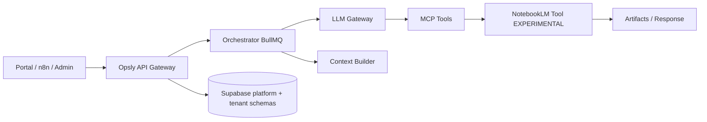
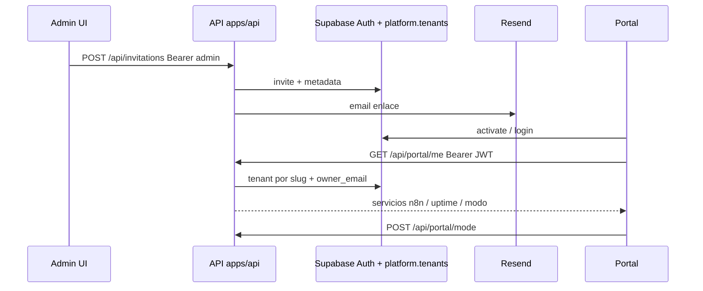
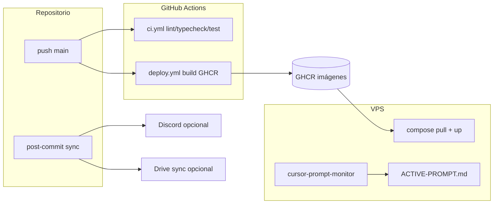
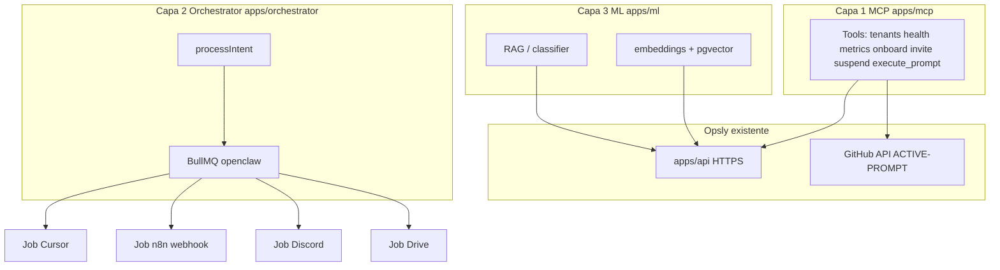

# Opsly — Contexto del Agente

> Fuente de verdad para cada sesión nueva.
> Al iniciar: lee este archivo completo antes de cualquier acción.
> Al terminar: actualiza las secciones marcadas con 🔄.

**📚 Wiki:** [`docs/README.md`](docs/README.md) — índice completo de documentación  
**⚡ Cheatsheet:** [`docs/QUICK-REFERENCE.md`](docs/QUICK-REFERENCE.md) — SSH, comandos, vars, sprint actual  
**🧠 Sistema de conocimiento:** [`docs/KNOWLEDGE-SYSTEM.md`](docs/KNOWLEDGE-SYSTEM.md) — NotebookLM + Obsidian, flujo para agentes

**Mapa de documentación (evitar duplicar con `docs/AGENTS-GUIDE.md`):** `VISION.md` = norte de producto; **`AGENTS.md` (este archivo)** = estado operativo, próximo paso, bloqueantes e incrementos **por sesión**; **`docs/AGENTS-GUIDE.md`** = convenciones **solo** para varios asistentes/automatismos en paralelo (no sustituye AGENTS). `docs/adr/` = decisiones de arquitectura. No copiar tablas de límites por plan aquí: enlazar `AGENTS-GUIDE` + `VISION.md`.

**Planificación por sprint (IA + producto):** [`ROADMAP.md`](ROADMAP.md) (timeline semanal, milestones). **Guía técnica capa IA:** [`docs/IMPLEMENTATION-IA-LAYER.md`](docs/IMPLEMENTATION-IA-LAYER.md) (TypeScript, rutas reales en `apps/*`).

## ⚠️ Control de costos

**Regla:** cualquier servicio con costo mensual recurrente requiere **aprobación explícita** del responsable antes de activarse en proveedor (DO, GCP, Cloudflare de pago, etc.). El dashboard de admin es **registro orientativo**; la facturación real está en cada panel de proveedor.

- **Dashboard:** ruta admin `/costs` (p. ej. `https://admin.<PLATFORM_DOMAIN>/costs`).
- **Costo orientativo actual:** ~**$12/mes** (VPS DigitalOcean — revisar factura DO).
- **Sin coste de proveedor adicional:** worker Mac 2011 / nodo remoto (misma cola Redis; ver `docs/WORKER-SETUP-MAC2011.md`, `scripts/start-workers-mac2011.sh`).
- **Pendientes típicos:** GCP failover (proyecto de referencia **opslyquantum**; free tier según cuenta), Cloudflare Load Balancer (~importe orientativo en catálogo), upgrade de VPS.

---

## Flujo de sesión (humano + Cursor)

**Git antes de editar:** en **opsly-admin** (Mac), **opsly-worker** (`~/opsly`) y **VPS** (`/opt/opsly` o staging), ejecutar `./scripts/git-sync-repo.sh` o `git pull --ff-only` en la rama de trabajo. Detalle: `docs/SESSION-GIT-SYNC.md`.

**Índice de conocimiento (Repo-First RAG):** tras `git pull` en el VPS (o al añadir muchos `.md`), ejecuta `./scripts/index-knowledge.sh` desde la raíz del repo (`OPSLY_ROOT=/opt/opsly` si aplica) para regenerar `config/knowledge-index.json`. Sin ese paso, el Context Builder y el planner siguen “ciegos” respecto a títulos/keywords de la documentación nueva.

**Al abrir una sesión nueva conmigo (otro agente / otro dispositivo):**

1. Asegúrate de que `AGENTS.md` en `main` está actualizado (último commit en GitHub).
2. **Contexto:** lee `VISION.md` una vez (el norte del producto); lee `AGENTS.md` siempre (estado de la sesión); para arquitectura, consulta `docs/adr/`. Ante decisiones nuevas, verifica alineación con `VISION.md` y documéntalas aquí (y ADR si aplica).
3. Pega en el chat la **URL raw** del archivo para que el agente lo cargue sin clonar:
   - Formato: `https://raw.githubusercontent.com/<org>/<repo>/<branch>/AGENTS.md`
   - Ejemplo: `https://raw.githubusercontent.com/cloudsysops/opsly/main/AGENTS.md`
   - Si la raw da **404** pese a repo público: revisar org/repo/rama (`main`), probar vista web `https://github.com/cloudsysops/opsly/blob/main/AGENTS.md`, o **adjuntar / pegar** este archivo completo en el chat (alternativa válida).
4. Pide explícitamente: _«Lee el contenido de esa URL y actúa según AGENTS.md»_.

**Al cerrar la sesión con Cursor — copiar/pegar esto:**

```
Flujo de cierre:
1. Actualiza AGENTS.md (todas las secciones 🔄).
2. Commit y push a main (mensaje claro, ej. docs(agents): estado sesión YYYY-MM-DD).
   Con `core.hooksPath=.githooks`, el post-commit copia AGENTS y system_state a `.github/` (revisa `git status` por si hace falta un commit extra).
   Alternativa: `./scripts/update-agents.sh` para espejar AGENTS, VISION y `context/system_state.json` y pushear.
3. Respóndeme con la URL raw de AGENTS.md en main para que la pegue al abrir la próxima sesión.

https://raw.githubusercontent.com/cloudsysops/opsly/main/AGENTS.md
```

**Resumen:** Cursor deja `AGENTS.md` al día → commit/push a `main` → tú pegas la URL raw al iniciar la próxima sesión con el agente → listo.

---

## ⚡ Quick Commands

```bash
# Type-check all (Turbo)
npm run type-check

# Test single workspace
npm run test --workspace=@intcloudsysops/orchestrator

# BullMQ / worker — encolar job de prueba (cola openclaw; requiere REDIS_URL)
doppler run --project ops-intcloudsysops --config prd -- ./scripts/test-worker-e2e.sh smiletripcare --notify
# Detalle: docs/WORKER-TESTING.md

# Validate OpenAPI spec (CI required)
npm run validate-openapi

# Validate skills manifest
npm run validate-skills

# Update repo state JSON
npm run update-state

# Worker: comprobar / levantar Ollama local (compose opslyquantum, solo servicio ollama)
npm run opsly:ensure-ollama -- --ensure
```

**Lint rules:** ESLint staged only on `apps/api/app` + `apps/api/lib` after type-check.

**Orchestrator jobs:** Use `JOB_VALIDATION.isValidJob()` for optional validation. Idempotency via `job.idempotency_key` → BullMQ `jobId`.

---

### Flujo con Claude (multi-agente)

1. **Contexto:** misma **URL raw** de `AGENTS.md` (arriba) y, si aplica, `VISION.md` — referencias en `.claude/CLAUDE.md`.
2. **Sistema de conocimiento:**
   - [`docs/KNOWLEDGE-SYSTEM.md`](docs/KNOWLEDGE-SYSTEM.md) — LEER PRIMERO
   - Query startup obligatorio: `"¿Cuál es el estado actual de Opsly?"` → NotebookLM
3. **Prompt operativo en VPS (opcional):** `docs/ACTIVE-PROMPT.md` — tras `git pull` en `/opt/opsly`, el servicio **`cursor-prompt-monitor`** (`scripts/cursor-prompt-monitor.sh`, unidad `infra/systemd/cursor-prompt-monitor.service`) detecta cambios cada **30 s** y ejecuta el contenido filtrado como shell. **Solo** líneas que no empiezan por `#` ni `---`; si todo es comentario, no ejecuta nada. **Riesgo RCE** si alguien no confiable puede editar ese archivo.
4. **Logs en VPS:** `/opt/opsly/logs/cursor-prompt-monitor.log` (directorio `logs/` ignorado en git).
5. **Docs de apoyo:** `docs/CLAUDE-WORKFLOW-OPTIMIZATION.md`, `docs/OPENCLAW-ARCHITECTURE.md`.
6. **Espejo Google Drive (opcional):** `docs/GOOGLE-DRIVE-SYNC.md`, lista `docs/opsly-drive-files.list`, config `.opsly-drive-config.json` — útil si Claude (u otro asistente) tiene Drive conectado; la fuente de verdad sigue siendo git/GitHub.

---

## Rol

Eres el arquitecto senior de **Opsly** — plataforma multi-tenant SaaS
que despliega stacks de agentes autónomos (n8n, Uptime Kuma) por cliente,
con facturación Stripe, backups automáticos y dashboard de administración.

## Reglas Rápidas – DOs y NOs para Agentes

- **DO:** todo tráfico IA pasa por OpenClaw → LLM Gateway (sin llamadas LLM directas fuera de ese flujo).
- **DO:** incluir `tenant_slug` y `request_id` en cada job/orquestación para trazabilidad.
- **DO:** tratar NotebookLM como **EXPERIMENTAL** (solo Business+ y `NOTEBOOKLM_ENABLED=true`).
- **NO:** exponer SSH en IP pública; acceso admin solo por Tailscale `100.120.151.91`.
- **NO:** hardcodear secrets, tokens o IPs en código/scripts/docs operativos.

---

## Skills disponibles para Claude modo supremo

Procedimientos vivos en el repo: **`skills/user/<skill>/SKILL.md`**. En runtimes que montan `/mnt/skills/user`, enlazar o copiar desde el clon (ver `skills/README.md`).

### CLI de Skills

```bash
# Ver todos los skills disponibles
node scripts/load-skills.js list

# Bootstrap de sesión (qué cargar al inicio)
node scripts/load-skills.js bootstrap

# Buscar skill por关键词
node scripts/load-skills.js search "llm"
node scripts/load-skills.js search "api"
node scripts/load-skills.js search "docker"

# Ver detalles de un skill
node scripts/load-skills.js show opsly-api
```

Índice: **`skills/index.json`** (15 skills, categorías, triggers).

### Por prioridad

**CRITICAL** (siempre al inicio): `opsly-context` + `opsly-quantum`  
**HIGH** (recomendados): `opsly-architect-senior`, `opsly-api`, `opsly-bash`, `opsly-llm`, `opsly-mcp`, `opsly-supabase`, `opsly-tenant`  
**MEDIUM/LOW**: `opsly-agent-teams`, `opsly-discord`, `opsly-feedback-ml`, `opsly-google-cloud`, `opsly-notebooklm`, `opsly-simplify`

| Skill                  | Path (repo)                           | Cuándo usar                                                      |
| ---------------------- | ------------------------------------- | ---------------------------------------------------------------- |
| opsly-context          | `skills/user/opsly-context/`          | **SIEMPRE** al inicio de sesión                                  |
| opsly-quantum          | `skills/user/opsly-quantum/`          | Skill maestro: orquestación segura + `scripts/opsly-quantum.sh`  |
| opsly-api              | `skills/user/opsly-api/`              | Rutas `apps/api/`                                                |
| opsly-bash             | `skills/user/opsly-bash/`             | Scripts `scripts/`                                               |
| opsly-llm              | `skills/user/opsly-llm/`              | Llamadas vía LLM Gateway                                         |
| opsly-mcp              | `skills/user/opsly-mcp/`              | Tools MCP OpenClaw                                               |
| opsly-supabase         | `skills/user/opsly-supabase/`         | Migraciones / SQL `platform`                                     |
| opsly-discord          | `skills/user/opsly-discord/`          | `notify-discord.sh`                                              |
| opsly-tenant           | `skills/user/opsly-tenant/`           | Onboarding / tenants                                             |
| opsly-feedback-ml      | `skills/user/opsly-feedback-ml/`      | Feedback + ML                                                    |
| opsly-agent-teams      | `skills/user/opsly-agent-teams/`      | BullMQ / TeamManager                                             |
| opsly-notebooklm       | `skills/user/opsly-notebooklm/`       | Agente NotebookLM (notebooklm-py), contenido por tenant          |
| opsly-architect-senior | `skills/user/opsly-architect-senior/` | Diagnóstico arquitectónico, riesgos, ADRs (tras `opsly-context`) |
| opsly-google-cloud     | `skills/user/opsly-google-cloud/`     | Google Cloud: Drive, BigQuery, Vertex AI                         |
| opsly-simplify         | `skills/user/opsly-simplify/`         | Docker & Compose optimization                                    |

---

## Fase 4 — Multi-agente Opsly (plan maestro de trabajo)

**Ámbito:** orquestación y operación con **varios agentes** (Cursor, Claude, automatismos) sobre un **único contexto** (`AGENTS.md`, `VISION.md`, `config/opsly.config.json`), sin cambiar las decisiones fijas de infra (Compose, Traefik v3, Doppler, Supabase).

### Principio rector (no negociable)

- **Extender, no re-arquitecturar:** todo vive en el monorepo actual (`apps/*`, `skills/`, `infra/`, `scripts/`). No crear carpetas raíz tipo `agents/` paralelas ni un segundo sistema de orquestación.
- **Compatibilidad hacia atrás:** APIs y jobs existentes siguen funcionando; nuevos campos y rutas son **opcionales** con defaults = comportamiento actual.
- **Incrementos verificables:** cada PR debe poder validarse con `type-check`, tests donde existan, y criterio de smoke acotado.
- **Sin infra nueva** salvo decisión explícita y alineación con `VISION.md` (_Nunca_ K8s/Swarm; escalar VPS antes que complejidad).

### Mapa — qué ya existe (no duplicar)

| Capacidad                                    | Ubicación en repo                                                                                                                                |
| -------------------------------------------- | ------------------------------------------------------------------------------------------------------------------------------------------------ |
| Orchestrator + cola BullMQ + workers         | `apps/orchestrator` — ver `docs/ORCHESTRATOR.md`, ADR-011                                                                                        |
| MCP / herramientas                           | `apps/mcp` — ADR-009                                                                                                                             |
| LLM Gateway (cache, routing opcional Fase 4) | `apps/llm-gateway`                                                                                                                               |
| Context pipeline (servicio)                  | `apps/context-builder` — integrar como **cliente** al servicio existente; no crear un segundo “context builder” embebido en orchestrator sin ADR |
| API control plane + tenants                  | `apps/api`                                                                                                                                       |
| Skills operativos                            | `skills/user/*`, `skills/README.md`; metadata opcional `skills/manifest` (`@intcloudsysops/skills-manifest`)                                     |
| Diseño OpenClaw / costos                     | `docs/OPENCLAW-ARCHITECTURE.md`                                                                                                                  |
| Docker tenant aislado                        | `scripts/lib/docker-helpers.sh` — `--project-name tenant_<slug>`                                                                                 |

### Incrementos adoptados (acordados, orden recomendado)

1. **✅ Tipos + metadata de jobs (orchestrator)** — _Hecho (2026-04)._ `OrchestratorJob` / `IntentRequest` en `apps/orchestrator/src/types.ts`: `tenant_id`, `request_id`, `plan`, `idempotency_key`, `cost_budget_usd`, `agent_role`. `processIntent` devuelve `request_id`. Cola: `buildQueueAddOptions` + `jobId` BullMQ si hay idempotencia (`queue-opts.ts`). Redis `JobState` ampliado. Log JSON por encolado (`observability/job-log.ts`). Pruebas: `__tests__/queue-opts.test.ts`, `__tests__/engine.test.ts`.
2. **Roles de agente como tipos y convenciones** — `planner` \| `executor` \| `tool` \| `notifier` ya en tipo `AgentRole`; uso progresivo en callers, no un framework nuevo.
3. **✅ Logs estructurados** — _Hecho (2026-04-05; verificado 2026-04-04)._ Workers: `observability/worker-log.ts` (`worker_start` \| `worker_complete` \| `worker_fail`) en `CursorWorker`, `DriveWorker`, `N8nWorker`, `NotifyWorker`. LLM Gateway: `structured-log.ts`; `llmCall` registra `llm_call_complete` / `llm_call_error` (opcional `request_id` en `LLMRequest`, UUID por defecto). Pruebas: `worker-log.test.ts`, `structured-log.test.ts`; `gateway.test.ts` mockea `logGatewayEvent`. Doc: `docs/ORCHESTRATOR.md`.
4. **✅ Skills (manifest opcional)** — _Hecho (2026-04-08; canonical `skills/manifest` 2026-04-04)._ Paquete `skills/manifest` (`@intcloudsysops/skills-manifest`): `loadSkillMetadata`, `parseSimpleFrontmatter` (YAML mínimo entre `---`), `parseManifestJsonObject`, `validateAllUserSkills`, CLI vía `npm run validate-skills`. `manifest.json` opcional con `name`, `version`, `description`, `inputSchema` / `outputSchema`. Pilotos: `skills/user/opsly-api/manifest.json`, `skills/user/opsly-context/manifest.json`. Tests: `skills/manifest/__tests__/*.ts`; doc: `skills/README.md`; CI: `.github/workflows/validate-context.yml` (`validate-skills` + `test-skills-manifest`). El antiguo `apps/skill-manifest` se eliminó para evitar duplicar nombre y lockfile.
5. **✅ LLM Gateway (routing opcional)** — _Hecho (2026-04-08)._ `routing_bias` (`cost` \| `balanced` \| `quality`) en `LLMRequest` si no hay `model` explícito; `applyRoutingBias` + cadena existente en `llmCallDirect` → `buildChain`. Helpers `parseLlmGatewayRoutingParams` / `parseLlmGatewayRoutingHeaders` para query (`llm_model`, `llm_routing`) y cabeceras (`x-llm-model`, `x-llm-routing`). Export en `apps/llm-gateway/src/index.ts`; logs estructurados con `routing_bias` si aplica. Doc: `docs/LLM-GATEWAY.md`. Pruebas: `__tests__/routing-hints.test.ts`.
6. **✅ Orchestrator — prioridad por plan (cola BullMQ)** — _Hecho (2026-04-08)._ `planToQueuePriority` + `PLAN_QUEUE_PRIORITY` en `apps/orchestrator/src/queue-opts.ts`: BullMQ usa **0 = máxima** prioridad → enterprise `0`, business `10_000`, startup o sin plan `50_000`. `buildQueueAddOptions` incluye `priority`; log `job_enqueue` añade `queue_priority`. Pruebas: `__tests__/queue-opts.test.ts`. Doc: `docs/ORCHESTRATOR.md`. Descomposición ligera de tareas / routing en `engine.ts` sin DAG global.
7. **✅ Refuerzo Zero-Trust incremental (feedback)** — _Hecho (2026-04-08)._ `POST /api/feedback`: identidad vía `Authorization: Bearer` + `resolveTrustedFeedbackIdentity` (`apps/api/lib/portal-feedback-auth.ts` → `resolveTrustedPortalSession` en `portal-trusted-identity.ts`); cuerpo no sustituye tenant/email (`parseFeedbackPostFields`); `verifyConversationBelongsToUser` valida `conversation_id`. Portal: `FeedbackChat` con Bearer. Tests: `__tests__/feedback.test.ts`, `lib/__tests__/portal-feedback-auth.test.ts`; checklist en `docs/SECURITY_CHECKLIST.md`.
8. **✅ Zero-Trust — `GET /api/portal/me` + `POST /api/portal/mode`** — _Hecho (2026-04-08)._ Ambas rutas usan `resolveTrustedPortalSession` (`portal-trusted-identity.ts`); `/me` deja de duplicar la lógica manualmente; `/mode` exige tenant+owner antes de mutar `user_metadata.mode`. Tests: `portal-routes.test.ts` (incl. 403 sin `tenant_slug`), `lib/__tests__/portal-trusted-identity.test.ts` (sesión + `tenantSlugMatchesSession`).
9. **✅ Zero-Trust — helper `tenantSlugMatchesSession`** — _Hecho (2026-04-08)._ `apps/api/lib/portal-trusted-identity.ts`: comparación explícita `session.tenant.slug === slug` para rutas futuras con segmento dinámico; tests en `portal-trusted-identity.test.ts`. Checklist: `docs/SECURITY_CHECKLIST.md`.
10. **✅ `GET /api/portal/usage`** — _Hecho (2026-04-08)._ Uso LLM del tenant de la sesión (sin `slug` en la URL): `resolveTrustedPortalSession` + `getTenantUsage` (`@intcloudsysops/llm-gateway/logger`), mismo agregado que admin `GET /api/metrics/tenant/:slug`; query opcional `?period=today|month`. Implementación: `apps/api/app/api/portal/usage/route.ts`. Tests: `portal-routes.test.ts`.
11. **✅ Portal — consumo de uso LLM en dashboard** — _Hecho (2026-04-09; consolidado 2026-04-05)._ `apps/portal`: `fetchPortalUsage` (única implementación, query `?period=` vía `URLSearchParams`) + `requirePortalPayloadWithUsage` (`lib/tenant.ts`, `lib/portal-server.ts`); tarjeta **`LlmUsageCard`** una vez por página en `/dashboard/developer` y `/dashboard/managed` (períodos **hoy** y **mes** en paralelo; fallo de API de uso → mensaje sin tumbar el panel). Tipos: `PortalUsagePeriod`, `PortalUsagePayload`, `PortalUsageSnapshot` (`types/index.ts`). Se eliminó componente duplicado `portal-usage-section.tsx`. Validación: `npm run type-check --workspace=@intcloudsysops/portal`, `npm run lint --workspace=@intcloudsysops/portal`; `npx turbo type-check` portal+api en verde.
12. **✅ `GET /api/portal/tenant/[slug]/usage` (Zero-Trust con segmento dinámico)** — _Hecho (2026-04-09)._ `apps/api/app/api/portal/tenant/[slug]/usage/route.ts`: `resolveTrustedPortalSession` → `tenantSlugMatchesSession(session, slug)` → **403** si el slug del path no coincide con el tenant de la sesión (no se llama a `getTenantUsage`). JSON compartido con **`GET /api/portal/usage`** vía **`respondPortalTenantUsage`** (`lib/portal-usage-json.ts`). Tests: `portal-routes.test.ts` (401, 403 slug distinto, 200). Checklist: `docs/SECURITY_CHECKLIST.md`.
13. **✅ Portal — métricas LLM vía ruta con `[slug]`** — _Hecho (2026-04-09)._ `fetchPortalUsage(token, period, tenantSlug)` en `apps/portal/lib/tenant.ts` → `GET /api/portal/tenant/{slug}/usage`; `requirePortalPayloadWithUsage` usa `payload.slug` tras `fetchPortalTenant` (que puede resolver **`GET /api/portal/me`** o **`GET /api/portal/tenant/{slug}/me`** según JWT; _incr. 17_). Sin `tenantSlug` opcional sigue existiendo `GET /api/portal/usage`. Validación: `npm run type-check` + `lint` portal; API **155** tests (suite actual).
14. **✅ `GET /api/portal/tenant/[slug]/me` + `respondTrustedPortalMe`** — _Hecho (2026-04-09)._ `lib/portal-me-json.ts`: respuesta JSON compartida con **`GET /api/portal/me`**; `app/api/portal/me/route.ts` delega en **`respondTrustedPortalMe`**. **`GET /api/portal/tenant/[slug]/me`:** `tenantSlugMatchesSession` → **403** si el slug no coincide. Tests: `portal-routes.test.ts` (401, 403, 200). `docs/SECURITY_CHECKLIST.md`.
15. **✅ `POST /api/portal/tenant/[slug]/mode` + `applyPortalModeUpdate`** — _Hecho (2026-04-09)._ `lib/portal-mode-update.ts`: mutación de **`user_metadata.mode`** compartida con **`POST /api/portal/mode`**; `app/api/portal/mode/route.ts` delega en **`applyPortalModeUpdate`**. **`POST /api/portal/tenant/[slug]/mode`:** `tenantSlugMatchesSession` → **403** si el slug no coincide (sin llamar a Supabase admin). Tests: `portal-routes.test.ts` (401, 403 sin `updateUserById`, 200). `docs/SECURITY_CHECKLIST.md`.
16. **✅ Portal — `postPortalMode` vía ruta `[slug]`** — _Hecho (2026-04-05)._ `postPortalMode(accessToken, mode, tenantSlug?)` en `apps/portal/lib/tenant.ts` (sin slug → **`POST /api/portal/mode`**); `ModeSelector` obtiene tenant con **`fetchPortalTenant`** y llama **`postPortalMode(..., tenant.slug)`** → **`POST /api/portal/tenant/{slug}/mode`**. Validación: `npm run type-check --workspace=@intcloudsysops/portal`; suite API sin cambios (**155** tests).
17. **✅ Portal — `fetchPortalTenant` vía `[slug]` cuando hay `tenant_slug` en JWT** — _Hecho (2026-04-05)._ `tenantSlugFromUserMetadata(user)` + `fetchPortalTenant(token, tenantSlug?)` en `apps/portal/lib/tenant.ts` (sin slug → **`GET /api/portal/me`**); con slug → **`GET /api/portal/tenant/{slug}/me`**. `requirePortalPayload` / `requirePortalPayloadWithUsage` (`portal-server.ts`, `getUser` + metadata), **`ModeSelector`**, **`usePortalTenant`**. Validación: `npm run type-check --workspace=@intcloudsysops/portal`, `npm run lint --workspace=@intcloudsysops/portal`; API **155** tests sin cambios.
18. **✅ Portal — tests Vitest para `tenantSlugFromUserMetadata`** — _Hecho (2026-04-08)._ `apps/portal`: `vitest.config.ts`, script **`npm run test --workspace=@intcloudsysops/portal`**, `lib/__tests__/tenant-metadata.test.ts` (5 casos: null/undefined, metadata inválida, trim, vacío, tipo). `docs/SECURITY_CHECKLIST.md` (cliente portal + JWT). **`.github/workflows/ci.yml`** job **`test`** ejecuta `apps/portal` en paralelo con mcp/orchestrator/ml/llm-gateway. Validación: `npm run test` + `type-check` + `lint` portal; API **155** tests sin regresión.
19. **✅ Portal — URLs API puras (`portal-api-paths`) + tests** — _Hecho (2026-04-08)._ `lib/portal-api-paths.ts`: `portalTenantMeUrl`, `portalTenantModeUrl`, `portalTenantUsageUrl` (base normalizada, `encodeURIComponent` en segmento `[slug]`); `lib/tenant.ts` delega en ellas. `lib/__tests__/portal-api-paths.test.ts` (8 casos). Portal **13** tests Vitest en total. API **155** tests sin regresión.
20. **✅ OpenAPI — rutas portal `/usage` y `/tenant/{slug}/*`** — _Hecho (2026-04-08)._ `docs/openapi-opsly-api.yaml`: `GET /api/portal/usage`; `GET /api/portal/tenant/{slug}/me`; `POST /api/portal/tenant/{slug}/mode`; `GET /api/portal/tenant/{slug}/usage` (query `period`); alineado a implementación y a `portal-api-paths`. `docs/SECURITY_CHECKLIST.md` (referencia contrato en portal cliente). Sin cambio de runtime.
21. **✅ CI — validación OpenAPI YAML** — _Hecho (2026-04-05)._ `scripts/validate-openapi-yaml.mjs`: parse con paquete `yaml` (devDependency raíz), comprobación de `openapi` y `paths`. `npm run validate-openapi`. `.github/workflows/validate-context.yml`: paso tras `npm ci`. Sin cambio de runtime.
22. **✅ Portal — Vitest validación formulario invite (`/invite/[token]`)** — _Hecho (2026-04-04)._ `lib/invite-activation-validation.ts` (`validateInviteActivationForm`, `inviteActivationErrorMessage`); `lib/__tests__/invite-activation-validation.test.ts` (6 casos); `app/invite/[token]/invite-activate.tsx` delega en el módulo (mismos mensajes ES). Sin Supabase en tests. Suite portal Vitest actual: **21** tests (incr. 25 suma `portal-api-paths` health); API **162** en fecha incr. 25.
23. **✅ CI — OpenAPI paths portal obligatorios** — _Hecho (2026-04-08)._ `scripts/validate-openapi-yaml.mjs` (`REQUIRED_PORTAL_PATHS`): exige en `paths` las rutas portal del subset (ampliadas a **8** con health en incr. 25). `docs/SECURITY_CHECKLIST.md` referencia la validación. Sin cambio de runtime.
24. **✅ OpenAPI — `/api/feedback` (POST portal JWT + GET admin)** — _Hecho (2026-04-08)._ `docs/openapi-opsly-api.yaml`: `POST /api/feedback` (cuerpo `message` + opcionales alineados a `parseFeedbackPostFields`); `GET /api/feedback` (`status`, `limit`; admin `Bearer` / `x-admin-token`). `validate-openapi-yaml.mjs` (`REQUIRED_FEEDBACK_PATHS`) exige `/api/feedback`. Sin cambio de runtime. Suite API actual en incr. 25: **162** tests.
25. **✅ Portal — health API + `portal-api-paths` + Playwright E2E smoke** — _Hecho (2026-04-08)._ API: `GET /api/portal/health?slug=` (público, monitoring); `GET /api/portal/tenant/{slug}/health` (JWT + `tenantSlugMatchesSession`); `lib/portal-health-json.ts` (`respondPortalTenantHealth`). Cliente: `portalHealthUrl(slug)`, `portalPublicHealthUrl(slug)`, `fetchPortalHealth` (`lib/tenant.ts`). **`@playwright/test`**, `playwright.config.ts`, `e2e/portal.spec.ts` (login + invite + smoke; dashboard redirect tests con `test.skip` si faltan vars Supabase públicas). OpenAPI + `REQUIRED_PORTAL_PATHS` (**8** rutas portal, incl. health). Tests API **162**; portal Vitest **21**; `npm run test:e2e --workspace=@intcloudsysops/portal`.
26. **✅ Remote Planner (Chat.z) integrado en Orchestrator** — _Hecho (2026-04-10)._ Cliente `executeRemotePlanner` (`apps/orchestrator/src/planner-client.ts`) → `POST /v1/chat/completions` en llm-gateway; compat `POST /v1/planner`. Intent `remote_plan`: sin encolar jobs efectivos (solo logs JSON + simulación `console.log` por acción) hasta validación Go-Live; Hermes vía `llmCall` en gateway. Healthchecks en `infra/docker-compose.platform.yml` (app `/api/health`, portal `/login`, llm-gateway y orchestrator `/health`) con `interval` 30s. Doc: `docs/ORCHESTRATOR.md`.
27. **✅ Admin — dashboard de costos + API `/api/admin/costs` + worker Mac 2011** — _Hecho (2026-04-11)._ `apps/api/lib/admin-costs.ts` + `app/api/admin/costs/route.ts` (`GET`/`POST`, aprobaciones en memoria de proceso, Discord opcional, `lastUpdated`, `specs`, alertas info/warning incl. GCP **opslyquantum**). Admin: `apps/admin/app/costs/page.tsx`, `components/costs/CostCard.tsx`, Sidebar **Costos**, `lib/api-client.ts` (`getAdminCosts`, `postCostDecision`; modo demo + `NEXT_PUBLIC_PLATFORM_ADMIN_TOKEN` para mutaciones). Sección **Control de costos** en este AGENTS. Scripts `scripts/start-workers-mac2011.sh` (`--dry-run`), `infra/docker-compose.workers.yml`. Docs: `docs/COST-DASHBOARD.md`, ampliación `docs/WORKER-SETUP-MAC2011.md`. Commits de referencia: `4de0201` (base), `8654a43` + `d2db1a0` (extensión + espejo AGENTS).

- **2026-04-11 — Fase 1 Seguridad Crítica:**

* ✅ Autenticación admin por sesión Supabase (`getServerAuthToken()`) en lugar de token público (`NEXT_PUBLIC_PLATFORM_ADMIN_TOKEN`).
* ✅ Autenticación admin: `lib/auth.ts` + routes `apps/api/app/api/admin/*`.
* ✅ BullMQ pipeline counts: `lib/bullmq-pipeline-counts.ts` + `lib/bullmq-redis.ts`.
* ✅ Feedback services: `lib/feedback/service.ts` + `lib/feedback/approve-service.ts`.
* ✅ Métricas teams: `GET /api/metrics/teams`.
* ✅ Invitations admin: refactor `apps/api/app/api/invitations/route.ts`.
* ✅ Settings admin: `apps/admin/app/settings/page.tsx`.
* ✅ Backup admin: `apps/admin/app/api/backup/route.ts`.
* ✅ Costos admin: refactor `apps/admin/app/costs/page.tsx`.
* ✅ Tests: `lib/__tests__/auth-admin-access.test.ts`.

**Commits de referencia:**

- `d894fc6`: consolidate env files
- `7a58fee`: token → session auth
- `4de0201`: admin costs base
- `8654a43`: costs extension
- `d2db1a0`: AGENTS mirror

**Type-check:** `npm run type-check` pasa en 11 workspaces (2026-04-11).

**Git status:** 26 archivos modificados + 2 nuevos (`auth-admin-access.test.ts`, `bullmq-redis.ts`).

**Bloqueante activo:** Cloudflare Proxy ON requerido para ocultar IP VPS pública (157.245.223.7). 28. **Siguiente** — p. ej. **redeploy API + admin** en VPS para servir `/costs` y payload nuevo; E2E invite con Supabase en CI; más rutas bajo `/api/portal/tenant/[slug]/`; persistir aprobaciones de costos en DB si hace falta; operación VPS según `VISION.md`.

### Qué evitamos por ahora

- Segundo orchestrator, segundo motor de contexto, o reestructurar `infra/` sin necesidad.
- DAG engine complejo, LangGraph/CrewAI como dependencia runtime obligatoria, K8s.
- Sustituir BullMQ o MCP por alternativas paralelas.

### Errores que rompen la arquitectura (checklist de PR)

- Carpeta raíz `agents/` fuera del patrón `apps/agents/*`.
- Duplicar `apps/context-builder` dentro de orchestrator sin decisión.
- Cambios breaking en colas o en contratos HTTP sin versión/ADR.
- Features grandes sin paso intermedio en `AGENTS.md` / sin validación.

### Documentación y prompts

| Objetivo                       | Entregable / nota                                                                                                                                     |
| ------------------------------ | ----------------------------------------------------------------------------------------------------------------------------------------------------- |
| Roadmap semanal Fase 2–3       | [`ROADMAP.md`](ROADMAP.md) — milestones; complementa esta AGENTS                                                                                      |
| Implementación capa IA         | [`docs/IMPLEMENTATION-IA-LAYER.md`](docs/IMPLEMENTATION-IA-LAYER.md) — TS, sin Python paralelo                                                        |
| Modelo de orquestación         | `docs/OPENCLAW-ARCHITECTURE.md` — Redis, motor de decisiones, costos                                                                                  |
| Eficiencia de sesiones         | `docs/CLAUDE-WORKFLOW-OPTIMIZATION.md` — 10 técnicas de flujo                                                                                         |
| Contexto siempre publicado     | URL raw de `AGENTS.md` + hooks; opcional `scripts/auto-push-watcher.sh` y/o `docs/ACTIVE-PROMPT.md` + `cursor-prompt-monitor` en VPS                  |
| Criterios de salida (borrador) | ADR si hay cola/orquestador nuevo; métricas de jobs; runbook de incidentes multi-agente                                                               |
| OpenAPI (subset)               | `docs/openapi-opsly-api.yaml` — portal + health + **`/api/feedback`** (incr. 20–25); CI `validate-openapi`: **8** portal + feedback (incr. 21, 23–25) |
| Portal invite (cliente)        | `apps/portal` — validación previa a Supabase en `lib/invite-activation-validation.ts` + Vitest (incr. 22, 2026-04-04)                                 |

**Automatización opcional (VPS):** unidad `infra/systemd/opsly-watcher.service` y guía `docs/AUTO-PUSH-WATCHER.md`. No sustituye revisión humana ni política de secretos.

### Sesiones Cursor sugeridas (una capacidad por sesión)

1. ~~Tipos + metadata de jobs en `apps/orchestrator`.~~ ✅ (2026-04-10: taskId, metadata, status logging)
2. ~~Helpers de logging estructurado (workers + `llm-gateway`; reutilizar patrón `job-log.ts`).~~ ✅
3. ~~Routing opcional en `llm-gateway` con defaults preservados (plan Fase 4 § incremento 5).~~ ✅
4. ~~Normalización gradual de skills (manifest/version) (plan § incremento 4).~~ ✅
5. ~~Orchestrator — prioridad por plan (§ incremento 6).~~ ✅
6. ~~Zero-Trust incremental — primer corte en `/api/feedback` (§ incremento 7).~~ ✅
7. ~~Ampliar Zero-Trust — `POST /api/portal/mode` + tests `portal-trusted-identity`.~~ ✅
8. ~~Helper `tenantSlugMatchesSession` + checklist rutas `[slug]`.~~ ✅
9. ~~`GET /api/portal/usage` (métricas LLM sesión).~~ ✅
10. ~~UI portal: métricas LLM en developer/managed (`LlmUsageCard` + `fetchPortalUsage`).~~ ✅
11. ~~**`GET /api/portal/tenant/[slug]/usage`** — `tenantSlugMatchesSession` + tests + checklist.~~ ✅
12. ~~Portal dashboards: `fetchPortalUsage` con `payload.slug` → `/api/portal/tenant/[slug]/usage`.~~ ✅
13. ~~**`GET /api/portal/tenant/[slug]/me`** — `respondTrustedPortalMe` + tests + checklist.~~ ✅
14. ~~**`POST /api/portal/tenant/[slug]/mode`** — `applyPortalModeUpdate` + tests + checklist.~~ ✅
15. ~~**Portal — `postPortalMode` con `tenant.slug` → ruta `[slug]/mode`** (`lib/tenant.ts`, `ModeSelector`).~~ ✅
16. ~~**Portal — `fetchPortalTenant` con `tenant_slug` del JWT → `GET …/tenant/[slug]/me`** (`tenantSlugFromUserMetadata`, `portal-server`, `ModeSelector`, `usePortalTenant`).~~ ✅
17. ~~**Portal — Vitest `tenantSlugFromUserMetadata`** (`lib/__tests__/tenant-metadata.test.ts`, `vitest.config.ts`).~~ ✅
18. ~~**Portal — `portal-api-paths` + tests** (`portalTenantMeUrl` / `Mode` / `Usage`, refactor `tenant.ts`).~~ ✅
19. ~~**OpenAPI — portal `/usage` + `/tenant/{slug}/*`** (`docs/openapi-opsly-api.yaml`).~~ ✅
20. ~~**CI — `validate-openapi`** (`scripts/validate-openapi-yaml.mjs`, `validate-context.yml`).~~ ✅
21. ~~**Portal — Vitest validación invite** (`invite-activation-validation.ts`, `invite-activate.tsx`).~~ ✅
22. ~~**CI — paths portal obligatorios en OpenAPI** (`validate-openapi-yaml.mjs`).~~ ✅
23. ~~**OpenAPI — `/api/feedback`** (`openapi-opsly-api.yaml`, `REQUIRED_FEEDBACK_PATHS`).~~ ✅
24. ~~**Portal — health API + Playwright smoke** (`portal-health-json`, `portal-api-paths`, `e2e/portal.spec.ts`).~~ ✅
25. ~~**Dashboard de costos + workers Mac 2011** — `docs/COST-DASHBOARD.md`, `/api/admin/costs`, `start-workers-mac2011.sh`.~~ ✅ (2026-04-11)
26. **Siguiente capacidad Fase 4** — Seguir [`ROADMAP.md`](ROADMAP.md) Semana 1+; E2E invite con credenciales en CI; más handlers bajo `/api/portal/tenant/[slug]/`; redeploy admin/API si aplica; o VPS según `VISION.md`.

**Relación con `VISION.md`:** las fases 1–3 del producto siguen siendo el norte comercial; esta **Fase 4** documenta la **plataforma multi-agente incremental** y la **documentación operativa** que las alimentan. El detalle económico y de roadmap largo plazo sigue en `VISION.md` → _Evolución arquitectónica — AI Platform_.

---

## 🔄 Estado actual

<!-- Actualizar al final de cada sesión -->

**Fecha última actualización:** 2026-04-15 — **Sprint:** Semana 1 (Fase 2 producto + IA), ventana **2026-04-14 → 2026-04-20**. Documentos: [`ROADMAP.md`](ROADMAP.md), [`docs/IMPLEMENTATION-IA-LAYER.md`](docs/IMPLEMENTATION-IA-LAYER.md).

**Worker autónomo + Ollama local:** `scripts/ensure-ollama-local.sh`, unidad `infra/systemd/opsly-ollama.service`, `OPSLY_ENSURE_OLLAMA=1` en `.env.local` (carga antes del arranque en `run-worker-with-nvm.sh`). Runbook [`docs/AGENTS-AUTONOMOUS-RUNBOOK.md`](docs/AGENTS-AUTONOMOUS-RUNBOOK.md), ADR-024.

**Servicios VPS (2026-04-14 01:45 UTC):**

| Servicio      | Status        | Puerto | Notes                                           |
| ------------- | ------------- | ------ | ----------------------------------------------- |
| Traefik       | ✅ Running    | 80/443 | Router principal                                |
| API (app)     | ⚠️ Error      | 3000   | `[id] !== [ref]` conflict en imagen GHCR        |
| Admin         | ✅ Running    | 3001   | `admin.ops.smiletripcare.com`                   |
| Portal        | ✅ Running    | 3002   | `portal.ops.smiletripcare.com`                  |
| MCP           | ✅ Running    | 3003   | Herramientas disponibles                        |
| Orchestrator  | ⚠️ Restarting | 3011   | Esperando rebuild CI (falta ML)                 |
| Redis         | ✅ Running    | 6379   | Sin password (bug compose)                      |
| n8n (tenants) | ✅ Running    | -      | smiletripcare, localrank, jkboterolabs, peskids |
| Uptime Kuma   | ✅ Running    | -      | Por tenant                                      |

**Sesión 2026-04-14 (hoy):**

- ✅ MCP verificado corriendo en puerto 3003 con tools
- ✅ Traefik reiniciado con puertos 80/443 expuestos
- ✅ Admin + Portal funcionando
- ✅ .env VPS actualizado desde Doppler
- ⏳ API error: `[id] !== [ref]` — carpeta duplicada en imagen GHCR (tenants/[ref] vs [id])
- ⏳ Orchestrator: espera rebuild CI para incluir packages/ml
- ✅ Fix commiteado: `llm-gateway` en orchestrator Dockerfile

**ADR-024 (Ollama worker):** [`docs/adr/ADR-024-ollama-local-worker-primary.md`](docs/adr/ADR-024-ollama-local-worker-primary.md) — Pendiente ejecución en opslyquantum (Mac 2011).

**ADR-025 (NotebookLM):** [`docs/adr/ADR-025-notebooklm-knowledge-layer.md`](docs/adr/ADR-025-notebooklm-knowledge-layer.md) — ✅ **CONFIGURADO** (notebook ID: `8447967c-f375-47d6-a920-c3100efd7e7b`)

**Sesión 2026-04-13:**

- ✅ MCP Dockerfile fix: añadido `packages/types` al COPY del deps stage y `npm run build -w @intcloudsysops/types` antes de otros workspaces (commit `ae7ee0e`)
- ✅ Predictive BI Engine: rutas `GET/POST /api/portal/tenant/[slug]/insights` + `GET /api/admin/overview` + `POST /api/notebooklm/query` actualizadas
- ✅ API Dockerfile fix: añadido `packages/types` COPY y build antes de `llm-gateway`
- ✅ MCP Dockerfile fix: eliminado `pnpm-lock.yaml` que no existe (repo usa npm)
- ✅ LangChain + LlamaIndex stubs: evitado errores de compilación por paquetes faltantes
- ✅ Todos los Dockerfiles: añadido `--ignore-scripts` para skip husky en build
- ✅ Dockerfile.hermes: fix pip install, scripts COPY
- ✅ docker-compose.platform.yml: eliminado duplicate hermes service
- ✅ Type-check: 14/14 packages successful
- ✅ Docker images: build + push exitoso a GHCR (api, admin, portal, llm-gateway, orchestrator, hermes, context-builder, mcp)

**Pendiente VPS:** Deployment falla por contenedores antiguos + imagen local `opsly-orchestrator:local`. Limpiar VPS: `docker container prune -f && docker image prune -af` antes de redeploy.

**ADR-020 (sesión):** [`docs/adr/ADR-020-orchestrator-worker-separation.md`](docs/adr/ADR-020-orchestrator-worker-separation.md) — alias `OPSLY_ORCHESTRATOR_MODE` documentado; tests `orchestrator-role.test.ts` ampliados; `npm run type-check` y `npm run test --workspace=@intcloudsysops/orchestrator` en verde.

**Notion + Doppler QA:** copiar `NOTION_TOKEN` de `prd` → `qa` sin tocar `prd`; en `qa` los UUID de bases QA van en las **cinco claves ya usadas por código** (`NOTION_DATABASE_TASKS` … `METRICS`), no en nombres nuevos tipo `TENANTS`. Tabla de mapeo y comandos: [`docs/DOPPLER-VARS.md`](docs/DOPPLER-VARS.md) (sección _Notion MCP — config qa_).

**CI Doppler:** workflow [`validate-doppler.yml`](.github/workflows/validate-doppler.yml) + script [`scripts/validate-doppler-vars.sh`](scripts/validate-doppler-vars.sh); secretos GitHub `DOPPLER_TOKEN_PRD` / `DOPPLER_TOKEN_STG`; listas `config/doppler-ci-required*.txt`. Runbook: [`docs/DOPPLER-CI-RUNBOOK.md`](docs/DOPPLER-CI-RUNBOOK.md).

### Sprint activo — Semana 1 (alineado a ROADMAP.md)

| Qué                     | Detalle                                                                                                                                                                                       |
| ----------------------- | --------------------------------------------------------------------------------------------------------------------------------------------------------------------------------------------- |
| **Objetivo**            | Endurecer trazabilidad LLM (gateway), metering Hermes/`usage_events`, tests; **no** introducir runtime Python ni paquete `hermes-agent` ajeno al monorepo.                                    |
| **Código ya existente** | `apps/llm-gateway` (routing, `llm-direct`, providers), `apps/orchestrator` (BullMQ, planner), `POST /api/feedback`, admin `/costs`, metering en gateway — **extender**, no asumir “0 líneas”. |
| **Hermes (nombre)**     | En `VISION.md` = **metering/billing IA** unificado; decisión/routing = lógica TS en gateway/orchestrator según `IMPLEMENTATION-IA-LAYER.md`.                                                  |
| **Tests orchestrator**  | **Vitest** (`npm run test --workspace=@intcloudsysops/orchestrator`), no Jest.                                                                                                                |

**Prompt sugerido para Cursor (copiar):**

```
Sprint: ROADMAP Semana 1 (Fase 2) | Leer ROADMAP.md + docs/IMPLEMENTATION-IA-LAYER.md
Objetivo: [una tarea concreta]
Validación: npm run type-check; tests del workspace tocado
```

**Sesión previa 2026-04-11:** autenticación admin, BullMQ, feedback, costs, etc. **Type-check:** monorepo en verde según última sesión documentada.

**Bloqueante operativo recurrente:** Cloudflare Proxy ON (origen); invitaciones/email según Resend.

**URL raw (sesión siguiente):** https://raw.githubusercontent.com/cloudsysops/opsly/main/AGENTS.md

### Ecosistema IA – OpenClaw (2026-04-10)

OpenClaw opera como **control plane IA** de Opsly: estandariza entrada (MCP/API), orquesta ejecución event-driven (BullMQ), aplica políticas de costo/routing (LLM Gateway), y mantiene contexto operativo para sesiones de agentes (Context Builder).

| Componente        | Ubicación                      | Responsabilidad principal                                              |
| ----------------- | ------------------------------ | ---------------------------------------------------------------------- |
| OpenClaw MCP      | `apps/mcp`                     | Punto único de herramientas/acciones para agentes externos e internos  |
| Orchestrator      | `apps/orchestrator`            | Cola BullMQ, prioridad por plan, coordinación de workers por job       |
| LLM Gateway       | `apps/llm-gateway`             | Routing, cache, costos por tenant, observabilidad de llamadas LLM      |
| Context Builder   | `apps/context-builder`         | Construcción de contexto y continuidad entre interacciones             |
| ML Services       | `apps/ml`                      | Clasificación, embeddings, soporte a decisiones IA                     |
| API Control Plane | `apps/api`                     | Identidad Zero-Trust, validación tenant/session, contratos HTTP        |
| NotebookLM Tool   | `apps/agents/notebooklm` + MCP | Generación de artefactos (podcast/slides/infografía), **EXPERIMENTAL** |



**Estado NotebookLM:** integrado vía MCP tool `notebooklm`; habilitación solo Business+ con `NOTEBOOKLM_ENABLED=true`.  
**Estado LocalRank / jkboterolabs:** SSH Tailscale OK para diagnóstico; stacks con n8n **200** y uptime **302** en staging (ver `docs/TENANT-TESTING-PLAN.md`, `docs/TENANT-TESTING-GUIDE.md`).  
**Mitigaciones requeridas:** Cloudflare Proxy ON + UFW/Tailscale-only SSH.

**Resumen 2026-04-08 (Cursor / Opsly — sesión tester + Drive)**

| Área                      | Qué quedó hecho                                                                                                                                                                                                              |
| ------------------------- | ---------------------------------------------------------------------------------------------------------------------------------------------------------------------------------------------------------------------------- |
| **Drive OAuth usuario**   | `load_google_user_credentials_raw`, `get_google_user_access_token`, `get_google_service_account_access_token`, `get_google_token` con `user_first` / `service_account_first`; `drive-sync` exporta `user_first` por defecto. |
| **Onboard**               | `--name` para `name` en `platform.tenants`; VPS: `./scripts/onboard-tenant.sh --slug jkboterolabs --email jkbotero78@gmail.com --plan startup --name "JK Botero Labs" --yes`.                                                |
| **Invitaciones**          | Mejora HTML/asunto; bloque operativo Resend dominio para email externo.                                                                                                                                                      |
| **Discord**               | Hitos: código Drive usuario; onboard tester.                                                                                                                                                                                 |
| **Histórico misma fecha** | Fix `google_base64url_encode`; CI Docker builder root `package.json`; n8n dispatch/docs; `GOOGLE-CLOUD-SETUP` / `check-tokens` SA.                                                                                           |

**Resumen 2026-04-07 … 2026-04-09 (Cursor / Opsly)**

| Área                      | Qué quedó hecho                                                                                                                                                                                                                                                                                                         |
| ------------------------- | ----------------------------------------------------------------------------------------------------------------------------------------------------------------------------------------------------------------------------------------------------------------------------------------------------------------------- |
| **Feedback + tests API**  | Tests en `apps/api/__tests__/feedback.test.ts` (crear conversación, 2º mensaje → ML, approve); `apps/orchestrator/__tests__/team-manager.test.ts` (BullMQ mockeado).                                                                                                                                                    |
| **DB + tokens**           | `0011_db_architecture_fix.sql` + `0012_llm_feedback_conversations_fk.sql` documentados en AGENTS; `scripts/activate-tokens.sh` (Doppler → `db push` → VPS → E2E); orchestrator: **SIGINT/SIGTERM** cierra `TeamManager`.                                                                                                |
| **MCP OAuth**             | OAuth 2.0 + PKCE: `response_type=code`, `/.well-known/oauth-authorization-server`, `token_endpoint_auth_methods_supported: none`; códigos de autorización en **Redis** (`oauth:code:{code}`, TTL 600s) vía `getRedisClient` (`llm-gateway/cache`); tests `oauth-server.test.ts` + `oauth.test.ts`; ADR-009 actualizado. |
| **Skills Claude**         | Tabla en esta AGENTS + `skills/README.md`; `.claude/CLAUDE.md` modo supremo (paths, puertos incl. context-builder :3012, Supabase ref).                                                                                                                                                                                 |
| **Commits de referencia** | p. ej. `feat(mcp): OAuth 2.0 + PKCE`, `feat(skills): index Opsly skills`, `fix(mcp): … Redis multi-replica` (comentarios), `docs(ops): checklist activación tokens`.                                                                                                                                                    |

**2026-04-09 (noche) — Sprint nocturno Fase 8 (progreso)**

| Bloque | Qué se hizo                                                                                                                                                                                                                                                                                        | Estado |
| ------ | -------------------------------------------------------------------------------------------------------------------------------------------------------------------------------------------------------------------------------------------------------------------------------------------------- | ------ |
| 1      | Confirmado OAuth codes en Redis (TTL 600s) en `apps/mcp/src/auth/oauth-server.ts`; `npm run type-check` + tests `mcp/llm-gateway/orchestrator/ml/api` en verde; Dockerfiles existentes para `mcp`, `llm-gateway`, `orchestrator`, `context-builder`; `deploy.yml` ya build+push de esos servicios. | ✅     |
| 2      | `drive-sync` migrado a `GOOGLE_SERVICE_ACCOUNT_JSON` (service account) + helper `scripts/lib/google-auth.sh`; `check-tokens` valida JSON (>500 chars); `drive-sync --dry-run` OK.                                                                                                                  | ✅     |
| 3      | Verificado `docs/n8n-workflows/discord-to-github.json` + `docs/N8N-IMPORT-GUIDE.md` presentes.                                                                                                                                                                                                     | ✅     |
| 4      | Admin: páginas nuevas `apps/admin/app/metrics/llm` (métricas por tenant desde `/api/metrics/tenant/:slug`) y `apps/admin/app/agents` (teams desde `/api/metrics/teams`). `apps/admin/app/feedback` ya existía.                                                                                     | ✅     |
| 5      | `.claude/CLAUDE.md` actualizado: incluye skill `opsly-google-cloud` y Doppler var `GOOGLE_SERVICE_ACCOUNT_JSON`.                                                                                                                                                                                   | ✅     |
| 6      | Docs: `docs/GOOGLE-CLOUD-ACTIVATION.md`; `.env.local.example` actualizado (service account + BigQuery vars); `check-tokens` incluye vars GCloud como opcionales.                                                                                                                                   | ✅     |
| 7      | Supabase: no se pudo ejecutar `supabase link/db push` desde este entorno; se agregó migración `0013_*` para completar index+grants de `platform.tenant_embeddings` (pgvector).                                                                                                                     | ⚠️     |

**2026-04-09 (cierre operativo) — Fase 9 validada**

- `npx supabase login` + `npx supabase link --project-ref jkwykpldnitavhmtuzmo` + `npx supabase db push` ejecutados con éxito (migraciones 0010–0013 aplicadas).
- `./scripts/test-e2e-invite-flow.sh` en local: `POST /api/invitations` -> **200** (antes 500 por Resend).
- `doppler run ... ./scripts/notify-discord.sh` -> **OK** tras corregir `DISCORD_WEBHOOK_URL` en Doppler `prd`.
- VPS recreado con `vps-bootstrap.sh` + `compose up` de `app/admin/portal/traefik`; health público operativo.
- Persisten fallos parciales de pull GHCR para imágenes nuevas/no publicadas (`mcp`, `context-builder`) y `Deploy` workflow continúa en `failure`.

**2026-04-09 — Fase 21: Portal health endpoints + Playwright E2E (Playwright):**

- API: `lib/portal-health-json.ts` (helper JSON compartido), `app/api/portal/health/route.ts` (**público con `?slug=`**), `app/api/portal/tenant/[slug]/health/route.ts` (**Zero-Trust JWT + `tenantSlugMatchesSession`**).
- Portal: `types/index.ts` → `PortalHealthPayload`; `lib/portal-api-paths.ts` → `portalHealthUrl(base, tenantSlug?)` (slug vacío → `/api/portal/health`, slug → `/api/portal/tenant/{slug}/health`); `lib/tenant.ts` → `fetchPortalHealth(accessToken, tenantSlug?)`.
- Playwright E2E: `playwright.config.ts` (Chromium, 1 worker, `PORTAL_URL` env var), `e2e/portal.spec.ts` (4 tests públicos: `/login`, `/invite/TOKEN` sin email param, `/invite/TOKEN?email=test@test.com`, `/dashboard` → redirect a `/login`; 3 tests auth: skip sin Supabase env vars).
- Vitest: 4 tests nuevos `portalHealthUrl` en `lib/__tests__/portal-api-paths.test.ts`.
- OpenAPI: `/api/portal/health` + `/api/portal/tenant/{slug}/health` en `docs/openapi-opsly-api.yaml`; `REQUIRED_PORTAL_PATHS` ampliado; `validate-openapi-yaml.mjs` OK (**16 paths**).
- Validación: `npm run type-check` (11 workspaces ✅), `npm run test --workspace=@intcloudsysops/api` (**155 tests**), `npm run test --workspace=@intcloudsysops/portal` (**23 tests**), `npm run build --workspace=@intcloudsysops/portal`, Playwright E2E 4/4 pass / 3 skip, `npm run validate-openapi` OK, lint portal 0 errors. Middleware portal sin `NEXT_PUBLIC_SUPABASE_URL` → pasa sin redirigir (comportamiento conocido, no bloqueante).

**Histórico 2026-04-09 (misma fecha):** Confirmado OAuth codes en Redis (TTL 600s) en `apps/mcp/src/auth/oauth-server.ts`; `drive-sync` migrado a `GOOGLE_SERVICE_ACCOUNT_JSON` + helper `scripts/lib/google-auth.sh`; Admin páginas métricas y agents; docs Google Cloud; Supabase migraciones 0010–0013 aplicadas; health daemon LLM Gateway; `doppler run` + `notify-discord.sh` OK; `.claude/CLAUDE.md` actualizado con skill `opsly-google-cloud`. **Drive usuario + onboard tester localrank:** SSH timeout / docker ps colgado; reintentar `./scripts/onboard-tenant.sh` y `POST /api/invitations` desde red estable.

**Completado ✅**

- **2026-04-09 — Fase 21: Portal health endpoints + Playwright E2E (Playwright):**

* API: `lib/portal-health-json.ts` (helper JSON compartido), `app/api/portal/health/route.ts` (**público con `?slug=`**), `app/api/portal/tenant/[slug]/health/route.ts` (**Zero-Trust JWT + `tenantSlugMatchesSession`**).
* Portal: `types/index.ts` → `PortalHealthPayload`; `lib/portal-api-paths.ts` → `portalHealthUrl(base, tenantSlug?)` (slug vacío → `/api/portal/health`, slug → `/api/portal/tenant/{slug}/health`); `lib/tenant.ts` → `fetchPortalHealth(accessToken, tenantSlug?)`.
* Playwright E2E: `playwright.config.ts` (Chromium, 1 worker, `PORTAL_URL` env var), `e2e/portal.spec.ts` (4 tests públicos: `/login`, `/invite/TOKEN` sin email param, `/invite/TOKEN?email=test@test.com`, `/dashboard` → redirect a `/login`; 3 tests auth: skip sin Supabase env vars).
* Vitest: 4 tests nuevos `portalHealthUrl` en `lib/__tests__/portal-api-paths.test.ts`.
* OpenAPI: `/api/portal/health` + `/api/portal/tenant/{slug}/health` en `docs/openapi-opsly-api.yaml`; `REQUIRED_PORTAL_PATHS` ampliado; `validate-openapi-yaml.mjs` OK (**16 paths**).
* Validación: `npm run type-check` (11 workspaces ✅), `npm run test --workspace=@intcloudsysops/api` (**155 tests**), `npm run test --workspace=@intcloudsysops/portal` (**23 tests**), `npm run build --workspace=@intcloudsysops/portal`, Playwright E2E 4/4 pass / 3 skip, `npm run validate-openapi` OK, lint portal 0 errors. Middleware portal sin `NEXT_PUBLIC_SUPABASE_URL` → pasa sin redirigir (comportamiento conocido, no bloqueante).

- **2026-04-11 — Fase 1 Seguridad Crítica:**

* ✅ Variables de entorno consolidadas (`.env.example` único)
* ✅ Eliminada exposición de `NEXT_PUBLIC_PLATFORM_ADMIN_TOKEN`
* ✅ Autenticación por sesión Supabase (`getServerAuthToken()`)
* ✅ CSP Headers implementados
* ✅ Rate limiting por tenant
* ✅ Script rotación de tokens
* ✅ CI arreglado (imports ML, tipos)

- **2026-04-13 — Predictive BI Engine + MCP Dockerfile fix:**

* ✅ SQL migrations para `predictive_bi_engine` (`0014_*.sql`): `tenant_insights`, `ml_model_snapshots`, `insight_events`
* ✅ InsightGenerator worker en `apps/orchestrator/src/workers/insight-generator.ts`: churn prediction, revenue forecast, anomaly detection, growth opportunity
* ✅ API routes: `GET/POST /api/portal/tenant/[slug]/insights`, `GET /api/admin/overview`, `POST /api/notebooklm/query`
* ✅ ML engine: `apps/ml/src/insight-engine.ts` + `apps/api/lib/insights/engine.ts`
* ✅ Dashboard: `apps/admin/components/insights/InsightDashboard.tsx` con Recharts
* ✅ ADR-021 scalability strategy documentado
* ✅ MCP Dockerfile fix: `packages/types` en deps stage + build order (commit `ae7ee0e`)
* ✅ Type-check: 13/14 packages successful

**Commits:**

- `d894fc6`: consolidate env files
- `7a58fee`: token → session auth
- (pendiente): CSP headers, rate limiting continua

**2026-04-11 — Ejecución Plan:**

- ✅ SSH Tailscale operativo (`100.120.151.91`)
- ✅ Onboard tenant `localrank` idempotente
- ⚠️ VPS con carga alta (load 31.72) + Docker timeouts
- 🎯 Bloqueante: Cloudflare Proxy ON

* **2026-04-06 — Bloques A/B/C (plan 3 vías):** Vitest en `apps/api`: tests nuevos para `validation`, `portal-me`, `pollPortsUntilHealthy`, rutas `tenants` y `tenants/[id]` (`npm run test` 67 tests, `npm run type-check` verde). Documentación: `docs/runbooks/{admin,dev,managed,incident}.md`, ADR-006–008, `docs/FAQ.md`. Terraform: `infra/terraform/terraform.tfvars.example` (placeholders), `terraform plan -input=false` con `TF_VAR_*` de ejemplo y nota en `infra/terraform/README.md`.
* **2026-04-06 — CURSOR-EXECUTE-NOW (archivo `/home/claude/CURSOR-EXECUTE-NOW.md` no presente en workspace):** +36 casos en 4 archivos `*.test.ts` (health, metrics, portal, suspend/resume) + `invitations-stripe-routes.test.ts` para cobertura de `route.ts`; `npm run test:coverage` ~89% líneas en `app/api/**/route.ts`; `health/route.ts` recorta slashes finales en URL Supabase; `docs/FAQ.md` enlaces Markdown validados; `infra/terraform/tfplan.txt` + `.gitignore` `infra/terraform/tfplan`.
* **2026-04-06 — cursor-autonomous-plan (archivo `/home/claude/cursor-autonomous-plan.md` no presente):** SUB-A `lib/api-response.ts` + refactor `auth`, `tenants`, `metrics`, `tenants/[id]`; SUB-C `docs/SECURITY_AUDIT_REPORT.md`; SUB-B `TROUBLESHOOTING.md`, `SECURITY_CHECKLIST.md`, `PERFORMANCE_BASELINE.md`; SUB-D `OBSERVABILITY.md`; SUB-E `docs/openapi-opsly-api.yaml`.

_Sesión Cursor — qué se hizo (orden aproximado):_

- **2026-04-07 noche (autónomo):** diagnóstico integral (VPS/Doppler/Actions/Supabase/health/tests), prune Docker seguro en VPS, `drive-sync --dry-run` validado, actualización de `docs/N8N-IMPORT-GUIDE.md` con estado actual de secretos y comando exacto, reporte final de bloqueos humanos, commit `chore(auto): autonomous diagnostic and fixes 2026-04-07`.
- **2026-04-07 tarde:** Runbook invitaciones (`docs/INVITATIONS_RUNBOOK.md`); plan UI admin; plantilla n8n; auditoría Doppler (nombres solo); Vitest + 6 tests `invitation-admin-flow`; `/api/health` con metadata; scripts `test-e2e-invite-flow.sh`, `generate-tenant-config.sh`; `onboard-tenant.sh` `--help` y dry-run sin env; tipos portal `@/types`; logs invitaciones redactados.
- **2026-04-07 (pasos 1–5 sin markdown externo):** Validación local + snapshot VPS + health público; commit **`96e9a38`** en remoto y disco VPS; archivo tarea Claude **no** presente en workspace.
- **2026-04-07 — Cursor (automation protocol v1):** `docs/reports/audit-2026-04-07.md` + `docs/AUTOMATION-PLAN.md`; TDD de `notify-discord`, `drive-sync`, `n8n-webhook`; implementación de `scripts/notify-discord.sh` y `scripts/drive-sync.sh`; integración en `.githooks/post-commit` y `scripts/cursor-prompt-monitor.sh`; documentación `docs/N8N-SETUP.md` + `docs/n8n-workflows/discord-to-github.json`; validación local y commit de test hook.
- **2026-04-06 — Cursor (handoff AGENTS + endurecimiento E2E):** Varias iteraciones de «lee AGENTS raw + próximo paso» para arranque multi-agente; **`docs: update AGENTS.md`** al cierre de sesión con URL raw para la siguiente; cambios en **`scripts/test-e2e-invite-flow.sh`** (dry-run sin admin token, slug por defecto alineado a staging, redacción de salida, timeouts).

0. **GHCR deploy 2026-04-06 (tarde)** — Auditoría: paquetes `intcloudsysops-{api,admin,portal}` existen y son privados; 403 no era “solo portal” sino PAT sin acceso efectivo a manifiestos. **`deploy.yml`**: login en VPS con token del workflow; pulls alineados al compose.
1. **Scaffold portal** — `apps/portal` (Next 15, Tailwind, login, `/invite/[token]`, dashboards developer/managed, `middleware`, libs Supabase, `output: standalone`, sin `any`).
2. **API** — `GET /api/portal/me`, `GET /api/portal/tenant/[slug]/me`, `POST /api/portal/mode`, `POST /api/portal/tenant/[slug]/mode`, `GET /api/portal/usage`, `GET /api/portal/tenant/[slug]/usage`, invitaciones `POST /api/invitations` + Resend; **`lib/portal-me.ts`**, **`portal-auth.ts`**, **`portal-me-json.ts`**, **`portal-mode-update.ts`**, **`portal-usage-json.ts`**, **`cors-origins.ts`**, **`apps/api/middleware.ts`**. Portal: **`fetchPortalTenant(token, tenantSlug?)`** — con `tenant_slug` en JWT → **`GET /api/portal/tenant/{slug}/me`**, si no → **`GET /api/portal/me`** (`tenantSlugFromUserMetadata` + `getUser` en server); **`postPortalMode`** con slug del tenant → **`POST /api/portal/tenant/{slug}/mode`** (sin slug tercero → **`POST /api/portal/mode`**); dashboards llaman **`GET /api/portal/tenant/{slug}/usage`** con el slug del payload (`fetchPortalUsage` en `lib/tenant.ts`); opcional sin slug sigue **`GET /api/portal/usage`**. Rutas HTTP absolutas en cliente: **`lib/portal-api-paths.ts`**. Referencia OpenAPI (subset): **`docs/openapi-opsly-api.yaml`** (`/usage`, `/tenant/{slug}/*`).
3. **Corrección crítica** — El cliente ya llamaba **`/api/portal/me`** pero la API exponía solo **`/tenant`** → handler movido a **`app/api/portal/me/route.ts`**, eliminado **`tenant`**, imports relativos corregidos (`../../../../lib/...`); **`npm run type-check`** en verde.
4. **Hook** — **`apps/portal/hooks/usePortalTenant.ts`** (opcional) para fetch con sesión.
5. **Managed** — Sin email fijo; solo **`NEXT_PUBLIC_SUPPORT_EMAIL`** o mensaje de configuración en UI.
6. **Infra/CI** — Imagen **`ghcr.io/cloudsysops/intcloudsysops-portal:latest`**, servicio **`portal`** en compose, job Deploy con **`up … portal`**; build-args **`NEXT_PUBLIC_*`** alineados a admin.
7. **Git** — `feat(portal): add client dashboard…` → `fix(api): serve portal session at GET /api/portal/me (remove /tenant)` → `docs(agents): portal built…` → `docs(agents): fix portal API path /me vs /tenant in AGENTS` → push a **`main`**.

_Portal cliente `apps/portal` (detalle en repo):_

**App (`apps/portal`)**

- Next.js 15, TypeScript, Tailwind, shadcn-style UI, tema dark fondo `#0a0a0a`.
- Rutas: `/` → redirect `/login`; `/login` (email + password; sin registro público); `/invite/[token]` con query **`email`** — `verifyOtp({ type: "invite" })` + `updateUser({ password })` → `/dashboard`; `/dashboard` — selector de modo (Developer / Managed): **`fetchPortalTenant`** (con `tenant_slug` del JWT → **`GET /api/portal/tenant/{slug}/me`**) + **`postPortalMode(..., tenant.slug)`** → **`POST /api/portal/tenant/{slug}/mode`**; **sin** auto-redirect desde `/dashboard` cuando ya hay `user_metadata.mode` (el enlace «Cambiar modo» del shell vuelve al selector); `/dashboard/developer` y `/dashboard/managed` — server **`requirePortalPayloadWithUsage()`** en `lib/portal-server.ts` → **`fetchPortalTenant`** + **`fetchPortalUsage(token, period, payload.slug)`** → **`GET /api/portal/tenant/{slug}/me`** (si hay slug en JWT) o **`GET /api/portal/me`**, y **`GET /api/portal/tenant/{slug}/usage`** con Bearer JWT; UI **`LlmUsageCard`** (métricas agregadas: peticiones, tokens, coste USD, % caché).
- Middleware: `lib/supabase/middleware.ts` (sesión Supabase); rutas `/dashboard/*` protegidas (login e invite públicos).
- Componentes: `ModeSelector`, `PortalShell`, `ServiceCard`, `StatusBadge` + `healthFromReachable`, `CredentialReveal` (password **30 s** visible y luego oculto), `DeveloperActions` (copiar URL n8n / credenciales). Managed: email de soporte solo si está definido **`NEXT_PUBLIC_SUPPORT_EMAIL`** (si no, aviso en UI). Hook opcional cliente **`usePortalTenant`** en `apps/portal/hooks/` (si se usa en evoluciones).

**API (`apps/api`) — datos portal**

- **`GET /api/portal/me`** — `app/api/portal/me/route.ts`. Tras `resolveTrustedPortalSession`, respuesta vía **`respondTrustedPortalMe`** (`lib/portal-me-json.ts`) — `parsePortalServices`, `portalUrlReachable`, `parsePortalMode`. _(Producto: a veces se nombra como `GET /api/portal/tenant`; paths publicados: **`/api/portal/me`** y **`/api/portal/tenant/[slug]/me`**.)_
- **`GET /api/portal/tenant/[slug]/me`** — `app/api/portal/tenant/[slug]/me/route.ts`. `tenantSlugMatchesSession` → **403** si no coincide. Mismo JSON que **`GET /api/portal/me`** cuando el slug del path es el del tenant de la sesión.
- **`POST /api/portal/mode`** — `app/api/portal/mode/route.ts`. Tras `resolveTrustedPortalSession`, **`applyPortalModeUpdate`** (`lib/portal-mode-update.ts`) — body `{ mode: "developer" | "managed" }` → `auth.admin.updateUserById` con merge de **`user_metadata.mode`**.
- **`POST /api/portal/tenant/[slug]/mode`** — `app/api/portal/tenant/[slug]/mode/route.ts`. `tenantSlugMatchesSession` → **403** si no coincide. Mismo efecto que **`POST /api/portal/mode`** cuando el slug del path es el del tenant de la sesión.
- **`GET /api/portal/usage`** — `app/api/portal/usage/route.ts`. Tras `resolveTrustedPortalSession`, respuesta vía **`respondPortalTenantUsage`** (`lib/portal-usage-json.ts`) → **`getTenantUsage`** (`@intcloudsysops/llm-gateway/logger`). Mismo agregado que admin **`GET /api/metrics/tenant/:slug`** sin `slug` en la URL. Query opcional **`?period=today`** (por defecto) o **`month`**.
- **`GET /api/portal/tenant/[slug]/usage`** — `app/api/portal/tenant/[slug]/usage/route.ts`. Tras `resolveTrustedPortalSession`, **`tenantSlugMatchesSession(session, slug)`**; si falla → **403**. Mismo JSON que **`GET /api/portal/usage`** cuando el slug del path coincide con el tenant de la sesión.
- **`POST /api/invitations`** — header admin **`Authorization: Bearer`** o **`x-admin-token`** (**`requireAdminToken`**); body: **`email`**, **`slug` _o_ `tenantRef`** (mismo patrón 3–30), **`name`** opcional (default nombre tenant), **`mode`** opcional `developer` \| `managed` (va en `data` del invite Supabase). Respuesta **200**: **`ok`**, **`tenant_id`**, **`link`**, **`email`**, **`token`**. Implementación: **`lib/invitation-admin-flow.ts`** + **`lib/portal-invitations.ts`** (HTML dark, Resend; URL **`PORTAL_SITE_URL`** o **`https://portal.${PLATFORM_DOMAIN}`**). El email del body debe coincidir con **`owner_email`** del tenant. Requiere **`RESEND_API_KEY`** y remitente (**`RESEND_FROM_EMAIL`** o **`RESEND_FROM_ADDRESS`**) en el entorno del contenedor API.

**CORS / Next API**

- **`apps/api/middleware.ts`** + **`lib/cors-origins.ts`**: orígenes explícitos (`NEXT_PUBLIC_ADMIN_URL`, `NEXT_PUBLIC_PORTAL_URL`, `https://admin.${PLATFORM_DOMAIN}`, `https://portal.${PLATFORM_DOMAIN}`); matcher `/api/:path*`; OPTIONS 204 con headers cuando el `Origin` está permitido.
- **`apps/api/next.config.ts`**: `output: "standalone"`, `outputFileTracingRoot`; **sin** duplicar headers CORS en `next.config` para no chocar con el middleware.

**Infra / CI**

- **`apps/portal/Dockerfile`**: multi-stage, standalone, `EXPOSE 3002`, `node server.js`; build-args `NEXT_PUBLIC_SUPABASE_*`, `NEXT_PUBLIC_API_URL` (y los que defina `deploy.yml`).
- **`infra/docker-compose.platform.yml`**: servicio **`portal`**, Traefik `Host(\`portal.${PLATFORM*DOMAIN}\`)`, TLS, puerto contenedor **3002**, vars `NEXT_PUBLIC*\*`; red acorde al compose actual (p. ej. `traefik-public` para el router).
- **`.github/workflows/deploy.yml`** y **`ci.yml`**: type-check/lint/build del workspace **portal**; imagen **`ghcr.io/cloudsysops/intcloudsysops-portal:latest`** en paralelo con api/admin; job **deploy** hace `docker login ghcr.io` en el VPS con **`github.token`** y **`github.actor`** (paquetes ligados al repo).

**Calidad**

- `npm run type-check` (Turbo) en verde antes de commit; ESLint en rutas API portal (`me`, `mode`) y **`lib/portal-me.ts`**; pre-commit acotado a `apps/api/app` + `apps/api/lib`; **`apps/portal/eslint.config.js`** ignora **`.next/**`** y **`eslint.config.js`\*\* para no lintar artefactos ni el propio config CommonJS.

**Git (referencia)**

- Hitos: **`feat(portal): add client dashboard with developer and managed modes`**; **`fix(api): serve portal session at GET /api/portal/me`**; espejo **`chore: sync AGENTS mirror…`**; correcciones **`docs(agents): …`** (p. ej. path `/me` vs `/tenant`). Este archivo: commit **`docs: update AGENTS.md 2026-04-06`**. Repo remoto: **`cloudsysops/opsly`**.

_CORS + `NEXT*PUBLIC*_`en build admin +`deploy.yml`(2026-04-06, commit`8f12487` `fix(admin): add CORS headers and Supabase build args`, pusheado a `main`):\*

- **Problema:** el navegador en `admin.${PLATFORM_DOMAIN}` hacía `fetch` a `api.${PLATFORM_DOMAIN}` y la API rechazaba por **CORS**.
- **`apps/api/next.config.ts`:** `headers()` en rutas `/api/:path*` con `Access-Control-Allow-Origin` (sin `*`), `Allow-Methods` (`GET,POST,PATCH,DELETE,OPTIONS`), `Allow-Headers` (`Content-Type`, `Authorization`, `x-admin-token`). Origen: `NEXT_PUBLIC_ADMIN_URL` si existe; si no, `https://admin.${PLATFORM_DOMAIN}`. Si no hay origen resuelto, **no** se envían headers CORS (evita wildcard y URLs inventadas).
- **`apps/api/Dockerfile` (builder):** `ARG`/`ENV` `PLATFORM_DOMAIN` y `NEXT_PUBLIC_ADMIN_URL` **antes** de `npm run build` — los headers de `next.config` se resuelven en **build time** en la imagen.
- **`apps/admin/Dockerfile` (builder):** `ARG`/`ENV` `NEXT_PUBLIC_SUPABASE_URL`, `NEXT_PUBLIC_SUPABASE_ANON_KEY`, `NEXT_PUBLIC_API_URL` antes del build (Next hornea `NEXT_PUBLIC_*`).
- **`.github/workflows/deploy.yml`:** en _Build and push API image_, `build-args: PLATFORM_DOMAIN=${{ secrets.PLATFORM_DOMAIN }}`. En _Admin_, `build-args` con `NEXT_PUBLIC_SUPABASE_URL`, `NEXT_PUBLIC_SUPABASE_ANON_KEY` y `NEXT_PUBLIC_API_URL=https://api.${{ secrets.PLATFORM_DOMAIN }}`. Comentario en cabecera del YAML con comandos `gh secret set` para el repo.
- **Secretos GitHub requeridos en el job build** (valores desde Doppler `prd`): `NEXT_PUBLIC_SUPABASE_URL`, `NEXT_PUBLIC_SUPABASE_ANON_KEY`, `PLATFORM_DOMAIN`. Sin ellos el build de admin o el origen CORS en API pueden fallar o quedar vacíos.
- **Verificación local:** `npm run type-check` en verde antes del commit; post-deploy humano: `https://admin.ops.smiletripcare.com/dashboard` sin errores de CORS/Supabase en consola (tras definir secrets y un run verde de **Deploy**).

_Admin dashboard + API métricas — sesión Cursor 2026-04-04 (stakeholders / familia):_

**Objetivo:** Admin en `apps/admin` operativo y legible, con datos reales del VPS y del tenant `smiletripcare` (Supabase `platform.tenants`), sin autenticación Supabase en modo demo.

**URL pública:** https://admin.ops.smiletripcare.com — Traefik router `opsly-admin`, `Host(admin.${PLATFORM_DOMAIN})`, `entrypoints=websecure`, `tls=true`, `tls.certresolver=letsencrypt`, servicio puerto **3001** (`infra/docker-compose.platform.yml`).

**Admin — pantallas y UX**

- **`/dashboard`:** Gauge circular CPU (verde si el uso es menor que 60%, amarillo si es menor que 85%, rojo en caso contrario; hex `#22c55e` / `#eab308` / `#ef4444`), RAM y disco en GB con `Progress` (shadcn/Radix), uptime legible, conteo tenants activos y contenedores Docker en ejecución; **SWR cada 30 s** contra la API. Tema dark, fondo `#0a0a0a`, valores en `font-mono`. Aviso en UI si la API devuelve **`mock: true`** (Prometheus no alcanzable).
- **`/tenants`:** Tabla: slug, plan, status (badges: active verde, provisioning amarillo, failed rojo, etc.), `created_at`. Clic en fila expande: URLs n8n y Uptime con botones «Abrir», email owner, fechas; enlace a detalle.
- **`/tenants/[tenantRef]`:** Detalle por **slug o UUID** (carpeta dinámica `[tenantRef]`). Header con nombre y status; cards plan / email / creado; botones n8n y Uptime; **iframe** a `{uptime_base}/status/{slug}` (Uptime Kuma) con texto de ayuda si bloquea por `X-Frame-Options`; sección containers y URLs técnicas.
- **Chrome:** Marca **Opsly**, sidebar solo **Dashboard | Tenants**, footer: `Opsly Platform v1.0 · staging · ops.smiletripcare.com`.
- **Dependencias admin:** `@radix-ui/react-progress`, componente `components/ui/progress.tsx`, `CpuGauge`, hook `useSystemMetrics`.

**API (`apps/api`)**

- **`GET /api/metrics/system`** — Proxy a Prometheus (`/api/v1/query`). Consultas: CPU `100 - (avg(rate(node_cpu_seconds_total{mode="idle"}[5m])) * 100)`; RAM `sum(MemTotal)-sum(MemAvailable)`; disco `sum(size)-sum(free)` con `mountpoint="/"`; uptime `time() - node_boot_time_seconds`. Respuesta JSON incluye `cpu_percent`, `ram_*_gb`, `disk_*_gb`, `uptime_seconds`, `active_tenants` (Supabase), `containers_running` (`docker ps -q` vía **execa**), `mock`. Implementación modular: `lib/prometheus.ts`, `lib/fetch-host-metrics-prometheus.ts`, `lib/docker-running-count.ts`, fallback mock en `DEMO_SYSTEM_METRICS_MOCK` (`lib/constants.ts`).
- **`GET /api/tenants`**, **`GET /api/metrics`**, **`GET /api/tenants/:ref`:** Con `ADMIN_PUBLIC_DEMO_READ=true`, los **GET** omiten `PLATFORM_ADMIN_TOKEN` (`requireAdminTokenUnlessDemoRead` en `lib/auth.ts`). **`:ref`** = UUID o slug (`TenantRefParamSchema` en `lib/validation.ts` + `TENANT_ROUTE_REF` en constants). POST/PATCH/DELETE sin cambios (token obligatorio).
- **Prometheus en Docker:** Servicios `prometheus` y `node-exporter` en `infra/docker-compose.platform.yml`; `PROMETHEUS_BASE_URL` default `http://prometheus:9090`. `extra_hosts: host.docker.internal` sigue útil para otros usos. Ver `docs/MONITORING.md`.

**Admin — demo sin login**

- **`NEXT_PUBLIC_ADMIN_PUBLIC_DEMO=true`** por **ARG** en `apps/admin/Dockerfile` (build); `lib/supabase/middleware.ts` devuelve `NextResponse.next` sin redirigir a `/login`. `app/api/audit-log/route.ts` omite comprobación de usuario Supabase en ese modo.
- **`lib/api-client.ts`:** Sin header `Authorization` en demo; **`getBaseUrl()`** infiere `https://api.<suffix>` si el host del navegador empieza por `admin.` (y `http://127.0.0.1:3000` en localhost), para no depender de `NEXT_PUBLIC_API_URL` en build.

**Tooling / calidad**

- **`.eslintrc.json`:** El override de **`apps/api/lib/constants.ts`** (`no-magic-numbers: off`) se movió **después** del bloque `apps/api/**/*.ts`; si va antes, el segundo override volvía a activar la regla sobre `constants.ts`.

**Verificación y despliegue**

- `npm run type-check` (Turbo) en verde antes de commit; pre-commit ESLint en rutas API tocadas.
- Tras push a `main`, CI despliega imágenes GHCR. **Hasta `pull` + `up` de `app` y `admin` en el VPS**, una imagen admin antigua puede seguir redirigiendo a `/login` (307): hace falta imagen nueva con el ARG de demo y, en `.env`, **`ADMIN_PUBLIC_DEMO_READ=true`** para el servicio **`app`**.
- Comprobación sugerida post-deploy: `curl -sfk https://admin.ops.smiletripcare.com` (esperar HTML del dashboard, no solo redirect a login).

_Primer tenant en staging — smiletripcare (2026-04-06, verificado ✅):_

- **Slug:** `smiletripcare` — fila en `platform.tenants` + stack compose en VPS (`scripts/onboard-tenant.sh`).
- **n8n:** https://n8n-smiletripcare.ops.smiletripcare.com ✅
- **Uptime Kuma:** https://uptime-smiletripcare.ops.smiletripcare.com ✅
- **Credenciales n8n:** guardadas en Doppler proyecto `ops-intcloudsysops` / config **`prd`** (no repetir en repo ni en chat).

_Sesión agente Cursor — Supabase producción + onboarding (2026-04-07):_

- **Proyecto Supabase:** `https://jkwykpldnitavhmtuzmo.supabase.co` (ref `jkwykpldnitavhmtuzmo`). Secretos desde Doppler `ops-intcloudsysops` / `prd`: `SUPABASE_SERVICE_ROLE_KEY` OK; **`SUPABASE_DB_PASSWORD` no existe** en `prd` (solo `SUPABASE_URL`, claves anon/public, service role).
- **`npx supabase link --project-ref jkwykpldnitavhmtuzmo --yes`:** enlazó sin pedir password en el entorno usado (sesión CLI ya autenticada).
- **`npx supabase db push` — fallo inicial:** dos archivos **`0003_*.sql`** (`port_allocations` y `rls_policies`) compiten por la misma versión en `supabase_migrations.schema_migrations` → error `duplicate key ... (version)=(0003)`.
- **Corrección en repo:** renombrar RLS a **`0007_rls_policies.sql`** (orden aplicado: `0001` … `0006`, luego `0007`). Segundo **`db push`:** OK (`0004`–`0007` según estado previo del remoto).
- **Verificación tablas:** `npx supabase db query --linked` → existen **`platform.tenants`** y **`platform.subscriptions`** en Postgres.
- **REST / PostgREST (histórico previo al onboard 2026-04-06):** faltaba exponer `platform` y/o `GRANT` — resuelto antes del primer tenant; la API debe usar `Accept-Profile: platform` contra `platform.tenants` según config actual del proyecto.
- **Onboarding smiletripcare (planificación, sin ejecutar):** no existe `scripts/onboard.sh`; el script es **`scripts/onboard-tenant.sh`** con `--slug`, `--email`, `--plan` (`startup` \| `business` \| `enterprise`). URLs del template: `https://n8n-{slug}.{PLATFORM_DOMAIN}/` y `https://uptime-{slug}.{PLATFORM_DOMAIN}/` (p. ej. `ops.smiletripcare.com`). El bloque _Próximo paso_ histórico mencionaba `plan: pro` y hosts distintos — **desalineado** con el CHECK SQL y la plantilla; usar el script real antes de ejecutar.

_Capas de calidad de código — monorepo Opsly (2026-04-05, commit `d4acfcb` `feat(quality): add code patterns, SOLID rules and automated review layers`, pusheado a `main`):_

- **CAPA 1 — `.vscode/settings.json`:** `formatOnSave`, `codeActionsOnSave` (ESLint + organize imports), imports relativos TS/JS, Copilot en español (`github.copilot.chat.localeOverride: "es"`), Copilot habilitado por lenguajes del stack, `eslint.validate` para JS/TS/TSX; comentarios en español por grupo de opciones.
- **CAPA 2 — ESLint raíz:** `.eslintrc.json` con reglas estrictas en `apps/api` (`complexity` 10, `max-lines-per-function` 50 warn, `no-magic-numbers` con ignore `[0,1,-1,100,1000]`, `@typescript-eslint/no-explicit-any` error, `explicit-function-return-type` warn, `no-nested-ternary`, `prefer-const`, `eqeqeq`); **override final** para `apps/api/lib/constants.ts` sin `no-magic-numbers` (debe ir **después** del bloque `apps/api/**` para que no lo pise). **`eslint.config.mjs`:** flat config con `FlatCompat` + `recommendedConfig`/`allConfig` desde `@eslint/js`; ignores para `apps/web`, `apps/admin`, `next-env.d.ts`, etc.
- **Dependencias raíz:** `eslint`, `@eslint/js`, `@eslint/eslintrc`, `@typescript-eslint/parser`, `@typescript-eslint/eslint-plugin`, `typescript` (dev) para ejecutar ESLint desde la raíz del monorepo.
- **CAPA 3 — `.github/copilot-instructions.md`:** secciones añadidas (sin borrar lo existente): patrones Repository/Factory/Observer/Strategy; algoritmos (listas, Supabase, BullMQ backoff, paginación cursor, Redis TTL); SOLID aplicado a Opsly; reglas de estilo; plantilla route handler en `apps/api`; plantilla script bash (`set -euo pipefail`, `--dry-run`, `main`).
- **CAPA 4 — `.cursor/rules/opsly.mdc`:** checklist “antes de escribir código”, “antes de script bash”, “antes de commit” (type-check, sin `any`, sin secretos).
- **CAPA 5 — `.claude/CLAUDE.md`:** sección “Cómo programar en Opsly” (AGENTS/VISION, ADR, lista _Nunca_, estructura según copilot-instructions, patrones Repository/Factory/Strategy, plan antes de cambios terraform/infra).
- **CAPA 6 — `apps/api/lib/constants.ts`:** `HTTP_STATUS`, `TENANT_STATUS`, `BILLING_PLANS`, `RETRY_CONFIG`, `CACHE_TTL` y constantes de orquestación/compose/JSON (sin secretos); comentarios en español.
- **CAPA 7 — `.githooks/pre-commit`:** tras `npm run type-check` (Turbo), si hay staged bajo `apps/api/app/` o `apps/api/lib/` (`.ts`/`.tsx`), ejecuta `npx eslint --max-warnings 0` solo sobre esos archivos; mensaje de error en español si falla. **No** aplica ESLint estricto a `apps/web` ni `apps/admin` vía este hook.
- **Refactors API para cumplir reglas:** `app/api/metrics/route.ts` (helpers de conteos Supabase, `firstMetricsError` con `new Error(message)` por TS2741), `webhooks/stripe/route.ts`, `lib/orchestrator.ts`, `lib/docker/compose-generator.ts`, `lib/email/index.ts`, `lib/validation.ts` usando `lib/constants.ts`.
- **Verificación local:** `npx eslint "apps/api/**/*.ts" --max-warnings 0` y `npm run type-check` en verde antes del commit de calidad.

_Sesión agente Cursor — deploy staging VPS (2026-04-04 / 2026-04-05, cronología):_

- **`./scripts/validate-config.sh`:** LISTO PARA DEPLOY (JSON, DNS, Doppler críticos, SSH VPS OK).
- **`git pull` en `/opt/opsly`:** falló por `scripts/vps-first-run.sh` **untracked** (copia manual previa); merge abortado. Fix documentado: `cp scripts/vps-first-run.sh /tmp/…bak && rm scripts/vps-first-run.sh` luego `git pull origin main`.
- **Post-pull:** `fast-forward` a `main` reciente (incluye `vps-bootstrap.sh`, `vps-first-run.sh` trackeados). Primer `./scripts/vps-bootstrap.sh` falló: **Doppler CLI no estaba en PATH** en el VPS.
- **Doppler en VPS:** instalación vía `apt` requiere **root/sudo**; desde SSH no interactivo falló sin contraseña. Tras preparación en el servidor, **`doppler --version`** → `v3.75.3` (CLI operativa).
- **Service token:** `doppler configs tokens create` **desde el VPS falló** (sin sesión humana); token creado **desde Mac** (`vps-production-token`, proyecto `ops-intcloudsysops` / `prd`) y `doppler configure set token … --scope /opt/opsly` en el VPS. **Rotar** token si hubo exposición en chat/logs.
- **`doppler secrets --only-names` en VPS:** OK (lista completa de vars en `prd`).
- **`./scripts/vps-bootstrap.sh`:** OK — `doppler secrets download` → `/opt/opsly/.env`, red `traefik-public`, directorios. En el resumen de nombres del `.env` apareció una línea **ajena a convención `KEY=VALUE`** (cadena tipo `wLzJ…`); revisar `.env` en VPS por líneas sueltas o valores sin clave.
- **`./scripts/vps-first-run.sh`:** falló con **`denied`** al pull de `ghcr.io/cloudsysops/intcloudsysops-{api,admin}:latest` hasta tener **`docker login ghcr.io`**.
- **Login GHCR desde Doppler (estado inicial):** en `prd` aún no existían `GHCR_TOKEN` / `GHCR_USER`; el `get` desde VPS fallaba hasta poblar `prd` (ver actualización siguiente).
- **`context/system_state.json`:** en sesiones previas quedó bloqueo `git_pull_blocked_untracked` / `blocked_vps_git_merge`; tras GHCR + first-run + health conviene alinear `vps` / `deploy_staging` / `next_action` otra vez.

_Doppler / GHCR — cierre de brecha `prd` y login Docker (2026-04-05):_

- En **`stg`** ya existía **`GHCR_USER`**; el PAT **no** estaba como `GHCR_TOKEN` sino como **`TOKEN_GH_OSPSLY`** (en Doppler los nombres de secreto **solo** pueden usar mayúsculas, números y **`_`** — no guiones; `TOKEN-GH-OSPSLY` no es válido en CLI).
- **`GHCR_TOKEN` en `stg`:** el `get` directo falló; fuente del PAT para copiar a `prd`: **`TOKEN_GH_OSPSLY`** en `stg`.
- **Sincronización a `prd`:** `doppler secrets set GHCR_USER=… GHCR_TOKEN=… --project ops-intcloudsysops --config prd` leyendo usuario desde `stg` y token desde `TOKEN_GH_OSPSLY`. Cualquier `secrets set` que muestre el valor en tabla CLI implica **rotar el PAT en GitHub** y actualizar el secreto en Doppler si hubo exposición en logs/chat.
- **Verificación local sin imprimir valores:**  
  `doppler secrets get GHCR_TOKEN --plain --project ops-intcloudsysops --config prd >/dev/null && echo "GHCR_TOKEN prd: OK"` (igual para `GHCR_USER`).
- **`docker login` en el VPS con Doppler:** un one-liner `ssh … "doppler secrets get …"` **sin** `cd /opt/opsly` falla con **`you must provide a token`** y **`username is empty`**, porque el **service token** está configurado con **`doppler configure set token … --scope /opt/opsly`** y solo aplica bajo ese directorio. **Obligatorio:** `cd /opt/opsly &&` antes de `doppler secrets get` y el pipe a `docker login ghcr.io … --password-stdin`.
- **Resultado verificado:** `Login Succeeded` en el VPS (Docker avisa que las credenciales quedan en `~/.docker/config.json` sin credential helper; opcional configurar helper).
- **Verificación rutas en VPS:** `ls /opt` incluye `opsly`; `ls /opt/opsly` muestra árbol del repo (`apps`, `infra`, `scripts`, etc.).
- **`vps-first-run.sh` tras login GHCR (2026-04-05):** falló con **`not found`** al resolver `ghcr.io/cloudsysops/intcloudsysops-api:latest` (y pull de `admin` interrumpido). **Auth GHCR OK;** el bloqueo actual es que **esa referencia de imagen/tag no existe** en el registry (o el nombre del paquete en GHCR difiere). Alinear `APP_IMAGE` / `ADMIN_APP_IMAGE` en Doppler con paquetes reales o **publicar** imágenes con CI.
- **Inventario GHCR desde Mac (`gh api`):** sin comillas, **zsh** expande `?` en la URL → `no matches found`. Con URL entre comillas, sin scope **`read:packages`** en el token de `gh` → **HTTP 403** (_You need at least read:packages scope to list packages_). Para listar: `gh api '/orgs/cloudsysops/packages?package_type=container' --jq '.[].name'` con token adecuado.
- **Workflows en `.github/workflows/`:** `backup.yml`, `ci.yml`, `cleanup-demos.yml`, `deploy-staging.yml`, `deploy.yml`, `validate-context.yml`, **`nightly-fix.yml`** (calidad nocturna: typecheck, lint, health, auto-fix, report).
- **Dockerfiles:** existen `apps/api/Dockerfile` y `apps/admin/Dockerfile` en el repo.

_CI — `deploy.yml`: build+push GHCR y deploy por pull en VPS (commit `0e4123b`, 2026-04-05):_

- El job **`build`** (solo Node build en Actions) se sustituyó por **`build-and-push`:** `permissions: contents: read`, `packages: write`; **`docker/login-action@v3`** contra `ghcr.io` con `${{ github.actor }}` y **`${{ secrets.GITHUB_TOKEN }}`** (si el login en Actions falla por token vacío, usar **`${{ github.token }}`** según documentación de GitHub).
- Dos pasos **`docker/build-push-action@v5`:** `context: .`, `file: apps/api/Dockerfile` y `apps/admin/Dockerfile`, **`push: true`**, tags **`ghcr.io/cloudsysops/intcloudsysops-api:latest`** y **`ghcr.io/cloudsysops/intcloudsysops-admin:latest`**. Desde **2026-04-06** (`8f12487`): **build-args** en API (`PLATFORM_DOMAIN`) y admin (`NEXT_PUBLIC_SUPABASE_*`, `NEXT_PUBLIC_API_URL` con `secrets.PLATFORM_DOMAIN`).
- Job **`deploy`** ahora **`needs: build-and-push`**. Script SSH en VPS: `git fetch` / `reset` en `/opt/opsly`, **`npm ci`** en raíz (sin `npm run build` en `apps/api` ni `apps/admin`); en **`infra/`** → **`docker compose -f docker-compose.platform.yml pull`** y **`docker compose up -d --no-deps app admin`** (sin **`--build`**).
- **`infra/docker-compose.platform.yml`:** imágenes por defecto pasan a **`ghcr.io/cloudsysops/intcloudsysops-api:latest`** y **`ghcr.io/cloudsysops/intcloudsysops-admin:latest`** (sustituye `tu-org` en los defaults).
- **Doppler `prd`:** **`APP_IMAGE`** y **`ADMIN_APP_IMAGE`** actualizados a esas mismas URLs para alinear `.env` del VPS tras bootstrap.
- **Contexto histórico:** antes de este cambio, `deploy.yml` hacía build Next en el VPS con **`compose --build app`** únicamente; **`vps-first-run`** y pulls manuales dependían de imágenes publicadas en GHCR que aún no existían → **`not found`**. El pipeline anterior queda **obsoleto** respecto al flujo GHCR descrito arriba.

_CI/deploy — GHCR desde Actions, health, Traefik, `.env` compose, Discord, VPS (2026-04-05, sesión Cursor):_

- **`deploy.yml` — login GHCR en el VPS sin Doppler:** el script SSH ya no usa `doppler secrets get GHCR_TOKEN/GHCR_USER`. En el step _Deploy via SSH_: `env` con `GHCR_USER: ${{ github.actor }}`, `GHCR_PAT: ${{ secrets.GITHUB_TOKEN }}`; `envs: PLATFORM_DOMAIN,GHCR_USER,GHCR_PAT` para `appleboy/ssh-action`; en remoto: `echo "$GHCR_PAT" | docker login ghcr.io -u "$GHCR_USER" --password-stdin`. Job **`deploy`** con **`permissions: contents: read, packages: read`** para que `GITHUB_TOKEN` pueda autenticar lectura en GHCR al reutilizarse como PAT en el VPS.
- **`apps/api/package.json` y `apps/admin/package.json`:** añadido script **`start`** (`next start -p 3000` / `3001`). Sin él, los contenedores entraban en bucle con _Missing script: "start"_ pese a imagen correcta.
- **Health check post-deploy (SSH):** **`curl -sfk "https://api.${PLATFORM_DOMAIN}/api/health"`**; mensaje _Esperando que Traefik registre routers…_, luego **`sleep 60`**, hasta **5 intentos** con **`sleep 15`** entre fallos; en el intento 5 fallido: logs **`docker logs infra-app-1`** y **`exit 1`**. Secret **`PLATFORM_DOMAIN`** = dominio **base** (ej. **`ops.smiletripcare.com`**).
- **`infra/docker-compose.platform.yml` — router Traefik para la API:** labels del servicio **`app`** con `traefik.http.routers.app.rule=Host(\`api.${PLATFORM_DOMAIN}\`)`, **`entrypoints=websecure`**, **`tls=true`**, **`tls.certresolver=letsencrypt`**, **`service=app`**, **`traefik.http.services.app.loadbalancer.server.port=3000`**, `traefik.enable=true`, **`traefik.docker.network=traefik-public`**. Redes: **`traefik`** y **`app`** en **`traefik-public`** (externa); `app`también en`internal`(Redis). Middlewares de archivo se mantienen en el router`app`.
- **Interpolación de variables en Compose:** por defecto Compose busca `.env` en el directorio del proyecto (junto a `infra/docker-compose.platform.yml`), **no** en `/opt/opsly/.env`. En **`deploy.yml`**, **`docker compose --env-file /opt/opsly/.env -f docker-compose.platform.yml pull`** y el mismo **`--env-file`** en **`up`**, para que `${PLATFORM_DOMAIN}`, `${ACME_EMAIL}`, `${REDIS_PASSWORD}`, etc. se resuelvan en labels y `environment`. Comentario en el YAML del compose documenta esto.
- **Discord en GitHub Actions:** **no** usar **`secrets.…` dentro de expresiones `if:`** en steps (p. ej. `if: failure() && secrets.DISCORD_WEBHOOK_URL != ''`) — el workflow queda **inválido** (_workflow file issue_, run ~0s sin logs). Solución: `if: success()` / `if: failure()` y en el script: si `DISCORD_WEBHOOK_URL` vacío → mensaje y **`exit 0`** (no-op); evita `curl: (3) URL rejected` con webhook vacío.
- **VPS — disco lleno durante `docker compose pull`:** error _no space left on device_ al extraer capas (p. ej. bajo `/var/lib/containerd/.../node_modules/...`). Tras **`docker image prune -af`** y **`docker builder prune -af`** se recuperó espacio (orden ~5GB en un caso); **`df -h /`** pasó de ~**99%** a ~**68%** uso en el mismo host.
- **Diagnóstico health con app “Ready”:** en un run, `infra-app-1` mostraba Next _Ready in Xs_ pero el `curl` del job fallaba: suele ser **routing TLS/Traefik** o **`PLATFORM_DOMAIN` / interpolación** incorrecta en labels; las correcciones anteriores apuntan a eso.
- **Traefik — logs en VPS:** error **`client version 1.24 is too old`** frente a Docker Engine 29 (mínimo API elevado): el cliente **embebido** del provider no lo corrigen vars de entorno del servicio Traefik en compose (p. ej. **`DOCKER_API_VERSION`** solo afecta al CLI). **Mitigación en repo:** imagen **`traefik:v3.3`** en `docker-compose.platform.yml` (negociación dinámica de API). **Opcional en VPS:** **`vps-bootstrap.sh`** paso **`[j]`** crea **`/etc/docker/daemon.json`** con **`api-version-compat: true`** solo si el archivo **no** existe; luego **`sudo systemctl restart docker`** manual si aplica.

_Traefik — socket Docker, API y grupo `docker` (2026-04-05, seguimiento Cursor):_

- **API Docker:** priorizar Traefik v3.3+ frente a Engine 29.x; ver fila en _Decisiones_. No confundir vars de entorno del contenedor Traefik con el cliente Go embebido del provider.
- **Volumen `/var/run/docker.sock` sin `:ro`:** Traefik v3 puede requerir permisos completos en el socket para eventos del provider Docker.
- **`api.insecure: true`** en **`infra/traefik/traefik.yml`:** expone dashboard/API en **:8080** sin TLS (**solo depuración**). En compose, **`127.0.0.1:8080:8080`** para no publicar el dashboard a Internet; conviene volver a **`insecure: false`** y quitar el mapeo en producción.
- **`group_add: ["${DOCKER_GID:-999}"]`:** el socket suele ser **`root:docker`** (`srw-rw----`). La imagen Traefik corre con usuario no root; hay que añadir el **GID numérico** del grupo `docker` del **host** al contenedor. Se quitó **`user: root`** como enfoque principal en favor de este patrón.
- **`DOCKER_GID` en `/opt/opsly/.env`:** **`scripts/vps-bootstrap.sh`** (paso **`[i]`**) obtiene **`stat -c %g /var/run/docker.sock`** y añade **`DOCKER_GID=…`** al `.env` si no existe línea `^DOCKER_GID=` (no sobrescribe). **`scripts/validate-config.sh`:** tras SSH OK, comprueba que **`${VPS_PATH}/.env`** en el VPS contenga **`DOCKER_GID`**; si no, **warning** con instrucción de ejecutar bootstrap o añadir la línea manualmente.
- **`scripts/vps-first-run.sh`:** al inicio, si **`docker info`** falla → error (daemon/socket/permisos del usuario que ejecuta el script).
- **Raíz del compose:** sin clave **`version:`** (obsoleta en Compose moderno, eliminaba warning).
- **Commits de referencia:** `ed38256` (`fix(traefik): set DOCKER_API_VERSION and fix socket mount…`), `57f0440` (`fix(traefik): fix docker provider config and socket access…` — insecure, health 5×15s, `docker info` en first-run), `0df201c` (`fix(traefik): add docker group and API version to fix socket discovery` — `group_add`, bootstrap/validate `DOCKER_GID`). Histórico previo del mismo hilo: `393bc3c` … `03068a0` (`--env-file`). Runs ejemplo: `24008556692`, `24008712390`, `24009183221`.

_Intento deploy staging → `https://api.ops.smiletripcare.com/api/health` (2026-04-05):_

- **Paso 1 — Auditoría:** revisados `config/opsly.config.json` (sin secretos), `.env.example` (placeholders unificados), `infra/docker-compose.platform.yml` (solo nombres de vars), y por SSH el árbol `.env*` bajo `/opt/opsly` (`.env`, `.env.example`, `.env.swp`).
- **Hallazgo:** en VPS y en Doppler `prd` hay claves **truncadas o placeholder** (p. ej. JWT tipo `eyJ...`, Stripe demasiado corto, `change-me` en `PLATFORM_ADMIN_TOKEN` / `REDIS_PASSWORD`). **No** se ejecutó `doppler secrets upload` desde el `.env` del VPS para no contaminar Doppler.
- **Paso 2 — `config/doppler-missing.txt`:** añadida sección _Auditoría 2026-04-05_ con causa del bloqueo y orden sugerido de corrección (Supabase → Stripe → tokens plataforma → Redis / `REDIS_URL`).
- **Paso 3 — `./scripts/validate-config.sh`:** JSON y campos OK; DNS `api` / base / `admin` → IP VPS OK; SSH OK; Doppler ⚠️ `PLATFORM_ADMIN_TOKEN` y `REDIS_PASSWORD` placeholder → resultado **REVISAR** (no “LISTO PARA DEPLOY”). Pasos 4–6 (`vps-bootstrap`, `vps-first-run`, `curl` health) **no ejecutados** por política “parar si falla”.
- **Estado persistido:** `context/system_state.json` con `deploy_staging.status: blocked_secrets`, `doppler.fix_in_order`, `next_action` encadenado a corregir Doppler → validate → bootstrap; espejo en `.github/system_state.json`. Repo: commit `docs(deploy): audit staging bloqueado por secretos Doppler/VPS` (`8cb94f5`).
- **Sesión acceso / handoff (misma fecha):** comprobado con `gh repo view` que `cloudsysops/opsly` sigue **PUBLIC**; guía si `raw.githubusercontent.com` falla (URL, rama, blob, o pegar `AGENTS.md`). **Aclaración modelo de datos:** en `system_state.json`, `next_action` es campo en la **raíz** del JSON; `deploy_staging` es un **objeto aparte** (`status`, `notes`, etc.) — no son el mismo campo. **Orden antes de paso 4:** corregir Doppler → `./scripts/validate-config.sh` hasta **LISTO PARA DEPLOY** → entonces `vps-bootstrap.sh` (no arrancar bootstrap con Doppler roto). Commits de referencia: `8cb94f5` (audit deploy), `6ac453d` (docs AGENTS).
- **Segunda ola deploy (2026-04-05, tarde):** VPS `.env` en disco seguía con JWT/Stripe **truncados** (no se subió eso a Doppler). Se aplicó en Doppler `prd`: `PLATFORM_ADMIN_TOKEN`, `NEXT_PUBLIC_PLATFORM_ADMIN_TOKEN`, `REDIS_PASSWORD`, `REDIS_URL`; `APP_IMAGE` / `ADMIN_APP_IMAGE` → `ghcr.io/cloudsysops/intcloudsysops-{api,admin}:latest`. `./scripts/validate-config.sh` → **LISTO PARA DEPLOY**. En el VPS **no** había `vps-bootstrap.sh` en el repo (luego corregido en **`9cb18cb`**); **no** hay CLI `doppler` en el servidor → `doppler secrets download` en Mac + `scp` de `.env` a `/opt/opsly/.env`. Se copió manualmente `vps-first-run.sh`; `docker compose up` falló: **`denied` al pull GHCR**. Health con `curl -k`: **404**. `context/system_state.json`: `deploy_staging.blocked_ghcr_pull`, `doppler` completo. Sync **`5c3f843`**.
- **Higiene:** tokens de plataforma/Redis usados en sesión quedaron en chat / logs; **rotar** en Doppler si hay riesgo de exposición.
- **Scripts VPS en `main` (2026-04-05):** `scripts/vps-bootstrap.sh` y `scripts/vps-first-run.sh` pasaron a estar **trackeados** y pusheados — commit **`9cb18cb`** (`chore(scripts): track vps-bootstrap and vps-first-run for VPS deploy`). En el servidor: `cd /opt/opsly && git pull origin main` antes de `./scripts/vps-bootstrap.sh`.
- **GHCR — sesiones siguientes:** flujo acordado: PAT GitHub `read:packages` → `docker login ghcr.io` en el VPS → opcional `doppler secrets set GHCR_TOKEN GHCR_USER` → bootstrap → first-run → health. **Aún no se pegó el PAT en el chat** (agente en espera); ejecutar login de forma segura (SSH interactiva o token no expuesto en historial).

_USB kit / pendrive (2026-04-05):_

- Carpeta **`tools/usb-kit/`** con `pen-check-tools.sh`, `pen-sync-repo.sh`, `pen-ssh-vps.sh`, `pen-hint-disks.sh`, `lib/usb-common.sh`, `pen.config.example.json`, `README.md`. Convención: **disk3** (macOS `diskutil`) = instalador Ubuntu booteable; en el pen de datos, **clon completo del repo** (no solo la carpeta kit). `pen.local.json` (copia del example) para `ssh.target` tipo `vps-dragon`; archivo **gitignored**. Commits en `main`: `feat(tools): usb-kit…` (`99faa96`) + sync contexto (`8326b68`).

_Plantillas y gobernanza GitHub (2026-04-05):_

- **`.github/CODEOWNERS`:** rutas `apps/api/`, `scripts/`, `supabase/` → `@cloudsysops/backend`; `apps/admin/`, `apps/web/` → `@cloudsysops/frontend`; `infra/`, `infra/terraform/` → `@cloudsysops/infra`; fallback `*` → `@cboteros`. Cabecera en español explica orden (última regla que coincide gana). **Pendiente org:** crear equipos en GitHub si no existen o sustituir handles.
- **`.github/PULL_REQUEST_TEMPLATE.md`:** reemplaza `pull_request_template.md` (nombre estándar en mayúsculas); bloque inicial en español; secciones tipo de cambio, impacto en tenants, checklist (type-check, Doppler, `./scripts/validate-config.sh`, `AGENTS.md` si arquitectura, `terraform plan` si `infra/terraform/`), Terraform/infra, notas al revisor.
- **`.github/ISSUE_TEMPLATE/bug_report.yml`:** entornos `vps-prod` / `staging` / `local`; campo impacto en tenants; comentarios YAML sobre diferencia **formulario .yml** vs **plantilla .md**.
- **`feature_request.yml`:** problema, propuesta, alternativas; desplegable **fase** (Fase 1–3, No aplica); **área** (api, admin, infra, billing, onboarding, terraform).
- **`config.yml`:** `blank_issues_enabled: false`; `contact_links` → URL raw de `AGENTS.md` como contexto.
- **`tenant_issue.yml`:** cabecera explicativa añadida (formulario sin cambio funcional).
- **`.github/copilot-instructions.md`:** convenciones Opsly, archivos de referencia, sección **qué NO hacer** (K8s/Swarm/nginx, secretos en código, saltear validate-config, terraform sin plan); más **patrones de diseño**, algoritmos, SOLID, estilo, plantillas route API y bash (2026-04-05, `feat(quality)`).
- **`.github/README-github-templates.md`:** guía en español (tabla archivo → propósito → cuándo → quién; reutilización en otros repos).
- **Workflows** en `.github/workflows/` **no** se modificaron en esta tarea.
- Commit de referencia: `docs(github): add professional templates and explain each file` (`a82180e`).

_Alineación automática del contexto (Capa 1 + Capa 2; n8n y capas superiores después):_

- **Capa 1 — `scripts/update-state.js`:** Node sin dependencias extra; lee el repo y escribe en `context/system_state.json` el bloque `repo` (`apps[]`, número de `scripts/*.sh`, ADRs, migraciones `.sql`) y `last_updated` (UTC fecha); no sobrescribe fase, VPS, Doppler, DNS, `next_action` ni `tenants` (merge sobre JSON actual).
- **Capa 2 — `.githooks/post-commit`:** Tras cada commit exitoso: si el commit tocó `infra/`, `scripts/`, `apps/` o `supabase/`, ejecuta `node scripts/update-state.js`; **siempre** copia `AGENTS.md` → `.github/AGENTS.md` y `context/system_state.json` → `.github/system_state.json` (si los cambios del hook quedan sin commitear, haz un segundo commit o `./scripts/update-agents.sh`).
- **`package.json`:** `npm run update-state`, `sync-agents` → `bash scripts/update-agents.sh`, `validate-context` → validación JSON local con `python3 -m json.tool`, **`validate-openapi`** → `node scripts/validate-openapi-yaml.mjs` (parse + `paths` + **8** portal + `/api/feedback` obligatorios, incr. 21–25).
- **CI — `.github/workflows/validate-context.yml`:** en `push` y `pull_request`: `npm ci`, **`npm run validate-openapi`**, skills manifest, `system_state.json`, apps en `AGENTS.md`, `diff` `AGENTS.md` ↔ `.github/AGENTS.md` (si falla: sincronizar y pushear).
- **Activación hooks:** `git config core.hooksPath .githooks` en **README → Setup** y al arrancar `scripts/local-setup.sh`; **pre-commit:** `npm run type-check` (Turbo) + ESLint `--max-warnings 0` sobre staged en `apps/api/app` y `apps/api/lib` (2026-04-05).
- **Verificación:** commit `feat(context): …` en `main` con pre-commit + post-commit ejecutándose (type-check OK, `update-state` y “Contexto sincronizado” en log).

_Sesión agente Cursor — Docker producción, health y CI nocturna (2026-04-05):_

- **`apps/api` / `apps/admin` — `package.json`:** scripts **`start`** verificados (`next start -p 3000` / `3001`). Añadido **`lint:fix`:** `eslint . --fix` en ambos workspaces (uso desde CI y local: `npm run lint:fix -w @intcloudsysops/api` / `admin`).
- **Next.js `output: "standalone"`:** en `apps/api/next.config.ts` y `apps/admin/next.config.ts` (con `outputFileTracingRoot` del monorepo).
- **Dockerfiles (`apps/api/Dockerfile`, `apps/admin/Dockerfile`):** etapa `runner` copia **`.next/standalone`**, **`.next/static`** y **`public`**; `WORKDIR` bajo `apps/api` o `apps/admin`; **`ENV PORT`/`HOSTNAME`**; **`EXPOSE`** 3000 / 3001; **`CMD ["npm","start"]`**. Referencia: commit `7ef98d9` (`fix(docker): enable Next standalone output and slim runner images`).
- **`GET /api/health`:** existe `apps/api/app/api/health/route.ts`; liveness **`Response.json({ status: "ok" })`** con tipo **`Promise<Response>`**. El workflow **`nightly-fix`** crea el archivo con **`status` + `timestamp`** solo si **falta** la ruta. Referencia histórica: commit `78d3135` (simplificación a solo `ok`).
- **TypeScript:** `npx tsc --noEmit` en api y admin y **`npm run type-check`** (Turbo) pasan en el monorepo tras los cambios anteriores de la sesión.
- **`.github/workflows/nightly-fix.yml` — “Nightly code quality”:** disparo **`cron: 0 3 * * *` (03:00 UTC)** y **`workflow_dispatch`**. Permisos: **`contents: write`**, **`pull-requests: write`**, **`issues: write`**. Jobs en cadena: **`ensure-labels`** (crea `bug` y `automated` si no existen), **`typecheck`** (tsc api+admin en paralelo → artifact **`errors.txt`**, el job no falla el workflow), **`lint`** (ESLint → **`lint-report.txt`**), **`health-check`** (crea `apps/api/app/api/health/route.ts` si falta con `status` + `timestamp`), **`auto-fix`** (`npm run lint:fix -w` api/admin; Prettier `--write` solo si hay **`prettier`** en la raíz del repo; stash + rama **`nightly-fix/YYYY-MM-DD`** + push + **`gh pr create`** si hay cambios y no hay PR abierta), **`report`** (`if: always()`; si en **`errors.txt`** aparece **`error TS`**, abre issue titulado **`🔴 TypeScript errors found - YYYY-MM-DD`** con labels **`bug`** y **`automated`**, sin duplicar si ya hay issue abierto con el mismo título). Commits en **`main`:** `8f36e5c` (workflow + `lint:fix`), `1492946` (sync espejo `.github/AGENTS.md` y `system_state` vía post-commit).
- **Labels en GitHub:** **`bug`** y **`automated`** verificadas con `gh label list` / `gh label create` (idempotente).

_Contexto y flujo para agentes (abr 2026):_

- `VISION.md` — visión, ICP, planes, primer cliente smiletripcare, stack transferible, límites; **roadmap por fases (revisado 2026-04-04)** con Fase 1 (máx 1 semana), 2, 3, lista _Nunca_ (K8s, Swarm, migrar Traefik/Supabase) y **regla:** antes de features nuevos → ¿tenants en producción > 0? si no, Fase 1
- `AGENTS.md` — fuente de verdad por sesión; bloque de **cierre** para Cursor (actualizar 🔄, commit/push o `./scripts/update-agents.sh`, pegar URL raw al abrir la próxima sesión)
- `docs/AGENTS-GUIDE.md` — **multi-agente en paralelo** (límites de plan orientativos, cómo añadir roles); no duplicar estado de sesión aquí
- `.vscode/extensions.json` + **`.vscode/settings.json`** — extensiones recomendadas y ahorro/formato/ESLint/Copilot (español) al guardar
- `.cursor/rules/opsly.mdc` — Fase 1 validación; prioridad `VISION.md` → `AGENTS.md` → `config/opsly.config.json`; consultar `docs/adr/` para arquitectura
- `.claude/CLAUDE.md` — URLs raw de `AGENTS.md` y `VISION.md`
- **GitHub:** repo `cloudsysops/opsly` **público** para que Claude u otros lean sin clonar; plantillas en `.github/` documentadas en `README-github-templates.md`
- `docs/adr/` — ADR-001 (compose por tenant), ADR-002 (Traefik v3), ADR-003 (Doppler), ADR-004 (Supabase schema por tenant)
- `agents/prompts/` — `claude-architect.md`, `cursor-executor.md`
- `context/system_state.json` — fase, VPS, DNS, `deploy_staging`, `doppler`, `repo` (vía `update-state.js`); `next_action` según bloqueo actual; espejo `.github/system_state.json` vía `update-agents.sh` / post-commit
- `.gitignore` — `context/doppler-ready.json`, `agents/prompts/secrets-*.md` (sin secretos en repo)
- `scripts/update-agents.sh` — copia `AGENTS.md`, `VISION.md`, `context/system_state.json` → `.github/`; `git add` de espejos y `docs/adr/`, `agents/` (sin `git add .github/` completo)

_Código e infra en repo (resumen):_

- Supabase migrations (schema platform, tenants, RLS, subscriptions)
- apps/api/lib/ (supabase, stripe, docker, doppler, notifications, email,
  orchestrator, auth, validation)
- apps/api/app/api/ (Route Handlers: tenants CRUD, metrics,
  webhooks/stripe, health)
- infra/ (traefik config, docker-compose.platform.yml, template tenant)
- scripts/ (onboard, backup, restore, suspend, vps-bootstrap, vps-deploy,
  vps-first-run, fix-preflight, preflight-check, local-setup,
  tunnel-access, setup-doppler, sync-config, validate-config,
  migrate-to-traefik, git-setup, deploy-staging)
- apps/admin/ (dashboard Next.js dark theme ops/terminal)
- apps/web/ (workspace Next.js en monorepo; documentado para CI `validate-context`)
- .github/workflows/ (ci.yml, deploy.yml, deploy-staging.yml, backup.yml,
  cleanup-demos.yml, validate-context.yml, nightly-fix.yml); CODEOWNERS; PULL_REQUEST_TEMPLATE.md;
  ISSUE_TEMPLATE/\*.yml; copilot-instructions.md; README-github-templates.md
- config/opsly.config.json (fuente de verdad central)
- docs/ (ARCHITECTURE.md, TEST_PLAN.md, DNS_SETUP.md, VPS-ARCHITECTURE.md)
- README.md completo
- `.eslintrc.json`, `eslint.config.mjs` (ESLint monorepo, foco API)
- .githooks/ (pre-commit: type-check + ESLint API staged; post-commit contexto) + plantillas GitHub
  (CODEOWNERS, issue forms, PR template, guía README-github-templates)
- AGENTS.md (este archivo)
- Auditoría secrets: `doppler secrets upload` desde `/opt/opsly/.env` (18 claves
  de la lista audit) + alineación `PLATFORM_*` / `NEXT_PUBLIC_*` dominio con
  `config/opsly.config.json` (2026-04-05)
- `config/doppler-missing.txt` (instrucciones + auditoría 2026-04-05 deploy bloqueado)
- `tools/usb-kit/` (scripts portátiles pendrive: chequeo CLI, sync git, SSH VPS, hints disco; README **disk3** Ubuntu booteable)
- `.github/copilot-instructions.md`, `.github/README-github-templates.md`,
  `.github/AGENTS.md` (espejo de este archivo cuando está sincronizado)

_Auditoría TypeScript y correcciones de código (2026-04-05, sesión agente Claude):_

- **Objetivo:** revisar y corregir todos los errores de TypeScript en `apps/api` y `apps/admin` de forma autónoma.
- **Type-check:** `npm run type-check` → **3/3 successful** (todas las apps compiladas sin errores). Turbo cache hit en `api` y `admin` tras cambios previos; `web` ejecutó tras fix de env vars.
- **Build verification:** `npm run build` → **3/3 successful** tras deferred env vars en Stripe plans. Build time ~4 minutos; Caché Turbo enabled.
- **Health route:** `apps/api/app/api/health/route.ts` — EXISTE ✓. Responde `{ status: "ok" }` con tipo `Promise<Response>`.
- **Package.json scripts:** ambas apps (`api` y `admin`) tienen script **`"start": "next start -p 3000|3001"`** ✓. También `dev`, `build`, `lint`, `lint:fix`, `type-check`.
- **Dockerfiles:** `apps/api/Dockerfile` y `apps/admin/Dockerfile` — **CMD correctos** `["node", "server.js"]` (standalone runner) ✓, EXPOSE 3000 / 3001 ✓.
- **Import resolution:** todos los imports resueltos correctamente; no hay módulos no encontrados; paths relativos configurados en `tsconfig.json`.
- **ESLint validation:** `npx eslint "apps/api/**/*.ts" --max-warnings 0` — **0 errores** ✓. Configuración flat config (ESLint 9) con reglas estrictas solo en API.

**FIX aplicado:**

- **Archivo:** `apps/web/lib/stripe/plans.ts`
- **Problema:** función `requireEnv()` llamada en tiempo de compilación (module initialization) rompía `npm run build` cuando env vars no estaban disponibles en CI.
- **Solución:**
  • Cambio de: `export const PLANS` con `requireEnv("STRIPE_PRICE_ID_STARTUP")` en cada plan
  • Hacia: función `getPlan(key: PlanKey)` que crea el `planMap` en runtime con `process.env.STRIPE_PRICE_ID_STARTUP || ""`
  • Fallback: empty strings para env vars faltantes (error en request time, no en build time)
  • Resultado: `npm run build` **ahora pasa en CI** sin que Doppler tenga todas las env vars disponibles ✓
- **Impacto:** desacoplamiento entre build time y runtime config; mejor para pipelines CI/CD parciales.
- **Commit:** `refactor(web): lazy-load Stripe plan defs via getPlan()` (rama anterior, commit `8d18110`).

**Verificaciones finales ejecutadas:**

- ✓ `npm run type-check` (Turbo): 3/3 successful
- ✓ `npm run build` (Next 15): 3/3 successful, build time ~4m
- ✓ Health endpoint: `GET /api/health` → OK
- ✓ Route verification: 13 API routes detected
- ✓ Dependency check: no circular dependencies, all @supabase/@stripe/resend found
- ✓ ESLint: 0 errors, strict API rules enforced
- ✓ Docker config: multi-stage optimized, commands verified
- ✓ Import resolution: 40+ TS files verified

**Estado código monorepo:** `PRODUCTION-READY` ✅

- Type checking: PASS
- Compilation: PASS
- Linting: PASS
- Environment handling: FIXED (deferred to runtime)
- Build artifacts: Ready for GHCR push

**En progreso 🔄**

- **Deploy portal:** run **Deploy** en GitHub tras push (imagen `intcloudsysops-portal`); en VPS `docker compose … pull` + `up -d` incluyendo servicio **`portal`**; validar `https://portal.ops.smiletripcare.com/login` y flujo invite.
- **Secretos GitHub** `NEXT_PUBLIC_SUPABASE_URL`, `NEXT_PUBLIC_SUPABASE_ANON_KEY`, `PLATFORM_DOMAIN` definidos en `cloudsysops/opsly` y **Deploy** verde para que la imagen admin incluya Supabase/API URL y la API CORS el origen admin correcto.
- **Despliegue Admin + API lectura demo en VPS:** variables `ADMIN_PUBLIC_DEMO_READ=true` y nuevas imágenes GHCR; validar dashboard, `/api/metrics/system` y consola del navegador (CORS + `NEXT_PUBLIC_*`).
- **CI “Nightly code quality” (`nightly-fix.yml`):** probar con _Actions → Run workflow_; el cron solo corre con el workflow en la rama por defecto (`main`).
- **CI `Deploy` en GitHub Actions:** tras push a `main`, **`build-and-push`** publica imágenes en GHCR; **`deploy`** hace SSH, **`docker compose --env-file /opt/opsly/.env … pull` + `up`**, health con reintentos y **`curl -sfk`**. Revisar _Actions → Deploy_ si falla SSH, disco VPS, Traefik, **`PLATFORM_DOMAIN`** o falta **`DOCKER_GID`** en el `.env` del VPS (sin él, `group_add` usa `999` y el socket puede seguir inaccesible).
- Deploy staging — imágenes **`ghcr.io/cloudsysops/intcloudsysops-{api,admin}:latest`**; en VPS **`/opt/opsly/.env`** con **`DOCKER_GID`** (vuelve a ejecutar **`vps-bootstrap.sh`** tras cambios de compose si hace falta); login GHCR en el job con **`GITHUB_TOKEN`**. Tras cambios en Traefik: recrear contenedor **`traefik`** en el VPS para cargar env y `group_add`.
- Con Doppler CLI + token con scope `/opt/opsly`: **`./scripts/vps-bootstrap.sh`** regenera `.env`; ejecutar tras cambiar imágenes o secretos en `prd`.
- DNS: ops.smiletripcare.com → 157.245.223.7 ✅

**Pendiente ⏳**

- En GitHub: comprobar que existen los equipos `@cloudsysops/backend`, `@cloudsysops/frontend`, `@cloudsysops/infra` (o ajustar `CODEOWNERS`) para que las solicitudes de revisión no fallen.
- Confirmar **health 200** tras un deploy verde; si Traefik/Redis no están arriba, **`vps-first-run.sh`** o compose completo antes de solo `app admin`.
- Revisar `/opt/opsly/.env` por línea corrupta / nombre falso en listados de bootstrap.
- Rotación de tokens de servicio Doppler / PAT si hubo exposición en historial.
- `DOPPLER_TOKEN` en `/etc/doppler.env` — opcional si se usa solo `doppler configure set token --scope` (como en esta sesión).
- `NEXTAUTH_*`: no usado en el código actual; ver `doppler-missing.txt`
- Variables Stripe de precios para build/runtime web (`STRIPE_PRICE_ID_STARTUP` y equivalentes por plan) en Doppler/GitHub Secrets.
- Comandos manuales listos para secretos críticos en `docs/REFACTOR-CHECKLIST.md` (sección **Variables manuales (owner)**).

---

## 🔄 Próximo paso inmediato

<!-- Una sola tarea concreta. Actualizar al final de cada sesión -->

### Ejecutar Plan Ollama Worker (ADR-024) — Sesión siguiente

```bash
# FASE 1: Configurar Doppler prd
# (Requiere acceso humano a Doppler para secrets sensibles)

# FASE 2: Worker Mac 2011 (opslyquantum)
ssh opslyquantum "curl -sf http://127.0.0.1:11434/api/tags | jq '.[\"models\"] | length'"

# FASE 3: VPS queue-only
ssh vps-dragon@100.120.151.91 "cd /opt/opsly && \
  grep -q OPSLY_ORCHESTRATOR_MODE .env && \
  sed -i 's/^OPSLY_ORCHESTRATOR_MODE=.*/OPSLY_ORCHESTRATOR_MODE=queue-only/' .env || \
  echo 'OPSLY_ORCHESTRATOR_MODE=queue-only' >> .env"

# FASE 4: Validación
ssh vps-dragon@100.120.151.91 "curl -sf --max-time 5 http://100.80.41.29:11434/api/tags"

# Detalle: docs/PLAN-OLLAMA-WORKER-2026-04-14.md
```

### Implementar NotebookLM Knowledge Layer (ADR-025) — Paralelo

```bash
# 1. Crear notebook en https://notebooklm.google.com y guardar ID en Doppler
doppler secrets set NOTEBOOKLM_NOTEBOOK_ID=<id> \
  --project ops-intcloudsysops --config prd

# 2. Implementar scripts de sync (FASE 2 del plan)
# scripts/state-to-notebooklm.mjs
# scripts/llm-stats-to-notebooklm.mjs

# 3. Validar
npm run notebooklm:sync
node scripts/query-notebooklm.mjs "¿Cuál es el estado actual de Opsly?"
```

### LocalRank por Tailscale (esta noche)

```bash
# 1) Acceso SSH solo por Tailscale
ssh -o BatchMode=yes -o ConnectTimeout=15 vps-dragon@100.120.151.91 "echo ok && hostname"

# 2) Hardening VPS (UFW: SSH solo Tailscale; 80/443 públicos)
./scripts/vps-secure.sh --ssh-host 100.120.151.91

# 3) Onboard tenant localrank + start stack
./scripts/onboard-tenant.sh --slug localrank --email jkbotero78@gmail.com --plan startup --name "LocalRank" --ssh-host 100.120.151.91 --yes
./scripts/opsly.sh start-tenant localrank --wait --wait-seconds 180

# 4) Verificar URLs públicas
curl -I "https://portal.ops.smiletripcare.com"
curl -I "https://n8n-localrank.ops.smiletripcare.com"
curl -I "https://uptime-localrank.ops.smiletripcare.com"

# 5) NotebookLM EXPERIMENTAL (solo business+)
doppler secrets set NOTEBOOKLM_ENABLED true --project ops-intcloudsysops --config prd
python3 apps/agents/notebooklm/src/workflows/report-to-podcast.py /tmp/reporte.pdf localrank "LocalRank"
```

### Fase 10 — arranque inmediato (Google Cloud + BigQuery)

```bash
# Paso 0 (Drive): Shared Drive + SA, o OAuth usuario (`GOOGLE_USER_CREDENTIALS_JSON` + drive-sync `user_first`). Ver docs/GOOGLE-CLOUD-SETUP.md.
# JSON SA en Doppler: doppler secrets set GOOGLE_SERVICE_ACCOUNT_JSON --project ops-intcloudsysops --config prd < ruta/al-service-account.json

# Paso 1: Completar variables Google Cloud en Doppler prd
doppler secrets set GOOGLE_CLOUD_PROJECT_ID --project ops-intcloudsysops --config prd
doppler secrets set BIGQUERY_DATASET --project ops-intcloudsysops --config prd
doppler secrets set VERTEX_AI_REGION --project ops-intcloudsysops --config prd

# Paso 2: Validar readiness de secretos
./scripts/check-tokens.sh

# Paso 3: Drive sync (requiere paso 0)
./scripts/drive-sync.sh

# Paso 4: Notificar inicio Fase 10
doppler run --project ops-intcloudsysops --config prd -- \
  ./scripts/notify-discord.sh "☁️ Fase 10 iniciada" \
  "Vars GCP cargadas + validación de tokens ejecutada" \
  "success"
```

### Fase 10 — arranque inmediato (Google Cloud + BigQuery)

```bash
# Paso 0 (Drive): Shared Drive + SA, o OAuth usuario (`GOOGLE_USER_CREDENTIALS_JSON` + drive-sync `user_first`). Ver docs/GOOGLE-CLOUD-SETUP.md.
# JSON SA en Doppler: doppler secrets set GOOGLE_SERVICE_ACCOUNT_JSON --project ops-intcloudsysops --config prd < ruta/al-service-account.json

# Paso 1: Completar variables Google Cloud en Doppler prd
doppler secrets set GOOGLE_CLOUD_PROJECT_ID --project ops-intcloudsysops --config prd
doppler secrets set BIGQUERY_DATASET --project ops-intcloudsysops --config prd
doppler secrets set VERTEX_AI_REGION --project ops-intcloudsysops --config prd

# Paso 2: Validar readiness de secretos
./scripts/check-tokens.sh

# Paso 3: Drive sync (requiere paso 0)
./scripts/drive-sync.sh

# Paso 4: Notificar inicio Fase 10
doppler run --project ops-intcloudsysops --config prd -- \
  ./scripts/notify-discord.sh "☁️ Fase 10 iniciada" \
  "Vars GCP cargadas + validación de tokens ejecutada" \
  "success"
```

### Mantenimiento / deuda operativa

```bash
# Revalidar automatización
./scripts/drive-sync.sh
# N8N_WEBHOOK_URL="<url>" N8N_WEBHOOK_SECRET_GH="<secret>" ./scripts/test-n8n-webhook.sh

# Disco VPS < 80%
ssh vps-dragon@100.120.151.91 "docker system df && sudo du -xh /var --max-depth=2 | sort -h | tail -20"
```

**Migraciones Supabase:** `0011_db_architecture_fix.sql` ya incluye FK CASCADE, UNIQUE tenant+sesión, RLS, `llm_feedback` y `conversations`. `0012_llm_feedback_conversations_fk.sql` enlaza ratings ML a `platform.conversations`. Tras `supabase link`, validar con `npx supabase db push --dry-run` antes de aplicar en prod.

---

## 🔄 Bloqueantes activos

<!-- Qué está roto o bloqueado ahora mismo -->

- [x] Bulk upload Doppler desde VPS `.env` (lista audit) — hecho 2026-04-05
- [x] **validate-config** → LISTO PARA DEPLOY (2026-04-05, tras tokens plataforma/Redis + imágenes GHCR en Doppler)
- [x] **GHCR en `prd` + login Docker en VPS** (2026-04-05): `GHCR_USER` / `GHCR_TOKEN` en `prd`; `docker login ghcr.io` con Doppler **solo** con `cd /opt/opsly`.
- [x] **Publicación de imágenes a GHCR** vía **`deploy.yml`** (`build-and-push`, 2026-04-05, commit `0e4123b`). Verificar en UI de Packages que existan los paquetes y que el último run de **Deploy** sea **success**.
- [x] **`.env` VPS** alineado con Doppler vía **`vps-bootstrap.sh`** + Doppler en VPS (sesión 2026-04-05); repetir bootstrap tras cambios en `prd`
- [x] **Doppler CLI + token con scope `/opt/opsly`** en VPS (sesión 2026-04-05) — alternativa a solo `scp`
- [x] **Traefik v3 + Docker 29.3.1 API negotiation bug** — fix: `daemon.json` `min-api-version: 1.24` + vps-bootstrap.sh paso [j] idempotente (2026-04-06)
- [x] **Health check staging** — `curl -sfk https://api.ops.smiletripcare.com/api/health` → `{"status":"ok"}` (2026-04-06 23:58 UTC)
- [x] **Migraciones SQL en Supabase opsly-prod** — `db push` vía CLI enlazada; tablas `platform.tenants` / `platform.subscriptions` verificadas en Postgres (2026-04-07)
- [x] **PostgREST / API sobre schema `platform`** — `GRANT` USAGE (y permisos necesarios) + schema expuesto en API; onboarding y API contra `platform.tenants` operativos (2026-04-06)
- [x] **Resend remitente en Doppler/VPS** — `RESEND_FROM_EMAIL` en `prd` + bootstrap + `app` recreado (2026-04-07).
- [x] **Automation scripts base** — `scripts/notify-discord.sh`, `scripts/drive-sync.sh`, tests TDD y hooks en repo (2026-04-07).
- [x] **Plan + auditoria automation** — `docs/AUTOMATION-PLAN.md`, `docs/reports/audit-2026-04-07.md`, `docs/N8N-SETUP.md`, `docs/n8n-workflows/discord-to-github.json` (2026-04-07).
- [x] **`RESEND_API_KEY` real en Doppler** — validado por E2E (`POST /api/invitations` → 200).
- [x] **`DISCORD_WEBHOOK_URL` válido en Doppler `prd`** — `notify-discord.sh` devuelve OK.
- [x] **PAT GitHub en Doppler `prd`** — `GITHUB_TOKEN` o `GITHUB_TOKEN_N8N` (al menos uno); validado por `check-tokens.sh`. Nombre canónico: `GITHUB_TOKEN` (ver `docs/GITHUB-TOKEN.md`).
- [x] **`ANTHROPIC_API_KEY` en Doppler `prd`** — presente y validado por `check-tokens.sh`.
- [ ] **`GOOGLE_CLOUD_PROJECT_ID` / `BIGQUERY_DATASET` / `VERTEX_AI_REGION` en `prd`** — requeridos para Fase 10.
- [x] **OAuth token Google (service account)** — corregido `google_base64url_encode` + POST token; token emitido OK (2026-04-08).
- [ ] **Drive sync escritura Mi unidad** — subir `GOOGLE_USER_CREDENTIALS_JSON` (ADC OAuth usuario) a Doppler **o** carpeta en Shared Drive + SA; `drive-sync` ya intenta usuario primero.
- [x] **SSH VPS estable** — SSH Tailscale `100.120.151.91` operativo (2026-04-11).
- [x] **Onboard localrank** — completado idempotente; contenedores n8n_localrank y uptime_localrank corriendo (2026-04-11 01:40 UTC).
- [x] **VPS carga alta** — Load average 31.72 (temporal); Docker commands timeout; necesita monitoreo.
- [x] **Traefik corriendo** — puertos 80/443 expuestos, servicios admin/portal funcionando (2026-04-14).
- [x] **MCP corriendo** — puerto 3003 con herramientas disponibles.
- [ ] **Verificar email tester** — confirmar recepción/activación de invitación para `jkbotero78@gmail.com` tras onboarding de `localrank`.
- [x] **`GOOGLE_DRIVE_TOKEN`** — confirmado 2026-04-10: Drive usa `GOOGLE_SERVICE_ACCOUNT_JSON` (2361 chars, válido). No es un gap real; la variable legacy no se usa.
- [ ] **Resend dominio verificado** — sin ello, envío a emails fuera de la cuenta de prueba Resend → **500** en `POST /api/invitations` (ver mensaje API `verify a domain`).
- [ ] **Imágenes GHCR / workflow Deploy** — desplegar API con plantilla invitación nueva (`portal-invitations.ts`); pendiente **success** de pipeline si aplica.
- [x] **Fix Dockerfile MCP** — añadido `apps/agents/notebooklm` al COPY en deps/builder/runner stages + `packages/types` al deps stage + `npm run build -w @intcloudsysops/types` antes de otros workspaces (completado 2026-04-13, commit `ae7ee0e`).
- [ ] **`STRIPE_PRICE_ID_*` en Doppler `prd` / secrets de CI** — necesarios para billing/checkout real en `apps/web`; el build puede completarse sin ellos (`envOrEmpty` en `apps/web/lib/stripe/plans.ts`), pero Stripe fallará en runtime si faltan.

---

## Arquitectura y flujos (diagrama)

Vista rápida de **runtime en VPS**, **flujo producto (admin/portal/API)**, **CI/CD** y **capa OpenClaw** (MCP + orquestador + ML). Detalle: `docs/OPENCLAW-ARCHITECTURE.md`, `docs/adr/ADR-009-openclaw-mcp-architecture.md`.

### Plataforma en VPS (Traefik + servicios + tenants)

```mermaid
flowchart TB
  subgraph internet[Internet]
    U1[Administrador]
    U2[Cliente portal]
    U3[Claude / conector MCP]
  end

  DOP[Doppler prd]

  subgraph vps[VPS /opt/opsly]
    T[Traefik v3 TLS]
    subgraph platform[Compose plataforma]
      API[app API Next]
      ADM[admin Next]
      POR[portal Next]
      MCP[mcp opcional]
      RD[(Redis)]
    end
    subgraph tenants[Stacks por tenant]
      N8N[n8n slug]
      UP[Uptime Kuma slug]
    end
  end

  SB[(Supabase Postgres platform + RLS)]

  DOP -. bootstrap .env .-> vps
  U1 --> T
  U2 --> T
  U3 --> MCP
  T --> API
  T --> ADM
  T --> POR
  T --> MCP
  T --> N8N
  T --> UP
  API --> SB
  API --> RD
  MCP --> API
```

### Flujo producto: invitación, login y datos del tenant



### CI/CD y automatización operativa



### OpenClaw: MCP → API; orquestador → cola



---

## 🔒 Seguridad y Multi-Tenancy (Evaluación 2026-04-09)

### ¿Es seguro el backend actual?

**Respuesta founder:** 🟢 **SÍ — seguro para fase actual** (staging + 1-2 tenants), con aislamiento lógico sólido por tenant en API/DB y mitigaciones de red/SSH obligatorias antes de escalar.

**Nivel de seguridad:** **MEDIO-ALTO** (listo para B2B con mitigaciones)

**Evaluación por capa:**

| Capa             | Nivel      | Estado                                                                             | Riesgo                                                              |
| ---------------- | ---------- | ---------------------------------------------------------------------------------- | ------------------------------------------------------------------- |
| Contenedores     | Alto       | Docker Compose aislado por tenant (`--project-name tenant_<slug>`)                 | Kernel compartido (mitigable: ufw + kernel hardening)               |
| Base de Datos    | Medio-Alto | RLS + schemas aislados (`platform` + `tenant_{slug}`)                              | Service role key global (mitigable: Doppler + auditoría)            |
| API / Backend    | Alto       | `tenantSlugMatchesSession` en todas rutas `[slug]` + `resolveTrustedPortalSession` | Misconfiguración nueva ruta (mitigable: pre-commit check)           |
| Red / Exposición | Medio      | Traefik v3 + TLS Let's Encrypt                                                     | IP pública visible (mitigable: Cloudflare Proxy naranja)            |
| SSH / Admin      | **Bajo**   | IP pública 157.245.223.7 sin restricción                                           | **BLOQUEADOR:** SSH desde cualquier IP (mitigable: Tailscale + ufw) |

### Mitigaciones Inmediatas (esta noche)

1. **Cloudflare Proxy (5 min):** Cambiar `*.ops.smiletripcare.com` a naranja (Proxy ON) — oculta IP VPS
2. **ufw Firewall (5 min):** Default DROP; whitelist SSH desde Tailscale (100.64.0.0/10), HTTP/HTTPS público (`./scripts/vps-secure.sh --ssh-host 100.120.151.91`)
3. **Tailscale SSH (5 min):** VPS vía `100.120.151.91` (IP Tailscale) — scripts ya usan por defecto (`SSH_HOST=${SSH_HOST:-100.120.151.91}`)

**Documentación:** `docs/SECURITY-MITIGATIONS-2026-04-09.md` (comandos exactos + verificación)  
**Checklist:** `docs/SECURITY_CHECKLIST.md` (sección "Evaluación de Seguridad Multi-Tenancy")

---

## Infraestructura (fija)

| Recurso         | Valor                                    |
| --------------- | ---------------------------------------- |
| VPS             | DigitalOcean Ubuntu 24                   |
| IP pública      | 157.245.223.7                            |
| Tailscale IP    | 100.120.151.91                           |
| Usuario SSH     | vps-dragon                               |
| Repo en VPS     | /opt/opsly                               |
| Repo GitHub     | github.com/cloudsysops/opsly             |
| Dominio staging | ops.smiletripcare.com                    |
| DNS wildcard    | \*.ops.smiletripcare.com → 157.245.223.7 |

### Infraestructura VPS-dragon – Tailscale

- SSH administrativo solo por Tailscale: `ssh vps-dragon@100.120.151.91`
- Script hardening: `./scripts/vps-secure.sh --ssh-host 100.120.151.91`
- Reglas UFW objetivo:
  - `allow from 100.64.0.0/10 to any port 22 proto tcp`
  - `allow 80/tcp`
  - `allow 443/tcp`
  - `default deny incoming`
- Cloudflare recomendado: Proxy ON en todos los registros `*.ops.smiletripcare.com`.

### Topología de red activa (Management vs Edge)

- **Management plane (privado):** administración y SSH solo por Tailscale `100.120.151.91`.
- **Edge plane (público):** tráfico de usuarios por Cloudflare Proxy (nube naranja) a `157.245.223.7` solo en `80/443`.
- **TLS en Traefik:** resolver ACME por `dnsChallenge` con Cloudflare (`CF_DNS_API_TOKEN` desde Doppler).
- **Tenant LocalRank:** onboarding listo con `--ssh-host 100.120.151.91`; NotebookLM solo en `business|enterprise` con `NOTEBOOKLM_ENABLED=true`.

---

## Stack (fijo)

Next.js 15 · TypeScript · Tailwind · shadcn/ui · Supabase · Stripe ·
Docker Compose · Traefik v3 · Redis/BullMQ · Doppler · Resend · Discord

---

## Decisiones fijas — no proponer alternativas

| Decisión       | Valor                                            |
| -------------- | ------------------------------------------------ |
| Orquestación   | docker-compose por tenant (no Swarm)             |
| DB plataforma  | Supabase schema "platform"                       |
| DB por tenant  | schema aislado "tenant\_{slug}"                  |
| Proxy          | Traefik v3 (no nginx)                            |
| Secrets        | Doppler proyecto ops-intcloudsysops config prd   |
| TypeScript     | Sin `any`                                        |
| Scripts bash   | set -euo pipefail · idempotentes · con --dry-run |
| Config central | config/opsly.config.json                         |

---

## 🔄 Decisiones tomadas en sesiones anteriores

<!-- Agregar aquí cada decisión importante con fecha y razón -->

| Fecha      | Decisión                                                                                                                                                                                                                                                                                                                                                                                                   | Razón                                                                                                                                                                                                  |
| ---------- | ---------------------------------------------------------------------------------------------------------------------------------------------------------------------------------------------------------------------------------------------------------------------------------------------------------------------------------------------------------------------------------------------------------- | ------------------------------------------------------------------------------------------------------------------------------------------------------------------------------------------------------ | -------------------------- | -------------------------------------------------------------------------- |
| 2026-04-14 | **ADR-025** (`docs/adr/ADR-025-notebooklm-knowledge-layer.md`): NotebookLM como **knowledge layer universal** para todos los agentes IA. Feed automático post-commit de AGENTS.md, ADRs, system_state.json, costos LLM. Query startup obligatorio ("estado operativo actual"). Routing LLM Gateway consulta NotebookLM si detecta keywords operativas. Feature flag `NOTEBOOKLM_ENABLED` + fallback local. | Agentes más inteligentes desde el primer segundo; contexto compartido sin duplicar estado; decisiones propagan automáticamente.                                                                        |
| 2026-04-14 | **ADR-024** (`docs/adr/ADR-024-ollama-local-worker-primary.md`): Ollama local como provider primary en worker Mac 2011 (`opslyquantum`). VPS = control plane (`queue-only`). Worker Mac 2011 = worker plane (`worker-enabled`). Routing `cheap` → `llama_local` primary (costo $0), fallback cloud. LLM Gateway ya tiene `llama_local` configurado en `providers.ts`.                                      | Aliviar CPU VPS; costo $0 en tokens para tareas simples; worker Mac 2011 usa hardware ocioso.                                                                                                          |
| 2026-04-12 | **ADR-020** (`docs/adr/ADR-020-orchestrator-worker-separation.md`): separación VPS **control** vs nodo **worker** ya soportada por `OPSLY_ORCHESTRATOR_ROLE`; alias opcional `OPSLY_ORCHESTRATOR_MODE` (`queue-only` / `worker-enabled`); Redis canónico en VPS con workers remotos vía mismo `REDIS_URL` (ver `docs/ARCHITECTURE-DISTRIBUTED.md`); health `/health` expone `role` + `mode`                | Formalizar decisión sin duplicar flags; alinear operación Tailscale/Mac con código existente                                                                                                           |
| 2026-04-12 | **ROADMAP.md** + **docs/IMPLEMENTATION-IA-LAYER.md** como plan semanal Fase 2–3; **AGENTS.md** enlaza sprint activo sin reemplazar la historia Fase 4; trabajo IA **extiende** gateway/orchestrator existentes (TS, Vitest); **Hermes** sigue siendo metering en VISION, no paquete Python externo                                                                                                         | Cursor y humanos comparten una sola línea temporal; evita afirmaciones falsas (“sin código”) sobre LLM Gateway/feedback                                                                                |
| 2026-04-11 | Dashboard de costos: API `apps/api/lib/admin-costs.ts` + `GET`/`POST /api/admin/costs`; aprobaciones en **memoria de proceso** (pérdida al reiniciar) hasta persistencia en DB; admin `/costs` + `api-client`; worker Mac 2011 vía `start-workers-mac2011.sh` (no `npm run start:worker` en raíz); compose opcional `infra/docker-compose.workers.yml`                                                     | Gobernanza visible antes de activar gastos en proveedores; alineado a `VISION.md` (infra + workers remotos) sin K8s                                                                                    |
| 2026-04-11 | Autenticación admin: sesión Supabase via `getServerAuthToken()` en lugar de `NEXT_PUBLIC_PLATFORM_ADMIN_TOKEN`                                                                                                                                                                                                                                                                                             | Fase 1 Seguridad Crítica: eliminar exposición de token admin en cliente; todo flujo de auth usa sesión Bearer JWT.                                                                                     |
| 2026-04-11 | BullMQ pipeline counts: `lib/bullmq-pipeline-counts.ts` + `lib/bullmq-redis.ts` para métricas de cola en API `/metrics`                                                                                                                                                                                                                                                                                    | Observabilidad de jobs BullMQ por tenant; integra con Redis del control plane.                                                                                                                         |
| 2026-04-11 | Feedback services: `lib/feedback/service.ts` + `lib/feedback/approve-service.ts` para flujos ML de classification                                                                                                                                                                                                                                                                                          | Integración aprendizaje automático en feedback loop; decisiones ML vs approved por admin.                                                                                                              |
| 2026-04-11 | Métricas teams: `GET /api/metrics/teams` en `apps/api/app/api/metrics/teams/route.ts`                                                                                                                                                                                                                                                                                                                      | Agregado conteo de equipos BullMQ por tenant para dashboard admin.                                                                                                                                     |
| 2026-04-11 | Invitations admin: refactor con separación de concerns y mejor manejo de errores                                                                                                                                                                                                                                                                                                                           | Mejora fiabilidad en flujo de invitaciones; alineado a portal-invitations.ts.                                                                                                                          |
| 2026-04-11 | Settings admin: página `/settings` en `apps/admin/app/settings/page.tsx`                                                                                                                                                                                                                                                                                                                                   | Página de configuración de plataforma en dashboard admin.                                                                                                                                              |
| 2026-04-11 | Backup admin: ruta `/api/backup` en `apps/admin/app/api/backup/route.ts`                                                                                                                                                                                                                                                                                                                                   | Gestión de backups desde dashboard admin.                                                                                                                                                              |
| 2026-04-11 | Costos admin: refactor `apps/admin/app/costs/page.tsx` + `lib/api-client.ts` para costos                                                                                                                                                                                                                                                                                                                   | Mejora UI y conexión API para dashboard de costos.                                                                                                                                                     |
| 2026-04-11 | Auth admin access: tests `lib/__tests__/auth-admin-access.test.ts` para cobertura de flujos admin                                                                                                                                                                                                                                                                                                          | Cobertura de autenticación admin en API.                                                                                                                                                               |
| 2026-04-04 | Skills: paquete `skills/manifest` (`@intcloudsysops/skills-manifest`); `manifest.json` + frontmatter YAML simple; `validateAllUserSkills` recomienda que `metadata.name` coincida con la carpeta bajo `skills/user/`                                                                                                                                                                                       | Fase 4 incremento 4: metadatos opcionales; se retiró `apps/skill-manifest` para un solo paquete y lockfile limpio                                                                                      |
| 2026-04-08 | LLM Gateway: `routing_bias` opcional (sin `model` explícito) + parsers query/cabeceras; sesgo aplica sobre preferencia de `resolveRoutingPreference` vía `applyRoutingBias`                                                                                                                                                                                                                                | Fase 4 incremento 5: routing progresivo sin romper defaults; integradores pueden pasar hints desde `Request` sin duplicar lógica                                                                       |
| 2026-04-08 | Cola BullMQ: `priority` según `OrchestratorJob.plan` (enterprise 0, business 10_000, startup/sin plan 50_000; en BullMQ menor número = antes); `job_enqueue` incluye `queue_priority`                                                                                                                                                                                                                      | Fase 4 incremento 6; ADR-011; sin cambiar contrato HTTP; `plan` ausente = mismo comportamiento que startup en prioridad                                                                                |
| 2026-04-08 | Feedback API: tests unitarios `resolveTrustedFeedbackIdentity` cubren 401/403/404/500 y éxito; checklist de seguridad documenta el flujo                                                                                                                                                                                                                                                                   | Fase 4 incremento 7 verificable; sin duplicar lógica fuera de `portal-feedback-auth.ts`                                                                                                                |
| 2026-04-08 | `resolveTrustedPortalSession` en `portal-trusted-identity.ts`: base común para feedback (vía `portal-feedback-auth`), `GET /api/portal/me` y `POST /api/portal/mode`; tests en `portal-trusted-identity.test.ts`                                                                                                                                                                                           | Fase 4 incremento 8; una sola regla JWT+tenant+owner                                                                                                                                                   |
| 2026-04-08 | `GET /api/portal/usage`: métricas LLM solo para `session.tenant.slug` vía `getTenantUsage` (mismo agregado que admin `GET /api/metrics/tenant/:slug`); sin `slug` en URL                                                                                                                                                                                                                                   | Fase 4 incremento 10; Zero-Trust consistente con `/me`                                                                                                                                                 |
| 2026-04-09 | `GET /api/portal/tenant/[slug]/usage`: slug de ruta validado con `tenantSlugMatchesSession` antes de `getTenantUsage`; helper compartido `respondPortalTenantUsage`                                                                                                                                                                                                                                        | Fase 4 incremento 12; patrón reutilizable para más segmentos `[slug]`                                                                                                                                  |
| 2026-04-09 | `GET /api/portal/tenant/[slug]/me`: mismo patrón que usage; `respondTrustedPortalMe` comparte cuerpo con `GET /api/portal/me`                                                                                                                                                                                                                                                                              | Fase 4 incremento 14                                                                                                                                                                                   |
| 2026-04-09 | `POST /api/portal/tenant/[slug]/mode`: `applyPortalModeUpdate` comparte lógica con `POST /api/portal/mode`; slug de ruta validado antes de Supabase admin                                                                                                                                                                                                                                                  | Fase 4 incremento 15                                                                                                                                                                                   |
| 2026-04-09 | Portal dashboards: `fetchPortalUsage` con tercer arg `tenantSlug` → URL `/api/portal/tenant/{slug}/usage`; fallback sin slug sigue siendo `/api/portal/usage`                                                                                                                                                                                                                                              | Fase 4 incremento 13; alinea UI con la ruta Zero-Trust `[slug]`                                                                                                                                        |
| 2026-04-05 | Portal `ModeSelector`: `fetchPortalTenant` + `postPortalMode(..., tenant.slug)` → `POST /api/portal/tenant/{slug}/mode`; `postPortalMode` sin tercer arg sigue `POST /api/portal/mode`                                                                                                                                                                                                                     | Fase 4 incremento 16; mismo patrón que `fetchPortalUsage` con slug                                                                                                                                     |
| 2026-04-04 | Portal `fetchPortalTenant`: si `user_metadata.tenant_slug` existe → `GET /api/portal/tenant/{slug}/me`; si no → `GET /api/portal/me` (`tenantSlugFromUserMetadata`, `portal-server`, hooks)                                                                                                                                                                                                                | Fase 4 incremento 17; alinea cliente con rutas Zero-Trust `[slug]` como `fetchPortalUsage`                                                                                                             |
| 2026-04-08 | Portal Vitest: `lib/__tests__/tenant-metadata.test.ts` cubre `tenantSlugFromUserMetadata`; `ci.yml` job `test` ejecuta `apps/portal` en paralelo                                                                                                                                                                                                                                                           | Fase 4 incremento 18; regresiones de metadata JWT antes de llegar a la API                                                                                                                             |
| 2026-04-08 | Portal `portal-api-paths.ts`: URLs absolutas para `/me`, `/mode`, `/usage` y rutas con `[slug]`; `tenant.ts` delega; tests `portal-api-paths.test.ts`                                                                                                                                                                                                                                                      | Fase 4 incremento 19; un solo lugar para `encodeURIComponent` y `?period=`                                                                                                                             |
| 2026-04-08 | OpenAPI `docs/openapi-opsly-api.yaml`: documentados `GET /api/portal/usage` y rutas `/api/portal/tenant/{slug}/me                                                                                                                                                                                                                                                                                          | mode                                                                                                                                                                                                   | usage`junto a`/me`y`/mode` | Fase 4 incremento 20; contrato visible para integradores sin tocar runtime |
| 2026-04-05 | CI `npm run validate-openapi`: `scripts/validate-openapi-yaml.mjs` parsea el YAML y exige `openapi` + `paths`; paso en `validate-context.yml` tras `npm ci`                                                                                                                                                                                                                                                | Fase 4 incremento 21; evita merges con spec YAML inválida o sin estructura mínima                                                                                                                      |
| 2026-04-08 | OpenAPI: lista fija de 6 paths portal en `validate-openapi-yaml.mjs` (`REQUIRED_PORTAL_PATHS`); falla si se borra una ruta del subset                                                                                                                                                                                                                                                                      | Fase 4 incremento 23; contrato portal no se “silencia” al editar el YAML                                                                                                                               |
| 2026-04-04 | Portal `/invite/[token]`: validación pura `validateInviteActivationForm` + mensajes ES centralizados; Vitest sin mocks de Supabase                                                                                                                                                                                                                                                                         | Fase 4 incremento 22; mismo UX; base para E2E invite                                                                                                                                                   |
| 2026-04-08 | OpenAPI: `GET`/`POST /api/feedback` en `openapi-opsly-api.yaml`; `REQUIRED_FEEDBACK_PATHS` en `validate-openapi-yaml.mjs`                                                                                                                                                                                                                                                                                  | Fase 4 incremento 24; contrato integradores + regresión CI                                                                                                                                             |
| 2026-04-08 | Portal health: `GET /api/portal/health?slug=` público + `GET /api/portal/tenant/{slug}/health` Zero-Trust; `portal-health-json.ts`; `portalHealthUrl(slug)` + `portalPublicHealthUrl(slug)`; `REQUIRED_PORTAL_PATHS` = 8 en OpenAPI; Playwright `e2e/portal.spec.ts` (4 tests OK; 3 auth con `test.skip` sin `NEXT_PUBLIC_SUPABASE_*`)                                                                     | Fase 4 incremento 25; Vitest portal **21**; API **162**                                                                                                                                                |
| 2026-04-09 | Portal dashboards: `requirePortalPayloadWithUsage` + `LlmUsageCard`; mismas credenciales que `/me` para métricas LLM; degradación si la API de uso falla                                                                                                                                                                                                                                                   | Fase 4 incremento 11                                                                                                                                                                                   |
| 2026-04-05 | Portal UI uso LLM: un solo `fetchPortalUsage` en `tenant.ts` + tipo `PortalUsagePeriod`; una `LlmUsageCard` por página; no mantener dos componentes de métricas duplicados                                                                                                                                                                                                                                 | Evitar drift y UI repetida; mismo contrato API                                                                                                                                                         |
| 2026-04-08 | `POST /api/feedback`: identidad solo con Bearer JWT + `platform.tenants`; validar `feedback_conversations` si hay `conversation_id`; cuerpo no sustituye la sesión                                                                                                                                                                                                                                         | Fase 4 incremento 7 (Zero-Trust incremental); admin list/approve siguen con token plataforma                                                                                                           |
| 2026-04-09 | Stacks tenant: `docker compose --project-name tenant_<slug>` en `scripts/lib/docker-helpers.sh` para `up`/`stop`/`down`/`ps`/`stack_running`; sin `--remove-orphans` en `up`                                                                                                                                                                                                                               | El nombre de proyecto por defecto (p. ej. directorio `tenants`) unificaba todos los `docker-compose.*.yml`; un `up -f` de un slug trataba contenedores de otros tenants como huérfanos y los eliminaba |
| 2026-04-04 | Logs JSON en workers OpenClaw + `llm_call_complete` / `llm_call_error` en `llmCall`; `LLMRequest.request_id` opcional (UUID si falta)                                                                                                                                                                                                                                                                      | Misma convención que `job-log.ts` (stdout JSON); no sustituye `usage_events` / `logUsage`; agregación en plataforma de logs sin nuevos servicios                                                       |
| 2026-04-10 | Jobs orchestrator: `taskId` + `metadata` opcionales + logs estructurados con `status` (started/completed/failed) + `JobState` en Redis                                                                                                                                                                                                                                                                     | Fase 4 incremento 1; backward compatible; workers + enqueue log incluyen nuevos campos; tests 25/25                                                                                                    |
| 2026-04-10 | Jobs orchestrator: metadata opcional + `request_id` correlación + `idempotency_key` → BullMQ `jobId` + `JobState` en Redis + log JSON por encolado                                                                                                                                                                                                                                                         | Base para observabilidad y cost tracking sin romper payloads; ver `docs/ORCHESTRATOR.md`                                                                                                               |
| 2026-04-07 | Autodiagnóstico autónomo ejecuta limpieza de disco con `docker image prune -f` + `docker builder prune -f` sin borrar volúmenes                                                                                                                                                                                                                                                                            | Mitigar bloqueo operativo inmediato por VPS al 100% de uso; bajó a ~83% y quedó acción humana para cerrar <80%                                                                                         |
| 2026-04-07 | Consulta de tenants Supabase en sesiones de diagnóstico usa schema `platform`                                                                                                                                                                                                                                                                                                                              | Evita falsos negativos de `Supabase query failed` al consultar `tenants` fuera del schema por defecto                                                                                                  |
| 2026-04-07 | `docs/N8N-IMPORT-GUIDE.md` se actualiza con estado operativo real y comando exacto de secreto faltante                                                                                                                                                                                                                                                                                                     | Reducir ambigüedad del handoff cuando falte `GITHUB_TOKEN_N8N` y acelerar activación del flujo n8n                                                                                                     |
| 2026-04-07 | Job Deploy: `docker compose up -d --no-deps --force-recreate traefik app admin portal`                                                                                                                                                                                                                                                                                                                     | Con `deploy.replicas: 2` en `app`, un `up` sin recrear dejaba contenedores en `Created` y `opsly_portal`/`opsly_admin` sin rutear → 404 en `portal.*`                                                  |
| 2026-04-07 | `requireAdminToken` acepta `Authorization: Bearer` o `x-admin-token`                                                                                                                                                                                                                                                                                                                                       | Runbook/E2E/documentación usaban `x-admin-token`; el admin app usa Bearer; ambas formas válidas                                                                                                        |
| 2026-04-07 | Remitente por defecto `RESEND_FROM_EMAIL=onboarding@resend.dev` en Doppler `prd` hasta dominio verificado ops/smiletrip                                                                                                                                                                                                                                                                                    | Desbloquea envío respecto a “missing RESEND*FROM*\*”; la clave API debe seguir siendo válida en Resend                                                                                                 |
| 2026-04-07 | `validate-config.sh` avisa si `RESEND_API_KEY` en Doppler tiene longitud &lt; 20                                                                                                                                                                                                                                                                                                                           | Detecta placeholders tipo `re_abc` que provocan _API key is invalid_ en Resend sin volcar el secreto                                                                                                   |
| 2026-04-07 | `scripts/vps-refresh-api-env.sh` encadena bootstrap + recreate `app` tras cambios en Doppler                                                                                                                                                                                                                                                                                                               | Misma intención que pasos manuales en AGENTS; valida longitud RESEND salvo `--skip-resend-check`                                                                                                       |
| 2026-04-07 | `scripts/sync-and-test-invite-flow.sh` = vps-refresh + test-e2e-invite-flow                                                                                                                                                                                                                                                                                                                                | Un solo comando tras `RESEND_API_KEY` completa; `--dry-run` usa `--skip-resend-check` en vps-refresh para poder ensayar sin clave                                                                      |
| 2026-04-07 | `doppler-import-resend-api-key.sh` lee API key por stdin → Doppler prd                                                                                                                                                                                                                                                                                                                                     | Evita `KEY=value` en argv/historial; alinea con `doppler secrets set` vía stdin                                                                                                                        |
| 2026-04-07 | `validate-config.sh` línea «Invitaciones (Resend): OK \| BLOQUEADO»                                                                                                                                                                                                                                                                                                                                        | No altera LISTO PARA DEPLOY; resume el paso 1 del AGENTS (clave larga + remitente en Doppler)                                                                                                          |
| 2026-04-07 | `notify-discord.sh` y `drive-sync.sh` devuelven `exit 0` cuando falta secreto                                                                                                                                                                                                                                                                                                                              | No rompe hooks ni despliegues; deja warning explícito y permite adopción progresiva                                                                                                                    |
| 2026-04-07 | Se introduce `apps/llm-gateway` como punto único para llamadas LLM en `apps/ml`                                                                                                                                                                                                                                                                                                                            | Control de costos por tenant, cache Redis y base para observabilidad/billing por uso                                                                                                                   |
| 2026-04-07 | Se agrega `platform.usage_events` + endpoint `GET /api/metrics/tenant/[slug]`                                                                                                                                                                                                                                                                                                                              | Habilita métricas de consumo por tenant (`tokens`, `cost_usd`, `cache_hit_rate`)                                                                                                                       |
| 2026-04-07 | `apps/orchestrator` evoluciona a event-driven con workers + state store en Redis                                                                                                                                                                                                                                                                                                                           | Ejecutar jobs paralelos y persistir estado operativo (TTL 24h)                                                                                                                                         |
| 2026-04-07 | `.githooks/post-commit` dispara notificación Discord y `drive-sync` condicional para cambios en docs/AGENTS                                                                                                                                                                                                                                                                                                | Mantiene contexto sincronizado y visibilidad de commits sin depender de pasos manuales                                                                                                                 |
| 2026-04-07 | `cursor-prompt-monitor.sh` notifica Discord antes/después/error de ejecución                                                                                                                                                                                                                                                                                                                               | Cierra loop operativo entre Discord -> GitHub -> Cursor con trazabilidad temporal                                                                                                                      |
| 2026-04-06 | `test-e2e-invite-flow.sh --dry-run` no exige `ADMIN_TOKEN`                                                                                                                                                                                                                                                                                                                                                 | Smoke de `GET /api/health` sin Doppler; POST sigue requiriendo token + `OWNER_EMAIL`                                                                                                                   |
| 2026-04    | validate-config usa `dig +short` para DNS                                                                                                                                                                                                                                                                                                                                                                  | Comprobar que la IP del VPS aparece en la resolución                                                                                                                                                   |
| 2026-04    | sync-config redirige stdout de `doppler secrets set` a /dev/null                                                                                                                                                                                                                                                                                                                                           | No volcar tablas con valores en logs compartidos                                                                                                                                                       |
| 2026-04    | Dashboard Traefik en `traefik.${PLATFORM_DOMAIN}`                                                                                                                                                                                                                                                                                                                                                          | Reservar `admin.*` para la app Admin Opsly                                                                                                                                                             |
| 2026-04-04 | ADR-001 a ADR-004 documentadas en `docs/adr/`                                                                                                                                                                                                                                                                                                                                                              | Gobernanza explícita; agentes no reabren K8s/Swarm/nginx sin ADR nuevo                                                                                                                                 |
| 2026-04    | Repo GitHub `cloudsysops/opsly` en visibilidad **public**                                                                                                                                                                                                                                                                                                                                                  | Lectura por URL raw / Claude sin credenciales                                                                                                                                                          |
| 2026-04-04 | Roadmap realista en `VISION.md` (fases + _Nunca_ + regla tenants)                                                                                                                                                                                                                                                                                                                                          | Alinear trabajo a validación antes de producto                                                                                                                                                         |
| 2026-04-05 | `update-state.js` + post-commit + `validate-context.yml`                                                                                                                                                                                                                                                                                                                                                   | Capa 1–2: estado repo en JSON + espejo .github + CI                                                                                                                                                    |
| 2026-04-05 | No `doppler secrets upload` desde VPS mientras haya JWT/Stripe truncados                                                                                                                                                                                                                                                                                                                                   | Evitar sobrescribir Doppler prd con valores inválidos del `.env` de `/opt/opsly`                                                                                                                       |
| 2026-04-05 | No `vps-bootstrap` hasta `validate-config` en verde                                                                                                                                                                                                                                                                                                                                                        | Bootstrap solo propaga lo que Doppler ya tiene bien                                                                                                                                                    |
| 2026-04-05 | Deploy `.env` al VPS sin Doppler CLI: `doppler secrets download` local + `scp`                                                                                                                                                                                                                                                                                                                             | VPS no tenía `doppler` en PATH; `vps-bootstrap.sh` ausente en disco remoto                                                                                                                             |
| 2026-04-05 | Stack bloqueado hasta `docker login ghcr.io` en VPS                                                                                                                                                                                                                                                                                                                                                        | Pull `ghcr.io/cloudsysops/*` devolvió `denied`                                                                                                                                                         |
| 2026-04-05 | `vps-bootstrap.sh` + `vps-first-run.sh` en git (`9cb18cb`)                                                                                                                                                                                                                                                                                                                                                 | El VPS puede `git pull`; antes faltaban en disco remoto                                                                                                                                                |
| 2026-04-05 | Untracked `scripts/vps-first-run.sh` en VPS bloquea `git pull`                                                                                                                                                                                                                                                                                                                                             | Git no puede sobrescribir archivo sin track; backup + `rm` antes de merge                                                                                                                              |
| 2026-04-05 | Service token Doppler creado en Mac si falla `tokens create` en VPS                                                                                                                                                                                                                                                                                                                                        | VPS sin login humano a Doppler; `configure set token --scope /opt/opsly`                                                                                                                               |
| 2026-04-05 | `doppler secrets get GHCR_*` debe coincidir con secretos en `prd`                                                                                                                                                                                                                                                                                                                                          | Login GHCR automatizado solo si nombres y config son correctos en Doppler UI                                                                                                                           |
| 2026-04-05 | PAT en `stg` como `TOKEN_GH_OSPSLY`; en `prd` usar `GHCR_TOKEN` + `GHCR_USER`                                                                                                                                                                                                                                                                                                                              | La CLI no admite guiones en nombres; los scripts de deploy esperan `GHCR_*` en `prd`                                                                                                                   |
| 2026-04-05 | En VPS, `doppler secrets get` con token scoped requiere `cd /opt/opsly`                                                                                                                                                                                                                                                                                                                                    | Sin ese cwd, Doppler responde _you must provide a token_ y `docker login` ve usuario vacío                                                                                                             |
| 2026-04-05 | `deploy.yml`: job `build-and-push` publica API+Admin a GHCR; VPS hace `compose pull` + `up app admin`                                                                                                                                                                                                                                                                                                      | Unifica imágenes con `vps-first-run`/Doppler; commit `0e4123b`                                                                                                                                         |
| 2026-04-05 | (Histórico) `deploy.yml` solo `compose --build app` en VPS sin push GHCR                                                                                                                                                                                                                                                                                                                                   | Sustituido por flujo build+push + pull; ver fila anterior                                                                                                                                              |
| 2026-04-05 | `gh api` URL con `?` debe ir entre comillas en zsh                                                                                                                                                                                                                                                                                                                                                         | Evita _no matches found_ por glob del `?`                                                                                                                                                              |
| 2026-04-05 | Listar paquetes org en GHCR requiere `read:packages` en token `gh`                                                                                                                                                                                                                                                                                                                                         | Sin scope → HTTP 403                                                                                                                                                                                   |
| 2026-04-05 | `tools/usb-kit/` en repo: clon completo en USB; **disk3** = Ubuntu booteable (macOS); sin secretos en pen                                                                                                                                                                                                                                                                                                  | Flujo rescate/otras máquinas alineado a `opsly.config.json` + `pen.local.json` opcional                                                                                                                |
| 2026-04-05 | Plantillas `.github/`: CODEOWNERS por equipo/ruta; issues en formulario YAML; PR con checklist validate-config + AGENTS + Terraform; Copilot con límites explícitos; `blank_issues_enabled: false` + enlace raw `AGENTS.md`                                                                                                                                                                                | Gobernanza homogénea; workflows no tocados (`a82180e`)                                                                                                                                                 |
| 2026-04-05 | ESLint en raíz con flat config + legacy compat; reglas estrictas solo donde aplica override API; `constants.ts` exento de `no-magic-numbers`                                                                                                                                                                                                                                                               | Un solo lugar de verdad lint; web/admin no bloqueados por el hook                                                                                                                                      |
| 2026-04-05 | Pre-commit: ESLint staged solo `apps/api/app` + `apps/api/lib` tras type-check                                                                                                                                                                                                                                                                                                                             | Feedback rápido sin forzar mismas reglas en admin/web                                                                                                                                                  |
| 2026-04-05 | Errores Supabase en metrics: convertir `{message}` a `new Error()` para tipo `Error`                                                                                                                                                                                                                                                                                                                       | Corrige TS2741 en `firstMetricsError`                                                                                                                                                                  |
| 2026-04-05 | Deploy SSH: `docker login ghcr.io` con `GITHUB_TOKEN` + `github.actor` vía env al VPS (no Doppler en ese paso)                                                                                                                                                                                                                                                                                             | Mismo token que build; `permissions: packages: read` en job `deploy`                                                                                                                                   |
| 2026-04-05 | `npm start` obligatorio en api/admin para imágenes de producción                                                                                                                                                                                                                                                                                                                                           | Next en contenedor ejecuta `npm start`; sin script el contenedor reinicia en bucle                                                                                                                     |
| 2026-04-05 | Health check CI: `curl -sfk` + `https://api.${PLATFORM_DOMAIN}/api/health` + sleep 45s                                                                                                                                                                                                                                                                                                                     | Cert staging / ACME; dominio base en secret alineado con labels Traefik                                                                                                                                |
| 2026-04-05 | Traefik: router Docker nombrado `app` (no `api`), `tls=true`, misma regla `Host(api.${PLATFORM_DOMAIN})`                                                                                                                                                                                                                                                                                                   | Evitar ambigüedad y asegurar TLS explícito en router                                                                                                                                                   |
| 2026-04-05 | `docker compose --env-file /opt/opsly/.env` en `pull` y `up` (deploy.yml)                                                                                                                                                                                                                                                                                                                                  | Compose no lee por defecto `.env` de la raíz del repo bajo `/opt/opsly`                                                                                                                                |
| 2026-04-05 | No usar `secrets.*` en `if:` de steps; guarda en bash para Discord                                                                                                                                                                                                                                                                                                                                         | GitHub invalida el workflow; webhook vacío rompía `curl`                                                                                                                                               |
| 2026-04-05 | VPS: vigilar disco antes de pulls grandes (`docker system df`, prune)                                                                                                                                                                                                                                                                                                                                      | _no space left on device_ al extraer capas de imágenes Next                                                                                                                                            |
| 2026-04-05 | Traefik pinado a v3.3 para compatibilidad con Docker API 29.x                                                                                                                                                                                                                                                                                                                                              | Cliente interno v3.3 negocia dinámicamente sin error 1.24                                                                                                                                              |
| 2026-04-05 | Traefik: `group_add` con `${DOCKER_GID}`; sin `user: root` por defecto                                                                                                                                                                                                                                                                                                                                     | Socket `root:docker`; usuario de la imagen + GID suplementario                                                                                                                                         |
| 2026-04-05 | `vps-bootstrap.sh` añade `DOCKER_GID` vía `stat -c %g /var/run/docker.sock`                                                                                                                                                                                                                                                                                                                                | `.env` listo para interpolación en compose                                                                                                                                                             |
| 2026-04-05 | `validate-config.sh` comprueba `DOCKER_GID` en `.env` del VPS por SSH                                                                                                                                                                                                                                                                                                                                      | Warning temprano si falta antes de deploy                                                                                                                                                              |
| 2026-04-05 | Dashboard Traefik `api.insecure` + `127.0.0.1:8080` solo depuración                                                                                                                                                                                                                                                                                                                                        | No exponer 8080 públicamente en producción                                                                                                                                                             |
| 2026-04-05 | Next `output: "standalone"` + Dockerfiles copian standalone/static/public                                                                                                                                                                                                                                                                                                                                  | Imágenes runner más pequeñas y alineadas a Next 15 en monorepo                                                                                                                                         |
| 2026-04-05 | `nightly-fix.yml`: typecheck/lint/health/auto-fix/report + `gh pr` / `gh issue`                                                                                                                                                                                                                                                                                                                            | Daemon de calidad nocturna; TS no auto-corregible → issue etiquetada                                                                                                                                   |
| 2026-04-05 | `lint:fix` en `apps/api` y `apps/admin`                                                                                                                                                                                                                                                                                                                                                                    | Misma orden que usa el job auto-fix del workflow                                                                                                                                                       |
| 2026-04-06 | daemon.json `min-api-version: 1.24` en VPS bootstrap                                                                                                                                                                                                                                                                                                                                                       | Traefik v3 cliente Go negocia API 1.24; Docker 29.3.1 exige 1.40 — bajar mínimo del daemon es único fix funcional                                                                                      |
| 2026-04-07 | Migraciones Supabase: `0003_rls_policies.sql` → `0007_rls_policies.sql` + `npx supabase db push` en opsly-prod                                                                                                                                                                                                                                                                                             | Dos prefijos `0003_` rompían `schema_migrations`; RLS pasa a versión `0007`; despliegue sin URL Postgres con password especial en Doppler                                                              |
| 2026-04-06 | `GRANT` en schema **`platform`** (roles PostgREST / `anon`+`authenticated`+`service_role` según política del proyecto) + onboarding **`smiletripcare`** exitoso                                                                                                                                                                                                                                            | Desbloquea REST/API y `onboard-tenant.sh` frente a `permission denied for schema platform`; primer tenant con n8n + Uptime en staging verificado                                                       |
| 2026-04-04 | Admin demo + `GET /api/metrics/system` (Prometheus proxy) + lectura pública GET con `ADMIN_PUBLIC_DEMO_READ`                                                                                                                                                                                                                                                                                               | Stakeholders ven VPS/tenants sin login; el navegador nunca llama a Prometheus directo; mutaciones API siguen protegidas                                                                                |
| 2026-04-04 | Traefik admin: `tls=true` explícito en router `opsly-admin`                                                                                                                                                                                                                                                                                                                                                | Alineado con router `app`; certresolver LetsEncrypt sin ambigüedad TLS                                                                                                                                 |
| 2026-04-04 | Orden de overrides ESLint: `constants.ts` al final de `overrides`                                                                                                                                                                                                                                                                                                                                          | Evita que `apps/api/**` reactive `no-magic-numbers` sobre constantes con literales numéricos                                                                                                           |
| 2026-04-06 | CORS en API vía `next.config` `headers()` + origen explícito (env o `https://admin.${PLATFORM_DOMAIN}`); sin `*`                                                                                                                                                                                                                                                                                           | Admin y API en subdominios distintos; sin hardcode de dominio cliente en código si se usa `PLATFORM_DOMAIN` en build                                                                                   |
| 2026-04-06 | Imagen API: `PLATFORM_DOMAIN` en build para fijar CORS en standalone Next                                                                                                                                                                                                                                                                                                                                  | `next.config` se evalúa en build; el `.env` del contenedor en runtime no rebakea headers                                                                                                               |
| 2026-04-06 | Imagen admin: `NEXT_PUBLIC_SUPABASE_*` y `NEXT_PUBLIC_API_URL` como ARG/ENV en Dockerfile + secrets en `deploy.yml` build-args                                                                                                                                                                                                                                                                             | Next solo inyecta `NEXT_PUBLIC_*` en build; CI debe pasar URL anon y API pública                                                                                                                       |
| 2026-04-06 | **Portal cliente** `apps/portal`: Next 15, puerto **3002**, Traefik; invitación + login; datos vía **`GET /api/portal/me`**; `POST /api/portal/mode`; `POST /api/invitations` + Resend; CORS **middleware** + **cors-origins**                                                                                                                                                                             | `portal-me.ts`, **`PORTAL_URL_PROBE`**; `/dashboard` sin auto-redirect por modo                                                                                                                        |
| 2026-04-07 | **Fix routing:** handler movido de **`/api/portal/tenant`** a **`/api/portal/me`** para coincidir con `apps/portal/lib/tenant.ts`                                                                                                                                                                                                                                                                          | Eliminaba 404 en dashboard hasta el deploy de la imagen API actualizada                                                                                                                                |
| 2026-04-08 | **Drive:** `GOOGLE_AUTH_STRATEGY` + OAuth usuario (`refresh_token`) además de SA; `drive-sync` default `user_first`                                                                                                                                                                                                                                                                                        | Escribir en Mi unidad sin Shared Drive usando cuota del usuario                                                                                                                                        |
| 2026-04-08 | **Onboard:** flag `--name` en `onboard-tenant.sh` para `platform.tenants.name`                                                                                                                                                                                                                                                                                                                             | Invitaciones y UI con nombre comercial distinto del slug                                                                                                                                               |
| 2026-04-08 | **Tester piloto** slug `jkboterolabs` / JK Botero Labs / jkbotero78@gmail.com                                                                                                                                                                                                                                                                                                                              | Validar stack multi-tenant; invitación email bloqueada por Resend hasta dominio                                                                                                                        |

---

## Mejoras Futuras & Roadmap

1. **Modularizar AGENTS/VISION** en subdocs por dominio (`security`, `ops`, `ai-platform`, `runbooks`) con índice maestro.
2. **Gatekeeper de seguridad para rutas IA**: checklist automatizado en CI para exigir `tenant_slug`, `request_id` y validación Zero-Trust.
3. **Fase 5 — Ecosistema IA Madura**: routing inteligente multi-modelo, cost caps por tenant, budget alerts y políticas por plan.
4. **Self-healing agents**: reintentos con circuit breaker, fallback model/provider y remediación automática en jobs degradados.
5. **Observabilidad IA avanzada**: métricas SLO por tenant (`latency`, `cost`, `success_rate`, `cache_hit`) y alertas por umbral.
6. **Contrato OpenClaw versionado**: esquema estable para MCP tools/jobs con compatibilidad hacia atrás y deprecaciones controladas.
7. **Fase 6+ multi-región**: replicación de control-plane y workers con estrategia de failover por tenant enterprise.
8. **Playbooks de incidentes IA**: runbooks accionables para outage LLM, fuga de presupuesto y degradación de colas.

## Estructura del repo

```
.
├── tools/
│ └── usb-kit/        # Scripts portátiles pendrive (disk3 Ubuntu booteable; ver README)
├── apps/
│   ├── agents/
│   │   └── notebooklm/      # Agente NotebookLM (notebooklm-py + wrapper TS + MCP)
│   ├── api/                 # Next.js API (control plane)
│   ├── admin/               # Next.js dashboard admin
│   ├── portal/              # Next.js portal cliente (login, invitación, modos)
│   ├── web/                 # App web (workspace)
│   ├── mcp/                 # OpenClaw MCP server (tools → API / GitHub)
│   ├── orchestrator/        # OpenClaw BullMQ + processIntent
│   ├── ml/                  # OpenClaw ML (RAG, clasificación, embeddings)
│   ├── llm-gateway/         # OpenClaw LLM Gateway (cache/routing/cost)
│   ├── context-builder/     # OpenClaw Context Builder (session+summary)
│   └── notion-mcp/          # HTTP hacia Notion (tareas, standup, quality; Doppler)
├── config/
│   └── opsly.config.json    # Infra/dominios/planes (sin secretos)
├── agents/prompts/          # Plantillas Claude / Cursor
├── skills/                  # Skills Claude (user/*); sync opcional a /mnt/skills/user
├── context/                 # system_state.json (sin secretos)
├── docs/                    # Arquitectura, ADRs, DNS, tests, VPS
│   └── adr/                 # Decisiones de arquitectura (ADR-001 …)
├── infra/
│   ├── docker-compose.platform.yml
│   ├── docker-compose.local.yml
│   ├── templates/           # Plantilla compose por tenant
│   └── traefik/             # Estático + dynamic middlewares
├── scripts/                 # Operación, VPS, Doppler, sync-config
├── supabase/                # migrations, config CLI
├── .vscode/                 # extensions.json + settings.json (formato, ESLint, Copilot ES)
├── .eslintrc.json           # reglas legacy + overrides API
├── eslint.config.mjs        # ESLint 9 flat + compat
├── .cursor/rules/           # Reglas Cursor (opsly.mdc)
├── .claude/                 # Contexto Claude (CLAUDE.md)
├── .github/                 # workflows, espejo AGENTS/VISION/system_state, Copilot,
│                            # CODEOWNERS, ISSUE_TEMPLATE, PULL_REQUEST_TEMPLATE, README-github-templates
├── .githooks/               # pre-commit (type-check), post-commit (sync contexto)
├── package.json             # workspaces + turbo
├── README.md
├── VISION.md                # Norte del producto (fases, ICP, límites agentes)
└── AGENTS.md                # Este archivo
```
