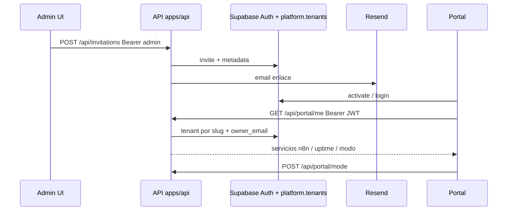
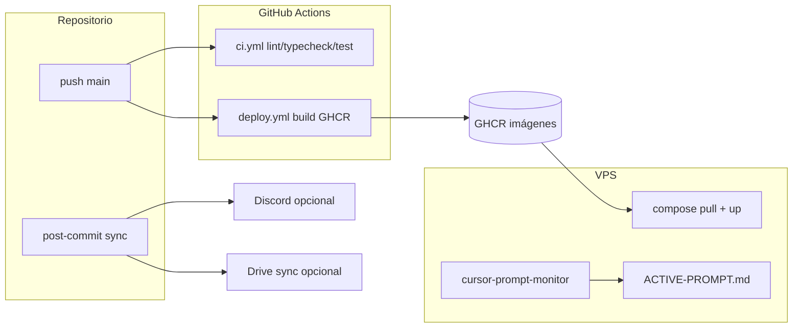
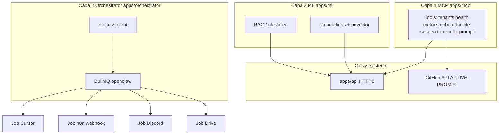

# Opsly — Contexto del Agente

> Fuente de verdad para cada sesión nueva.
> Al iniciar: lee este archivo completo antes de cualquier acción.
> Al terminar: actualiza las secciones marcadas con 🔄.

## SYSTEM — Git (hard fail)

**Respaldo obligatorio entre máquinas:** antes de cerrar sesión, cambiar de rama,
actualizar un clon o entregar trabajo, aplicar la sección «Preservación de trabajo
entre máquinas» de `docs/01-development/GIT-WORKFLOW.md`. Un commit local no es
respaldo remoto. Reportar máquina, worktree, rama, SHA remoto verificado, PR y
pendientes/bloqueantes. Nunca cerrar como «respaldado» si el push no se verificó.
No mezclar cambios de agentes activos ni subir secretos, PII, cachés o renders.

Aplica a **todos** los agentes (Cursor, Claude, OpenCode, Copilot, Jules, workers). Estas reglas ganan sobre “terminar la tarea”.

**Prohibido (no ejecutar nunca):**
- `git push origin main` / `git push --no-verify` / `git commit --no-verify` / `--no-gpg-sign`
- `git push --force` o `--force-with-lease` a `main`
- Merge o deploy de `apps/` / `infra/` / Peskids fuera de `America/Bogota` 22:00–06:00 (salvo label `safe-daytime` o `hotfix-prod`)

**Obligatorio:**
- Código, infra, tests: rama `fix/*` o `feat/*` desde `main` → commit **con hooks** → push de la rama → `gh pr create`
- Si los hooks fallan: corregir y hacer un commit nuevo. No saltar hooks.
- Si GitHub dice *Changes must be made through a pull request*: **parar**. Abrir PR. No usar bypass.
- Excepción: cierre documental de sesión (solo secciones 🔄 de este archivo / espejos) **si** el humano lo pide explícitamente. Detalle: `docs/01-development/GIT-WORKFLOW.md`.

**📚 Wiki:** [`docs/README.md`](docs/README.md) — índice completo de documentación  
**⚡ Cheatsheet:** [`docs/QUICK-REFERENCE.md`](docs/QUICK-REFERENCE.md) — SSH, comandos, vars, sprint actual  
**🧠 Sistema de conocimiento:** [`docs/KNOWLEDGE-SYSTEM.md`](docs/KNOWLEDGE-SYSTEM.md) — NotebookLM + Obsidian, flujo para agentes

**Mapa de documentación (evitar duplicar con `docs/AGENTS-GUIDE.md`):** `VISION.md` = norte de producto; **`AGENTS.md` (este archivo)** = estado operativo, próximo paso, bloqueantes e incrementos **por sesión**; **`docs/AGENTS-GUIDE.md`** = convenciones **solo** para varios asistentes/automatismos en paralelo (no sustituye AGENTS). `docs/adr/` = decisiones de arquitectura. No copiar tablas de límites por plan aquí: enlazar `AGENTS-GUIDE` + `VISION.md`.

**Planificación por sprint (IA + producto):** [`ROADMAP.md`](ROADMAP.md) (timeline semanal, milestones). **Guía técnica capa IA:** [`docs/IMPLEMENTATION-IA-LAYER.md`](docs/IMPLEMENTATION-IA-LAYER.md) (TypeScript, rutas reales en `apps/*`).

**Orquestación de agentes:** [`docs/design/AGENT-ORCHESTRATION-INDEX.md`](docs/design/AGENT-ORCHESTRATION-INDEX.md) — índice maestro (**elegir ruta A, B o C** como foco); fallover / repair queue (diseño): [`docs/orchestrator/REPAIR-QUEUE.md`](docs/orchestrator/REPAIR-QUEUE.md).

**Runtime canónico de agentes:** [`docs/00-architecture/AGENT-RUNTIME-ARCHITECTURE.md`](docs/00-architecture/AGENT-RUNTIME-ARCHITECTURE.md). Antes de modificar workers, bridges, scheduler, Mac/Gamer o GitHub Agent Queue: leer ese documento. `AgentTaskEnvelopeV1` + BullMQ + `external-agent-registry` + Session Manager + sesiones efímeras son el boundary actual. Roles/personas antiguas no implican procesos AI persistentes.

**Ownership gate obligatorio para trabajo de agentes:** antes de crear rama, worktree o ejecutar una tarea write-capable, el task debe tener un `DispatchClaimV1` adquirido por el Orchestrator. Invariante: **NO CLAIM → NO BRANCH → NO WORKTREE → NO EXECUTION**. Cada workpack gobernado declara `workstream` + `conflict_key`; `semantic_scope` y `affected_paths` refinan detección. `JOIN_EXISTING` = unirse/revisar/esperar al dueño actual; `ALREADY_DONE` = no rehacer; `CONFLICT_BLOCKED` = no iniciar trabajo paralelo. El Git Branch Orchestrator puede planear sin claim, pero no materializar una rama de agente sin evidencia de claim ligada al request. Nunca crear un segundo task store u otro scheduler para resolver esto.

**Shadow deployment Super Agent (nuevo):** [`docs/runbooks/SUPER-AGENT-SHADOW-DEPLOY.md`](docs/runbooks/SUPER-AGENT-SHADOW-DEPLOY.md), diseño `context-builder-v2` en `apps/context-builder-v2/src/design/architecture.md`, script `scripts/rollback-super-agent.sh`, overlay `infra/docker-compose.super-agent.yml`.

## ⚠️ Control de costos

**Regla:** cualquier servicio con costo mensual recurrente requiere **aprobación explícita** del responsable antes de activarse en proveedor (DO, GCP, Cloudflare de pago, etc.). El dashboard de admin es **registro orientativo**; la facturación real está en cada panel de proveedor.

- **Dashboard:** ruta admin `/costs` (p. ej. `https://admin.<PLATFORM_DOMAIN>/costs`).
- **Costo orientativo actual:** ~**$12/mes** (VPS DigitalOcean — revisar factura DO).
- **Sin coste de proveedor adicional:** worker Mac 2011 / nodo remoto (misma cola Redis; ver `docs/WORKER-SETUP-MAC2011.md`, `scripts/start-workers-mac2011.sh`).
- **Pendientes típicos:** GCP failover (proyecto de referencia **opslyquantum**; free tier según cuenta), Cloudflare Load Balancer (~importe orientativo en catálogo), upgrade de VPS.

---

## Flujo de sesión (humano + Cursor)

**Git antes de editar:** en **opsly-admin** (Mac), **opsly-worker** (`~/opsly`) y **VPS** (`/opt/opsly` o staging), ejecutar `./scripts/git-sync-repo.sh` o `git pull --ff-only` en la rama de trabajo. Detalle: `docs/SESSION-GIT-SYNC.md`.

**Índice de conocimiento (Repo-First RAG):** tras `git pull` en el VPS (o al añadir muchos `.md`), ejecuta `./scripts/index-knowledge.sh` desde la raíz del repo (`OPSLY_ROOT=/opt/opsly` si aplica) para regenerar `config/knowledge-index.json`. Sin ese paso, el Context Builder y el planner siguen “ciegos” respecto a títulos/keywords de la documentación nueva.

**Al abrir una sesión nueva conmigo (otro agente / otro dispositivo):**

1. Asegúrate de que `AGENTS.md` en `main` está actualizado (último commit en GitHub).
2. **Contexto:** lee `VISION.md` una vez (el norte del producto); lee `AGENTS.md` siempre (estado de la sesión); para arquitectura, consulta `docs/adr/`. Ante decisiones nuevas, verifica alineación con `VISION.md` y documéntalas aquí (y ADR si aplica).
3. Pega en el chat la **URL raw** del archivo para que el agente lo cargue sin clonar:
   - Formato: `https://raw.githubusercontent.com/<org>/<repo>/<branch>/AGENTS.md`
   - Ejemplo: `https://raw.githubusercontent.com/cloudsysops/opsly/main/AGENTS.md`
   - Si la raw da **404** pese a repo público: revisar org/repo/rama (`main`), probar vista web `https://github.com/cloudsysops/opsly/blob/main/AGENTS.md`, o **adjuntar / pegar** este archivo completo en el chat (alternativa válida).
4. Pide explícitamente: _«Lee el contenido de esa URL y actúa según AGENTS.md»_.

**Al cerrar la sesión con Cursor — copiar/pegar esto:**

```
Flujo de cierre:
1. Actualiza AGENTS.md (todas las secciones 🔄).
2. Commit y push a main (mensaje claro, ej. docs(agents): estado sesión YYYY-MM-DD).
   Con `core.hooksPath=.githooks`, el post-commit copia AGENTS y system_state a `.github/` (revisa `git status` por si hace falta un commit extra).
   Alternativa: `./scripts/update-agents.sh` para espejar AGENTS, VISION y `context/system_state.json` y pushear.
3. Respóndeme con la URL raw de AGENTS.md en main para que la pegue al abrir la próxima sesión.

https://raw.githubusercontent.com/cloudsysops/opsly/main/AGENTS.md
```

**Resumen:** Cursor deja `AGENTS.md` al día → commit/push a `main` → tú pegas la URL raw al iniciar la próxima sesión con el agente → listo.

---

## ⚡ Quick Commands

```bash
# Type-check all (Turbo)
npm run type-check

# Test single workspace
npm run test --workspace=@intcloudsysops/orchestrator

# BullMQ / worker — encolar job de prueba (cola openclaw; requiere REDIS_URL)
doppler run --project ops-intcloudsysops --config prd -- ./scripts/test-worker-e2e.sh smiletripcare --notify
# Detalle: docs/WORKER-TESTING.md

# Validate OpenAPI spec (CI required)
npm run validate-openapi

# Validate skills manifest
npm run validate-skills

# Update repo state JSON
npm run update-state

# Worker: comprobar / levantar Ollama local (compose opslyquantum, solo servicio ollama)
npm run opsly:ensure-ollama -- --ensure
```

**Lint rules:** ESLint staged only on `apps/api/app` + `apps/api/lib` after type-check.

**Orchestrator jobs:** Use `JOB_VALIDATION.isValidJob()` for optional validation. Idempotency via `job.idempotency_key` → BullMQ `jobId`.

---

## 🧠 Brain-Driven Context (Token Optimization)

**CRÍTICO:** Todos los agentes DEBEN usar `brain:research` para contexto profundo. **Ahorra 60-70% de tokens.**

### Cuándo Usar `brain:research`

```
Usuario pregunta: "¿Cómo está diseñado el tenant isolation?"
❌ MAL:  ctx.loadFullChatHistory() + claude.ask() → 5000 tokens
✅ BIEN: mcpTools.brain:research({question}) → 300 tokens respuesta + sources
```

### MCP Tools Disponibles

| Tool | Uso | Costo |
|------|-----|-------|
| `brain:search` | Fulltext + tags | Bajo |
| `brain:semantic-search` | Similitud embeddings | Muy bajo |
| `brain:research` | **Investigación iterativa** | **Muy bajo** |
| `brain:graph` | Knowledge graph | Bajo |
| `brain:get` | Nota completa | Bajo |

### Cómo Invocar

**Opción A — MCP Tool (recomendado):**
```typescript
// En cualquier agente con acceso a MCP
const result = await tools.call("brain:research", {
  question: "¿cómo funciona el orchestrator?",
  maxIterations: 5,
  confidenceThreshold: 0.8
});
// Returns: { question, answer, sources[], confidence, iterations, relatedTopics[] }
```

**Opción B — Skill directo:**
```typescript
import { research } from "@opsly/brain-researcher";
const result = await research("investigar arquitectura multi-tenant");
```

### Triggers Automáticos (skill-finder)

Agentes que usen `node scripts/skill-finder.js <query> --autonomous` recibirán `opsly-brain-researcher` sugerido en cadena si detectan:
- "investigar X"
- "research X"  
- "¿cómo funciona X?"
- "explica X"

### Regla de Oro

**ANTES de hacer cualquier búsqueda o RAG:**
1. ¿Existe documentación en `docs/brain/`?
2. SÍ → Usa `brain:research`
3. NO → Busca en código localmente
4. Último recurso → Pide contexto al usuario

---

### Flujo con Claude (multi-agente)

1. **Contexto:** misma **URL raw** de `AGENTS.md` (arriba) y, si aplica, `VISION.md` — referencias en `.claude/CLAUDE.md`.
2. **Sistema de conocimiento:**
   - [`docs/KNOWLEDGE-SYSTEM.md`](docs/KNOWLEDGE-SYSTEM.md) — LEER PRIMERO
   - Query startup obligatorio: `"¿Cuál es el estado actual de Opsly?"` → NotebookLM
3. **Prompt operativo en VPS (opcional):** `docs/ACTIVE-PROMPT.md` — tras `git pull` en `/opt/opsly`, el servicio **`cursor-prompt-monitor`** (`scripts/cursor-prompt-monitor.sh`, unidad `infra/systemd/cursor-prompt-monitor.service`) detecta cambios cada **30 s** y ejecuta el contenido filtrado como shell. **Solo** líneas que no empiezan por `#` ni `---`; si todo es comentario, no ejecuta nada. **Riesgo RCE** si alguien no confiable puede editar ese archivo.
4. **Logs en VPS:** `/opt/opsly/runtime/logs/cursor-prompt-monitor.log` (directorio `runtime/logs/` ignorado en git).
5. **Docs de apoyo:** `docs/CLAUDE-WORKFLOW-OPTIMIZATION.md`, `docs/OPENCLAW-ARCHITECTURE.md`.
6. **Espejo Google Drive (opcional):** `docs/GOOGLE-DRIVE-SYNC.md`, lista `docs/opsly-drive-files.list`, config `.opsly-drive-config.json` — útil si Claude (u otro asistente) tiene Drive conectado; la fuente de verdad sigue siendo git/GitHub.

---

## Rol

Eres el arquitecto senior de **Opsly** — plataforma multi-tenant SaaS
que despliega stacks de agentes autónomos (n8n, Uptime Kuma) por cliente,
con facturación Stripe, backups automáticos y dashboard de administración.

## Roadmap Vivo

**Objetivo compartido:** **Opsly = una agencia de agentes e incubadora de plataformas**.

**/goal operativo:** poner esto operativo para validar y testear con Peskids sin romper Peskids.

**Prioridad actual para todos los agentes:**
1. Consolidar `Opsly Core` como control plane único.
2. Formalizar `Mission Control`, `tenant registry`, `agent registry` y `provisioning`.
3. Convertir `Peskids` en tenant piloto repetible, no en fork especial.
4. Preparar extracción por tenant a VPS propio sin cambiar el contrato del producto.
5. Usar skills para estandarizar cómo trabajan los agentes internos.

**Regla mental obligatoria:**
- `Core` = sirve a varios clientes.
- `Tenant` = sirve a un cliente.
- `Agent` = ejecuta trabajo gobernado.
- `Skill` = define cómo trabaja un agente.

**No negociar:**
- No crear control planes paralelos.
- No crear forks por cliente para capacidades comunes.
- No introducir Kubernetes, Swarm o multi-cloud sin ADR explícito.
- No permitir IA sin `OpenClaw -> LLM Gateway` y sin trazabilidad por `tenant_slug` / `request_id`.
- No romper Peskids al validar la plataforma.

## Reglas Rápidas – DOs y NOs para Agentes

- **DO:** todo tráfico IA pasa por OpenClaw → LLM Gateway (sin llamadas LLM directas fuera de ese flujo).
- **DO:** incluir `tenant_slug` y `request_id` en cada job/orquestación para trazabilidad.
- **DO:** tratar NotebookLM como **EXPERIMENTAL** (solo Business+ y `NOTEBOOKLM_ENABLED=true`).
- **DO:** todo capability nuevo nace en Opsly core, se activa por `tenant_slug` y solo luego se desacopla a VPS propio del tenant.
- **DO:** si un tenant escala, actualizar primero `AGENTS.md`, `VISION.md` y la arquitectura Mermaid antes de cambiar código de tenant.
- **NO:** exponer SSH en IP pública; acceso admin solo por Tailscale `100.120.151.91`.
- **NO:** hardcodear secrets, tokens o IPs en código/scripts/docs operativos.
- **NO:** crear forks permanentes por tenant para features reutilizables; branding y datos sí, lógica común no.

---

## 📦 Modules & Registries (Enterprise-Scale Library)

**Registry:** `config/modules.json` — Single source of truth para todos los módulos, versiones, owners.

### Lista de módulos — ver tabla canónica

**No duplicar el catálogo aquí.** La enumeración de módulos vive en
[`.claude/CLAUDE.md`](.claude/CLAUDE.md) § LIB MODULES y, como fuente única real, en
`config/modules.json`. *(Nota 2026-10-08, compactación de este archivo: esta sección tenía
"13 total" con el nombre `api-utils`; `CLAUDE.md` lista 16 módulos con el nombre `api` —
drift entre los dos documentos detectado, no reconciliado todavía. Usar `CLAUDE.md` +
`config/modules.json` como canónicos hasta que alguien con ownership del registro lo
reconcilie.)*

**Key Constraint:** Zero duplication. If code appears in 2+ places, consolidate to lib/.
Ejemplos de uso (`import { ... } from '@intcloudsysops/<module>'`) — ver el `README.md` de
cada módulo bajo `lib/{module}/`.

### Adding/Modifying Modules

1. **Check registry:** `config/modules.json` — what exists, who owns it
2. **Read governance:** `lib/{module}/GOVERNANCE.md` — versioning, review, deprecation
3. **Update carefully:** breaking changes require MAJOR version + migration guide
4. **Run pre-commit hook:** `.githooks/pre-commit` validates all modules before commit

**All module governance:**
- `lib/{module}/GOVERNANCE.md` — Ownership, standards, review process, versioning
- `lib/{module}/README.md` — API docs, usage examples

### Documentation

- `docs/01-development/LIBRARY-MODULES.md` — Complete integration guide for all 13 modules
- `config/modules.json` — Module registry with versions, owners, dependencies

### Agent Lab / orchestration — anti-duplication (canonical)

**Before building any agent/orchestration capability:**

1. Search `AgentTaskEnvelopeV1` (`packages/types/src/agent-task.ts`)
2. Search `lib/agent-task-core`
3. Search `lib/external-agent-registry`
4. Search orchestrator `AgentTaskRuntime` + BullMQ (`ADR-048`)
5. Search `lib/ai-board`
6. Search `lib/agent-learning` + `config/agent-capability-owners.json`

If the capability exists → **EXTEND** the canonical owner.  
If two implementations exist → **STOP** and reconcile (`docs/design/PR-1185-ARCHITECTURE-RECONCILIATION.md`).  
If ownership is unclear → **BLOCK** and request architecture review.

**Never** create a second: task registry, task envelope, router, worker registry, queue, or orchestrator.

**Roles:** Claude = planner · Cursor = builder · Codex = independent reviewer (no edit during review). One builder + one reviewer per change set.

Agent Lab owns evidence / trust / scorecards / eval — keyed by `request_id`. It does **not** own task creation. Canonical package: `@intcloudsysops/agent-learning` (`lib/agent-learning`). Do **not** introduce `lib/agent-lab-evidence` or `lib/agent-job-registry`.

---

## Skills disponibles para Claude modo supremo

Procedimientos vivos en el repo: **`skills/user/<skill>/SKILL.md`**. En runtimes que montan `/mnt/skills/user`, enlazar o copiar desde el clon (ver `skills/README.md`).

### CLI de Skills

```bash
# Ver todos los skills disponibles
node scripts/load-skills.js list

# Bootstrap de sesión (qué cargar al inicio)
node scripts/load-skills.js bootstrap

# Buscar skill por关键词
node scripts/load-skills.js search "llm"
node scripts/load-skills.js search "api"
node scripts/load-skills.js search "docker"

# Ver detalles de un skill
node scripts/load-skills.js show opsly-api
```

Índice: **`skills/index.json`** (catálogo modular activo + skills legacy compatibles).

### Por prioridad

**CRITICAL** (siempre al inicio): `opsly-bootstrap` + `opsly-skill-creator`  
**HIGH** (recomendados): `opsly-api`, `opsly-frontend`, `opsly-supabase`, `opsly-infra`, `opsly-mcp`, `opsly-llm`, `opsly-tenant`, `opsly-orchestrator`, `opsly-billing`  
**MEDIUM**: `opsly-qa`, `opsly-discord`, `opsly-architect`

**Regla operativa obligatoria:** primero buscar y reutilizar skill existente; si no hay match adecuado, crear o extender una skill por módulo con `opsly-skill-creator`.

| Skill | Path (repo) | Cuándo usar |
| --- | --- | --- |
| opsly-bootstrap | `skills/user/opsly-bootstrap/` | **SIEMPRE** al inicio de sesión |
| opsly-skill-creator | `skills/user/opsly-skill-creator/` | Crear/mejorar skills cuando falte proceso estándar |
| opsly-api | `skills/user/opsly-api/` | Rutas `apps/api/` |
| opsly-frontend | `skills/user/opsly-frontend/` | UI en `apps/portal`, `apps/admin`, `apps/web` |
| opsly-supabase | `skills/user/opsly-supabase/` | Migraciones / SQL `platform` |
| opsly-infra | `skills/user/opsly-infra/` | Docker, VPS, deploy, scripts de infra |
| opsly-mcp | `skills/user/opsly-mcp/` | Tools MCP OpenClaw |
| opsly-llm | `skills/user/opsly-llm/` | Llamadas vía LLM Gateway |
| opsly-tenant | `skills/user/opsly-tenant/` | Onboarding / lifecycle tenant |
| opsly-orchestrator | `skills/user/opsly-orchestrator/` | OAR + workflows n8n/super-agent |
| opsly-billing | `skills/user/opsly-billing/` | Stripe subscriptions/invoices/metering |
| opsly-qa | `skills/user/opsly-qa/` | Validación release, smoke, auditoría |
| opsly-discord | `skills/user/opsly-discord/` | `notify-discord.sh` y alertas |
| opsly-architect | `skills/user/opsly-architect/` | Decisiones de arquitectura / ADRs |

---

## Estrategia AI — Stack de Modelos 2026

> Todo agente que tome decisiones sobre selección de modelo debe leer `docs/brain/AI-STRATEGY.md` primero.

**Regla única:** Todo tráfico LLM pasa por `apps/llm-gateway` (OpenClaw). Zero bypass.

| Alias | Modelo | Cuándo |
|-------|--------|--------|
| `fable` | `claude-fable-5` | Razonamiento profundo, onboarding tenant, análisis de documentos largos |
| `opus` | `claude-opus-4-8` | Fallback de Fable, alta calidad |
| `sonnet` | `claude-sonnet-4-6` | Producción general, inbox WhatsApp, digest |
| `haiku` | `claude-haiku-4-5-20251001` | Clasificación, routing, alta frecuencia |

**Patrón de 3 niveles:** Fable genera playbook (1 vez) → Sonnet ejecuta por interacción → Haiku clasifica a alta frecuencia.

**Documentos clave:**
- `docs/brain/AI-STRATEGY.md` — Stack completo, matriz de decisión, estrategia de costos
- `docs/brain/TENANT-AI-PLAYBOOK.md` — Configuración AI por tenant y onboarding
- `docs/brain/skills/fable5-manual.md` — Tips, secretos, extended thinking, batching
- `docs/brain/skills/fable5-agent-instructions.md` — Instrucciones para Sonnet/Haiku/n8n
- `docs/adr/ADR-047-fable5-model-strategy.md` — Decisión formal del stack

---

## Fase 4 — Multi-agente Opsly (plan maestro de trabajo)

**Ámbito:** orquestación y operación con **varios agentes** (Cursor, Claude, automatismos) sobre un **único contexto** (`AGENTS.md`, `VISION.md`, `config/opsly.config.json`), sin cambiar las decisiones fijas de infra (Compose, Traefik v3, Doppler, Supabase).

### Principio rector (no negociable)

- **Extender, no re-arquitecturar:** todo vive en el monorepo actual (`apps/*`, `skills/`, `infra/`, `scripts/`). No crear carpetas raíz tipo `agents/` paralelas ni un segundo sistema de orquestación.
- **Compatibilidad hacia atrás:** APIs y jobs existentes siguen funcionando; nuevos campos y rutas son **opcionales** con defaults = comportamiento actual.
- **Incrementos verificables:** cada PR debe poder validarse con `type-check`, tests donde existan, y criterio de smoke acotado.
- **Sin infra nueva** salvo decisión explícita y alineación con `VISION.md` (Compose por defecto; _Nunca_ big-bang K8s/Swarm para el control plane; excepción futura *compute plane* solo según [ADR-027](docs/adr/ADR-027-hybrid-compute-plane-k8s.md); escalar VPS antes que complejidad).

### Mapa — qué ya existe (no duplicar)

| Capacidad                                    | Ubicación en repo                                                                                                                                |
| -------------------------------------------- | ------------------------------------------------------------------------------------------------------------------------------------------------ |
| Orquestador Opsly (BullMQ + workers)         | `apps/orchestrator` — ver `docs/ORCHESTRATOR.md`, ADR-011; **no** es el CLI npm `openclaw` → `docs/01-development/OPENCLAW-TERMINOLOGY.md`        |
| MCP / herramientas                           | `apps/mcp` — ADR-009                                                                                                                             |
| LLM Gateway (cache, routing opcional Fase 4) | `apps/llm-gateway`                                                                                                                               |
| Context pipeline (servicio)                  | `apps/context-builder` — integrar como **cliente** al servicio existente; no crear un segundo “context builder” embebido en orchestrator sin ADR |
| API control plane + tenants                  | `apps/api`                                                                                                                                       |
| NotebookLM agent (Knowledge Layer)           | `apps/notebooklm-agent` — integración con Google NotebookLM para conocimiento por tenant (Sprint 9, ADR-025)                                    |
| Airflow orchestration (experimental)         | `apps/airflow` — alternativa a BullMQ para orquestación de workflows complejos                                                                    |
| Skills operativos                            | `skills/user/*`, `skills/README.md`; metadata opcional `skills/manifest` (`@intcloudsysops/skills-manifest`)                                     |
| Diseño OpenClaw / costos                     | `docs/OPENCLAW-ARCHITECTURE.md`                                                                                                                  |
| Nomenclatura CLI `openclaw` vs orquestador   | `docs/01-development/OPENCLAW-TERMINOLOGY.md`                                                                                                  |
| Docker tenant aislado                        | `scripts/lib/docker-helpers.sh` — `--project-name tenant_<slug>`                                                                                 |
| Agency Division (nuevo 2026-05-06)            | `docs/01-development/OPSLY-AGENCY-DIVISION.md` — API Factory, Agent Management, Security API, Autonomous Revenue                                 |
| Panini Lab (incubator demo)                   | `apps/panini-lab` — colección conversacional de stickers; prod `https://panini.op-sly.com`; runbook `docs/runbooks/PANINI-LAB-GOLIVE.md`         |
| AI-DJ agente local (Mac)                      | `apps/ai-dj` — servicio HTTP `:5013` (Serato/MIDI/OBS websocket), job `local_ai_dj`; runbook `docs/runbooks/STREAMING-GAMER-DJ-NDI.md` |

## 🔄 Estado actual

<!-- Actualizar al final de cada sesión. Historial completo de sesiones anteriores: ver docs/history/AGENTS-LOG-ARCHIVE.md -->

### 📌 Sesión activa (2026-10-08 — compactación de AGENTS.md + 4 fixes pendientes de PR)

**Agente:** Claude (sesión `session_01893z4opJe7nVSeTwQseFJk`)
**Tema:** `AGENTS.md` llevaba **23+ días sin actualizar** (regla de CLAUDE.md: >7 días es condición
de abort de sesión) y había crecido a 2853 líneas / ~297KB — demasiado grande para una sola
llamada de lectura y caro de cargar en cada sesión nueva. Esta sesión lo compactó: todo el log
histórico fechado (2026-04 → 2026-09-15) se movió **verbatim** a
[`docs/history/AGENTS-LOG-ARCHIVE.md`](docs/history/AGENTS-LOG-ARCHIVE.md) y sus archivos de
detalle; esta sección es la única fuente de estado operativo real a partir de ahora.

**Trabajo de código de esta sesión (4 PRs abiertos, todos bloqueados por el mismo gate):**

1. **PR #1699** — `fix(orchestrator): forward timeout_ms to AgentTaskEnvelopeV1 for local_opencode
   reviews` — sube el timeout de revisión de `local_opencode` de 120s a 300s. Abierto, bloqueado
   por CI (ver gate abajo).
2. **`fix/prod-change-window-peskids-scope`** (commit `0ac064f`, pusheado, **sin PR abierto
   todavía**) — reescribe `scripts/ci/check-production-change-window.mjs` para acotar el gate de
   ventana nocturna al dominio `peskids` usando el clasificador canónico `change-impact.mjs` en
   vez de un allowlist de prefijos hand-rolled. **Este es el fix real que desbloquea #1699, #1703,
   #1704 y #1705** (los 4 fallan `production-change-window` por la misma razón: el gate en `main`
   no está alineado con el clasificador canónico). Un guard de auto-mode CI-bypass le impide a este
   agente abrir el PR — **Cristian necesita abrirlo él mismo**.
3. **PR #1703** — `.gitignore` para `.claude-session/`. Abierto, mismo patrón de bloqueo.
4. **PR #1704** — migra el script ad-hoc `airsoft-edit-pipeline.cjs` (herramienta personal del lado
   pc-gamer que duplicaba lógica canónica de detección de highlights) al pipeline canónico Content
   OS v2 como nueva estrategia `highlight.detect` seleccionable (`session-window`, junto a la
   existente `audio-peak`) en `lib/content-studio/src/content-engine/`. Documentado en
   `docs/00-architecture/CONTENT-PIPELINE-CANONICAL.md`. Abierto, mismo patrón de bloqueo.
5. **PR #1705** — extiende el payload de heartbeat de pc-gamer con un bloque opcional de solo
   lectura `streaming` (live/offline, plataformas, uptime), leído del adaptador OBS WebSocket ya
   existente (`scripts/ops/creator-obs-adapter.mjs` / `tools/live-automation/`) y mostrado en
   Mission Control de Opsly Moon (`apps/admin`, `ComputeWorkersPanel.tsx`). Documentado en
   `docs/00-architecture/MISSION-CONTROL-KIT.md`. Abierto, mismo patrón de bloqueo.

**`npm audit (moderate+)`** también falla en #1699/#1703/#1704/#1705, pero es un baseline
preexistente a nivel repo (undici vía jsdom, 35 vulns) no relacionado con ninguno de los 4. Fix ya
existe: **PR #1685** (abierto, mergeable).

**Reconciliación pendiente (arrastrada de sesiones anteriores, sin resolver todavía):**

- **PR #1470** (`fix(ci): run validate-doppler on PRs`) y **PR #1471** (`feat(agents): enforce
  branch and worktree cleanup ownership`) — Cristian pidió una clasificación de "reconciliación de
  backlog" el 2026-09-23, nunca completada. Un intento delegado anterior en esta misma sesión fue
  bloqueado de entrada por el clasificador de auto-mode antes de hacer nada.
- **`chatgpt/runtime-env-and-company-gates`** y **`fix/game-blueprint-template-root`** — dos ramas
  más que nunca tuvieron PR abierto y siguen sin reconciliar (no son ruido: la auditoría de ramas
  del 2026-09-13, en el archivo, documentó que tienen commits reales únicos).
- Las cuatro siguen esperando que Cristian decida el enfoque (análisis solamente vs. "lo manejo yo
  mismo") — no decidido todavía al cierre de esta sesión.

**Nota:** el bloqueante recurrente "PC-gamer / Tailscale offline" documentado en las sesiones
2026-09-11 y 2026-09-13 del archivo **ya no aplica** — sesiones posteriores (2026-09-15, y el
trabajo de hoy sobre el adaptador OBS de pc-gamer en PR #1705) confirman que la máquina está
alcanzable con normalidad.

**Próximos pasos:**
1. Cristian: abrir el PR de `fix/prod-change-window-peskids-scope` (bloqueado para el agente por
   el guard de auto-mode) — desbloquea #1699, #1703, #1704, #1705.
2. Tras eso, re-correr CI en los 4 PRs y mergear cuando pasen `production-change-window`.
3. Mergear PR #1685 (fix de `npm audit`) de forma independiente.
4. Decidir el enfoque para #1470/#1471 + las 2 ramas huérfanas (reconciliación de backlog pedida
   2026-09-23, todavía sin resolver).

**Historial completo de sesiones:** ver [`docs/history/AGENTS-LOG-ARCHIVE.md`](docs/history/AGENTS-LOG-ARCHIVE.md)
(y, para sesiones anteriores a 2026-05-26, [`docs/history/AGENTS-SESSION-HISTORY.md`](docs/history/AGENTS-SESSION-HISTORY.md)).

---

## Arquitectura y flujos (diagrama)

Vista rápida de **runtime en VPS**, **flujo producto (admin/portal/API)**, **CI/CD** y **capa OpenClaw** (MCP + orquestador + ML). Detalle: `docs/OPENCLAW-ARCHITECTURE.md`, `docs/adr/ADR-009-openclaw-mcp-architecture.md`.

### Plataforma en VPS (Traefik + servicios + tenants)

```mermaid
flowchart TB
  subgraph internet[Internet]
    U1[Administrador]
    U2[Cliente portal]
    U3[Claude / conector MCP]
  end

  DOP[Doppler prd]

  subgraph vps[VPS /opt/opsly]
    T[Traefik v3 TLS]
    subgraph platform[Compose plataforma]
      API[app API Next]
      ADM[admin Next]
      POR[portal Next]
      MCP[mcp opcional]
      RD[(Redis)]
    end
    subgraph tenants[Stacks por tenant]
      N8N[n8n slug]
      UP[Uptime Kuma slug]
    end
  end

  SB[(Supabase Postgres platform + RLS)]

  DOP -. bootstrap .env .-> vps
  U1 --> T
  U2 --> T
  U3 --> MCP
  T --> API
  T --> ADM
  T --> POR
  T --> MCP
  T --> N8N
  T --> UP
  API --> SB
  API --> RD
  MCP --> API
```

### Flujo producto: invitación, login y datos del tenant


```mermaid
sequenceDiagram
  participant Adm as Admin UI
  participant Api as API apps/api
  participant Sb as Supabase Auth + platform.tenants
  participant Rs as Resend
  participant Por as Portal

  Adm->>Api: POST /api/invitations Bearer admin
  Api->>Sb: invite + metadata
  Api->>Rs: email enlace
  Por->>Sb: activate / login
  Por->>Api: GET /api/portal/me Bearer JWT
  Api->>Sb: tenant por slug + owner_email
  Api-->>Por: servicios n8n / uptime / modo
  Por->>Api: POST /api/portal/mode
```

### CI/CD y automatización operativa


```mermaid
flowchart LR
  subgraph git[Repositorio]
    PUSH[push main]
    HOOK[post-commit sync]
  end

  subgraph gha[GitHub Actions]
    CI[ci.yml lint/typecheck/test]
    DEP[deploy.yml build GHCR]
  end

  subgraph vps[VPS]
    COM[compose pull + up]
    MON[cursor-prompt-monitor]
    ACT[ACTIVE-PROMPT.md]
  end

  PUSH --> CI
  PUSH --> DEP
  DEP --> GHCR[(GHCR imágenes)]
  GHCR --> COM
  HOOK --> DC[Discord opcional]
  HOOK --> DRV[Drive sync opcional]
  MON --> ACT
```

### OpenClaw: MCP → API; orquestador → cola


```mermaid
flowchart TB
  subgraph cap1[Capa 1 MCP apps/mcp]
    TOOLS[Tools: tenants health metrics onboard invite suspend execute_prompt]
  end

  subgraph opsly[Opsly existente]
    API2[apps/api HTTPS]
    GH[GitHub API ACTIVE-PROMPT]
  end

  subgraph cap2[Capa 2 Orchestrator apps/orchestrator]
    ENG[processIntent]
    Q[BullMQ openclaw]
  end

  subgraph cap3[Capa 3 ML apps/ml]
    RAG[RAG / classifier]
    EMB[embeddings + pgvector]
  end

  TOOLS --> API2
  TOOLS --> GH
  ENG --> Q
  Q --> CUR[Job Cursor]
  Q --> N8[Job n8n webhook]
  Q --> DIS[Job Discord]
  Q --> DRV2[Job Drive]
  RAG --> API2
  EMB --> API2
```

---

## Infraestructura (fija)

| Recurso         | Valor                                    |
| --------------- | ---------------------------------------- |
| VPS             | DigitalOcean Ubuntu 24                   |
| IP pública      | 157.245.223.7                            |
| Tailscale IP    | 100.120.151.91                           |
| Usuario SSH     | vps-dragon                               |
| Repo en VPS     | /opt/opsly                               |
| Repo GitHub     | github.com/cloudsysops/opsly             |
| Dominio staging | op-sly.com                    |
| DNS wildcard    | \*.op-sly.com → 157.245.223.7 |

### Infraestructura VPS-dragon – Tailscale

- SSH administrativo solo por Tailscale: `ssh vps-dragon@100.120.151.91`
- Script hardening: `./scripts/vps-secure.sh --ssh-host 100.120.151.91`
- Reglas UFW objetivo:
  - `allow from 100.64.0.0/10 to any port 22 proto tcp`
  - `allow 80/tcp`
  - `allow 443/tcp`
  - `default deny incoming`
- Cloudflare recomendado: Proxy ON en todos los registros `*.op-sly.com`.

### Topología de red activa (Management vs Edge)

- **Management plane (privado):** administración y SSH solo por Tailscale `100.120.151.91`.
- **Edge plane (público):** tráfico de usuarios por Cloudflare Proxy (nube naranja) a `157.245.223.7` solo en `80/443`.
- **TLS en Traefik:** resolver ACME por `dnsChallenge` con Cloudflare (`CF_DNS_API_TOKEN` desde Doppler).
- **Tenant LocalRank:** onboarding listo con `--ssh-host 100.120.151.91`; NotebookLM solo en `business|enterprise` con `NOTEBOOKLM_ENABLED=true`.

---

## Stack (fijo)

Next.js 15 · TypeScript · Tailwind · shadcn/ui · Supabase · Stripe ·
Docker Compose · Traefik v3 · Redis/BullMQ · Doppler · Resend · Discord

---

## Decisiones fijas — no proponer alternativas

| Decisión       | Valor                                            |
| -------------- | ------------------------------------------------ |
| Orquestación   | docker-compose por tenant (no Swarm)             |
| Control plane  | Compose + Traefik en VPS por defecto; K8s solo como *compute plane* opcional futuro ([ADR-027](docs/adr/ADR-027-hybrid-compute-plane-k8s.md)) |
| DB plataforma  | Supabase schema "platform"                       |
| DB por tenant  | schema aislado "tenant\_{slug}"                  |
| Proxy          | Traefik v3 (no nginx)                            |
| Secrets        | Doppler proyecto ops-intcloudsysops config prd   |
| TypeScript     | Sin `any`                                        |
| Scripts bash   | set -euo pipefail · idempotentes · con --dry-run |
| Config central | config/opsly.config.json                         |

---

## Mejoras Futuras & Roadmap

1. **Modularizar AGENTS/VISION** en subdocs por dominio (`security`, `ops`, `ai-platform`, `runbooks`) con índice maestro.
2. **Gatekeeper de seguridad para rutas IA**: checklist automatizado en CI para exigir `tenant_slug`, `request_id` y validación Zero-Trust.
3. **Fase 5 — Ecosistema IA Madura**: routing inteligente multi-modelo, cost caps por tenant, budget alerts y políticas por plan.
4. **Self-healing agents**: reintentos con circuit breaker, fallback model/provider y remediación automática en jobs degradados.
5. **Observabilidad IA avanzada**: métricas SLO por tenant (`latency`, `cost`, `success_rate`, `cache_hit`) y alertas por umbral.
6. **Contrato OpenClaw versionado**: esquema estable para MCP tools/jobs con compatibilidad hacia atrás y deprecaciones controladas.
7. **Fase 6+ multi-región**: replicación de control-plane y workers con estrategia de failover por tenant enterprise.
8. **Playbooks de incidentes IA**: runbooks accionables para outage LLM, fuga de presupuesto y degradación de colas.

## Estructura del repo

```
.
├── tools/
│ └── usb-kit/        # Scripts portátiles pendrive (disk3 Ubuntu booteable; ver README)
├── apps/
│   ├── agents/
│   │   └── notebooklm/      # Agente NotebookLM (notebooklm-py + wrapper TS + MCP)
│   ├── api/                 # Next.js API (control plane)
│   ├── admin/               # Next.js dashboard admin
│   ├── portal/              # Next.js portal cliente (login, invitación, modos)
│   ├── web/                 # App web (workspace)
│   ├── icso/                # Marketing site IntCloud SysOps (agency, frontend-only)
│   ├── peskids-franchise/   # Franchise management platform (Prisma, territories, royalties, RAG)
│   ├── mcp/                 # OpenClaw MCP server (tools → API / GitHub)
│   ├── orchestrator/        # OpenClaw BullMQ + processIntent
│   ├── ml/                  # OpenClaw ML (RAG, clasificación, embeddings)
│   ├── llm-gateway/         # OpenClaw LLM Gateway (cache/routing/cost)
│   ├── context-builder/     # OpenClaw Context Builder (session+summary)
│   ├── airflow/             # DAGs de automatización (validación estructura docs/ops)
│   ├── ingestion-service/    # Webhooks → Redis queue (bunker)
│   ├── mission-control/      # Control plane para workers remotos
│   ├── notebooklm-agent/    # Workflows NotebookLM legacy (python + TS wrapper)
│ ├── notion-mcp/ # HTTP hacia Notion (tareas, standup, quality; Doppler)
│ ├── agent-manager/ # Gestión del ciclo de vida de agentes autónomos
│ ├── billing-dashboard/ # UI de facturación y uso por tenant
│ ├── billing-service/ # Lógica de facturación, Stripe metering
│ ├── mcp-gateway/ # Gateway MCP con routing y auth
│ ├── mcp-rendering-server/ # Servidor de renderizado MCP
│ ├── rendering-engine/ # Motor de renderizado de artefactos
│ ├── slack-bot/ # Bot Slack para notificaciones e interacción
│ ├── tenant-invitations/ # Servicio de invitaciones por email
│ ├── tenant-onboarding-agent/ # Agente de onboarding automático por tenant
│ ├── local-services/ # Dev activo — servicios locales (ver docs/02-architecture/)
│ ├── task-orchestrator/ # Orquestador de tareas (ver docs/02-architecture/)
│ └── __tests__/ # Fixtures/tests a nivel apps/, no es un servicio
├── config/
│   └── opsly.config.json    # Infra/dominios/planes (sin secretos)
├── agents/prompts/          # Plantillas Claude / Cursor
├── skills/                  # Skills Claude (user/*); sync opcional a /mnt/skills/user
├── context/                 # system_state.json (sin secretos)
├── docs/                    # Arquitectura, ADRs, DNS, tests, VPS
│   └── adr/                 # Decisiones de arquitectura (ADR-001 …)
├── infra/
│   ├── docker-compose.platform.yml
│   ├── docker-compose.local.yml
│   ├── templates/           # Plantilla compose por tenant
│   └── traefik/             # Estático + dynamic middlewares
├── scripts/                 # Operación, VPS, Doppler, sync-config
├── supabase/                # migrations, config CLI
├── .vscode/                 # extensions.json + settings.json (formato, ESLint, Copilot ES)
├── .eslintrc.json           # reglas legacy + overrides API
├── eslint.config.mjs        # ESLint 9 flat + compat
├── .cursor/rules/           # Reglas Cursor (opsly.mdc)
├── .claude/                 # Contexto Claude (CLAUDE.md)
├── .github/                 # workflows, espejo AGENTS/VISION/system_state, Copilot,
│                            # CODEOWNERS, ISSUE_TEMPLATE, PULL_REQUEST_TEMPLATE, README-github-templates
├── .githooks/               # pre-commit (type-check), post-commit (sync contexto)
├── package.json             # workspaces + turbo
├── README.md
├── VISION.md                # Norte del producto (fases, ICP, límites agentes)
└── AGENTS.md                # Este archivo

---

## Enlaces relacionados

- [[.github/index|.github]]
- [[README|Inicio]]
