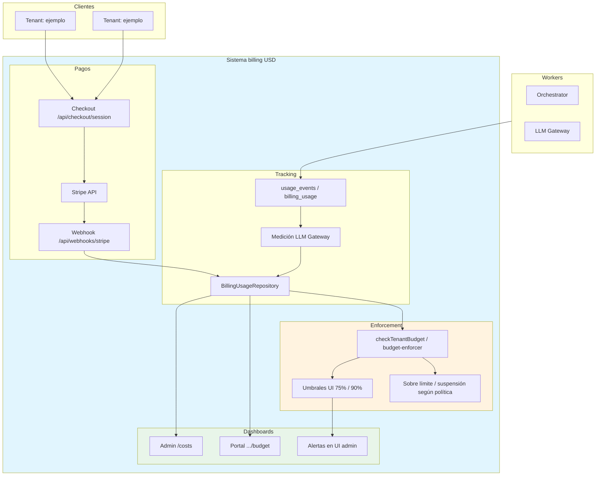
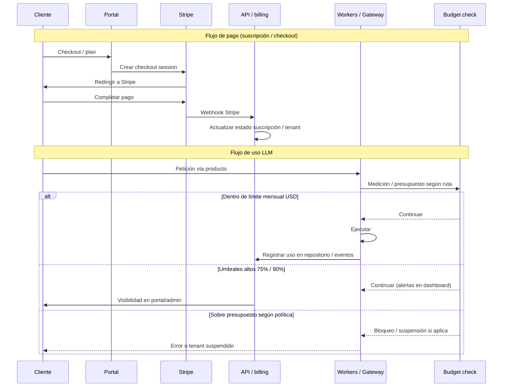
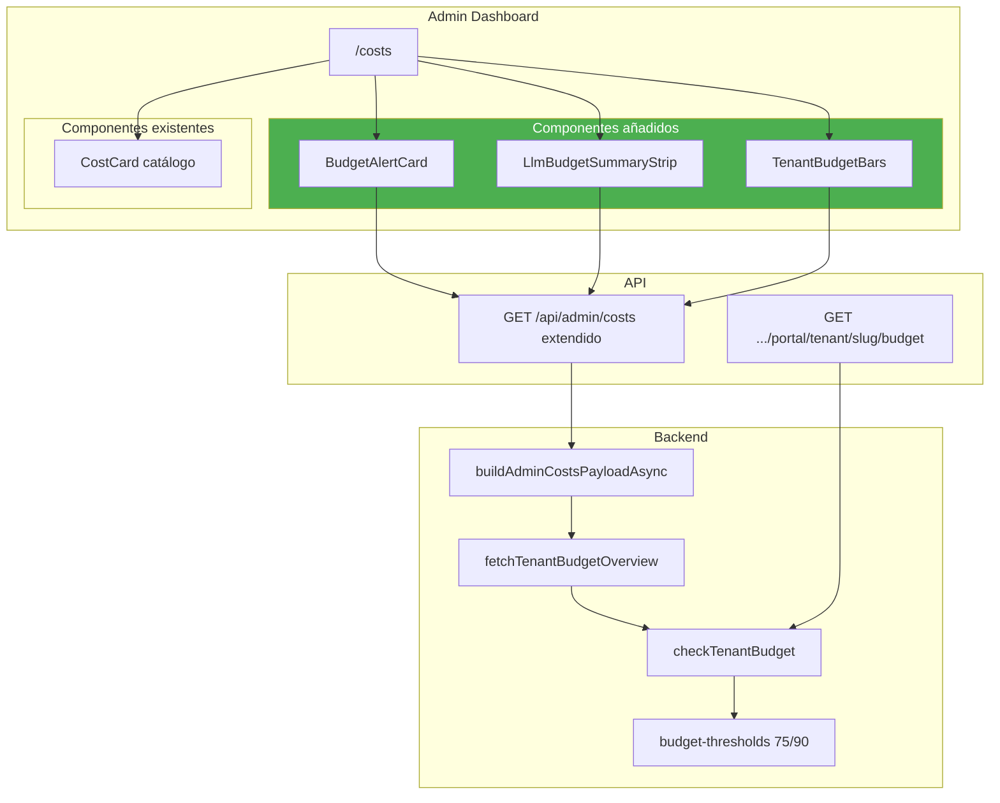
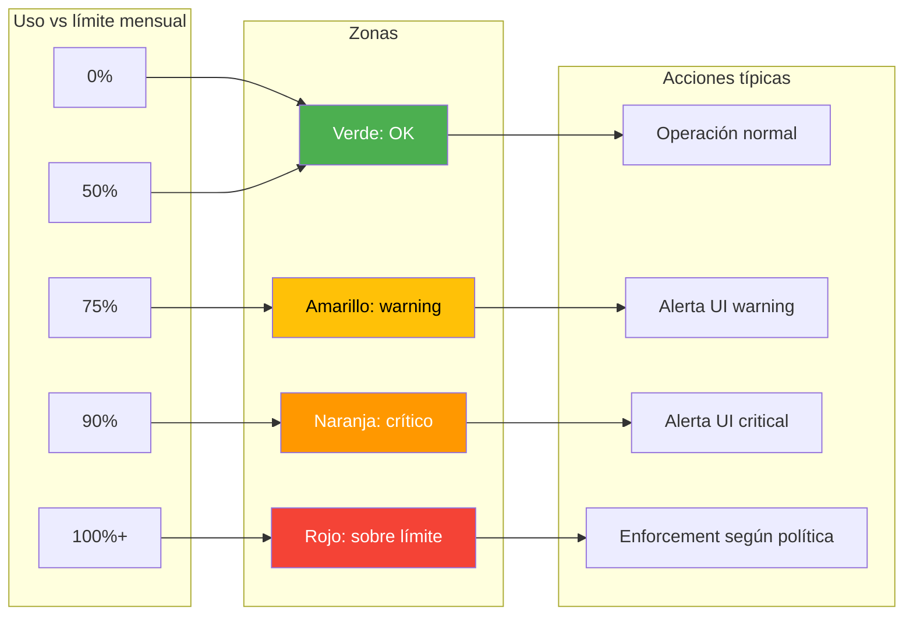
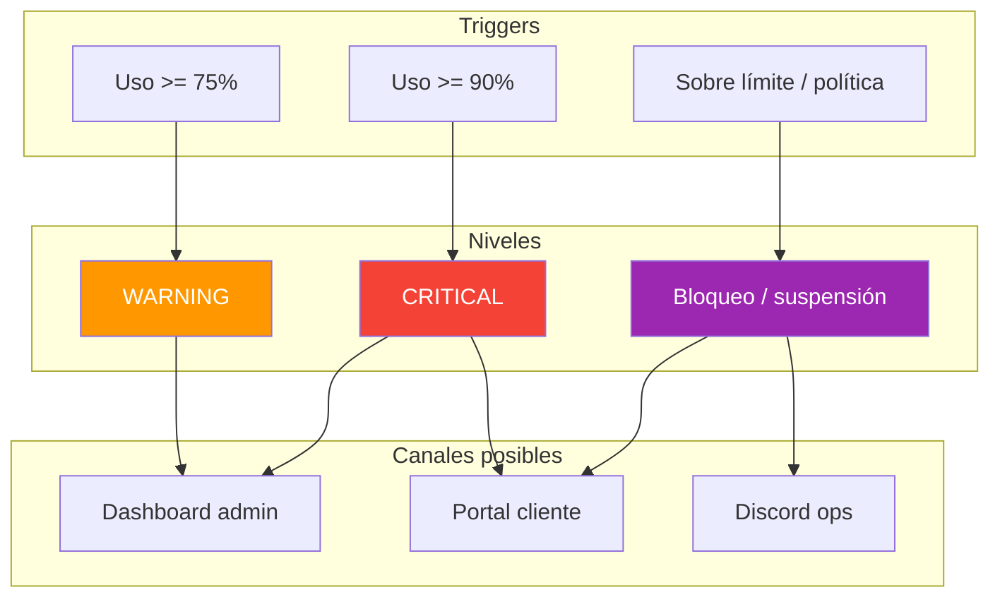
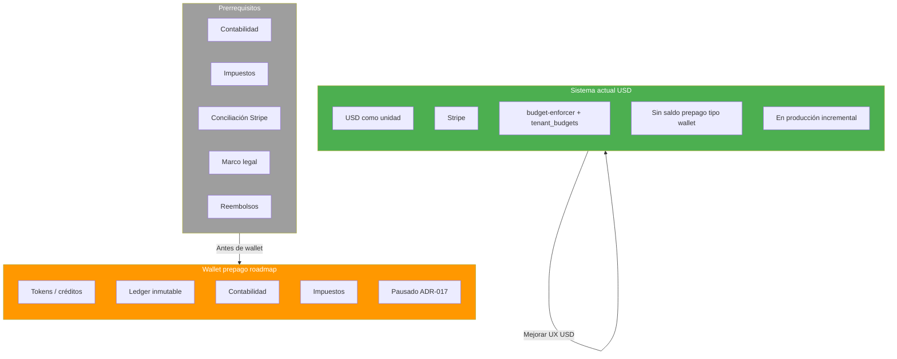
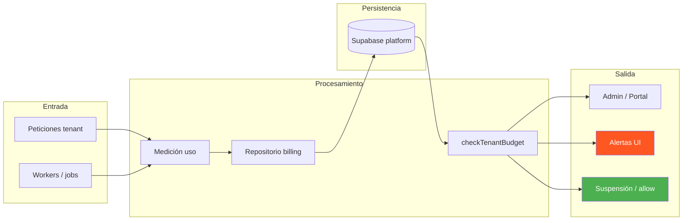
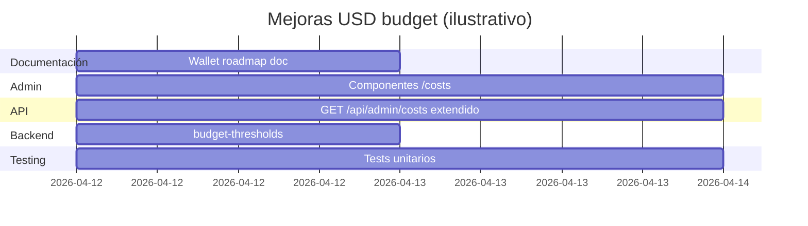
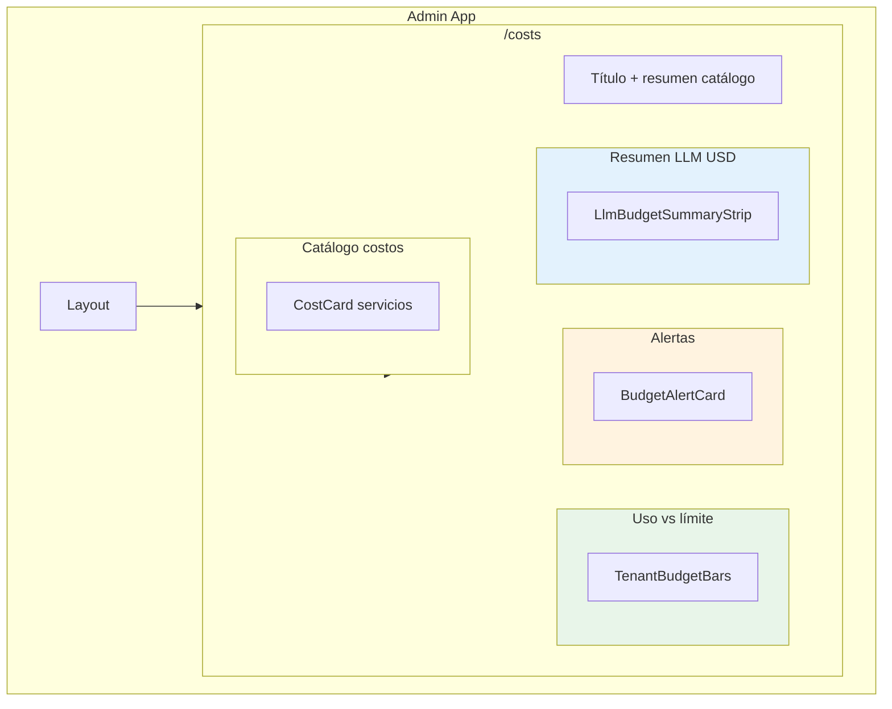
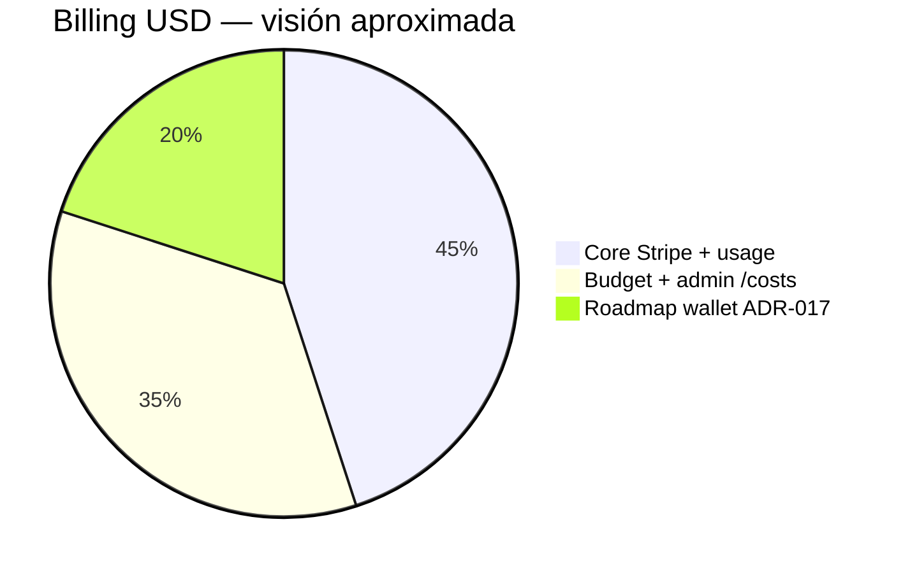

# Diagramas Mermaid — Billing USD (Opsly)

> **Alcance:** sistema actual en **USD** (sin wallet prepago). Wallet prepago: pausado según [ADR-030](adr/ADR-030-prepaid-token-wallet-roadmap.md) y [WALLET-PREPAID-ROADMAP](WALLET-PREPAID-ROADMAP.md).  
> **UI admin:** `/costs` usa `BudgetAlertCard`, `LlmBudgetSummaryStrip`, `TenantBudgetBars` y datos de `GET /api/admin/costs` (incl. `tenant_budgets`, `llm_budget_summary`).  
> **Umbrales UI:** 75% warning, 90% critical (`budget-thresholds.ts`). El enforcement de suspensión sigue la lógica de `checkTenantBudget` y políticas de tenant.

---

## 1. Arquitectura actual USD

---

## 2. Flujo de pago y uso (referencia)

---

## 3. Admin `/costs` y API (implementado)

---

## 4. Presupuesto: zonas y umbrales (UI)

---

## 5. Sistema de alertas (orientativo)

> Los canales Email/Discord masivos no están todos cableados en el diagrama de producto; el admin `/costs` muestra alertas por tenant. Discord puede usarse en flujos operativos aparte.

---

## 6. USD actual vs wallet prepago

---

## 7. Flujo de datos (alto nivel)

---

## 8. Timeline ilustrativo

> Planificación de ejemplo; el calendario real está en sprints y `AGENTS.md`.

---

## 9. Componentes UI en `/costs`

---

## 10. Estado del sistema (orientativo)

---

## Referencias

- [ADR-030 — Wallet prepago](adr/ADR-030-prepaid-token-wallet-roadmap.md)
- [WALLET-PREPAID-ROADMAP.md](WALLET-PREPAID-ROADMAP.md)
- [TOKEN-BILLING-SYSTEM.md](TOKEN-BILLING-SYSTEM.md)
- Código: `apps/api/lib/billing/budget-thresholds.ts`, `admin-costs-tenant-budgets.ts`, `apps/admin/app/costs/page.tsx`
