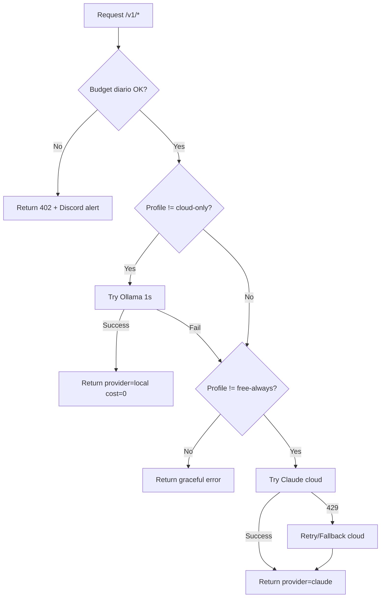

# Policy AI Local-First

Fecha: 2026-04-13  
Estado: Activa (Semana 1 — Operational Maturity)

## Decisión

Opsly adopta una política **local-first** para inferencia IA:

- Primera opción: Ollama local en `opsly-mac2011`.
- Fallback cloud: proveedor cloud cuando el intento local excede `1s` o falla.
- Error graceful: si no hay ruta permitida por perfil, se retorna error controlado.

## Perfiles Operativos

- `free-always`: solo local; sin fallback cloud.
- `hybrid`: local + fallback cloud.
- `cloud-only`: cloud directo (legacy compatible).

## Tenants Default

- `smiletripcare` -> `hybrid`
- `peskids` -> `hybrid`
- `intcloudsysops` -> `free-always`

## Routing en LLM Gateway

1. Resolver `tenant_slug`, perfil y budget diario.
2. Si supera budget diario -> bloqueo `402` + alerta Discord.
3. Si consumo >= 80% del budget -> alerta preventiva Discord.
4. Si perfil != `cloud-only`:
   - Intentar Ollama (`/api/chat`) con timeout de `1s`.
   - Si responde -> provider `local`, `cost_usd=0`.
5. Si local falla y perfil != `free-always`:
   - Fallback a cloud (Claude primero, luego fallback secundario en 429).
6. Registrar uso en `usage_events`: tenant, provider/model, latencia, costo.

## Budget Diario por Tenant

Los budgets se definen por variables `DAILY_BUDGET_*`.

- Convención: `DAILY_BUDGET_<TENANT_SLUG_NORMALIZED>`
- Ejemplo: `DAILY_BUDGET_INTCLOUDSYSOPS=0.50`
- Unidad: USD por día

## Enforcement

- `>= 100%`: bloqueo de inferencia (`HTTP 402`).
- `>= 80%`: alerta preventiva a Discord (`warning`).
- Errores `429`/`402`: notificación operativa a canal de alertas.

## Guardrails de Implementación

- Sin secretos hardcodeados.
- Configuración por entorno (Doppler + env).
- Comportamiento determinista para perfiles y tenants default.
- Compatibilidad hacia atrás para rutas existentes del gateway.
