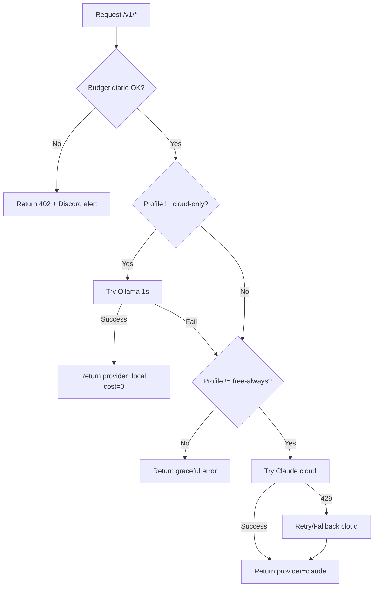

# Policy AI Local-First

Fecha: 2026-04-13  
Estado: Activa (Semana 1 — Operational Maturity)

## Decisión

Opsly adopta una política **local-first / subscription-independent** para inferencia y coding:

- Primera opción de implementación: **OpenCode + Ollama en PC Gamer** (GPU, costo de tokens $0).
- Segunda opción: OpenCode en Mac contra un Ollama local/remoto permitido.
- El Mac/VPS controlan y encolan; el PC Gamer ejecuta cómputo pesado. El Gamer no es un segundo control plane.
- Cloud/Cursor/Codex/Claude son aceleradores opcionales, no dependencias operativas.
- Cualquier ruta pagada sigue pasando por Cost Governance + Approval Gate.
- Si no hay capacidad local y el perfil es `free-always`, el trabajo queda esperando capacidad en vez de consumir una suscripción.

## Perfiles Operativos

- `free-always`: solo local; sin fallback cloud. Si PC Gamer/Mac local no están disponibles, la tarea espera capacidad.
- `hybrid`: local + fallback cloud.
- `cloud-only`: cloud directo (legacy compatible).

## Tenants Default

- `smiletripcare` -> `hybrid`
- `peskids` -> `hybrid`
- `intcloudsysops` -> `free-always`

## Routing en LLM Gateway

1. Resolver `tenant_slug`, perfil y budget diario.
2. Si supera budget diario -> bloqueo `402` + alerta Discord.
3. Si consumo >= 80% del budget -> alerta preventiva Discord.
4. Si perfil != `cloud-only`:
   - Intentar Ollama (`/api/chat`) con timeout de `1s`.
   - Si responde -> provider `local`, `cost_usd=0`.
5. Si local falla y perfil != `free-always`:
   - Fallback a cloud (Claude primero, luego fallback secundario en 429).
6. Registrar uso en `usage_events`: tenant, provider/model, latencia, costo.


```mermaid
flowchart TD
  A[Request /v1/*] --> B{Budget diario OK?}
  B -- No --> C[Return 402 + Discord alert]
  B -- Yes --> D{Profile != cloud-only?}
  D -- Yes --> E[Try Ollama 1s]
  E -- Success --> F[Return provider=local cost=0]
  E -- Fail --> G{Profile != free-always?}
  D -- No --> G
  G -- No --> H[Return graceful error]
  G -- Yes --> I[Try Claude cloud]
  I -- 429 --> J[Retry/Fallback cloud]
  I -- Success --> K[Return provider=claude]
  J --> K
```

## Budget Diario por Tenant

Los budgets se definen por variables `DAILY_BUDGET_*`.

- Convención: `DAILY_BUDGET_<TENANT_SLUG_NORMALIZED>`
- Ejemplo: `DAILY_BUDGET_INTCLOUDSYSOPS=0.50`
- Unidad: USD por día

## Enforcement

- `>= 100%`: bloqueo de inferencia (`HTTP 402`).
- `>= 80%`: alerta preventiva a Discord (`warning`).
- Errores `429`/`402`: notificación operativa a canal de alertas.

## Guardrails de Implementación

- Sin secretos hardcodeados.
- Configuración por entorno (Doppler + env).
- Comportamiento determinista para perfiles y tenants default.
- Compatibilidad hacia atrás para rutas existentes del gateway.

---

## Enlaces relacionados

- [[00-architecture/README|00-architecture]]
- [[brain/README|Brain Central]]


## Coding runtime local-first

La ruta canónica para tareas de implementación es:

```text
AgentTaskEnvelopeV1
→ BullMQ local-agents
→ capability routing
→ PC Gamer online?
   ├─ yes → OpenCode → Ollama GPU
   └─ no  → Mac local-capable runtime / WAITING_FOR_CAPACITY
→ evidence
→ teardown
```

Comandos operativos:

```bash
npm run pc-gamer:opencode:doctor
npm run pc-gamer:opencode:status
npm run pc-gamer:opencode:up
npm run pc-gamer:opencode:autostart
```

Selección de modelo:
1. `OPSLY_OPENCODE_MODEL` explícito, si existe;
2. inventario real de `OLLAMA_URL/api/tags`;
3. preferencia configurable `OPSLY_LOCAL_MODEL_PREFERENCE`;
4. si no hay modelo disponible, fail closed.

El script **no descarga modelos automáticamente** durante `--up`. La descarga requiere una acción explícita:

```bash
./scripts/ops/pc-gamer-opencode-plane.sh --pull-model=<modelo>
```

Esto evita consumo inesperado de disco/red y mantiene la política free-first auditable.
