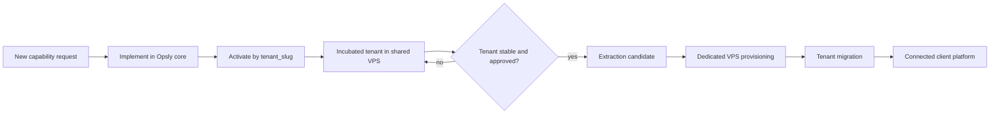
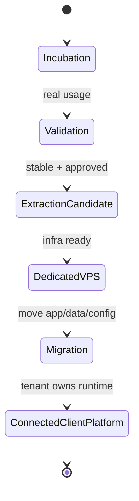

# Tenant Incubation Lifecycle

Opsly incubates new clients inside the existing VPS and shared control plane
first. Dedicated infrastructure is provisioned only after the tenant proves
real usage, business value, and a clean migration path.

## Multi-tenant contract

- New features are implemented once in Opsly core.
- Tenant-specific behavior is selected by `tenant_slug` and capability flags.
- Branding, login surface, and routing can differ per tenant; shared logic does
  not fork permanently by client.
- When the tenant grows, the same product contract should be movable to a
  dedicated VPS with minimal code changes.

## Principios

- New tenants start inside Opsly infrastructure.
- Opsly validates MVPs quickly with shared stack components.
- Extraction happens only after approval and business case validation.
- The client eventually owns the runtime, domain, database, integrations, and
  business data.
- Opsly remains the control plane, provisioning layer, and automation
  orchestrator.

## Stage 1 - Incubation

Tenant lives inside the Opsly VPS.

Characteristics:

- Shared infrastructure.
- Shared monitoring.
- Shared automation stack.
- Shared agent orchestration.
- Fast iteration on MVP scope.
- Low-friction onboarding and support.

Exit criteria:

- MVP is live.
- Tenant can capture real signals.
- Core workflows are usable end to end.

## Stage 2 - Validation

Tenant is actively used by the client.

Signals:

- Real workflows run in production.
- Real leads are captured.
- Real feedback is received.
- Operational metrics are available.
- Owner or team uses the platform regularly.

Exit criteria:

- The tenant is stable enough to justify a migration candidate review.

## Stage 3 - Extraction Candidate

Tenant is eligible for standalone preparation.

Requirements:

- Stable usage.
- Explicit client approval.
- Defined business value.
- Migration checklist completed.
- Key dependencies are portable.

Exit criteria:

- Opsly can provision a dedicated runtime without changing the product contract.

## Stage 4 - Dedicated VPS Provisioning

Opsly provisions a tenant-specific server.

Standard bundle:

- Ubuntu VPS.
- Docker Compose.
- Traefik.
- Uptime Kuma.
- n8n.
- Opsly Agent.
- Backups.
- Monitoring.

Exit criteria:

- Dedicated runtime is live and ready for migration.

## Stage 5 - Tenant Migration

Move:

- app.
- workflows.
- data.
- configs.

Do not move:

- Opsly core.
- shared control plane.

Exit criteria:

- Tenant runs from its dedicated VPS.
- Shared Opsly dependencies are removed or replaced.
- New tenant-specific features are configuration-driven, not code forks.

## Stage 6 - Connected Client Platform

Client owns the platform instance.

Client owns:

- VPS.
- Domain.
- Database.
- Integrations.

Opsly keeps:

- Monitoring.
- Governance.
- Templates.
- Automation catalog.
- Agent coordination.

## Decision Gates

Extract only when all of these are true:

- Usage is stable.
- The client approves the move.
- The business case is validated.
- The migration checklist is complete.
- The feature set is already modeled in Opsly core by `tenant_slug` and can be reused by another tenant without a second implementation.

## Non-goals

- No runtime refactor.
- No immediate VPS migration.
- No production change in this document.
- No secret changes.

---

## Enlaces relacionados

- [[00-architecture/README|00-architecture]]
- [[brain/README|Brain Central]]
