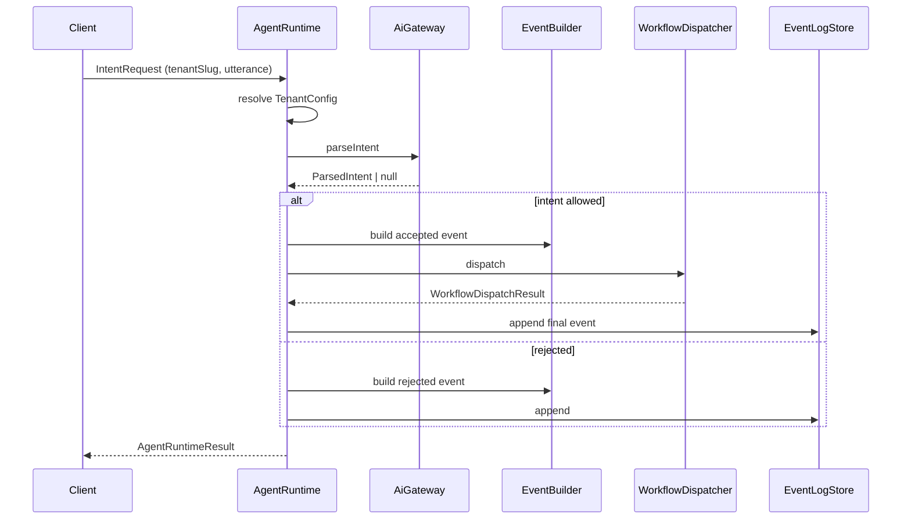

# Opsly Agent Runtime (OS Core MVP)

Opsly OS Core is a **tenant-agnostic** agent runtime packaged as `@intcloudsysops/opsly-core`. Business rules live in per-tenant config files under `apps/*/config/tenant.config.ts`; the core never hardcodes Panini, Peskids, or SmileTripCare.

## Modules

| Module | Responsibility |
|--------|----------------|
| `tenant-config` | Registry + validation of `TenantConfig` (intents, workflows, keywords) |
| `ai-gateway` | Parse natural language → structured intent (`mock` \| `gemini`) |
| `agent-runtime` | Orchestrates parse → allowlist → event → dispatch |
| `event-builder` | Builds `OpslyEvent` with `crypto.randomUUID()` IDs |
| `workflow-dispatcher` | Routes accepted events to tenant workflow refs |
| `observability` | Event log interface + in-memory (tests) + Supabase adapter |

## Request flow



## Tenant modes

| Mode | Dispatch | Use case |
|------|----------|----------|
| `demo` | Yes (mock dispatcher) | Hackathon / Panini Lab |
| `shadow` | No-op (`accepted`, not `dispatched`) | Peskids / SmileTripCare validation |
| `live` | Yes (real dispatcher when wired) | Production |

## Event log (Postgres / Supabase)

Production storage uses `SupabaseEventLogStore` with table `platform.opsly_event_log` (recommended):

```sql
create table if not exists platform.opsly_event_log (
  id uuid primary key,
  request_id uuid not null,
  tenant_slug text not null,
  intent text not null,
  payload jsonb not null default '{}',
  status text not null,
  created_at timestamptz not null default now(),
  metadata jsonb
);

create index if not exists opsly_event_log_tenant_created
  on platform.opsly_event_log (tenant_slug, created_at desc);
```

Inject the Supabase client from `apps/api` — the core only defines the adapter interface.

## AI providers

- **`mock`** (default): keyword routing from `tenant.intentKeywords` — no external API.
- **`gemini`**: optional; falls back to mock when `GEMINI_API_KEY` is unset.

Env: `OPSLY_AI_PROVIDER=mock|gemini`, `GEMINI_API_KEY`.

## Package layout

```
packages/opsly-core/
├── src/
│   ├── tenant-config/
│   ├── ai-gateway/
│   ├── agent-runtime/
│   ├── event-builder/
│   ├── workflow-dispatcher/
│   ├── observability/
│   ├── cli/demo.ts
│   └── index.ts          # createOpslyCore()
└── __tests__/core-mvp.test.ts
```

Tenant configs (owned by each app):

```
apps/panini-lab/config/tenant.config.ts      # demo
apps/peskids/config/tenant.config.ts         # shadow
apps/smiletripcare/config/tenant.config.ts   # shadow
```

## Design rules

1. IDs via `crypto.randomUUID()` — never `Math.random()`.
2. Strict TypeScript — no `any` in core.
3. No tenant business names inside `packages/opsly-core/src`.
4. Do not modify Peskids production routes for MVP; shadow mode only.

## Related

- Demo walkthrough: [`docs/demo/hackathon-demo.md`](../demo/hackathon-demo.md)
- OpenClaw orchestration: [`docs/OPENCLAW-ARCHITECTURE.md`](../OPENCLAW-ARCHITECTURE.md)
