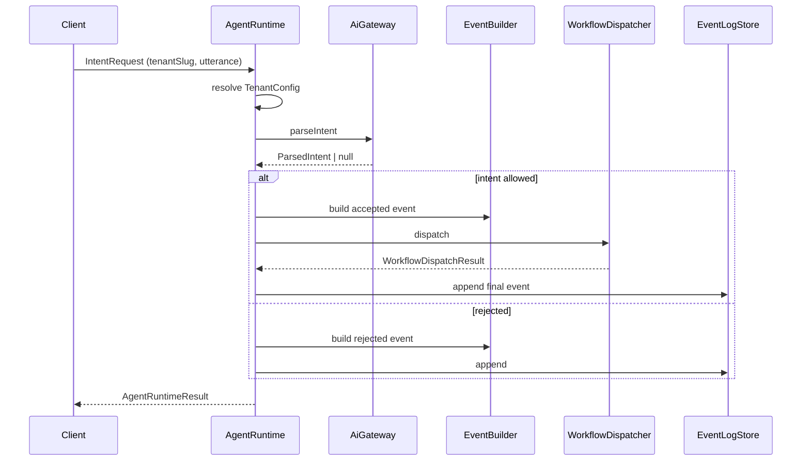

# Opsly Agent Runtime (OS Core MVP)

Opsly OS Core is a **tenant-agnostic** agent runtime packaged as `@intcloudsysops/opsly-core`. Business rules live in per-tenant config files under `apps/*/config/tenant.config.ts`; the core never hardcodes Panini, Peskids, or SmileTripCare.

## Modules

| Module | Responsibility |
|--------|----------------|
| `tenant-config` | Registry + validation of `TenantConfig` (intents, workflows, keywords) |
| `ai-gateway` | Parse natural language → structured intent (`mock` \| `gemini`) |
| `agent-runtime` | Orchestrates parse → allowlist → event → dispatch |
| `event-builder` | Builds `OpslyEvent` with `crypto.randomUUID()` IDs |
| `workflow-dispatcher` | Routes accepted events to tenant workflow refs |
| `observability` | Event log interface + in-memory (tests) + Supabase adapter |

## Request flow



## Tenant modes

| Mode | Dispatch | Use case |
|------|----------|----------|
| `demo` | Yes (mock dispatcher) | Hackathon / Panini Lab |
| `shadow` | No-op (`accepted`, not `dispatched`) | Peskids / SmileTripCare validation |
| `live` | Yes (real dispatcher when wired) | Production |

## Event log (Postgres / Supabase)

Production storage uses `SupabaseEventLogStore` with table `platform.opsly_event_log` (recommended):

```sql
create table if not exists platform.opsly_event_log (
  id uuid primary key,
  request_id uuid not null,
  tenant_slug text not null,
  intent text not null,
  payload jsonb not null default '{}',
  status text not null,
  created_at timestamptz not null default now(),
  metadata jsonb
);

create index if not exists opsly_event_log_tenant_created
  on platform.opsly_event_log (tenant_slug, created_at desc);
```

Inject the Supabase client from `apps/api` — the core only defines the adapter interface.

## AI providers

| Provider | Status in opsly-core MVP | Notes |
|----------|---------------------------|-------|
| `mock` | ✅ Implemented | Keyword routing from `tenant.intentKeywords` |
| `gemini` | ✅ Implemented | Direct API; falls back to mock if no key |
| `openai` | Stub | Throws `AiProviderNotConfiguredError` — wire via `@intcloudsysops/llm-gateway` (Sprint 2) |
| `anthropic` | Stub | Same |
| `openrouter` | Stub | Same |
| `ollama` | Stub | Same |

Env: `OPSLY_AI_PROVIDER=mock|gemini`, `GEMINI_API_KEY`.

Public types: `TenantConfig`, `IntentRequest`, `StructuredIntent` (`ParsedIntent`), `OpslyEvent`, `AgentRuntimeResult`, `EventLogStore`, `AiProvider`, `AiProviderKind`.

Channel types (`InputMessage`, `AgentResponse`) live in `@intcloudsysops/conversational-runtime`.

## Complemento, no duplicado (integración con Opsly existente)

| Componente existente | Rol en plataforma | Relación con opsly-core |
|---------------------|-------------------|-------------------------|
| `apps/llm-gateway` | LLM routing, metering, `tenant_slug`, cache | **Complementario.** Core MVP usa `mock`/`gemini` directo; Sprint 2 añade `LlmPort` adapter sobre `llmCall`. No reemplaza el gateway. |
| `apps/orchestrator` | BullMQ jobs, workers, OAR | **Complementario.** Core `WorkflowDispatcher` opera a nivel intent/tenant; orchestrator encola jobs pesados. Futuro: dispatcher emite a cola OpenClaw. |
| `apps/mcp` | Tools para agentes externos | **Complementario.** MCP expone tools; core procesa utterances → eventos. |
| `apps/ml` | Clasificación, embeddings | **Complementario.** No duplicado; puede enriquecer `understand()` más adelante. |
| `config/tenants/*.json` | Onboarding metadata | **Extendido.** JSON = registry; `apps/*/config/tenant.config.ts` = intents/workflows. |
| `apps/peskids/lib/events.ts` | Event bus emitter | **Patrón reutilizado.** Generalizado en `EventSinkPort` (Sprint 2). |
| `lib/observability` | Logs/metrics | **Reutilizable.** Core tiene logger mínimo; apps pueden wrap `createLogger`. |

**Riesgo de duplicación:** BAJO si se mantiene la regla: todo LLM productivo pasa por llm-gateway; opsly-core gemini es solo MVP/demo hasta el adapter.

## Event log — modos de operación

| Modo | Store | Cuándo |
|------|-------|--------|
| Tests / CLI demo | `InMemoryEventLogStore` | Default `createOpslyCore()` |
| Panini Lab (futuro app) | Supabase `platform.opsly_event_log` | Tras aplicar SQL manualmente |
| Peskids / SmileTripCare shadow | In-memory o Supabase | **Solo append de eventos; dispatcher no-op** — sin writes a prod |

**No ejecutar migraciones automáticamente.** Usar el SQL de la sección [Event log (Postgres / Supabase)](#event-log-postgres--supabase) arriba cuando staging esté listo.

## Package layout

```
packages/opsly-core/
├── src/
│   ├── tenant-config/
│   ├── ai-gateway/
│   ├── agent-runtime/
│   ├── event-builder/
│   ├── workflow-dispatcher/
│   ├── observability/
│   ├── cli/demo.ts
│   └── index.ts          # createOpslyCore()
└── __tests__/core-mvp.test.ts
```

Tenant configs (owned by each app):

```
apps/panini-lab/config/tenant.config.ts      # demo
apps/peskids/config/tenant.config.ts         # shadow
apps/smiletripcare/config/tenant.config.ts   # shadow
```

## Sprint 2 — Panini Lab + gateway transcribe

| Piece | Path |
|-------|------|
| Demo app (Next `:3005`) | `apps/panini-lab` — `POST /api/webhooks/inbound`, `GET /dashboard` |
| DB schema | `supabase/migrations/0065_panini_lab_schema.sql` (`panini_lab.*`) |
| Multimodal transcribe | `apps/llm-gateway` — `POST /v1/transcribe` (Gemini; `GEMINI_API_KEY`) |
| Runtime adapter | `lib/conversational-runtime/src/adapters/gateway-transcription.ts` |

Local dev:

```bash
npm run dev --workspace=@intcloudsysops/panini-lab
# Webhook (dev, no secret): curl -X POST http://localhost:3005/api/webhooks/inbound \
#   -H 'Content-Type: application/json' \
#   -d '{"text":"Tengo la figurita 45 repetida"}'
```

## Design rules

1. IDs via `crypto.randomUUID()` — never `Math.random()`.
2. Strict TypeScript — no `any` in core.
3. No tenant business names inside `packages/opsly-core/src`.
4. Do not modify Peskids production routes for MVP; shadow mode only.

## Related

- Demo walkthrough: [`docs/demo/hackathon-demo.md`](../demo/hackathon-demo.md)
- OpenClaw orchestration: [`docs/OPENCLAW-ARCHITECTURE.md`](../OPENCLAW-ARCHITECTURE.md)
