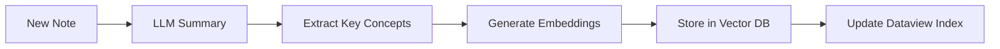

# Knowledge Brain System — Obsidian como Cerebro Creciente

> **Versión:** 1.0 | **Fecha:** 2026-04-21

Sistema para transformar Obsidian en un **cerebro digital** que absorbe conocimiento de fuentes externas, lo procesa con IA y lo almacena estructuradamente.

---

## 1. Arquitectura del Sistema

```
┌─────────────────────────────────────────────────────────────────────────────┐
│                         KNOWLEDGE BRAIN SYSTEM                              │
├─────────────────────────────────────────────────────────────────────────────┤
│                                                                             │
│  ┌──────────────┐    ┌──────────────┐    ┌──────────────┐             │
│  │   FUENTES    │───▶│   COLECTOR   │───▶│   PROCESOR   │             │
│  │   EXTERNAS   │    │    (n8n)     │    │   (LLM)      │             │
│  └──────────────┘    └──────────────┘    └──────────────┘             │
│         │                   │                   │                          │
│         │ RSS               │ Webhook          │ Summary                │
│         │ API               │                  │ Embedding              │
│         │ Scraping          │                  │ Tagging                │
│         ▼                   ▼                   ▼                          │
│  ┌─────────────────────────────────────────────────────────────────┐     │
│  │                      OBSIDIAN VAULT                              │     │
│  │  📚 Programming  🎨 Design  📈 Marketing  🔒 Security           │     │
│  │  ⚔️ Warfare  ❤️ Love  🐛 Hacking  🚀 Aerospace                 │     │
│  └─────────────────────────────────────────────────────────────────┘     │
│                                    │                                        │
│                                    ▼                                        │
│                         ┌──────────────────┐                              │
│                         │   NOTEBOOKLM    │                              │
│                         │   (Brain Cortex) │                              │
│                         └──────────────────┘                              │
│                                                                             │
└─────────────────────────────────────────────────────────────────────────────┘
```

---

## 2. Fuentes de Conocimiento

### 2.1 Categorías y Fuentes

| Categoría             | Fuentes                                                   | Tipo      |
| --------------------- | --------------------------------------------------------- | --------- |
| **Programación**      | HackerNews, Reddit/r/programming, Dev.to, GitHub Trending | RSS + API |
| **Diseño**            | Dribbble, Behance, Awwwards, Design weekly                | RSS + API |
| **Marketing**         | Marketing Week, HubSpot, Ahrefs blog                      | RSS       |
| **Seguridad**         | Krebs on Security, The Hacker News, SANS, CVE             | RSS + API |
| **Hacking**           | Reddit/netsec, GitHub security-advisories, Exploit-DB     | RSS + API |
| **Guerra/Estrategia** | War on the Rocks, Small Wars Journal, CSBA                | RSS       |
| **Relaciones/Amor**   | Psychology Today, The Gottman Institute                   | RSS       |
| **IA/ML**             | OpenAI Blog, Google AI, DeepLearning.AI                   | RSS + API |
| **Hardware**          | Hackaday, Arduino Blog, Raspberry Pi                      | RSS       |

### 2.2 Configuración de Fuentes

```yaml
# config/knowledge-sources.yaml
sources:
  programming:
    - name: 'HackerNews'
      url: 'https://hnrss.org/frontpage'
      category: 'programming'
      tags: ['tech', 'startups']
    - name: 'Reddit Programming'
      url: 'https://www.reddit.com/r/programming/.rss'
      category: 'programming'

  security:
    - name: 'The Hacker News'
      url: 'https://feeds.feedburner.com/TheHackersNews'
      category: 'security'
      tags: ['breach', 'vulnerability']
    - name: 'Krebs on Security'
      url: 'https://krebsonsecurity.com/feed/'
      category: 'security'

  hacking:
    - name: 'GitHub Security Advisories'
      url: 'https://api.github.com/advisories'
      category: 'hacking'
      format: 'json'

  marketing:
    - name: 'Marketing Week'
      url: 'https://www.marketingweek.com/feed/'
      category: 'marketing'
    - name: 'Ahrefs Blog'
      url: 'https://ahrefs.com/blog/feed/'
      category: 'marketing'

  design:
    - name: 'Design Weekly'
      url: 'https://designweek.co.uk/feed/'
      category: 'design'
    - name: 'Awwwards'
      url: 'https://www.awwwards.com/feed/'
      category: 'design'
```

---

## 3. Sistema de Recolección (n8n)

### 3.1 Workflow Principal

```
┌─────────────┐    ┌─────────────┐    ┌─────────────┐    ┌─────────────┐
│   RSS      │    │   HTTP      │    │   Claude    │    │  Obsidian  │
│   Reader   │───▶│   Request   │───▶│   (LLM)    │───▶│   Create   │
│            │    │             │    │   Summary   │    │   Note     │
└─────────────┘    └─────────────┘    └─────────────┘    └─────────────┘
     │                  │                  │                   │
     └──────────────────┴──────────────────┴───────────────────┘
                                │
                                ▼
                    ┌─────────────────────┐
                    │   Dataview Query   │
                    │   (Auto-tagging)   │
                    └─────────────────────┘
```

### 3.2 n8n Workflow (JSON)

```json
{
  "name": "Knowledge Brain Collector",
  "nodes": [
    {
      "name": "RSS Reader",
      "type": "n8n-nodes-base.rssRead",
      "parameters": {
        "url": "={{$json.feedUrl}}",
        "limit": 10
      }
    },
    {
      "name": "LLM Summary",
      "type": "@intcloudsysops/llm-gateway",
      "parameters": {
        "prompt": "Extrae los puntos clave y genera un resumen estructurado",
        "model": "claude-3-haiku"
      }
    },
    {
      "name": "Create Obsidian Note",
      "type": "obsidian",
      "operation": "createNote",
      "parameters": {
        "vault": "Knowledge Brain",
        "folder": "={{$json.category}}"
      }
    }
  ]
}
```

### 3.3 Script de Colección

```python
#!/usr/bin/env python3
# scripts/knowledge-collector.py

import feedparser
import requests
import yaml
from datetime import datetime
from pathlib import Path

CONFIG = yaml.safe_load(open('config/knowledge-sources.yaml'))

def fetch_rss(source):
    """Fetch RSS feed and return entries"""
    feed = feedparser.parse(source['url'])
    return [{
        'title': entry.title,
        'link': entry.link,
        'summary': entry.get('summary', ''),
        'published': entry.get('published', datetime.now().isoformat()),
        'category': source['category'],
        'tags': source.get('tags', [])
    } for entry in feed.entries[:10]]

def generate_summary(entry):
    """Use LLM to generate summary"""
    # Integration with LLM Gateway
    prompt = f"""
    Analiza el siguiente artículo y genera:
    1. Resumen de 3 puntos clave
    2. Tags relevantes
    3. Nivel de importancia (1-5)
    4. Área temática

    Título: {entry['title']}
    Contenido: {entry['summary'][:1000]}
    """
    # Call LLM and return structured response
    return {"summary": "...", "tags": [], "importance": 3}

def create_obsidian_note(entry, summary):
    """Create note in Obsidian vault"""
    vault_path = Path("docs/knowledge/")

    category_folder = vault_path / entry['category']
    category_folder.mkdir(parents=True, exist_ok=True)

    filename = f"{entry['published'][:10]}-{entry['title'][:50].replace(' ', '-')}.md"

    content = f"""---
title: {entry['title']}
date: {entry['published']}
category: {entry['category']}
tags: {summary['tags']}
importance: {summary['importance']}
source: {entry['link']}
---

# {entry['title']}

## Resumen
{summary['summary']}

## Puntos Clave
{summary['key_points']}

## Fuente
[Leer original]({entry['link']})

---

*Recolectado automáticamente el {datetime.now().isoformat()}*
"""

    (category_folder / filename).write_text(content)
    return category_folder / filename

def main():
    for category, sources in CONFIG['sources'].items():
        for source in sources:
            print(f"Fetching {source['name']}...")
            entries = fetch_rss(source)
            for entry in entries:
                summary = generate_summary(entry)
                note_path = create_obsidian_note(entry, summary)
                print(f"  ✓ Created: {note_path.name}")

if __name__ == "__main__":
    main()
```

---

## 4. Procesamiento con IA

### 4.1 Pipeline de Embedding



### 4.2 Scripts de Procesamiento

```typescript
// scripts/process-knowledge.ts
interface ProcessedNote {
  title: string;
  originalContent: string;
  summary: string;
  keyPoints: string[];
  concepts: string[];
  embedding: number[];
  tags: string[];
  category: string;
  importance: number;
  createdAt: Date;
}

async function processNote(content: string): Promise<ProcessedNote> {
  // 1. LLM Summary
  const summary = await llmCall(
    `
    Genera un resumen estructurado del siguiente contenido.
    Incluye: resumen(50 palabras), puntos clave(3-5), conceptos clave, tags.
    
    ${content}
  `,
    { model: 'claude-3-haiku' }
  );

  // 2. Generate Embedding
  const embedding = await generateEmbedding(summary);

  // 3. Store in Pinecone/Supabase
  await storeVector({
    id: generateId(),
    vector: embedding,
    metadata: { summary, tags: summary.tags },
  });

  return { ...summary, embedding };
}
```

---

## 5. Estructura del Vault

```
docs/knowledge/
├── _templates/
│   ├── article-note.md
│   ├── concept-note.md
│   └── daily-note.md
├── _scripts/
│   ├── knowledge-collector.py
│   └── process-knowledge.ts
├── 01-programming/
│   ├── 2026-01-01-article-name.md
│   └── ...
├── 02-design/
├── 03-marketing/
├── 04-security/
│   ├── _index.md (Dataview)
│   └── 2026-01-01-hacker-news.md
├── 05-hacking/
├── 06-warfare/
├── 07-love/
├── 08-ia-ml/
└── 99-archive/
```

### 5.1 Plantilla de Nota

````markdown
---
title: '{{title}}'
date: { { date } }
category: { { category } }
tags: [{ { tags } }]
importance: { { importance } }
source: '{{source}}'
reviewed: false
---

# {{title}}

## 🔑 Puntos Clave

{{key_points}}

## 📝 Resumen

{{summary}}

## 🔗 Conexiones

```dataview
LIST FROM "{{category}}" WHERE contains(tags, this.tags[0]) AND file.name != this.file.name
```
````

## 💭 Mis Notas

-

## 📚 Recursos Relacionados

- ***

  _Recolectado: {{date}} | Importancia: {{importance}}/5_

`````

---

## 6. Queries con Dataview

### 6.1 Dashboard Principal

````markdown
```dataview
TABLE date, category, importance, tags
FROM "docs/knowledge"
WHERE date >= date(today) - dur(7 days)
SORT date DESC
LIMIT 20
`````

`````

### 6.2 Por Categoría

````markdown
## 🖥️ Programación
```dataview
LIST FROM "docs/knowledge/01-programming"
WHERE date >= date(today) - dur(3 days)
SORT importance DESC
```

## 🔐 Seguridad
```dataview
LIST FROM "docs/knowledge/04-security"
WHERE date >= date(today) - dur(1 days)
SORT importance DESC
```
`````

### 6.3 Conceptos Relacionados

````markdown
## 🧠 Conceptos de Hoy

```dataview
LIST tags, length(file.inlinks) as " backlinks"
FROM "docs/knowledge"
WHERE date >= date(today)
FLATTEN tags
GROUP BY tags
SORT length(file.inlinks) DESC
LIMIT 10
```
````

---

## 7. Integración con NotebookLM

### 7.1 Sync Automático

```bash
# scripts/notebooklm-knowledge-sync.sh
#!/bin/bash

# 1. Exportar notas de la semana a PDF
find docs/knowledge -name "*.md" -mtime -7 | \
  while read note; do
    pandoc "$note" -o "${note%.md}.pdf"
  done

# 2. Subir a NotebookLM
node scripts/docs-to-notebooklm.mjs --folder docs/knowledge/01-programming

# 3. Generar podcast semanal
python3 scripts/generate-weekly-podcast.py
```

### 7.2 Query desde Obsidian

```typescript
// obsidian-plugin/query-notebooklm.js
class NotebookLMQuery {
  async query(prompt: string) {
    const response = await fetch('https://api.opsly.com/api/tools/notebooklm', {
      method: 'POST',
      headers: { Authorization: `Bearer ${this.token}` },
      body: JSON.stringify({ query: prompt, context: this.getVaultContext() }),
    });
    return response.json();
  }
}
```

---

## 8. Automatización Completa

### 8.1 Cron Jobs

| Hora  | Tarea                   | Script                             |
| ----- | ----------------------- | ---------------------------------- |
| 6:00  | Recolectar RSS mañana   | `knowledge-collector.py --morning` |
| 12:00 | Recolectar RSS mediodía | `knowledge-collector.py --noon`    |
| 18:00 | Recolectar RSS tarde    | `knowledge-collector.py --evening` |
| 20:00 | Procesar notas          | `process-knowledge.ts`             |
| 22:00 | Sync a NotebookLM       | `notebooklm-knowledge-sync.sh`     |
| 23:00 | Generar resumen semanal | `generate-weekly-summary.sh`       |

### 8.2 n8n Workflow Completo

```yaml
# .github/workflows/knowledge-brain.yml
name: Knowledge Brain
on:
  schedule:
    - cron: '0 6,12,18 * * *'
  workflow_dispatch:
jobs:
  collect:
    runs-on: ubuntu-latest
    steps:
      - uses: actions/checkout@v4
      - name: Setup Python
        uses: actions/setup-python@v5
        with:
          python-version: '3.12'
      - name: Install dependencies
        run: pip install feedparser requests openai
      - name: Run collector
        run: python scripts/knowledge-collector.py
      - name: Commit changes
        run: |
          git config --local user.email "brain@opsly.com"
          git config --local user.name "Knowledge Brain"
          git add docs/knowledge/
          git commit -m "brain: sync knowledge $(date -u +%Y-%m-%d)" || exit 0
      - name: Push
        uses: ad-m/github-push-action@master
```

---

## 9. growth del Sistema

### 9.1 Métricas

| Métrica            | Descripción              | Meta |
| ------------------ | ------------------------ | ---- |
| Notas recolectadas | Artículos por día        | 50+  |
| Conceptos nuevos   | Tags únicos/semana       | 20+  |
| Conexiones         | Backlinks entre notas    | 100+ |
| Interacciones      | Queries a NotebookLM/día | 10+  |
| Retention          | Notas revisitadas        | 30%  |

### 9.2 Auto-Mejoramiento

```python
# El sistema aprende qué fuentes son más útiles
def calculate_source_value(sources):
    """Calcular valor de cada fuente basado en engagement"""
    for source in sources:
        notes = get_notes_from_source(source)
        backlinks = sum(n.backlinks for n in notes)
        importance = avg(n.importance for n in notes)

        source.score = (backlinks * 0.5) + (importance * 0.5)

    # Priorizar fuentes de alto valor
    return sorted(sources, key=lambda s: s.score, reverse=True)
```

---

## 10. Instalación Rápida

```bash
# 1. Clonar estructura
cp -r docs/knowledge-template docs/knowledge

# 2. Configurar fuentes
cp config/knowledge-sources.example.yaml config/knowledge-sources.yaml
# Editar con tus fuentes preferidas

# 3. Setup Python
pip install feedparser requests pyyaml openai

# 4. Primer collection
python scripts/knowledge-collector.py

# 5. Configurar n8n
# Importar workflows/n8n/knowledge-collector.json

# 6. Automatizar con cron
(crontab -l 2>/dev/null; echo "0 6,12,18 * * * /path/to/collector.sh") | crontab -
```

---

## 11. APIs Externas Útiles

| API            | Uso               | Rate Limit     |
| -------------- | ----------------- | -------------- |
| HackerNews API | Stories, comments | 10k/day        |
| Reddit API     | Posts, comments   | 60/min         |
| GitHub API     | Trending, repos   | 5k/hour        |
| CVE API        | Vulnerabilidades  | 5000/day       |
| NewsAPI        | Headlines         | 100/day (free) |
| SerpAPI        | Google results    | 500/month      |

---

## 12. Seguridad y Privacidad

- **No colectar PII** de fuentes públicas
- **Respetar** `robots.txt` y términos de servicio
- **Rate limiting** para no sobrecargar fuentes
- **Cache local** para reducir requests
- **Indices offline** para búsquedas rápidas
