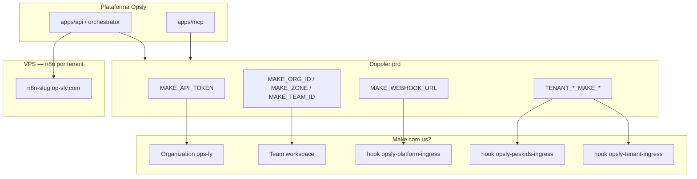

# Make.com — integración Opsly (plataforma + tenants)

> Paridad con n8n: Opsly expone **automatización dual** — n8n self-hosted por tenant en VPS y **Make.com** (SaaS) por org/equipo/hook. Secretos en Doppler `ops-intcloudsysops` / `prd`.

## Arquitectura



| Capa | n8n | Make |
|------|-----|------|
| Plataforma | Contenedor `n8n_intcloudsysops` + webhooks CRM | Org `ops-ly`, team por defecto, `MAKE_WEBHOOK_URL` |
| Tenant | `https://n8n-{slug}.op-sly.com/webhook` | `TENANT_{SLUG}_MAKE_WEBHOOK_URL` (hook dedicado) |
| Auth | `TENANT_{SLUG}_N8N_USER/PASS` | `MAKE_API_TOKEN` (API) + URL del hook (ingress) |
| Orquestación | BullMQ / n8n workflows en repo | Escenarios Make + API v2 |

**Licencia Make actual:** un **team** por organización. Hasta ampliar plan, todos los tenants comparten `MAKE_TEAM_ID`; el aislamiento es **un webhook (`gateway-webhook`) por tenant**, no un team separado.

## Variables Doppler (canónico)

| Variable | Uso |
|----------|-----|
| `MAKE_API_TOKEN` | Token API Make (scopes: org/teams/hooks). **No loguear.** |
| `MAKE_ZONE` | Zona producción (`us2`, `eu1`, …). Base: `https://{zone}.make.com/api/v2` |
| `MAKE_ORG_ID` | ID organización Make |
| `MAKE_TEAM_ID` | ID team/workspace por defecto |
| `MAKE_WEBHOOK_URL` | Webhook plataforma (`opsly-platform-ingress`) |
| `TENANT_{SLUG}_MAKE_TEAM_ID` | Mismo team hasta licencia multi-team |
| `TENANT_{SLUG}_MAKE_WEBHOOK_URL` | Webhook ingress del tenant (`opsly-{slug}-ingress`) |

Convención slug → env: `peskids` → `TENANT_PESKIDS_MAKE_*` (mayúsculas, guiones → `_`).

## Configuración automática

```bash
# Requiere MAKE_API_TOKEN ya en Doppler prd
./scripts/doppler-configure-make-prd.sh --dry-run
./scripts/doppler-configure-make-prd.sh
./scripts/doppler-configure-make-prd.sh --force   # reescribe URLs/IDs
```

El script:

1. Descubre org/team vía API (zona `us2` por defecto).
2. Escribe `MAKE_ORG_ID`, `MAKE_ZONE`, `MAKE_TEAM_ID`, `MAKE_WEBHOOK_URL`.
3. Crea hooks faltantes para tenants de producción (`peskids`, `smiletripcare`, `localrank`, `jkboterolabs`, `intcloudsysops`).
4. **No imprime** tokens ni URLs completas.

Verificar solo nombres:

```bash
doppler secrets --only-names --project ops-intcloudsysops --config prd | rg -i 'MAKE|TENANT_.*_MAKE'
```

## Uso en código (futuro)

- Entrada de eventos: `POST` al `TENANT_{SLUG}_MAKE_WEBHOOK_URL` desde apps/orchestrator o integraciones (Instagram, CRM).
- Gestión: Make API v2 con `Authorization: Token ${MAKE_API_TOKEN}`.
- No hardcodear zona ni org en código; leer de env/Doppler.

Referencia API: [Make API — Hooks](https://developers.make.com/api-documentation/api-reference/hooks), [Teams](https://developers.make.com/api-documentation/api-reference/teams).

## Relación con n8n

| Evento | Ruta recomendada |
|--------|------------------|
| Workflows versionados en git, VPS | n8n (`N8N_WEBHOOK_BASE_URL`, `.n8n/`) |
| Conectores SaaS, UI Make, equipos no-dev | Make (`TENANT_*_MAKE_WEBHOOK_URL`) |
| Opsly CRM pack | n8n (instalado en cada tenant VPS) |
| Piloto Instagram Peskids | n8n hoy; Make hook listo para escenario paralelo |

Docs n8n: [`N8N-SETUP.md`](./N8N-SETUP.md). Peskids: [`../tenants/peskids/DOPPLER-SETUP.md`](../tenants/peskids/DOPPLER-SETUP.md).

## Post-configuración

```bash
# VPS — propagar .env
ssh vps-dragon@100.120.151.91 'cd /opt/opsly && ./scripts/vps-bootstrap.sh'
```

En Make UI: crear escenario por tenant con módulo **Webhooks → Custom webhook** y enlazar al hook `opsly-{slug}-ingress` (o reutilizar el URL ya en Doppler).
