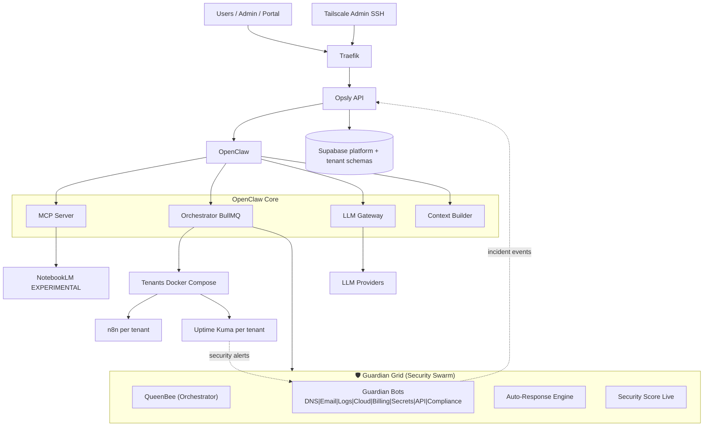

# Opsly — Visión y Objetivos

> Última revisión: 2026-05-02  
> **Pivote estratégico (2026-04-28+):** Opsly Guardian Grid — Autonomous Defense Operating System

**Planificación ejecutable por sprint:** [`ROADMAP.md`](ROADMAP.md) (semanas, milestones).  
**Guía técnica capa IA (monorepo):** [`IMPLEMENTATION-IA-LAYER.md`](IMPLEMENTATION-IA-LAYER.md).  
**Runtime agéntico (borrador):** [`../design/OAR.md`](../design/OAR.md) — Opsly Agentic Runtime (OAR).  
**Infra híbrida futura (opcional):** [`../adr/ADR-027-hybrid-compute-plane-k8s.md`](../adr/ADR-027-hybrid-compute-plane-k8s.md).  
**Shadow deploy Super Agent:** [`../runbooks/SUPER-AGENT-SHADOW-DEPLOY.md`](../runbooks/SUPER-AGENT-SHADOW-DEPLOY.md).

## Índice de planificación (canon vs temático)

| Rol | Documento | Notas |
| --- | --- | --- |
| **Norte y fases** | Este archivo (`VISION.md`) | ICP, límites, checklist Fase 1–6, reglas para agentes |
| **Sprint semanal** | [`ROADMAP.md`](ROADMAP.md) | Tareas por semana; alineado a las fases de arriba |
| **Checkboxes de la semana** | [`SPRINT-TRACKER.md`](SPRINT-TRACKER.md) | Progreso operativo editable |
| **Sesión y bloqueantes** | [`../../AGENTS.md`](../../AGENTS.md) (raíz del repo) | Estado vivo; no duplicar tablas de límites aquí |
| **Macro + herramientas** | [`PLANNING.md`](PLANNING.md) | Cómo planificar (GitHub Projects, CI, calidad) |
| **Planes temáticos** | [`../plans/README.md`](../plans/README.md) | Autonomía, CLI, go/no-go; no sustituyen ROADMAP |
| **Semana 6 (detalle)** | [`SEMANA-6-PLAN.md`](SEMANA-6-PLAN.md) | Playbook segundo cliente + E2E; informe: [`../SEMANA-6-INFORME.md`](../SEMANA-6-INFORME.md) |
| **Histórico** | [`../history/plans/`](../history/plans/) | `MASTER-PLAN*.md` y similares — **deprecated** (ADR-033); solo contexto |

La **raíz del repo** expone stubs que apuntan aquí: [`../../VISION.md`](../../VISION.md), [`../../ROADMAP.md`](../../ROADMAP.md).

## Qué es Opsly

**Opsly = Autonomous Defense Operating System**

Plataforma multi-tenant SaaS que despliega y gestiona:

1. **Opsly Automation** — stacks de agentes autónomos (n8n, Uptime Kuma) para automatización de procesos
2. **Opsly Shield** — Guardian Bots defensivos (Blue Team AI) para seguridad 24/7 sin SOC dedicado

Ambos con facturación Stripe, backups automáticos, dashboard global y orquestación via OpenClaw.

### Opsly Shield — Guardian Grid (pivot defensivo)

**Guardian Grid** es la propuesta de producto defensiva 24/7 para SMBs que no pueden asumir un SOC tradicional: monitorización (p. ej. Uptime Kuma ya en stack tenant) más **alertas accionables** (Discord/webhook) y **postura de seguridad** visible en el portal.

**Phase 2 MVP — checklist (estado en repo)**

- [x] Tablas Supabase: `platform.shield_alert_config`, `platform.shield_score_history`, `platform.shield_secret_findings` (RLS: `service_role` en API/workers; `authenticated` SELECT propio tenant vía `auth.jwt() -> user_metadata.tenant_slug` en tablas score/findings).
- [x] Alertas Discord: `POST /api/shield/alerts/config` (JWT portal); webhooks desde Doppler (`DISCORD_WEBHOOK_SHIELD`, `SHIELD_ALERTS_DISCORD_WEBHOOK_URL` o `DISCORD_WEBHOOK_URL`), nunca en código.
- [x] Score + hallazgos: `GET /api/portal/tenant/{slug}/shield/score`, `GET /api/portal/tenant/{slug}/shield/secrets`, `PATCH …/shield/secrets/{findingId}` (Zero-Trust).
- [x] Observabilidad Hermes: rutas Shield llaman `logUsage` con `tenant_slug` y `request_id` correlativo (`shield:{slug}:…` o cabecera `x-request-id`).
- [x] Cron escaneo diario: `GET|POST /api/cron/shield-secret-scan` (`CRON_SECRET`); MVP simulado con `SHIELD_SECRET_SCAN_SIMULATE=true` (sin escanear repos reales hasta integración).
- [x] Worker opcional orchestrator: `OPSLY_SHIELD_SCAN_WORKER_ENABLED=true` → `POST` al cron cada 24h (requiere `CRON_SECRET` + URL API alcanzable).
- [x] Portal: `/shield/dashboard` (gauge, breakdown, tendencia 7d, badge de riesgo, lista de hallazgos).

## Para quién

### Opsly Automation
- Agencias digitales y equipos de operaciones que necesitan automatización sin gestionar infra
- Monitoreo de uptime para sus clientes
- Facturación recurrente con planes diferenciados

### Opsly Shield (NUEVO — norte estratégico)
- **SMBs que no pueden pagar SOC enterprise** (~$1k-5k/mes típico)
- Pequeños negocios que necesitan defensa digital 24/7
- Familias y startups en modalidad personal
- **Propuesta clave:** "Opsly protege negocios que no pueden pagar un SOC real."

## Planes

### Opsly Automation (originales)

| Plan       | Precio   | Incluye                                 |
| ---------- | -------- | --------------------------------------- |
| Startup    | $49/mes  | n8n + Uptime Kuma, 1 dominio            |
| Business   | $149/mes | Todo Startup + backups diarios, soporte |
| Enterprise | Custom   | Multi-región, SLA, onboarding dedicado  |

### Opsly Shield (NUEVO — línea defensiva)

| Plan       | Precio   | Incluye                                      | Público                    |
| ---------- | -------- | -------------------------------------------- | -------------------------- |
| Starter    | $49/mes  | Monitoreo web, alertas phishing, backups     | Pequeños negocios          |
| Business   | $199/mes | Starter + SIEM lite, bots defensivos, uptime | SMBs con datos sensibles   |
| Enterprise | $999/mes | Business + agentes SOC completos, compliance | Empresas con requisitos SLA |
| Personal   | $19/mes  | Protección identidad, breaches, fraude       | Familias, freelancers      |

## Clientes Reales y Validación

### Opsly Automation
- **Tenant:** smiletripcare
- **Plan:** Startup ($49/mes)
- **Dominio:** ops.smiletripcare.com
- **Propósito:** validar stack completo en producción

### Opsly Shield (PRÓXIMO)
- **Target:** Primera SMB + una startup personalmente
- **Plan aspiracional:** Business ($199/mes) + Personal ($19/mes)
- **Métrica de éxito:** detección de breach/anomalía real en primer mes

## Estrategia de Mercado

### Por qué Opsly Shield gana

1. **Competidores existentes (SOC-as-a-Service):** $1k-5k/mes, requieren integración compleja
2. **Opsly Shield:** $49-999/mes, despliega en 5 min, IA + humano en bucle feedback
3. **Diferenciador:** "Protege negocios que no pueden pagar un SOC real"

### Go-to-Market Fase 1 (30 días)
- [ ] Uptime Kuma + security alerts (MVP)
- [ ] Secrets scanner automático
- [ ] Dashboard Security Score (0-100)
- [ ] Discord notifications
- [ ] Blog post: "Why SMBs Get Breached and How Opsly Shield Stops It"

### Go-to-Market Fase 2 (90 días)
- [ ] Guardian Bots (5/8 implementados)
- [ ] Auto-Response Engine (feature flag)
- [ ] Compliance checklists
- [ ] HN post: "Building an Accessible SOC for SMBs"
- [ ] 5-10 clientes en MRR

### Revenue Projection (anual)
```
Mes 1-3:  MVP validation    →  $500 MRR (1-2 clientes)
Mes 4-6:  Guardian full     →  $3k MRR (8-12 clientes)
Mes 7-12: Product-market fit → $20k+ MRR (50-100 SMBs)
```

## Stack transferible desde smiletripcare

(Extraído de `.vscode/extensions.json` y `package.json` del proyecto origen)

### Extensiones VS Code / Cursor

Fuente: `.vscode/extensions.json` (mismo orden).

- dbaeumer.vscode-eslint
- esbenp.prettier-vscode
- bradlc.vscode-tailwindcss
- ms-vscode.vscode-typescript-next
- eamodio.gitlens
- usernamehw.errorlens
- Supabase.vscode-supabase-extension (en Cursor, si `--install-extension` no lo encuentra, instalar el `.vsix` desde el Visual Studio Marketplace)
- yoavbls.pretty-ts-errors
- formulahendry.auto-rename-tag
- christian-kohler.path-intellisense
- rangav.vscode-thunder-client
- Gruntfuggly.todo-tree

### Paquetes npm core

- next, react, react-dom, typescript
- @supabase/supabase-js, @supabase/ssr
- zod, stripe
- @sentry/nextjs, @logtail/next
- tailwindcss, @tailwindcss/postcss
- eslint, prettier, husky, lint-staged
- vitest, @playwright/test

### Patrón middleware

Next.js + Supabase Auth = @supabase/ssr + `NEXT_PUBLIC_SUPABASE_*` en `.env`

## Objetivos por fase (resumen)

El detalle vive en **Roadmap por fases** más abajo (y en [`ROADMAP.md`](ROADMAP.md) para el desglose semanal).  
**Fase 1** está cerrada en producción según checklist de la sección _Fase 1 — Validación_; **Fase 2** sigue abierta (p. ej. segundo cliente).

## Decisión de arquitectura central

Cada tenant es un docker-compose aislado. **Despliegue por defecto:** Docker Compose + Traefik en VPS — **sin Kubernetes ni Swarm** como stack principal del control plane. Simplicidad operativa sobre escala teórica; escalar = más VPS antes que más complejidad.

**Excepción estratégica (futura, no por defecto):** una **fase opcional** de _compute plane_ (workers BullMQ, sandboxes de ejecución, ML/GPU) podrá usar **Kubernetes** solo cuando se cumplan criterios de negocio/seguridad documentados — ver [`docs/adr/ADR-027-hybrid-compute-plane-k8s.md`](docs/adr/ADR-027-hybrid-compute-plane-k8s.md). El **control plane** (API, portal, admin, MCP HTTP, web) permanece en Compose salvo nueva decisión explícita.

## Principios Morales y Operacionales

> **Construir escudos atrae clientes.  
> Construir armas ofensivas atrae problemas.**

Opsly es defensa ética:

- Guardianes autónomos Blue Team, no ofensiva
- Seguridad transparente, nunca encubierta
- SMBs + familias como prioridad (acceso democrático a seguridad)
- Escalar a humano antes que acciones destructivas
- Auditoría completa de cada acción automática

---

## Principios de Arquitectura

- Aislamiento por tenant con Docker Compose + Traefik por subdominio.
- Control plane único en `apps/api` y servicios OpenClaw.
- Escalamiento incremental: vertical primero, horizontal con demanda real.
- Seguridad Zero-Trust en rutas dinámicas y sesiones portal.
- **Gobernanza de costos de infra:** activar proveedores con cargo recurrente (p. ej. upgrade VPS, GCP Compute de pago, Cloudflare Load Balancer) requiere **aprobación explícita** del responsable; el dashboard admin en `/costs` y la API `GET /api/admin/costs` son **catálogo y registro operativo** — la facturación real sigue en cada panel (DO, GCP proyecto de referencia **opslyquantum**, etc.). Ver `AGENTS.md` (_Control de costos_) y `docs/COST-DASHBOARD.md`.
- **Workers remotos** (p. ej. Mac 2011 + Ubuntu): extienden el mismo orchestrator BullMQ contra Redis del control plane, sin segundo sistema de orquestación; guía `docs/WORKER-SETUP-MAC2011.md`, scripts `scripts/start-workers-mac2011.sh` / `start-worker.sh`.

## Principios del Ecosistema IA

- Todo tráfico LLM/agent pasa por **OpenClaw / LLM Gateway** como punto único de control.
- **Orchestrator** es el motor event-driven (BullMQ), con prioridad/costo por plan.
- Multi-tenancy Zero-Trust en capas IA: identidad, contexto, ejecución y observabilidad por tenant.
- Agentes premium (NotebookLM y similares) permanecen **EXPERIMENTALES** hasta planes superiores.
- Cost-aware routing y límites por tenant son obligatorios para sostenibilidad de margen.
- **Hermes (metering/billing IA)** es la fuente única para medir tokens, costo, latencia y cache-hit por `tenant_slug` y `request_id`.
- La **inteligencia de routing** (qué modelo/proveedor intentar) se implementa en **LLM Gateway y orchestrator (TypeScript)**; no confundir Hermes con librerías externas de terceros ni con un runtime Python paralelo al monorepo.
- **Comportamiento agéntico (roadmap):** el **Opsly Agentic Runtime (OAR)** — [`docs/design/OAR.md`](docs/design/OAR.md) — define loops explícitos (ReAct, Plan & Execute, Reflection) e interfaces `MemoryInterface` / `AgentActionPort` entre orchestrator y gateway; implementación por fases, no sustituye Hermes/BullMQ de un día para otro.
- **Gobierno interno de agentes:** `opsly_billy` (orquesta/ejecuta) + `opsly_lili` (supervisa/políticas). Los agentes externos se integran por adapters, nunca como control plane paralelo.

## Lo que un agente NUNCA debe hacer

- Proponer **migración masiva** a Kubernetes o Swarm **sin ADR** y sin criterios de activación (el despliegue por defecto sigue siendo Compose; la excepción _compute plane_ está en [ADR-027](docs/adr/ADR-027-hybrid-compute-plane-k8s.md))
- Hardcodear secrets (todo va a Doppler)
- Usar `any` en TypeScript
- Crear scripts no idempotentes
- Tomar decisiones de arquitectura sin documentarlas en AGENTS.md

## Roadmap por fases (revisado 2026-04-04)

### Fase 1 — Validación (COMPLETO 2026-04-11)

Objetivo: un tenant real corriendo en producción.

- [x] validate-config.sh verde
- [x] vps-bootstrap.sh sin errores
- [x] curl https://api.ops.smiletripcare.com/api/health → 200
- [x] tenant smiletripcare: n8n + Uptime Kuma accesibles
- [x] Stripe webhook configurado (pendiente eventos reales en producción)
- [x] Backup automático (script backup-tenants.sh disponible, requiere S3)

### Fase 2 — Producto Dual (EN PROGRESO)

Objetivo: onboarding sin intervención manual + Guardian Grid MVP.

**Opsly Automation (existente):**
- [x] Stripe → webhook → tenant desplegado automáticamente
- [x] Dashboard admin operativo
- [x] Redis memory layer para contexto de agentes
- [x] Emails transaccionales (Resend)
- [ ] Segundo cliente real

**Opsly Shield (nuevo):**
- [ ] Uptime Kuma + alertas defensivas en portal
- [ ] Secrets scanner básico (repos públicos, hardcoded env vars)
- [ ] Security Score dashboard (MVP)
- [ ] Discord webhook para alerts
- [ ] Primer cliente Shield (MVP → validación)

### Fase 3 — Escala y PMF (cuando Fase 2 esté estable)

Objetivo: plataforma defensiva + automatización que vende sola, PMF claro en Shield.

**Opsly Shield (prioridad defensiva):**
- [ ] Guardian Bots completamente funcionales (DNS, Email, Logs, Cloud, Billing, Secrets, API)
- [ ] Auto-Response Engine con toggles por plan y confidence threshold
- [ ] Breach intelligence + threat feeds integradas
- [ ] Compliance checklists automatizados (GDPR, SOC2, ISO)
- [ ] 3+ clientes pagando Shield en plan Business/Enterprise

**Opsly Automation (complementario):**
- [ ] Self-service completo para workflow tenants
- [ ] Marketplace de templates n8n
- [ ] Multi-VPS si el primero no alcanza

**Ambas líneas:**
- [ ] Observabilidad: métricas por tenant
- [ ] Vector DB para memoria semántica de agentes
- [ ] API docs públicas

### Fase 4 — Multi-agente con OpenClaw + Guardian Grid (actual)

Objetivo: unificar herramientas, orquestación, defensa y capa de costos IA bajo un control plane único.

**OpenClaw Core (multi-agente):**
- [ ] MCP como entrypoint estándar de herramientas para agentes.
- [ ] Orchestrator BullMQ con prioridad por plan (`startup|business|enterprise`).
- [ ] LLM Gateway como punto único de routing, cache y métricas de costo.
- [ ] Context Builder integrado para continuidad entre sesiones.
- [ ] NotebookLM disponible como EXPERIMENTAL con feature flag en planes superiores.
- [x] Planner externo (Chat.z): delegar planes de ejecución a LLMs remotos vía LLM Gateway.
- [x] Base SwarmOps/Hive en orchestrator: `QueenBee` + bots especializados + coordinación.
- [ ] Endurecer SwarmOps: retries/reasignación explícita por subtarea y pruebas integradas.

**Guardian Grid (NUEVO — defensa 24/7):**
- [ ] Guardian Bots base: Bot DNS, Bot Email, Bot Logs, Bot Cloud, Bot Billing, Bot Secrets, Bot API, Bot Compliance.
- [ ] Security Swarm coordinado: microbots en cooperación via Opsly Core.
- [ ] Auto-Response Engine: bloqueo IP, rotación credenciales, aislamiento automático de tenant.
- [ ] Security Score Live: dashboard de postura en tiempo real por tenant.
- [ ] Integración Uptime Kuma + alertas defensivas (phishing, dominios falsos, endpoints caídos, abuso API, costos anormales).
- [ ] Secrets scanner automático en repos y configuraciones.
- [ ] Breach detection + breach intelligence para usuarios (Personal Shield).
- [ ] Compliance tracker (GDPR, SOC2, ISO27001 checklists por tenant).

---

## Opsly Guardian Grid — Arquitectura Defensiva

### Principios de Defensa Ética

- **Guardianes autónomos**, no "hackers bots"
- **Blue Team AI** (defensa): detectar, alertar, remediar
- **Seguridad soberana:** cada tenant aislado, datos nunca compartidos entre clientes
- **Transparencia:** Security Score Live + audit trail de todas las acciones automáticas
- **Escalación humana:** cuando confidence < 0.8, escalar a usuario antes de remediar

### Componentes Guardian Grid

#### 1. Guardian Bots (especialización)
Cada bot monitorea un dominio de seguridad 24/7:

```
BotDNS         → Registros DNS, expiración dominios
BotEmail       → Phishing, spoofing, delegación insegura
BotLogs        → Anomalías en logs de aplicación, auth inusuales
BotCloud       → Postura cloud (IAM permisivo, buckets expuestos, snapshots públicas)
BotBilling     → Costos anormales, recursos fantasma, abuse de APIs
BotSecrets     → Scans de repos, variables hardcoded, token leakage
BotAPI         → Rate limiting abuse, auth failure spike, endpoints caídos
BotCompliance  → Checklists GDPR/SOC2/ISO27001, requisitos regulatorios
```

#### 2. Security Swarm
Microbots coordinados por `QueenBee` (orquestador), comunicación via `PheromoneChannel`:
- Cooperación paralela: múltiples bots investigan el mismo incidente
- Priorización inteligente: severidad + tenant + plan
- State sharing: contexto compartido para reasignación automática

#### 3. Auto-Response Engine
Remediaciónauto cuando confidence > threshold:
- **Red:** bloquear IP / dominio
- **Orange:** rotación de credenciales, reset 2FA
- **Yellow:** apagar servicio comprometido temporalmente, crear backup inmediato
- **Green:** alert-only (información, sin acción)

#### 4. Security Score Live
Dashboard por tenant actualizado en tiempo real:
- Postura actual (0-100)
- Riesgos identificados (severidad)
- Uptime última 7 días
- Vulnerabilidades conocidas
- Cumplimiento normativo (%)
- Costos infraestructura

#### 5. Intelligence Feed
Conectores a:
- Breach databases (HaveIBeenPwned, etc.)
- Threat intel feeds (públicos + privados según plan)
- CVE tracking (vulnerabilidades de 3rd party)
- Abuse detection networks (IP reputation, spam, malware)

### Integración con OpenClaw

```
QueenBee + Guardian Bots ↔ Orchestrator BullMQ
                         ↔ LLM Gateway (análisis de logs, decisiones)
                         ↔ Context Builder (histórico de incidentes)
                         ↔ MCP Tools (integración con terceros)
```

**Flujo típico incidente:**

1. BotLogs detecciona 100 failed logins en 2 min
2. Envía alert a QueenBee con contexto
3. QueenBee activa BotSecrets (verificar tokens) + BotCloud (revisar IAM)
4. LLM Gateway analiza contexto vs histórico de tenant
5. Si confidence > 0.8 → BotAPI bloquea la IP automáticamente
6. Crear incidente en Supabase + notificar tenant via Discord/email
7. Security Score baja a "orange" hasta remediación confirmada

---

### Fase 5 — Ecosistema IA Madura

Objetivo: operaciones IA predecibles, auditables y eficientes por tenant.

- [ ] Routing inteligente multi-modelo con políticas por plan/tenant.
- [ ] Cost tracking por tenant en tiempo real (budget cap + alertas automáticas).
- [ ] Self-healing en orquestación (retry inteligente, fallback provider/modelo).
- [ ] Métricas avanzadas IA: latencia, éxito, costo, cache hit rate y trazas por `request_id`.
- [ ] Catálogo de agentes versionado (MCP tools/jobs con contratos estables).

### Fase 6+ — Multi-región y agentes autónomos completos

Objetivo: resiliencia enterprise y autonomía operativa avanzada.

- [ ] Multi-región activa-activa para control plane y workers críticos.
- [ ] Failover automático por tenant y plan.
- [ ] Workflows autónomos de remediación (incidentes, costos, degradación).
- [ ] Gobernanza global de prompts, políticas y auditoría por región.

### Nunca (decisiones fijas)

- **Kubernetes o Swarm como reemplazo del control plane por defecto** (API/portal/admin/MCP siguen en Compose salvo ADR explícito).
- Docker Swarm como orquestador de tenants (se usa Compose por proyecto).
- Migrar de Traefik
- Migrar de Supabase

_Nota: una futura **opción** de compute plane en K8s (workers/sandboxes) no revoca esta lista para el control plane; ver [ADR-027](docs/adr/ADR-027-hybrid-compute-plane-k8s.md)._

## Regla para agentes

Antes de proponer cualquier feature nuevo, verificar:
¿Tenants en producción > 0? Si no → volver a Fase 1.

---

## Evolución arquitectónica — AI Platform

### Diagrama de Arquitectura High-Level (Dual Platform)



### Visión de escalonamiento

**Vertical (ahora → 6 meses):**

- Un VPS DigitalOcean escalado (CPU/RAM según carga)
- Redis como núcleo: sessions + cache LLM + job queues
- BullMQ con workers paralelos (concurrency por tenant)
- LLM Gateway con cache → ahorro 40-70% tokens

**Horizontal (6 → 18 meses):**

- Multi-VPS con Traefik como load balancer
- Redis Cluster o Redis Sentinel
- Tenant runtime portable (abstraído de n8n)
- Multi-región cuando haya clientes enterprise

**Agentes paralelos:**

- Cada tenant tiene su pool de workers BullMQ
- Workers especializados: CodeAgent, ResearchAgent, NotifyAgent
- Ejecución paralela con límites por plan (startup: 2, business: 5, enterprise: unlimited)
- Estado persistido en Redis con TTL por sesión

### Tabla de proveedores LLM (Gateway v2)

| Provider      | Nivel | Costo/1k tokens (orientativo) | Cuándo usar                          |
| ------------- | ----- | ----------------------------- | ------------------------------------ |
| Llama local   | 1     | $0                            | Clasificación, extracción, formato   |
| Claude Haiku  | 2     | ~$0.001 combinado típico      | Respuestas moderadas, RAG simple     |
| GPT-4o mini   | 2     | ~$0.0004 combinado típico     | Fallback económico tras Haiku/Ollama |
| Claude Sonnet | 3     | ~$0.015 salida (referencia)   | Arquitectura, código complejo        |
| GPT-4o        | 3     | ~$0.015 salida (referencia)   | Fallback si Sonnet no disponible     |

**Servicios nuevos en roadmap:**

1. LLM Gateway (cache + routing + cost control)
2. Context Builder (prompt optimization)
3. Orchestrator event-driven completo
4. Observabilidad por tenant (tokens, costo, éxito)
5. Tenant Runtime abstraction
6. Control Plane vs Data Plane separados

### Regla de escalonamiento

> Nunca añadir infra nueva sin cliente pagador que lo justifique.
> Escalar verticalmente primero. Horizontal solo con 10+ tenants activos.

### Plan maestro incremental (plataforma AI — Fase 4)

El desglose operativo (**extender sin re-arquitecturar**, mapa de `apps/*`, incrementos en orden, qué evitar, checklist de PR) vive en **`AGENTS.md`** → sección **«Fase 4 — Multi-agente Opsly (plan maestro de trabajo)»**. Aquí se mantienen la visión económica y el escalonamiento; allí, el trabajo ejecutable por sesiones.

---

## Stack de expansión — Google Cloud + Open Source

### Estado operativo (2026-04-09)

- Fase 9 (activación producción) validada: migraciones Supabase aplicadas y E2E de invitaciones en verde.
- Discord operativo con webhook válido en Doppler `prd`.
- Transición iniciada a Fase 10 con foco en variables GCP (`GOOGLE_CLOUD_PROJECT_ID`, `BIGQUERY_DATASET`, `VERTEX_AI_REGION`).
- Bloqueante vigente: `drive-sync` con service account aún devuelve `invalid_request` en OAuth token endpoint.

### Principio

Usar gratis lo que Google da gratis.
Integrar open source antes de pagar servicios.
Escalar verticalmente antes de horizontalmente.
Nunca añadir infra nueva sin cliente pagador que lo justifique.

### Google Cloud — roadmap por fase

#### AHORA (activo)

| Servicio   | Uso                      | Costo  | Estado          |
| ---------- | ------------------------ | ------ | --------------- |
| Drive API  | Sync docs AGENTS.md      | Gratis | ✅ implementado |
| Sheets API | Reportes tenants/billing | Gratis | ⏳ próximo      |

#### PRÓXIMO MES (cuando haya 3+ tenants pagando)

| Servicio  | Uso                         | Costo                  | Estado         |
| --------- | --------------------------- | ---------------------- | -------------- |
| BigQuery  | Analytics usage_events      | 1TB queries/mes gratis | ⏳ planificado |
| Cloud Run | Workers ML sin VPS dedicado | 2M requests/mes gratis | ⏳ planificado |

#### 6 MESES (cuando haya 10+ tenants)

| Servicio       | Uso                               | Costo                    | Estado         |
| -------------- | --------------------------------- | ------------------------ | -------------- |
| Vertex AI      | Fine-tuning Llama con datos Opsly | $300 créditos iniciales  | ⏳ planificado |
| Speech-to-Text | Transcripción para tenants        | 60 min/mes gratis        | ⏳ planificado |
| Vision API     | Análisis imágenes para clientes   | 1000 unidades/mes gratis | ⏳ planificado |

#### 1 AÑO (cuando VPS no alcance)

| Servicio      | Uso                    | Costo        | Estado         |
| ------------- | ---------------------- | ------------ | -------------- |
| GKE Autopilot | Escalado horizontal    | Pago por uso | ⏳ planificado |
| Cloud Spanner | DB global multi-región | Pago por uso | ⏳ planificado |

### Open Source — roadmap por fase

#### AHORA (integrar en VPS existente)

| Tool         | Uso                       | Por qué                  | Estado         |
| ------------ | ------------------------- | ------------------------ | -------------- |
| Ollama       | LLMs locales gratis       | Ya instalado             | ✅ activo      |
| Llama 3.2 3B | Clasificación, extracción | $0/token                 | ⏳ configurar  |
| Llama 3.1 8B | Respuestas moderadas      | $0/token                 | ⏳ configurar  |
| Mistral 7B   | Alternativa a Haiku       | $0/token                 | ⏳ configurar  |
| Phi-3 Mini   | Muy liviano, rápido       | $0/token                 | ⏳ configurar  |
| DuckDB       | Analytics local en VPS    | Gratis, brutal velocidad | ⏳ planificado |
| Prometheus   | Métricas VPS              | Ya instalado             | ✅ activo      |

#### PRÓXIMO MES

| Tool          | Uso                            | Por qué                      | Estado         |
| ------------- | ------------------------------ | ---------------------------- | -------------- |
| OpenTelemetry | Traces + métricas distribuidas | Estándar industria           | ⏳ planificado |
| Grafana       | Dashboards observabilidad      | Gratis self-hosted           | ⏳ planificado |
| Qdrant        | Vector DB a escala             | Mejor que pgvector > 1M docs | ⏳ planificado |

#### 6 MESES

| Tool      | Uso                            | Por qué              | Estado         |
| --------- | ------------------------------ | -------------------- | -------------- |
| LangGraph | Orquestación agentes complejos | Open source, estable | ⏳ planificado |
| CrewAI    | Multi-agent teams              | Complementa OpenClaw | ⏳ planificado |
| AutoGen   | Agentes conversacionales       | Microsoft, activo    | ⏳ planificado |

#### 1 AÑO

| Tool         | Uso                        | Por qué                | Estado         |
| ------------ | -------------------------- | ---------------------- | -------------- |
| Apache Spark | Procesamiento batch masivo | Cuando datos > 10TB    | ⏳ planificado |
| Ray          | Computación distribuida ML | Para fine-tuning serio | ⏳ planificado |

### Inventario de librerías (npm vs necesidad)

Snapshot archivado (ADR-033, **no** fuente de verdad del roadmap): [`../history/plans/MASTER-PLAN.md`](../history/plans/MASTER-PLAN.md) — sección _STACK DE LIBRERÍAS — INVENTARIO vs NECESIDAD_. Para el estado vivo del monorepo, preferir `package.json` / workspaces y decisiones en `docs/adr/`. Evita duplicar frameworks o añadir dependencias masivas sin ADR.

### Reglas de integración

1. **Gratis primero**: siempre explorar tier gratuito antes de pagar
2. **Open source primero**: antes de SaaS de pago, buscar alternativa OS
3. **VPS primero**: agotar capacidad vertical antes de Cloud Run/GKE
4. **Datos primero**: recolectar datos HOY para ML de mañana
5. **Un servicio a la vez**: no añadir dos tecnologías nuevas en el mismo sprint

### El activo más valioso — datos

Los datos que recolectamos hoy son el cimiento del LLM propio de mañana:

```
platform.conversations     → historial de chats por tenant
platform.llm_feedback      → correcciones y ratings
platform.usage_events      → tokens, costos, latencias
platform.agent_executions  → qué funcionó, qué falló
platform.feedback_decisions → qué implementó el ML solo
```

Con 12 meses de datos + Vertex AI + Llama base:
→ Fine-tuning especializado en automatización de negocios
→ Modelo propio que corre en VPS ($0/token)
→ Ventaja competitiva real vs plataformas genéricas

### Sistema de Metering — Hermes

- **Fuente de eventos:** `platform.usage_events` como ledger por tenant para LLM Gateway, Orchestrator y agentes MCP.
- **Claves obligatorias por evento:** `tenant_slug`, `request_id`, `agent_role`, `model`, `tokens_in`, `tokens_out`, `cost_usd`, `latency_ms`, `cache_hit`.
- **Regla operativa:** ninguna llamada de agente/LLM entra a producción sin evento de metering trazable.
- **Objetivo Fase 5:** budget caps por tenant, alertas automáticas y reconciliación mensual de margen.

### Vista operativa — capa agentic (consolidada 2026-04)

Texto que antes vivía solo en `docs/VISION.md`; la visión larga sigue siendo este archivo; los stubs en raíz y `.github/` solo enlazan aquí.

1. **Control plane estable** en `apps/*` (API, Orchestrator, MCP, LLM Gateway).
2. **Shell de aceleración operativa** en `tools/cli` para validar patrones de autonomía: modos dinámicos, selección de skills, pipeline seguro sandbox/qa/prod, coordinación de workers, orquestación multi-agente.
3. **Gobernanza por fases:** fase actual `dry-run` + guardrails (sin despliegues destructivos automáticos); fase siguiente sandbox remoto + rollback + evidencia auditable.

**Principio:** autonomía progresiva con seguridad por defecto. Toda capacidad de auto-construcción o auto-evolución inicia en modo seguro (`dry-run`) y solo se promueve con aprobación explícita y trazabilidad.
