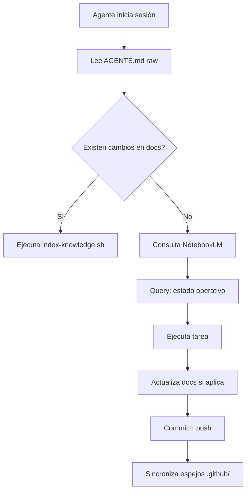

# Sistema de Conocimiento Opsly — NotebookLM + Obsidian

> **Última actualización:** 2026-04-14
> **Para agentes:** leer este doc primero para entender cómo Opsly gestiona conocimiento.

---

## 🌐 Visión general

Opsly usa **dos sistemas de conocimiento** complementarios:

| Sistema        | Propósito                                                                       | Cuándo usar                                    |
| -------------- | ------------------------------------------------------------------------------- | ---------------------------------------------- |
| **NotebookLM** | Knowledge layer universal para agentes IA; genera podcasts, slides, résúmenes   | Queries operativas, contexto durante ejecución |
| **Obsidian**   | Documentación técnica local con graph/wiki-links; fuente de verdad para humanos | Desarrollo, arquitectura, decisiones           |

**Fuente de verdad para agentes:** `AGENTS.md` (raíz del repo) → publicado a GitHub → sincronizado con NotebookLM en cada commit.

---

## 📚 NotebookLM (Knowledge Layer)

### Configuración actual

```bash
# Variables en Doppler (prd)
NOTEBOOKLM_ENABLED=true        # Solo business+/enterprise
NOTEBOOKLM_NOTEBOOK_ID=<id>    # ID del notebook en notebooklm.google.com
```

### Flujo de sync (ADR-025)

1. **Post-commit:** `.githooks/post-commit` → `scripts/index-knowledge.sh` → regenera `config/knowledge-index.json`
2. **Query startup:** cada sesión Claude/agent debe preguntar: `"¿Cuál es el estado actual de Opsly?"` → NotebookLM retorna contexto resumido
3. **Routing LLM Gateway:** si detecta keywords operativas (`deploy`, `error`, `vps`, `tenant`), consulta NotebookLM antes de proceder

### Scripts disponibles

```bash
# Regenerar índice de conocimiento
npm run update-state
node scripts/index-knowledge.sh

# Sync a NotebookLM (requiere NOTEBOOKLM_NOTEBOOK_ID)
npm run notebooklm:sync

# Query al notebook
node scripts/query-notebooklm.mjs "¿Cuál es el estado actual de Opsly?"
```

### Casos de uso

- **Reporte mensual tenant:** PDF → podcast + slides (workflow `report-to-podcast.py`)
- **Resumen operativo:** AGENTS.md + system_state.json → podcast para revisión
- **Investigación:** URLs/docs → fuentes en notebook → quiz, chat

---

## 📓 Obsidian (Documentación local)

### Estructura del vault

```
docs/
├── README.md                 ← Índice principal
├── adr/                      ← Decisiones de arquitectura (ADR-001...)
├── runbooks/                  ← Runbooks operativos
├── howto/                    ← Guías paso a paso
├── cheatsheets/              ← Referencias rápidas
└── templates/                ← Plantillas para nuevos docs
```

### Graph view (obsidian://graph)

- **Nodos:** archivos `.md` en `docs/`
- **Links:** `[[nombre]]` para wiki-links internos
- **Tags:** `#tag` para categorización

### Plugins recomendados

```json
// .obsidian/workspace.json (ya en repo)
{
  "plugin": ["graph", "backlinks", "daily-notes", "templates"]
}
```

### Reglas de documentación

1. **Cada decisión = un ADR** en `docs/adr/`
2. **Cada runbook = un archivo** en `docs/runbooks/`
3. **Sin duplicados:** si algo ya está en AGENTS.md, referenciar en lugar de copiar
4. **Tags al final:** `#ops #ia #infra` para filtrar en graph

---

## 🔄 Flujo de trabajo agente



---

## ⚡ Quick reference para agentes

```bash
# 1.获取 contexto
https://raw.githubusercontent.com/cloudsysops/opsly/main/AGENTS.md

# 2. Regenerar índice conocimiento
npm run update-state

# 3. Query NotebookLM
node scripts/query-notebooklm.mjs "<pregunta>"

# 4. Ver documentación
docs/README.md  ← índice principal
docs/QUICK-REFERENCE.md  ← comandos rápidos
```

---

## 📋 Checklist para nuevos docs

- [ ] ¿Ya existe en AGENTS.md? → referenciar
- [ ] ¿Es una decisión? → crear ADR en `docs/adr/`
- [ ] ¿Es un runbook? → crear en `docs/runbooks/`
- [ ] ¿Tiene tags al final? → `#ops #ia #infra`
- [ ] ¿Tiene links a otros docs? → `[[nombre]]`
- [ ] ¿Actualiza README.md índice?

---

## 🔗 Enlaces relacionados

- [`AGENTS.md`](../AGENTS.md) — estado operativo
- [`VISION.md`](../VISION.md) — norte del producto
- [`ROADMAP.md`](../ROADMAP.md) — plan semanal
- [`docs/adr/ADR-025-notebooklm-knowledge-layer.md`](adr/ADR-025-notebooklm-knowledge-layer.md)
- [`skills/user/opsly-notebooklm/SKILL.md`](../skills/user/opsly-notebooklm/SKILL.md)
