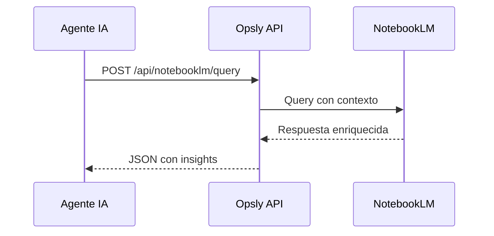

# Obsidian + NotebookLM + n8n + External Agents Integration

> **Status:** Planning | **Created:** 2026-04-21

## Visión General

Sistema integrado de documentación, knowledge layer y automatización que conecta:

- **Obsidian** vault → conocimiento estructurado
- **NotebookLM** → knowledge layer para agentes IA
- **n8n** → workflows de automatización
- **External Agents** → herramientas invocables por webhook/MCP
- **Internal Tools** → hooks internos del sistema

---

## 1. Arquitectura

```
┌─────────────────────────────────────────────────────────────────────┐
│                         OPSLY PLATFORM                              │
├─────────────────────────────────────────────────────────────────────┤
│                                                                     │
│  ┌──────────────┐    ┌──────────────┐    ┌──────────────────┐   │
│  │   OBSIDIAN   │───▶│  NOTEBOOKLM  │───▶│   AGENTS IA      │   │
│  │    VAULT     │    │  KNOWLEDGE   │    │  (Claude/Cursor) │   │
│  │  docs/*.md   │    │   LAYER      │    │                  │   │
│  └──────────────┘    └──────────────┘    └──────────────────┘   │
│         │                   │                      │               │
│         │ Sync             │ Query               │ Tools          │
│         ▼                   ▼                      ▼               │
│  ┌─────────────────────────────────────────────────────────────┐ │
│  │                    OPSLY API / MCP SERVER                  │ │
│  │  /api/tools/*  │  /api/agents/*  │  /api/hooks/*         │ │
│  └─────────────────────────────────────────────────────────────┘ │
│                              │                                    │
│         ┌────────────────────┼────────────────────┐              │
│         ▼                    ▼                    ▼              │
│  ┌────────────┐    ┌────────────┐    ┌────────────────┐    │
│  │    n8n      │    │ EXTERNAL   │    │   INTERNAL     │    │
│  │ WORKFLOWS  │    │  AGENTS    │    │    TOOLS       │    │
│  └────────────┘    └────────────┘    └────────────────┘    │
│                                                                     │
└─────────────────────────────────────────────────────────────────────┘
```

---

## 2. Obsidian Vault

### 2.1 Estructura

```
docs/
├── .obsidian/                 # Configuración Obsidian
│   ├── vault.json             # ID del vault
│   ├── workspace.json         # Estado UI
│   ├── PLUGINS-TO-INSTALL.md # Plugins a instalar
│   └── templates/             # Plantillas
├── adr/                       # Architecture Decision Records
├── runbooks/                  # Procedimientos operativos
├── agents/                    # Documentación de agentes
└── knowledge/                # Knowledge base para NotebookLM
    ├── AGENTS.md             # Estado de agentes (para IA)
    ├── VISION.md              # Visión del producto
    ├── SKILLS.md             # Catálogo de skills
    └── SYSTEM.md             # Estado del sistema
```

### 2.2 Plugins Requeridos

En `docs/.obsidian/PLUGINS-TO-INSTALL.md`:

```markdown
# Obsidian Plugins Requeridos

## Obligatorios

- obsidian-git: Sincronización automática con Git
- metadata-menu: Metadata estructurada
- dataview: Queries sobre notas
- tasks: Gestión de tareas

## Opcionales (para NotebookLM)

- obsidian-pandoc: Export a PDF
- image auto upload: Para assets
```

### 2.3 Sync con Git

```bash
# Hook post-save para Obsidian
# En .obsidian/workspace.json o plugin obsidian-git
```

---

## 3. NotebookLM Integration

### 3.1 Fuentes Automáticas

| Fuente     | Script                                | Frecuencia |
| ---------- | ------------------------------------- | ---------- |
| AGENTS.md  | `scripts/state-to-notebooklm.mjs`     | On-commit  |
| VISION.md  | `scripts/docs-to-notebooklm.mjs`      | On-commit  |
| Skills     | `scripts/skills-to-notebooklm.mjs`    | On-commit  |
| Estado LLM | `scripts/llm-stats-to-notebooklm.mjs` | Daily      |

### 3.2 Query Startup



### 3.3 API Endpoint

```typescript
// apps/api/app/api/notebooklm/query/route.ts
interface NotebookLMQueryRequest {
  query: string;
  context?: string[]; // Fuentes adicionales
  tenant_slug?: string;
}

interface NotebookLMQueryResponse {
  answer: string;
  sources: string[];
  confidence: number;
}
```

---

## 4. n8n Workflows

### 4.1 Webhooks Disponibles

| Endpoint                         | Trigger | Descripción                 |
| -------------------------------- | ------- | --------------------------- |
| `POST /api/webhooks/n8n/deploy`  | Manual  | Desplegar workflow a tenant |
| `POST /api/webhooks/n8n/suspend` | Manual  | Suspender tenant            |
| `POST /api/webhooks/n8n/backup`  | Cron    | Backup automático           |
| `POST /api/webhooks/n8n/metrics` | Cron    | Recolectar métricas         |

### 4.2 Templates

En `docs/n8n-workflows/`:

```
docs/n8n-workflows/
├── discord-to-github.json    # Notificaciones commits
├── tenant-onboard.json      # Onboarding automático
├── metrics-collector.json   # Métricas diarias
└── backup-automation.json  # Backup schedule
```

### 4.3 Integración API

```typescript
// apps/api/app/api/webhooks/n8n/[action]/route.ts
// Métodos: POST /webhooks/n8n/deploy, /suspend, /backup, /metrics
```

---

## 5. External Agents (Hooks)

### 5.1 Hooks para Agentes Externos

```typescript
// apps/api/app/api/hooks/external/route.ts
interface ExternalAgentHook {
  agent_id: string;
  action: string;
  payload: Record<string, unknown>;
  signature: string; // HMAC-SHA256
}
```

### 5.2 Herramientas Invocables

| Tool               | Endpoint                   | Descripción               |
| ------------------ | -------------------------- | ------------------------- |
| `execute_command`  | POST /api/tools/execute    | Ejecutar comando en agent |
| `get_status`       | GET /api/tools/status      | Estado de agent           |
| `deploy_tenant`    | POST /api/tools/deploy     | Desplegar tenant          |
| `query_notebooklm` | POST /api/tools/notebooklm | Query a knowledge layer   |

### 5.3 Autenticación

```typescript
// HMAC-SHA256 signature en header X-Hook-Signature
const verifySignature = (payload: string, signature: string, secret: string) => {
  const expected = crypto.createHmac('sha256', secret).update(payload).digest('hex');
  return crypto.timingSafeEqual(Buffer.from(signature), Buffer.from(expected));
};
```

---

## 6. Internal Tools (Hooks)

### 6.1 Webhooks Internos

| Evento              | Hook                        | Descripción               |
| ------------------- | --------------------------- | ------------------------- |
| `commit`            | `.githooks/post-commit`     | Sync docs, notify Discord |
| `deploy`            | `scripts/deploy-hooks.sh`   | Post-deploy actions       |
| `tenant_created`    | `scripts/onboard-tenant.sh` | Post-onboard              |
| `metrics_collected` | Cron                        | Process metrics           |

### 6.2 Sistema de Hooks

```typescript
// lib/hooks/manager.ts
interface Hook {
  name: string;
  event: 'commit' | 'deploy' | 'tenant_created' | 'metrics';
  script: string;
  enabled: boolean;
}

const hooks: Hook[] = [
  { name: 'sync-docs', event: 'commit', script: './scripts/sync-docs.sh', enabled: true },
  { name: 'notify-discord', event: 'commit', script: './scripts/notify-discord.sh', enabled: true },
  {
    name: 'notebooklm-sync',
    event: 'commit',
    script: './scripts/docs-to-notebooklm.mjs',
    enabled: true,
  },
  {
    name: 'backup-tenant',
    event: 'tenant_created',
    script: './scripts/backup-tenant.sh',
    enabled: true,
  },
];
```

---

## 7. Implementación

### 7.1 Archivos a Crear/Modificar

| Archivo                                         | Acción    | Descripción                   |
| ----------------------------------------------- | --------- | ----------------------------- |
| `docs/.obsidian/plugins/obsidian-git/data.json` | Crear     | Config sync Git               |
| `docs/.obsidian/templates/agent-template.md`    | Crear     | Template para notas de agente |
| `apps/api/app/api/hooks/external/route.ts`      | Crear     | Webhook para agents externos  |
| `apps/api/app/api/tools/notebooklm/route.ts`    | Crear     | Endpoint query NotebookLM     |
| `scripts/obsidian-sync.sh`                      | Crear     | Script sync Obsidian → Git    |
| `.githooks/post-commit`                         | Modificar | Añadir sync Obsidian          |

### 7.2 Scripts

```bash
# Sync Obsidian vault
#!/bin/bash
# scripts/obsidian-sync.sh
cd docs
git add -A
git commit -m "docs: sync $(date -u +%Y-%m-%d)" || echo "No changes"
git push origin main
```

### 7.3 GitHub Actions

```yaml
# .github/workflows/obsidian-sync.yml
name: Obsidian Sync
on:
  push:
    paths:
      - 'docs/**/*.md'
  workflow_dispatch:
jobs:
  sync:
    runs-on: ubuntu-latest
    steps:
      - uses: actions/checkout@v4
      - name: Sync to NotebookLM
        run: npm run docs:to-notebooklm
```

---

## 8. Usage

### 8.1 Query desde Agente Externo

```bash
curl -X POST https://api.opsly.com/api/tools/notebooklm \
  -H "Authorization: Bearer $TOKEN" \
  -H "X-Hook-Signature: $HMAC" \
  -d '{"query": "¿Cuál es el estado de los tenants?", "tenant_slug": "smiletripcare"}'
```

### 8.2 Invocar Herramienta Externa

```bash
curl -X POST https://api.opsly.com/api/hooks/external \
  -H "Content-Type: application/json" \
  -H "X-Hook-Signature: $HMAC" \
  -d '{"agent_id": "cursor-pro", "action": "deploy", "payload": {"tenant": "acme"}}'
```

### 8.3 Consultar n8n

```bash
# Activar workflow
curl -X POST https://api.opsly.com/api/webhooks/n8n/deploy \
  -H "Authorization: Bearer $ADMIN_TOKEN" \
  -d '{"tenant_slug": "acme", "workflow": "tenant-onboard"}'
```

---

## 9. Métricas

| Métrica                  | Fuente    | Dashboard      |
| ------------------------ | --------- | -------------- |
| Queries NotebookLM       | API logs  | Admin /metrics |
| Agentes externos activos | Hook logs | Admin /agents  |
| Workflows n8n ejecutados | n8n DB    | Admin /n8n     |
| Docs sync status         | Git logs  | Admin /docs    |

---

## 10. Seguridad

- **HMAC signatures** para todos los webhooks externos
- **Rate limiting** por agent_id en hooks
- **Audit log** de todas las invocaciones
- **IP allowlist** para webhooks de n8n (configurable)
