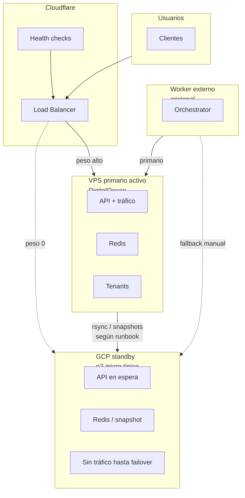

# Arquitectura de failover — GCP (standby pasivo)

> **Contexto:** complementa [`FAILOVER-RUNBOOK.md`](FAILOVER-RUNBOOK.md). Los importes y límites del **Free Trial / créditos** de GCP cambian; verifica siempre [Precios Compute Engine](https://cloud.google.com/compute/pricing) y las condiciones actuales de la cuenta.

## Configuración para `opslyquantum`

El proyecto GCP de referencia es **`opslyquantum`** (ya existente; los scripts usan `GCP_PROJECT_ID=opslyquantum` por defecto).

### Variables

1. Copiar plantilla: `cp config/gcp-opslyquantum.env config/gcp.env`
2. Rellenar secretos y `SYNC_SSH_*` en `config/gcp.env` (el archivo está en `.gitignore`).
3. Los scripts cargan **`config/gcp.env`** si existe; si no, **`config/gcp-opslyquantum.env`**.

### Verificación local

```bash
./scripts/verify-gcp-setup.sh
```

Checklist operativo: [`GCP-ACTIVATION-CHECKLIST.md`](GCP-ACTIVATION-CHECKLIST.md).

## Opción recomendada en exploración: standby pasivo (DO primario + GCP secundario)



## Especificaciones orientativas (e2-micro)

| Componente     | Valor típico                                            |
| -------------- | ------------------------------------------------------- |
| Tipo de VM     | `e2-micro`                                              |
| vCPU           | Compartida (elegibilidad Free Tier según región/cuenta) |
| RAM            | 1 GB                                                    |
| Disco boot     | 30 GB estándar (pd-standard)                            |
| Región ejemplo | `us-central1` (ajustar a tu LB y latencia)              |
| Costo          | Depende de cuenta; no asumir “$0 para siempre”          |

## Limitaciones operativas

1. **1 GB RAM**: el stack completo (Next + Redis + workers) puede no caber igual que en un DO 4 GB; Redis en standby suele ir con `maxmemory` acotado y política LRU (ver [`GCP-STANDBY-CONFIG.md`](GCP-STANDBY-CONFIG.md)).
2. **Egreso y ancho de banda**: el tráfico de usuarios en failover pasará por GCP; modelar coste si el incidente se alarga.
3. **Región**: alinear origen del pool en Cloudflare con la región de la VM para latencia y cumplimiento.
4. **Datos**: Supabase y estado en Postgres **no** se “rsyncean”; el standby debe usar los **mismos endpoints** (`SUPABASE_*`, etc.) salvo diseño multi-región explícito.

## Estrategia de escalado (incidente prolongado)

Si el nodo standby queda saturado:

```bash
gcloud compute instances set-machine-type "${INSTANCE_NAME}" \
  --machine-type=e2-medium \
  --zone="${ZONE}"
```

Validar cuotas y facturación antes de escalar.

## Artefactos en el repo

| Artefacto                            | Uso                                                                 |
| ------------------------------------ | ------------------------------------------------------------------- |
| `infra/provision-gcp-failover.sh`    | Crear VM y APIs (con `--dry-run`)                                   |
| `infra/gcp-failover-startup.sh`      | Script de arranque referenciado por metadata                        |
| `scripts/sync-to-gcp.sh`             | Sincronización código/artefactos (requiere SSH y política aprobada) |
| `scripts/configure-cloudflare-lb.sh` | Actualizar orígenes del pool (con `--dry-run`)                      |
| `GET /api/health/lightweight`        | Health mínimo para LB barato en CPU                                 |

## Comparación rápida con segundo VPS DO

|                      | GCP e2-micro (standby)            | Segundo DO 4 GB |
| -------------------- | --------------------------------- | --------------- |
| Coste                | Variable (créditos/free tier)     | Fijo mensual    |
| Paridad con primario | Suele ser menor (RAM)             | Alta            |
| Complejidad          | Dos proveedores + facturación GCP | Homogéneo DO    |

---

## Nota sobre costos “24 meses” en tablas externas

Cualquier tabla de ahorro multi-año es **ilustrativa**: depende de precios vigentes, impuestos y si el proyecto GCP sigue en free tier o pasa a tarifa estándar. Usar solo como orden de magnitud.
