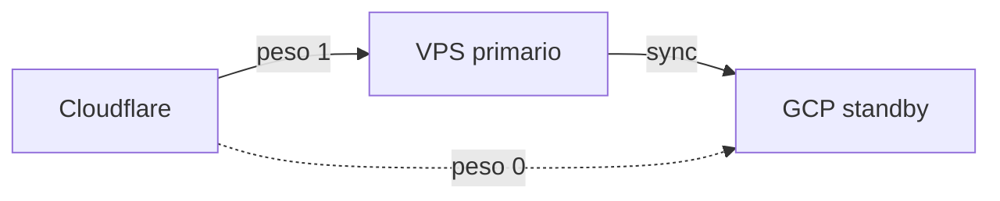

# GCP — standby pasivo (configuración)

> Acompaña [`FAILOVER-GCP-ARCHITECTURE.md`](FAILOVER-GCP-ARCHITECTURE.md) y [`FAILOVER-RUNBOOK.md`](FAILOVER-RUNBOOK.md).

**Proyecto GCP:** por defecto **`opslyquantum`** (`GCP_PROJECT_ID` en `config/gcp-opslyquantum.env` o `config/gcp.env`). No crear un proyecto nuevo en los scripts: se reutiliza el existente.

## Estado normal

- Cloudflare LB dirige **casi todo** el tráfico al **origen primario** (p. ej. DigitalOcean).
- La VM GCP mantiene **código y/o Redis** al día según política de sync (no sustituye backups ni Postgres).



## Estado de failover

- Tras caída del primario (health + procedimiento del runbook), se sube el peso del origen GCP en el pool o se ejecuta `scripts/trigger-failover-manual.sh` / `configure-cloudflare-lb.sh` según variables.

## Redis en 1 GB RAM

Ajuste orientativo en el contenedor Redis del standby (valores a validar con carga):

```bash
docker exec redis redis-cli CONFIG SET maxmemory 512mb
docker exec redis redis-cli CONFIG SET maxmemory-policy allkeys-lru
```

Persistencia: los dumps entre primario y standby **no garantizan** consistencia fuerte de colas; para BullMQ en incidente, el riesgo de jobs duplicados o perdidos debe estar aceptado o mitigado (idempotencia, `jobId`, etc.).

## Health check ligero

- Ruta: `GET /api/health/lightweight` — sin llamadas a Supabase; útil para health checks frecuentes del LB.
- Ruta completa: `GET /api/health` — incluye comprobaciones de dependencias.

Variable opcional para etiquetar el nodo en JSON:

- `OPSLY_STANDBY_ROLE=gcp` → campo `mode`: `failover` en la respuesta ligera.

## Tailscale y SSH

- Administración preferente por **Tailscale** (no exponer SSH en IP pública).
- Tras `provision-gcp-failover.sh`, completar `tailscale up` en la VM con auth key de tu tailnet.

## Orden sugerido de despliegue

1. Proyecto GCP + facturación habilitada (requisito habitual para Compute).
2. `infra/provision-gcp-failover.sh` (revisar con `--dry-run`).
3. Instalar Tailscale y clonar `/opt/opsly` o sincronizar con `scripts/sync-to-gcp.sh`.
4. Añadir IP/host del origen GCP al pool en Cloudflare.
5. Probar `curl https://api.<dominio>/api/health/lightweight` vía origen GCP cuando esté en el LB.
