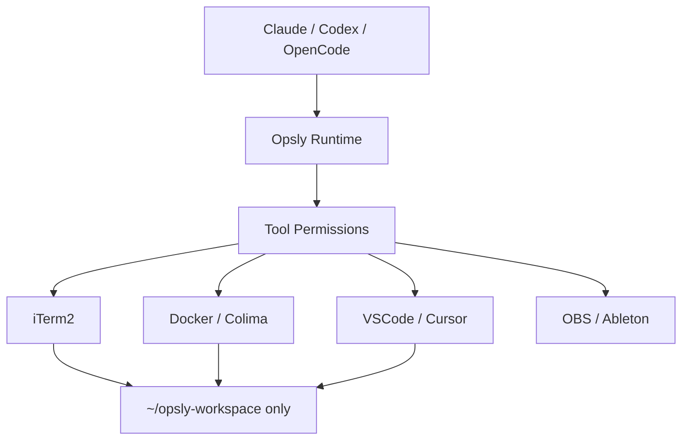

# macOS Local AI Automation Policy

Opsly agents may automate local developer tools, but only through a constrained workspace and explicit tool allowlist.

## Workspace

Canonical local workspace (replace `<CLONE>` with the **absolute path** to your `intcloudsysops` clone):

```bash
mkdir -p ~/opsly-workspace
ln -s "<CLONE>" ~/opsly-workspace/opsly
```

Agents should run commands from:

```text
~/opsly-workspace/opsly
```

Optional override: set `OPSLY_LOCAL_WORKSPACE` to a directory **under** `~/opsly-workspace/` (see `scripts/local-iterm-open.sh`).

Do not use personal folders, iCloud, Downloads, Desktop, Keychain, or system directories as agent workspaces.

## Allowed Tools

Agents may open or automate:

- iTerm2
- Cursor
- Visual Studio Code
- Docker / Colima
- Browser for localhost QA
- OBS / Ableton only when the task explicitly needs media tooling

Repo helpers:

```bash
scripts/local-iterm-open.sh "tmux attach -t openclaw"
scripts/local-app-open.sh cursor
scripts/local-app-open.sh docker
```

## macOS Permissions

Ningún agente (Cursor, Codex, OpenCode) puede marcar estos permisos por ti: **debes hacerlo tú** en el Mac.

### Checklist — lo que te pedimos que configures (manual)

1. **Ajustes del sistema → Privacidad y seguridad → Accesibilidad**
   Activa al menos: **Cursor**, **Codex** (si usas Codex Desktop), **iTerm2**, **Visual Studio Code**.
   *Opcional si ya los usas para otras automatizaciones:* Raycast, Hammerspoon.

2. **Primera vez que ejecutes `scripts/local-iterm-open.sh`**
   macOS puede mostrar un diálogo del estilo *«Terminal quiere controlar iTerm»* o *«Cursor quiere controlar iTerm»* (AppleScript / Apple Events).
   **Acepta** para la app que **lanza** el script (Terminal, iTerm, Cursor, etc.).
   Si no aparece y falla el script: **Privacidad y seguridad → Automatización** (si existe en tu versión) y permite que la app controladora use **iTerm**.

3. **Entrada de monitorización**
   Solo si ves que **no llegan teclas o pegado** a iTerm cuando una herramienta automatiza la terminal. Entonces añade **iTerm2** (y solo si hace falta, la app que inyecta entrada).

4. **Grabación de pantalla**
   Solo si vas a hacer **QA visual** o automatización basada en imagen. Añade **Codex** y/o **iTerm2** según quien capture.

5. **Acceso completo al disco**
   **Evítalo.** Solo si algo falla leyendo configs fuera del home; si lo activas, hazlo para **iTerm2** o **Cursor**, no para binarios genéricos, y sigue trabajando solo bajo `~/opsly-workspace`.

6. Tras cada cambio: **cierra la app por completo (Cmd+Q)** y vuelve a abrirla. Para iTerm: `killall iTerm2` y reabrir.

### Reference table (English)

| Section | Apps |
| --- | --- |
| Accessibility | Codex, Cursor, iTerm2, Visual Studio Code, Raycast, Hammerspoon (optional) |
| Automation / Apple Events | The app that runs `osascript` or `local-iterm-open.sh` → allow controlling **iTerm** |
| Input Monitoring | iTerm2 only if keyboard automation requires it |
| Screen Recording | Codex/iTerm2 only if visual QA requires it |
| Full Disk Access | Prefer none; if required, iTerm2/Cursor only, and still operate in `~/opsly-workspace` |

We do **not** ask for: **Administrador** (sudo), **Keychain**, **iCloud**, ni acceso root.

## Explicitly Forbidden

- Automatic `sudo`
- Keychain or iCloud access
- Unrestricted Full Disk Access for arbitrary agents
- Running agent HTTP bridges on public interfaces
- Exposing `POST /execute` outside localhost/Tailscale without Bearer auth
- Writing outside `~/opsly-workspace` unless a human asks for a specific file

## Operating Model



The rule is: AI controls specific tools for specific tasks. AI does not control the whole Mac.

## Python live automation (OBS / OSC)

Repo path: `tools/live-automation/`. Scripts `scripts/opsly-live-obs.sh` y `scripts/opsly-live-osc.sh` crean/actualizan el venv `tools/live-automation/.venv` e instalan dependencias antes de ejecutar.

| npm script | Acción |
| --- | --- |
| `npm run opsly:live:obs -- '<json>'` | OBS WebSocket (env `OBS_WEBSOCKET_*`) |
| `npm run opsly:live:osc -- /ruta/osc [valores…]` | UDP OSC |
| `npm run opsly:live:test` | Tests unitarios (sin OBS) |
| `npm run opsly:live:install` | `pip install` con el `python3` del sistema (opcional si usas los wrappers) |

Ejemplos (OBS abierto con **Herramientas → Servidor WebSocket** activo y puerto por defecto 4455):

```bash
export OBS_WEBSOCKET_PASSWORD='…'   # si aplica
npm run opsly:live:obs -- '{"action":"get_version"}'
npm run opsly:live:osc -- /live/tempo 120
```

Si ves `Connection refused`, OBS no está escuchando en ese host/puerto o el servidor WebSocket está apagado.
