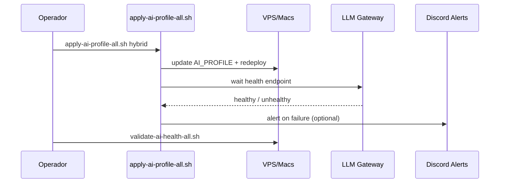

# Runbook AI Local-First

Fecha: 2026-04-13  
Ámbito: operación de LLM Gateway + Ollama + budgets + alertas

## Comandos Base

- Health global: `./scripts/validate-ai-health-all.sh`
- Aplicar profile global: `./scripts/apply-ai-profile-all.sh [profile]`

Profiles válidos:

- `hybrid`
- `free-always`
- `cloud-only`

## Flujo Operativo Estándar

1. Ejecutar health check completo.
2. Aplicar profile objetivo.
3. Revalidar salud.
4. Revisar alertas (Discord) y métricas de costo.



## Troubleshooting

### Ollama offline

Síntomas:

- `curl :11434/api/tags` falla
- Requests en `hybrid` caen a cloud en todos los casos

Acción:

1. Verificar proceso Ollama en host.
2. Reiniciar servicio.
3. Repetir `./scripts/validate-ai-health-all.sh`.

### Gateway fail

Síntomas:

- `curl :9000/health` o `:3010/health` falla
- error `5xx` en clientes

Acción:

1. Revisar logs del contenedor/proceso gateway.
2. Verificar variables (`AI_PROFILE`, budgets, API keys).
3. Redeploy del servicio.

### Error 429

Síntomas:

- proveedor cloud responde rate limited
- alertas en Discord con tipo 429

Acción:

1. Confirmar fallback cloud secundario activo.
2. Reducir concurrencia temporal.
3. Mantener `hybrid` para absorber carga local.

### Error 402 (budget)

Síntomas:

- inferencia bloqueada por budget diario agotado

Acción:

1. Verificar `DAILY_BUDGET_*` actual.
2. Ajustar budget en Doppler si procede.
3. Reaplicar profile y validar salud.

### Fallback no funciona

Síntomas:

- local falla y cloud no entra, o viceversa

Acción:

1. Revisar profile efectivo (`AI_PROFILE`).
2. Validar conectividad Ollama y cloud provider.
3. Revisar logs de gateway para cadena local -> cloud.

## Cron Automático (Future)

Objetivo: health check cada 6 horas.

Ejemplo:

```bash
0 */6 * * * /opt/opsly/scripts/validate-ai-health-all.sh >> /opt/opsly/runtime/logs//ai-health.log 2>&1
```

## Escalation

Escalar inmediatamente cuando:

- 3 fallos consecutivos de health check.
- > 30 minutos con 402 masivo para tenants productivos.
- fallback cloud también falla para `hybrid`.

Canal primario:

- Discord `#alerts` (errores 429/402 y fallos de health críticos).
