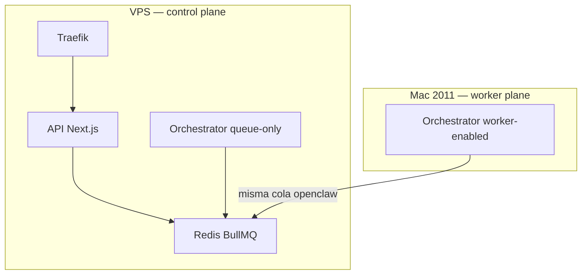

# Arquitectura distribuida — VPS (control) + Mac 2011 (workers)

> **Implementación en código:** `OPSLY_ORCHESTRATOR_ROLE` (`control` \| `worker` \| `full`) y alias `OPSLY_ORCHESTRATOR_MODE` (`queue-only` \| `worker-enabled`). Ver `docs/ORCHESTRATOR.md`.

## Estado típico (todo en VPS)

Cuando el orchestrator corre en **un solo proceso** (`full`), CPU y RAM del VPS suben con la carga de jobs (BullMQ, I/O, LLM vía gateway).

## Estado objetivo (carga repartida)



- **VPS:** API, Traefik, Redis, **orchestrator en modo `queue-only`** (TeamManager + eventos + health; no arranca workers BullMQ).
- **Mac (u otro nodo):** **orchestrator en modo `worker-enabled`** (mismos `start*Worker`, mismo `REDIS_URL` hacia el VPS vía Tailscale).

Misma base de código e imagen Docker; solo cambia el rol.

## Requisitos de red

- `REDIS_URL` en el worker remoto debe apuntar al Redis del VPS con **autenticación** (mismo `REDIS_PASSWORD` que en Doppler). Ejemplo orientativo: `redis://:PASSWORD@100.x.x.x:6379/0` (IP Tailscale del VPS, no la IP pública).
- **No** exponer Redis a Internet abierto. Ver sección Redis en este doc y `docs/SECURITY_CHECKLIST.md`.

## Redis: opciones (orden de preferencia)

1. **Solo red Tailscale:** el daemon Redis escucha en la IP Tailscale del VPS (o en `0.0.0.0` **y** firewall `ufw` limitando `6379/tcp` a `100.64.0.0/10`). Revisar `docs/SECURITY-MITIGATIONS-2026-04-09.md` (UFW + Tailscale).
2. **Solo Docker interno (default actual):** el servicio `redis` no publica puerto al host; para workers remotos hace falta **publicar** el puerto de forma acotada o usar túnel — por eso la opción 1 es la habitual para BullMQ remoto.

Comandos de comprobación (desde el Mac, con `redis-cli`):

```bash
redis-cli -u "$REDIS_URL" ping
```

## Arranque rápido

| Ubicación | Variable | Comando |
|-----------|----------|---------|
| VPS `.env` / Doppler | `OPSLY_ORCHESTRATOR_MODE=queue-only` | `docker compose ... up -d orchestrator` |
| Mac `.env.local` | `REDIS_URL=...` y `OPSLY_ORCHESTRATOR_MODE=worker-enabled` | `./scripts/run-orchestrator-worker.sh` o `./scripts/start-workers-mac2011.sh` |

Scripts de ayuda: `scripts/setup-vps-control-plane.sh`, `scripts/start-workers-mac2011.sh`.

## Defaults recomendados para el nodo worker

Arranque seguro inicial para `opsly-mac2011` / `opslyquantum`:

- `ORCHESTRATOR_CURSOR_CONCURRENCY=1`
- `ORCHESTRATOR_OLLAMA_CONCURRENCY=1`
- `ORCHESTRATOR_N8N_CONCURRENCY=1`
- `ORCHESTRATOR_DRIVE_CONCURRENCY=1`
- `ORCHESTRATOR_NOTIFY_CONCURRENCY=2`

Sube estos valores solo tras medir CPU sostenida, crecimiento de `waiting` y latencia del gateway/Ollama.

## Límites y operación

- **Un solo `control`** debe asignar equipos (`TeamManager`); varios `worker` pueden coexistir si todos consumen la misma cola (BullMQ reparte jobs).
- **LLM Gateway:** el contenedor en el VPS sigue siendo el esperado por URLs internas (`http://llm-gateway:3010`). Los workers remotos deben poder alcanzar el gateway (misma red, proxy, o URL pública según diseño). Si solo el orchestrator en VPS llamaba al gateway por nombre Docker, un worker **solo remoto** necesita `ORCHESTRATOR_LLM_GATEWAY_URL` apuntando a una URL alcanzable desde el Mac — validar antes de producción.
- **Docker en el VPS** sigue albergando API, Redis, Traefik, etc.; el orchestrator en modo `control` **sí** puede seguir en Docker (servicio `orchestrator` con env).

## Referencias

- `docs/VPS-SSH-WORKER-NODES.md` — SSH desde el VPS a nodos worker (clave dedicada + `authorized_keys`, Tailscale).
- `docs/WORKER-FLOWS.md` — flujo lógico jobs / roles.
- `docs/WORKER-SERVICE-MAC2011.md` — systemd en el Mac (si aplica).
- `infra/systemd/opsly-workers-remote.service.example` — unidad ejemplo con `worker`.
