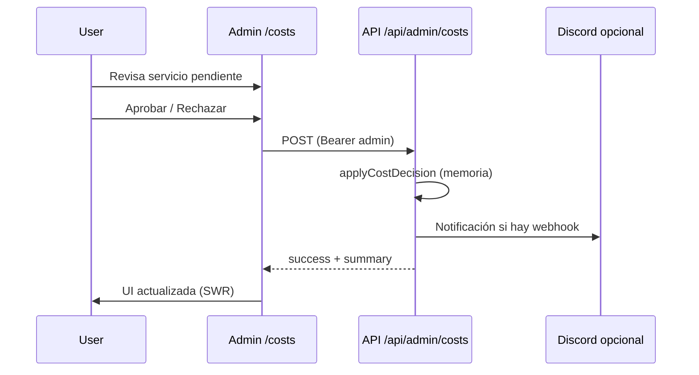

# Dashboard de costos (admin)

## Acceso

Ruta en la app admin: `/costs`.

En staging, la URL base suele ser `https://admin.<PLATFORM_DOMAIN>/costs` (por ejemplo `https://admin.ops.smiletripcare.com/costs`).

## Funcionalidad

- **GET** `GET /api/admin/costs` (API `apps/api`): devuelve líneas de costo actuales y propuestas, resumen mensual, **alertas** (info / warning, p. ej. Mac 2011 worker y revisión GCP **opslyquantum**), campo opcional **`specs`** en propuestas (hardware/SO) y **`lastUpdated`** (ISO 8601).
- **POST** `POST /api/admin/costs`: registra **aprobación** o **rechazo** de una línea propuesta (`service_id`, `action`, `reason` opcional).

Los importes son **orientativos** (orden de magnitud); la facturación real está en cada proveedor.

### Autenticación

- **Lectura (GET):** si `ADMIN_PUBLIC_DEMO_READ=true` en la API, el GET puede usarse sin token (modo demo de lectura).
- **Mutaciones (POST):** siempre requieren `PLATFORM_ADMIN_TOKEN` (cabecera `Authorization: Bearer` o `x-admin-token`).

En el admin en modo demo, si está definido `NEXT_PUBLIC_PLATFORM_ADMIN_TOKEN` en el build, el cliente envía ese token para permitir mutaciones (mismo patrón que otras pantallas admin).

### Persistencia

El estado aprobado/rechazado de propuestas vive **en memoria del proceso** de la API (`apps/api/lib/admin-costs.ts`); se pierde al reiniciar el contenedor. Una evolución futura puede persistir en base de datos o archivo.

### Notificaciones

Si `DISCORD_WEBHOOK_URL` está configurada en el entorno de la API, un POST de aprobación o rechazo puede enviar un mensaje breve al webhook (sin secretos en el cuerpo).

## Flujo de aprobación

## Referencias de código

- API: `apps/api/app/api/admin/costs/route.ts`, `apps/api/lib/admin-costs.ts`
- Admin: `apps/admin/app/costs/page.tsx`, `apps/admin/components/costs/CostCard.tsx`
- Cliente HTTP: `apps/admin/lib/api-client.ts` (`getAdminCosts`, `postCostDecision`)
