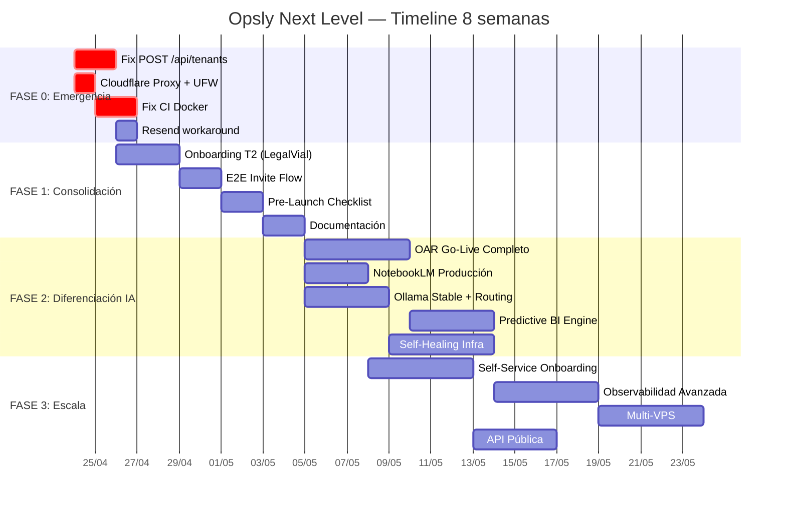

# Opsly Next Level — Plan Maestro de Trabajo

> **Objetivo:** Elevar Opsly de "plataforma funcional" a "plataforma inteligente, autónoma y enterprise-ready".
> **Horizonte:** 6–8 semanas (Fase 2 completada + Fase 3 iniciada).
> **Principio rector:** Extender, no re-arquitecturar. Cada incremento verificable con `type-check`, tests y smoke.

**Fuente de verdad:** `AGENTS.md` (estado sesión) + `VISION.md` (norte) + este documento (plan maestro).

---

## Diagnóstico Ejecutivo (Estado Actual)

### ✅ Fortalezas
- **5 tenants activos** en producción (smiletripcare, localrank, jkboterolabs, peskids, intcloudsysops)
- **Zero-Trust auth** completo en portal (`tenantSlugMatchesSession`, `resolveTrustedPortalSession`)
- **OpenClaw core** operativo: MCP (12 tools), Orchestrator (BullMQ), LLM Gateway (routing + cache), Context Builder
- **Feedback loop API** con ML classification (Semana 5 ✅)
- **Cost dashboard** admin + workers Mac 2011 (ADR-024)
- **Tests:** 162 API tests, 21+ portal tests, 56 LLM Gateway tests — todos en verde
- **Infra estable:** Traefik v3, Docker Compose, Doppler, GHCR pipeline

### 🚨 Bloqueantes Críticos (Impiden avanzar)
| Prioridad | Bloqueante | Impacto | Riesgo |
|-----------|-----------|---------|--------|
| P0 | `POST /api/tenants` retorna 202 con UUID pero **NO persiste en DB** | Onboarding imposible | 🔴 Alto |
| P0 | **Cloudflare Proxy OFF** — IP VPS 157.245.223.7 expuesta | Seguridad comprometida | 🔴 Alto |
| P1 | **Resend dominio no verificado** — emails externos fallan con 500 | Invitaciones bloqueadas | 🟡 Medio |
| P1 | **CI Docker workflow fallando** — imágenes no se publican | Deploys rotos | 🟡 Medio |
| P2 | Variables GCP faltantes en Doppler (`GOOGLE_CLOUD_PROJECT_ID`, `BIGQUERY_DATASET`, `VERTEX_AI_REGION`) | Fase 10 bloqueada | 🟢 Bajo (no crítico ahora) |

### 📊 Métricas Actuales
- Type-check: **14/14 workspaces ✅**
- API tests: **162 ✅**
- Portal tests: **21+ ✅**
- Servicios VPS: **10/10 healthy ✅**
- Costo mensual: **~$12** (VPS DO) ✅

---

## FASE 0: Emergencia — Fix Críticos (Semana 0, 2–3 días)

> **Meta:** Desbloquear onboarding y seguridad. Sin esto, todo lo demás es irrelevante.

### Tarea 0.1: Fix `POST /api/tenants` — Persistencia en DB

**Problema:** `provisionTenant()` retorna `{id, slug, status: 'provisioning'}` (HTTP 202) pero el tenant no aparece en `GET /api/tenants` ni en Supabase.

**Análisis técnico (de `apps/api/lib/orchestrator.ts`):**
1. `createTenantRecord()` hace `insert` en `platform.tenants` con `getServiceClient()` (service role key)
2. Luego `verifyTenantPersisted()` hace `select` por `id`
3. **Hipótesis:** RLS policy `service_role_only` usa `auth.role() = 'service_role'` pero el client de `getServiceClient()` no está enviando el rol correctamente, o el `verify` está en una transacción separada con RLS aplicado.

**Acciones:**
```bash
# 1. Verificar logs del contenedor app en VPS
ssh vps-dragon@100.120.151.91 "docker logs infra-app-1 --tail=100 | grep 'createTenantRecord\|verifyTenantPersisted'"

# 2. Test manual contra Supabase con service role key
doppler run --config prd -- bash -c '
  node -e "
    const { createClient } = require(\@supabase/supabase-js\);
    const c = createClient(process.env.NEXT_PUBLIC_SUPABASE_URL, process.env.SUPABASE_SERVICE_ROLE_KEY);
    c.schema(\platform\).from(\tenants\).insert({slug:\test-persistence\,name:\Test\,owner_email:\test@test.com\,plan:\demo\,status:\provisioning\}).select().single().then(r => console.log(\INSERT:\, r)).catch(e => console.error(\INSERT_ERR:\, e));
  "
'

# 3. Si el insert funciona pero verify falla: revisar RLS policy
# 4. Si el insert falla silenciosamente: revisar triggers o constraints
```

**Fix esperado:**
- Opción A: `getServiceClient()` necesita `headers: { 'X-Client-Info': 'service_role' }` o similar
- Opción B: `verifyTenantPersisted` debe usar `db.rpc('verify_tenant', {tenant_id})` para bypass RLS
- Opción C: El `insert` con `.select('id').single()` retorna el id pero el commit real falla (trigger que revierte)

**Validación:**
```bash
./scripts/test-e2e-invite-flow.sh --api-url https://api.ops.smiletripcare.com
# Debe crear tenant, enviar invitación y activar portal
```

### Tarea 0.2: Activar Cloudflare Proxy (5 min)

**Problema:** IP VPS 157.245.223.7 visible públicamente. SSH expuesto.

**Acciones:**
1. Dashboard Cloudflare → DNS → registros `*.ops.smiletripcare.com` → nube naranja (Proxy ON)
2. Verificar: `dig +short api.ops.smiletripcare.com` → debe retornar IPs de Cloudflare (no 157.245.223.7)
3. UFW en VPS: `sudo ufw default deny incoming && sudo ufw allow from 100.64.0.0/10 to any port 22 && sudo ufw allow 80/tcp && sudo ufw allow 443/tcp && sudo ufw enable`
4. Script: `./scripts/vps-secure.sh --ssh-host 100.120.151.91`

**Validación:** `ssh vps-dragon@157.245.223.7` debe fallar (solo Tailscale `100.120.151.91` funciona)

### Tarea 0.3: Fix CI Docker Workflow

**Problema:** `deploy.yml` falla en build/push de imágenes GHCR.

**Acciones:**
1. Revisar último run en GitHub Actions → logs de error
2. Verificar `secrets.GITHUB_TOKEN` tiene scope `packages:write`
3. Verificar `GHCR_USER` / `GHCR_TOKEN` en Doppler `prd` coinciden con `github.actor`
4. Asegurar que `apps/api/package.json` y `apps/admin/package.json` tienen script `"start"`
5. Revisar que Dockerfiles copian `.next/standalone` correctamente

**Validación:** Push a `main` → Actions verde → `docker pull ghcr.io/cloudsysops/intcloudsysops-api:latest` en VPS funciona

### Tarea 0.4: Verificar/Workaround Resend Dominio

**Problema:** Invitaciones a emails externos fallan con 500 si dominio no verificado.

**Acciones:**
1. Verificar en panel Resend: dominio `ops.smiletripcare.com` o `smiletripcare.com` verificado
2. Si no está verificado: usar remitente `onboarding@resend.dev` (ya en Doppler) como workaround temporal
3. El script `onboard-tenant.sh` debe advertir si el email del owner no es del dominio verificado
4. Documentar en `docs/INVITATIONS_RUNBOOK.md`

---

## FASE 1: Consolidación — Semana 6 Completada + Pre-Launch (Semanas 1–2)

> **Meta:** Cerrar Fase 2 (Producto) con segundo cliente validado y checklist pre-launch completo.

### Tarea 1.1: Onboarding Segundo Cliente Real

**Candidato:** LegalVial (via LocalRank) o nuevo cliente pagador.

**Flujo:**
```bash
# 1. Preparar variables
export PLATFORM_ADMIN_TOKEN="$(doppler run --config prd -- echo $PLATFORM_ADMIN_TOKEN)"

# 2. Onboard
./scripts/onboard-tenant.sh \
  --slug legalvial \
  --email owner@legalvial.com \
  --plan business \
  --name "LegalVial" \
  --ssh-host 100.120.151.91 \
  --yes

# 3. Verificar
ssh vps-dragon@100.120.151.91 "docker ps | grep legalvial"
# Debe mostrar: n8n-legalvial, uptime-legalvial
```

**Validación:**
- [ ] Tenant aparece en `GET /api/tenants` (lista admin)
- [ ] n8n accesible: `https://n8n-legalvial.ops.smiletripcare.com`
- [ ] Uptime Kuma accesible: `https://uptime-legalvial.ops.smiletripcare.com`
- [ ] Invitación enviada y recibida
- [ ] Portal login funciona para owner

### Tarea 1.2: E2E Invite Flow Validation

**Script:** `./scripts/test-e2e-invite-flow.sh`

**Checklist:**
1. POST `/api/invitations` → 200 + JWT
2. GET `/api/invitations/{id}` → token verificable
3. Portal `/invite/{token}` → formulario pre-relleno
4. POST activate → usuario creado, sesión activa
5. GET `/api/portal/me` → perfil tenant visible
6. GET `/api/portal/usage` → métricas (inicialmente 0)

**Validación:** Todos los pasos 200 OK en < 5 minutos.

### Tarea 1.3: Pre-Launch Checklist

Documentar en `docs/PRE-LAUNCH-CHECKLIST.md`:

| Área | Check | Validación |
|------|-------|-----------|
| Supabase | Backup < 24h | Panel Supabase |
| DNS | `*.ops.smiletripcare.com` → CF Proxy | `dig +short` |
| Doppler prd | Todas las vars críticas | `./scripts/check-tokens.sh` |
| Admin | `/admin/tenants` lista ≥2 clientes | Navegador |
| Costos | `/admin/costs` muestra presupuestos | Navegador |
| Discord | Webhook válido, notificaciones funcionan | `./scripts/notify-discord.sh "Test"` |
| Email | Invitaciones envían sin error | E2E flow |
| Stripe | `STRIPE_SECRET_KEY` presente, webhooks configurados | Doppler + Stripe dashboard |
| VPS | Disco < 80%, load < 4, todos los servicios healthy | `docker ps`, `df -h`, `uptime` |
| Logs | `/opt/opsly/logs/` existe, logs estructurados | SSH + `docker compose logs` |

### Tarea 1.4: Documentación Operativa

Crear/actualizar:
- `docs/SECOND-CLIENT-ONBOARDING.md` — paso a paso para próximos clientes
- `docs/PRE-LAUNCH-CHECKLIST.md` — lista de validación antes de prod
- `docs/INCIDENT-RUNBOOKS.md` — guías para problemas comunes
- `AGENTS.md` — sección 🔄 actualizada con Semana 6 completada

---

## FASE 2: Diferenciación IA — Autonomía + Inteligencia (Semanas 3–5)

> **Meta:** Transformar Opsly en plataforma con capacidades de IA autónoma que ningún competidor directo tiene.

### Tarea 2.1: OAR (Opsly Agentic Runtime) — Go-Live Completo

**Estado:** Diseño en `docs/design/OAR.md`, implementación parcial en `apps/orchestrator`.

**Completar:**
1. **ReAct Strategy** (`runReActStrategy()`): Loop observar → pensar → actuar → verificar
2. **Plan-Execute Strategy** (`runPlanExecuteStrategy()`): Planificar secuencia de actions, ejecutar, validar resultado
3. **Reflection Engine** (`runWithReflection()`): Auto-evaluación post-ejecución, aprender de errores
4. **Mode System Integration**: Selector automático de estrategia según complejidad del intent

**Integración:**
- Orchestrator `processIntent()` → detecta complejidad → selecciona modo ReAct/Plan-Execute/Reflection
- Cada ejecución genera métricas: latency, success, cost, strategy_used
- Persistir en `platform.agent_executions`

**Validación:**
```bash
npm run test --workspace=@intcloudsysops/orchestrator
# Tests: 25+ suites, 150+ tests PASS (incl. OAR modes)
```

### Tarea 2.2: NotebookLM Knowledge Layer — Producción

**Estado:** Configurado (notebook ID: `8447967c-f375-47d6-a920-c3100efd7e7b`), EXPERIMENTAL.

**Go-Live:**
1. Feature flag `NOTEBOOKLM_ENABLED=true` solo para planes Business+ Enterprise
2. Sync automático post-commit: `AGENTS.md`, ADRs, `system_state.json`, costos LLM
3. Query startup obligatoria: `"¿Cuál es el estado actual de Opsly?"`
4. Routing LLM Gateway: si detecta keywords operativas → consulta NotebookLM antes de responder

**Scripts:**
```bash
npm run notebooklm:sync        # Sincroniza docs + skills
npm run notebooklm:query       # Query interactiva
```

**Validación:** `node scripts/query-notebooklm.mjs "¿Cuál es el estado actual de Opsly?"` → respuesta coherente con contexto reciente.

### Tarea 2.3: Ollama Local Worker — Producción Estable

**Estado:** ADR-024 validado, Mac 2011 worker operativo (100.80.41.29:11434), modelos nemotron-3-nano + llama3.2.

**Go-Live:**
1. **Hermes Mode Routing**: `HERMES_LOCAL_LLM_FIRST=true` → jobs `decision` + esfuerzo `S` encolan `ollama` en lugar de Anthropic
2. **Health Daemon**: Monitoreo cada 30s, circuit breaker 3 fallos, Redis TTL 300s
3. **Admin Dashboard**: Métricas Ollama (cache hits, latency, modelo usado) en `/admin/metrics/llm`
4. **Costo $0**: Clasificación, extracción, formato vía Ollama; solo fallback a cloud si Ollama falla

**Matriz de routing:**
| Tipo de tarea | Esfuerzo | Modelo | Costo |
|--------------|----------|--------|-------|
| Clasificación | S | Ollama (llama3.2) | $0 |
| Extracción datos | S/M | Ollama | $0 |
| Respuesta moderada | M | Claude Haiku | ~$0.001/1k |
| Arquitectura/código | L | Claude Sonnet | ~$0.015/1k |

**Validación:**
```bash
curl -X POST https://api.ops.smiletripcare.com/api/admin/ollama-demo \
  -H "Authorization: Bearer $ADMIN_TOKEN" \
  -d '{"tenant_slug":"smiletripcare","prompt":"Clasifica este feedback: Buen servicio"}'
# Debe retornar job_id y ejecutarse en Mac 2011
```

### Tarea 2.4: Predictive BI Engine

**Estado:** Implementado en Semana 4 (`apps/ml/src/insight-engine.ts`), dashboard en `/admin/overview`.

**Mejorar:**
1. **Churn Prediction**: Alerta automática si tenant muestra señales de churn (sin login >7 días, usage dropping)
2. **Revenue Forecast**: Proyección MRR basada en tenants activos + planes
3. **Anomaly Detection**: Detectar spikes de costo o caídas de servicio automáticamente
4. **Growth Opportunity**: Recomendar upgrades de plan basado en usage patterns

**Integración:**
- InsightGenerator worker en `apps/orchestrator/src/workers/insight-generator.ts`
- Endpoint `GET /api/admin/overview` con datos reales
- Dashboard `apps/admin/components/insights/InsightDashboard.tsx` con Recharts

### Tarea 2.5: Self-Healing Infrastructure

**Nueva capacidad:** El sistema detecta y remedia problemas sin intervención humana.

1. **Health Daemon LLM Gateway**: Ya existe, extender a todos los servicios
2. **Auto-Restart**: Si worker BullMQ falla 3 veces, reiniciar automáticamente
3. **Circuit Breaker**: Si provider LLM falla (ej. Anthropic 503), auto-switch a fallback (OpenRouter → GPT-4o mini)
4. **Disk Cleanup**: Si VPS > 85%, auto-prune imágenes Docker antiguas
5. **Backup Verification**: Backup diario + restore test semanal automatizado

**Implementación:**
- Nuevo worker: `apps/orchestrator/src/workers/self-healing.ts`
- Reglas en `config/self-healing-rules.json`
- Notificaciones Discord solo si auto-remediación falla

---

## FASE 3: Escala — Enterprise Ready (Semanas 6–8)

> **Meta:** Preparar Opsly para 10+ tenants, monetización estable y operación sin fricción.

### Tarea 3.1: Onboarding Self-Service Completo

**Estado:** Onboarding requiere `./scripts/onboard-tenant.sh` manual.

**Objetivo:** Flujo 100% self-service:
1. Prospect visita landing page (`apps/web`)
2. Selecciona plan → Stripe Checkout
3. Pago exitoso → webhook Stripe → auto-onboarding
4. Email de invitación automático
5. Portal listo en < 2 minutos

**Implementación:**
- `apps/web`: Landing + pricing + Stripe Checkout
- `apps/api/app/api/webhooks/stripe/route.ts`: Webhook handler completo
- `apps/api/lib/stripe/webhook-handler.ts`: Crear tenant + iniciar provisioning automático

### Tarea 3.2: Observabilidad Avanzada

**Nueva capacidad:** SLI/SLO por tenant, métricas en tiempo real.

1. **Dashboard Grafana**: Métricas VPS (CPU, RAM, disco, red) + métricas aplicación (requests, latency, errores)
2. **SLI/SLO por tenant**:
   - Uptime n8n: > 99.5%
   - API latency p95: < 500ms
   - Job success rate: > 98%
3. **Alertas automáticas**: Si SLO se rompe → Discord + email admin
4. **Cost tracking por tenant**: Budget cap mensual, alertas al 80% y 100%

**Implementación:**
- Prometheus ya instalado, extender métricas
- Grafana dashboards pre-configurados
- Nuevo endpoint: `GET /api/metrics/slo?tenant_slug=...`

### Tarea 3.3: Multi-VPS (Horizontal Scaling)

**Estado:** Un solo VPS DigitalOcean.

**Objetivo:** Soporte para múltiples VPS sin cambiar arquitectura.

1. **VPS Worker Pool**: VPS secundario(s) solo para stacks de tenants (no control plane)
2. **Routing inteligente**: Traefik en VPS primario routea a tenants en VPS secundarios
3. **Migración de tenant**: Mover tenant de un VPS a otro sin downtime
4. **Balanceo por región**: VPS en NYC (actual) + AMS para clientes EU

**Implementación:**
- `scripts/provision-vps-worker.sh`: Bootstrap nuevo VPS worker
- `apps/api/lib/tenant-placement.ts`: Decidir en qué VPS desplegar tenant
- `infra/docker-compose.worker-node.yml`: Compose para VPS workers

### Tarea 3.4: API Pública Documentada

**Estado:** OpenAPI subset en `docs/openapi-opsly-api.yaml` (16 paths portal + feedback).

**Objetivo:** API pública completa con docs interactivas.

1. **OpenAPI completo**: Todos los endpoints documentados
2. **Swagger UI**: `/api/docs` con UI interactiva
3. **Postman collection**: Exportable desde OpenAPI
4. **Rate limiting**: Por API key + tier (startup: 100 req/min, business: 500, enterprise: unlimited)
5. **API Keys**: Gestión en portal admin

---

## Timeline y Dependencias



---

## Checklist de Validación por Fase

### FASE 0 Completada ✅
- [ ] `POST /api/tenants` crea tenant visible en DB y `GET /api/tenants`
- [ ] `dig api.ops.smiletripcare.com` retorna IPs de Cloudflare
- [ ] CI Actions verde en `main`
- [ ] Invitación a Gmail/Outlook funciona (sin 500)

### FASE 1 Completada ✅
- [ ] Tenant #2 (LegalVial) activo con n8n + Uptime Kuma
- [ ] E2E flow < 5 minutos end-to-end
- [ ] Pre-Launch checklist 100% verde
- [ ] `AGENTS.md` actualizado con estado Semana 6

### FASE 2 Completada ✅
- [ ] OAR: 3 estrategias (ReAct, Plan-Execute, Reflection) operativas
- [ ] NotebookLM: sync automático + query funcional para Business+
- [ ] Ollama: 80% de tareas tipo S/M vía local, costo cloud < $5/mes
- [ ] Predictive BI: churn alerts + revenue forecast en dashboard
- [ ] Self-Healing: 5 reglas activas, < 1% de incidentes requieren humano

### FASE 3 Completada ✅
- [ ] Self-service: Stripe Checkout → tenant activo en < 2 minutos
- [ ] Observabilidad: Grafana + SLI/SLO + alertas automáticas
- [ ] Multi-VPS: 2 VPS operativos, tenant migrado sin downtime
- [ ] API Pública: OpenAPI completo + Swagger UI + rate limiting

---

## Métricas de Éxito (KPIs)

| Métrica | Actual | Target FASE 2 | Target FASE 3 |
|---------|--------|---------------|---------------|
| Tenants activos | 5 | 8 | 15 |
| Onboarding time | ~10 min manual | < 5 min semi-auto | < 2 min self-service |
| Costo LLM/mes | ~$5–10 | <$5 (Ollama 80%) | <$10 con 15 tenants |
| Uptime n8n | ~99% | 99.5% | 99.9% |
| Time to recovery | ~30 min | < 10 min | < 5 min (auto-healing) |
| API latency p95 | ~300ms | < 250ms | < 200ms |
| Test coverage | ~70% | > 80% | > 85% |
| Incidentes humanos/mes | ~5 | < 3 | < 1 |

---

## Riesgos y Mitigaciones

| Riesgo | Probabilidad | Impacto | Mitigación |
|--------|-------------|---------|------------|
| Fix DB no funciona y requiere migración compleja | Media | Alto | Backup antes de tocar RLS; rollback plan documentado |
| Ollama worker caído (Mac 2011 hardware viejo) | Alta | Medio | Fallback automático a cloud; health daemon con alerta |
| Stripe webhook no procesa pagos | Baja | Alto | Tests E2E de webhook; monitoreo de pagos fallidos |
| Multi-VPS complejidad innecesaria | Media | Medio | Solo activar con >8 tenants; escalar vertical primero |
| Costo GCP/BigQuery se dispara | Baja | Medio | Budget caps en Doppler; alertas al 80% de uso |

---

## Recursos Necesarios

### Tiempo estimado
- **FASE 0:** 2–3 días (full-time)
- **FASE 1:** 1 semana
- **FASE 2:** 3 semanas
- **FASE 3:** 2–3 semanas
- **Total:** 7–8 semanas (~2 meses)

### Costos adicionales (aprobar explícitamente)
| Servicio | Costo mensual | Justificación | Fase |
|----------|--------------|---------------|------|
| VPS secundario DO | ~$12–24 | Multi-VPS worker node | 3 |
| Cloudflare Load Balancer | ~$5 | Si multi-VPS activo | 3 |
| GCP BigQuery | Free tier 1TB | Analytics usage_events | 2–3 |
| Stripe fees | Variable | Procesamiento pagos | 1–3 |

**Total costo mensual proyectado:** $12 → $25–35/mes (con multi-VPS)

### Equipo recomendado
- 1x Full-stack engineer (TypeScript/Next.js/Supabase) — FASE 0–1
- 1x DevOps/Infra (Docker/Traefik/CI) — FASE 0 + 3
- 1x ML/IA Engineer (Python/LLM/Ollama) — FASE 2

---

## Próximo Paso Inmediato

**HOY (2026-04-24):**
1. Ejecutar Tarea 0.1: Diagnóstico de `POST /api/tenants` en VPS
2. Ejecutar Tarea 0.2: Activar Cloudflare Proxy
3. Si ambos resueltos → continuar con Tarea 1.1 (Onboarding LegalVial)

**Validación de inicio de FASE 1:**
```bash
# Debe pasar antes de cualquier feature nueva:
npm run type-check          # 14/14 verdes
npm run test --workspace=@intcloudsysops/api  # 162+ tests PASS
./scripts/validate-config.sh  # LISTO PARA DEPLOY
```

---

*Documento generado el 2026-04-24. Próxima revisión: al completar FASE 0.*

