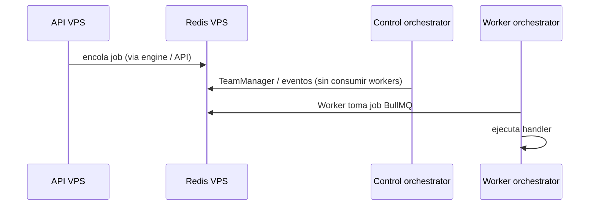

# Flujos — orchestrator distribuido

> Requiere `OPSLY_ORCHESTRATOR_ROLE` configurado; ver `docs/ARCHITECTURE-DISTRIBUTED.md` y `docs/ORCHESTRATOR.md`.

## Dónde corre cada pieza

| Pieza | Modo `control` (VPS) | Modo `worker` (Mac/remoto) |
|--------|----------------------|----------------------------|
| `TeamManager` + eventos Redis | Sí | No |
| Workers BullMQ (`cursor`, `n8n`, `notify`, …) | No | Sí |
| Health HTTP `:3011` | Sí | Sí (puerto configurable) |
| `processIntent` notify al arranque | Sí | No |

## Tipos de job (BullMQ) — referencia

Los nombres reales están en los workers (`apps/orchestrator/src/workers/*`). Ejemplos frecuentes:

| Job / área | Worker | Notas |
|-------------|--------|--------|
| `cursor` | CursorWorker | GitHub / prompts |
| `n8n` | N8nWorker | Integraciones |
| `notify` | NotifyWorker | Discord, etc. |
| `drive` | DriveWorker | Drive |
| `backup` | BackupWorker | Backups |
| Health checks tenant | HealthWorker | Sonda URLs |
| Suspension / billing | SuspensionWorker | Stripe / políticas |
| Webhooks | WebhookWorker, WebhooksProcessingWorker | Colas dedicadas |

No existe un tipo único llamado `feedback` en la tabla del orchestrator; el feedback del portal sigue rutas API (`/api/feedback`). Ajusta esta tabla si añades workers nuevos.

## Secuencia simplificada

## Escalado

- Subir **concurrencia** en un worker: editar el worker concreto (`concurrency` en `Worker` de BullMQ) o levantar **otro** proceso `worker` en otro host con el mismo `REDIS_URL`.
- No escalar el modo `control` horizontalmente sin revisar idempotencia de `TeamManager` / eventos (hoy un solo proceso `control` es lo esperado).
