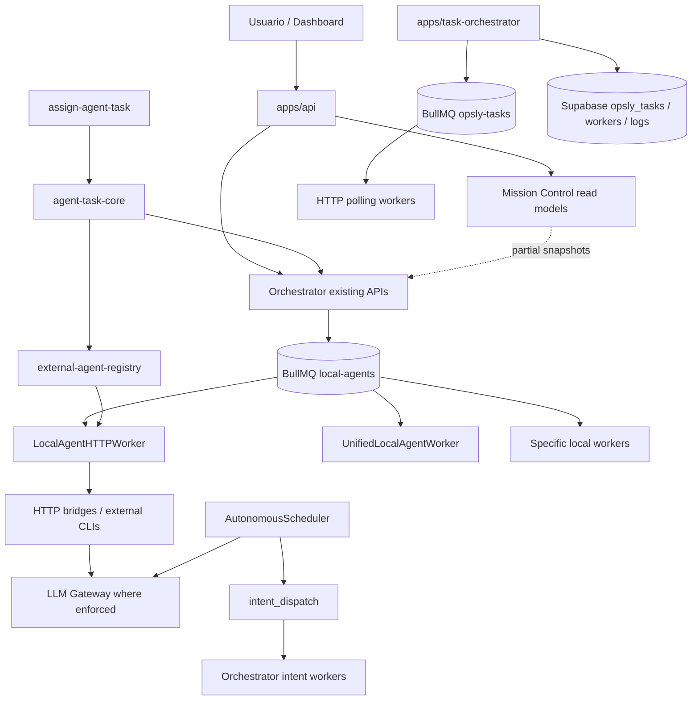
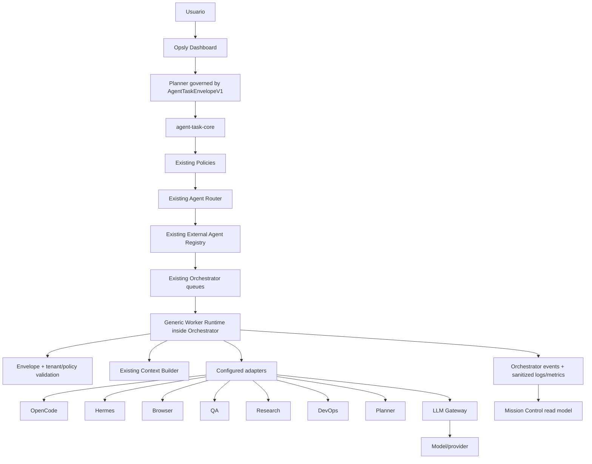

# Opsly Background Workers Audit

**Fecha:** 2026-08-02
**Rama:** `feat/opsly-reusable-core`
**Alcance:** Fase 0 únicamente. Auditoría read-only del estado de Digital Workforce / background workers.
**Cambios de código en esta fase:** ninguno.

## Veredicto

**PARTIAL_DIGITAL_WORKFORCE / READY_FOR_REVIEW**

Opsly ya tiene un núcleo real para describir, enrutar, gobernar y encolar tareas de agentes. También tiene workers BullMQ especializados, bridges HTTP locales, health checks, logs, reintentos básicos y Mission Control.

Todavía no es una Digital Workforce unificada porque:

1. no existe un `worker-runtime` genérico que consuma cualquier agente del registry mediante el contrato canónico;
2. el Planner autónomo crea `intent_dispatch`, no `AgentTaskEnvelopeV1` y subtareas gobernadas por el mismo flujo;
3. conviven varias colas y modelos de tarea incompatibles;
4. `apps/task-orchestrator` implementa otro plano de tareas, workers, polling y persistencia;
5. los workers locales existentes son adapters y clases específicas, pero no una flota gobernada por un runtime común;
6. el dashboard expone snapshots parciales, no un read model completo de fleet/task/attempt/cost/heartbeat.

No recomiendo crear otra cola, otro registry, otro router ni otra tabla en este momento.

## 1. Qué existe como código real

| Capacidad | Estado | Evidencia | Evaluación |
|---|---|---|---|
| Contrato canónico | Implementado parcial | `packages/types/src/agent-task.ts` | Zod `AgentTaskEnvelopeV1`, tenant/request/correlation, límites, modo y budget. El Orchestrator lo valida cuando llega en `agent_task`. |
| Agent Core | Implementado parcial | `lib/agent-task-core/src/` | Assign, inferencia, policy, prompt compacto y cliente HTTP. No ejecuta workers ni mantiene ciclo de vida background. |
| Agent Registry | Implementado parcial | `lib/external-agent-registry`, `config/external-agent-registry.json` | Registry validado y routing determinista. No existe registro runtime de instancias, leases, heartbeats o capacidades observadas. |
| Router | Implementado | `lib/external-agent-registry/src/task-routing.ts` | Selección determinista con fallback y reason codes. No debe duplicarse. |
| Policies | Implementado parcial | `lib/agent-task-core/src/policy.ts` | `allow`, `deny`, `require_approval`; faltan enforcement uniforme en cada worker/bridge y límites persistidos por tenant. |
| Orchestrator Client | Implementado parcial | `lib/agent-task-core/src/orchestrator-client.ts` | Dry-run y enqueue al endpoint existente. No ofrece get/cancel/retry/events como API completa de tarea. |
| Orchestrator | Implementado | `apps/orchestrator` | BullMQ, Redis, colas, workers, roles y trazabilidad base. Es el control plane que debe continuar siendo canónico. |
| Cola AgentTask | Implementado parcial | `apps/orchestrator/src/queue.ts:30-37` | `local-agents` existe, con attempts 2 y backoff exponencial. No tiene un modelo explícito de estados de Digital Workforce ni persistencia de resultados multi-día. |
| Worker HTTP unificado | Implementado parcial | `apps/orchestrator/src/workers/local-agent-http-worker.ts` | Consume `local-agents`, llama bridges HTTP y valida respuestas. Su contrato de payload todavía es más amplio/legacy que el envelope y no es adapter genérico del registry. |
| Worker runtime base | Implementado parcial | `apps/orchestrator/src/runtime/agent-task-runtime.ts` | Runtime común para una ejecución: valida envelope, aplica policy, ejecuta adapter, soporta timeout/cancelación y eventos sanitizados. Aún falta lease/heartbeat persistido, contexto y read model. |
| Workers específicos | Implementados, duplicados por familias | `apps/orchestrator/src/workers/*`, `LocalOpenCodeWorker.ts`, `UnifiedLocalAgentWorker.ts` | Hay múltiples implementaciones y rutas para agentes locales; deben quedar detrás de adapters/runtime común. |
| Heartbeat / health | Implementado parcial | `src/infra/heartbeat.ts`, `monitoring/worker-health-monitor.ts`, health servers | Hay heartbeat de servicio y monitor BullMQ; falta heartbeat de instancia de worker registrado con lease/capacity/status. |
| Retry / timeout | Implementado parcial | BullMQ queue options, `AbortSignal.timeout`, worker health monitor | Existe retry de cola y timeout HTTP; falta política unificada de retry/timeout/cancel por envelope y eventos de transición. |
| Observabilidad | Implementado parcial | `src/observability/worker-log.ts`, `job-log.ts` | Incluye tenant/request/duración en varias rutas. No existe un esquema único de ejecución/attempt/event para todas las familias. |
| Planner | Implementado parcial | `apps/orchestrator/src/schedulers/autonomous-scheduler.ts`, planner workers | Usa LLM Gateway y crea hasta tres jobs `intent_dispatch`; no descompone a subtareas `AgentTaskEnvelopeV1` ni espera/integra resultados de una misión. |
| Mission Control | Implementado parcial | `apps/admin`, `apps/api/app/api/admin/mission-control`, `apps/portal` | Tiene vistas de equipos/orchestrator/queues y nodes; el snapshot de workers es parcial y usa valores de configuración, no fleet state completo. |
| Autopilot | Implementado parcial | `scripts/start-agents-autopilot.sh`, `scripts/agents-autopilot.sh`, systemd | Arranca loop operativo y scheduler; no lee exclusivamente el registry canónico ni registra/health-checkea agentes habilitados como fleet. |
| LLM Gateway | Implementado | `apps/llm-gateway` | Existe gateway con routing/cache/budget. La cobertura de “todo bridge pasa por gateway” requiere auditoría separada; no se debe declarar cerrada por la existencia del servicio. |

## 2. Qué falta para Digital Workforce real

### 2.1 Runtime genérico

Falta una única abstracción de runtime, ubicada dentro de `apps/orchestrator` o en un módulo reusable existente, que reciba:

```text
AgentTaskEnvelopeV1
  -> validate
  -> resolve context
  -> resolve registered adapter
  -> execute with policy/timeout
  -> persist status/result
  -> emit sanitized events/metrics
```

Debe ser independiente de OpenCode, Hermes, Browser, QA o DevOps. Los agentes deben diferir únicamente por adapter y configuración del registry.

### 2.2 Estado y eventos canónicos

El contrato actual contiene modo, timeout y attempts, pero no define por sí solo el lifecycle persistido. Falta un modelo canónico de:

- `pending`, `queued`, `running`, `succeeded`, `failed`, `cancelled`, `timed_out`, `awaiting_approval`, `retrying`;
- attempt number y causa de retry;
- worker instance y lease;
- started/completed timestamps;
- resultado sanitizado y error code;
- eventos ordenados e idempotentes;
- retención y read model para Mission Control.

ADR-048 recomienda que el primer store de `AgentTaskEnvelopeV1` siga siendo BullMQ `local-agents` + estado/logs del Orchestrator, sin crear una tabla paralela ahora. Esa decisión debe convertirse en un contrato de runtime antes de añadir persistencia nueva.

### 2.3 Fleet registry runtime

`config/external-agent-registry.json` describe workers/adapters, pero no instancias vivas. Falta separar claramente:

- registry estático de agentes/adapters;
- registro efímero de worker instances;
- health/heartbeat/lease/capacity;
- disponibilidad observada;
- tenant/policy allowlist;
- versión del adapter/runtime.

No debe crearse otro registry estático. El runtime registry debe ser un estado operativo derivado del registry canónico y del heartbeat.

### 2.4 Planner gobernado

El scheduler actual solicita un plan al Gateway, pero en `autonomous-scheduler.ts:146-178` lo convierte directamente en `intent_dispatch` para tenant `platform`. Falta que el Planner:

1. reciba una intención del usuario con tenant y request/correlation IDs;
2. genere un plan validado;
3. cree subtareas mediante el mismo `assignAgentTask`/router/policy;
4. encole tareas en `local-agents` u otra cola existente según contrato;
5. espere eventos y dependencias;
6. agregue resultados sin guardar chain-of-thought;
7. detenga la misión ante aprobación requerida, budget o fallo terminal.

## 3. Duplicación detectada

### 3.1 Dos planos de tareas

#### Plano canónico recomendado

```text
AgentTaskEnvelopeV1
  -> lib/agent-task-core
  -> OrchestratorAgentTaskClient
  -> apps/orchestrator /api/local/prompt-submit
  -> BullMQ local-agents
  -> local HTTP worker / bridges
```

Evidencia: `lib/agent-task-core/src/orchestrator-client.ts`, `apps/orchestrator/src/http/routes/local.ts`, `apps/orchestrator/src/queue.ts:30-37`.

#### Plano paralelo heredado

```text
Task schema propio
  -> apps/task-orchestrator
  -> BullMQ opsly-tasks
  -> Supabase opsly_tasks / opsly_workers / opsly_task_logs
  -> worker polling HTTP
```

Evidencia: `apps/task-orchestrator/src/validation/schemas.ts`, `services/queue.ts`, `db/schema.sql`, README sección “Get Next Task”.

Este segundo plano tiene heartbeat, cancelación, logs y workers, pero no usa `AgentTaskEnvelopeV1`, el registry canónico, el router canónico ni las policies canónicas. Es la duplicación más importante.

### 3.2 Múltiples colas dentro del Orchestrator

El Orchestrator posee `openclaw`, `local-agents`, `agent-classifier`, `approval-gate` y `hermes-orchestration`. No todas son duplicadas: varias representan dominios distintos. El problema es que `local-agents`, `hermes` e `intent_dispatch` pueden parecer rutas de Workforce sin un boundary contractual común.

Recomendación: mantener las colas de dominio existentes, pero definir que las tareas de agentes del Digital Workforce entran por `AgentTaskEnvelopeV1` y que el Orchestrator decide la cola interna. No crear una cola `worker-runtime` adicional sin demostrar una necesidad de aislamiento.

### 3.3 Múltiples implementaciones de worker local

Existen `LocalAgentHTTPWorker`, `UnifiedLocalAgentWorker`, `LocalOpenCodeWorker`, `LocalClaudeWorker`, `LocalCursorWorker`, `LocalCopilotWorker` y otros workers especializados. Eso es parte histórica del sistema, no evidencia de adapters homogéneos.

No eliminar todavía: `apps/orchestrator/src/index.ts:115-119` muestra que algunos pueden arrancar simultáneamente y hay flags de compatibilidad. Primero debe existir una matriz de consumidores, colas, jobs y despliegues; luego migración gradual a runtime/adapters.

## 4. Qué puede reutilizarse inmediatamente

1. `AgentTaskEnvelopeV1` como único contrato de tarea.
2. `lib/agent-task-core` para assign, policy y cliente.
3. `lib/external-agent-registry` y `config/external-agent-registry.json` como único registry estático.
4. `routeAgentTask()` como único router.
5. `apps/orchestrator` como control plane y `local-agents` como cola inicial.
6. `create-worker.ts` y `worker-log.ts` como piezas de lifecycle/logging, extendiéndolas sin convertirlas en otro framework.
7. `local-agent-http-worker.ts` como primer host de runtime/adapters, si se desacopla la lógica de resolución/ejecución.
8. `WorkerHealthMonitor` y `recordOrchestratorHeartbeat` como infraestructura existente, con contrato de heartbeat de instancia.
9. `apps/llm-gateway` como único camino de modelo.
10. Mission Control existente como read model/UI, ampliándolo con datos canónicos del Orchestrator.
11. `config/tenants/academy-demo.json` para pruebas tenant-aware sin tocar Peskids.

## 5. Qué debe eliminarse o pasar a deprecación

No debe hacerse un borrado inmediato. La ruta correcta es deprecación verificable:

| Candidato | Acción recomendada | Condición antes de retirar |
|---|---|---|
| `apps/task-orchestrator` como plano AgentTask | Marcar legacy y congelar nuevas features | Inventario de consumidores, migración de endpoints/DB o prueba de que no tiene consumidores reales |
| `opsly-tasks` para AgentTaskEnvelope | No usar para tareas nuevas | Todos los nuevos jobs pasan por Orchestrator/`local-agents` |
| `opsly_tasks` / `opsly_workers` como store del Workforce | No ampliar schema | Runbook de migración y evidencia de retención/consumidores |
| `scripts/assign-agent-task.ts/.mjs` como lógica | Mantener solo compatibilidad | Ya delegan al core; no añadir routing allí |
| Workers locales específicos con lifecycle duplicado | Migrar a adapters sobre runtime | Cobertura equivalente, dual-run controlado y rollback |
| polling HTTP documentado en `apps/task-orchestrator/README.md` | No adoptar para Workforce | Sustituir por consumo BullMQ/lease si ese dominio se migra |

“Eliminar” aquí significa retirar código después de medir consumidores y completar migración; no borrar en esta auditoría.

## 6. Diagrama actual



## 7. Arquitectura objetivo sin framework paralelo



Properties required by the target:

- one envelope, router, registry, policy and skills system;
- one control plane: Orchestrator;
- one runtime abstraction; adapters are configuration-backed;
- queue-backed execution, never synchronous dashboard execution;
- tenant/request/correlation propagation end-to-end;
- explicit approval for writes, browser, network, infrastructure and production;
- no secrets or private chain-of-thought in task/event records;
- no automatic PR merge/deploy.

## 8. Fase 1 design — Worker Runtime, without implementation

Proposed boundary inside the existing Orchestrator:

```text
WorkerRuntime
  register(instance)
  heartbeat(instance)
  claim(task)
  execute(task)
  cancel(task)
  shutdown()

WorkerAdapter
  supports(agent registry entry)
  health()
  execute(envelope, context)
  cancel(request_id)
```

The runtime owns lifecycle, state transitions, lease/heartbeat, timeout, retry, cancellation, event emission and sanitized results. The adapter owns only translation to the external agent bridge/CLI.

The runtime must not:

- select agents independently of the existing router;
- create envelopes independently of `AgentTaskEnvelopeV1`;
- call model providers directly;
- introduce a new queue or registry;
- embed tenant-specific logic.

## 9. Fase 2 queue/state design, without implementation

The first implementation should use existing BullMQ and Redis. The task identity remains `request_id`; `correlation_id` and `tenant_slug` must be part of the job payload and every event.

Required state mapping:

```text
pending -> queued -> running -> completed
                         |-> failed -> retrying -> queued
                         |-> timeout
                         |-> cancelled
                         |-> approval_required
```

BullMQ native states can remain internal, but the external read model must expose the canonical states above. This avoids adding a second persistence system before retention requirements are proven.

## 10. Test gaps

Existing tests prove pieces, not the Workforce lifecycle:

- Agent Core and registry tests exist.
- Orchestrator has queue, local prompt, worker lifecycle and health tests.
- `apps/task-orchestrator` has queue/schema tests for its own model.

Missing acceptance tests for the target:

1. one `AgentTaskEnvelopeV1` travels Planner → queue → runtime → adapter → event;
2. invalid envelope is rejected before adapter execution;
3. tenant/correlation/request isolation across two tenants;
4. retry and timeout emit ordered events and preserve attempt count;
5. cancellation stops an in-flight adapter;
6. disabled/unhealthy registry entry is not started or selected;
7. adapter failure uses configured fallback without bypassing policy;
8. Planner creates bounded subtasks and waits for their terminal states;
9. no secret/chain-of-thought appears in logs/results;
10. Mission Control reads real queue/worker state rather than static concurrency snapshots.

## 11. Cuello de botella prioritario

**PR-1 debe completar la frontera canónica de ejecución: `AgentTaskEnvelopeV1` → `local-agents` → Worker Runtime → adapter.**

No empezar por siete adapters, dashboard o nuevas tablas. Sin esta frontera, cada adapter perpetúa el problema actual y el Planner seguiría creando una ruta paralela mediante `intent_dispatch`.

## 12. PR recomendado

### PR-BG-1 — Canonical Worker Runtime boundary (slice iniciado)

Alcance único:

- especificar el runtime/adapters como interfaces internas del Orchestrator;
- aceptar únicamente `AgentTaskEnvelopeV1` en el nuevo path del worker;
- reutilizar `local-agents`, registry, router, policies y `worker-log`;
- definir lifecycle/event schema sin añadir tabla ni cola;
- adaptar un solo agente de bajo riesgo, preferiblemente `mock_agent` o OpenCode en dry-run;
- tests unitarios, queue, health y runtime con adapter fake;
- documentación `WORKER-RUNTIME.md` y ADR si cambia una frontera pública.

Fuera de alcance:

- Planner completo;
- dashboard nuevo;
- migración de `apps/task-orchestrator`;
- Hermes/Browser/DevOps adapters adicionales;
- deploy, merge o producción.

Aceptación:

- el runtime es importable dentro de `apps/orchestrator`;
- no existe segundo envelope/router/registry/policy;
- un job válido ejecuta un adapter fake y produce eventos sanitizados;
- timeout/retry/cancel están cubiertos;
- `tenant_slug`, `request_id`, `correlation_id` llegan a logs y resultado;
- los tests de Orchestrator existentes siguen pasando.

## 13. Riesgos

| Riesgo | Impacto | Mitigación |
|---|---|---|
| Migrar `apps/task-orchestrator` demasiado pronto | Romper consumidores desconocidos | Inventario de imports, rutas, compose, DB y despliegues antes de retirar |
| Arrancar todos los modelos | Coste y presión de RAM | Registry `enabled` + health/availability; adapters lazy y no spawn si no hay tarea |
| Planner crea tareas ilimitadas | Coste, cola saturada, acciones no deseadas | Máximo de subtareas, budget, deadline, approval y policy antes de enqueue |
| Bridges bypass del Gateway | Pérdida de control de coste/trazabilidad | Gate de configuración y auditoría de llamadas; no declarar cumplimiento sin evidencia |
| Reintentos duplican side effects | Daño operativo | Idempotency key, lease, cancelación cooperativa y policies de write |
| Logs contienen prompts sensibles | Riesgo de privacidad | Resultados resumidos/sanitizados; no chain-of-thought ni secretos |
| Dashboard muestra estado falso | Decisiones incorrectas | Leer estado real del Orchestrator/Redis y marcar snapshots degradados |
| Peskids afectado por cambios core | Riesgo productivo | Fixture `academy-demo`, dry-run, PR pequeño y no tocar rutas tenant |

## 14. Preguntas bloqueantes reales

1. ¿`apps/task-orchestrator` tiene consumidores activos fuera del monorepo o puede entrar en deprecación formal?
2. ¿La retención requerida para Mission Control supera el TTL/estado actual de Redis? Si sí, ¿qué duración y qué datos deben persistirse?
3. ¿El primer adapter real del runtime será OpenCode o un adapter fake/mock para cerrar el lifecycle sin consumo de modelos?
4. ¿La generación automática de PR es una capacidad del Orchestrator existente y requiere aprobación antes de crear la rama/PR, o solo antes de merge?
5. ¿Qué tenants pueden usar background workers y cuál es el budget/limite de concurrencia por tenant?

## 15. Estado final

**READY_FOR_REVIEW** — runtime base conectado a `local-agents`; falta completar lease/heartbeat, Planner fan-out y read model.

Fase 0 completada. No se escribió código de runtime, no se creó una cola nueva, no se desplegó, no se hizo merge y no se tocó Peskids.
