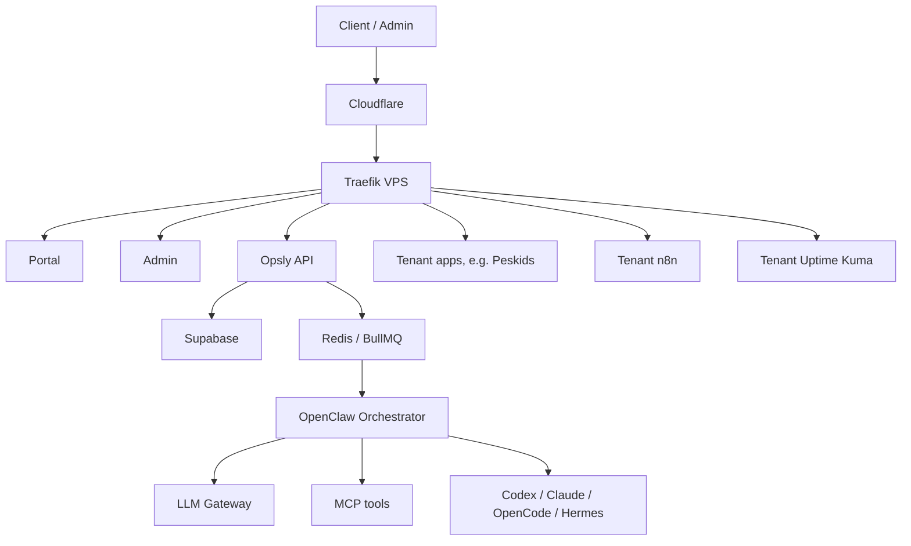
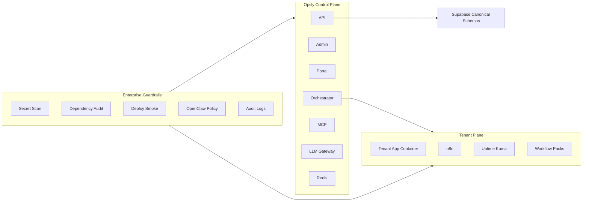

# Opsly Enterprise Hardening Blueprint

Status: draft generated with The Architect on 2026-05-21.

## 1. Goal

Move Opsly from working production pilot to enterprise-ready automation platform while preserving the current operating model:

- VPS Docker Compose control plane.
- Traefik on `op-sly.com`.
- Supabase platform data.
- Tenant stacks with n8n and Uptime Kuma.
- OpenClaw, MCP, LLM Gateway, local agents, and Mission Control.

## 2. Current Architecture

## 3. Risk Themes From Cyber Neo

| Theme | Current Signal | Target State |
| --- | --- | --- |
| Secret hygiene | 47 potential findings | No real secrets in tracked docs/scripts |
| Package manager ambiguity | npm lock exists, pnpm workspace exists | One canonical package manager |
| Dependency risk | 7 prod audit findings | Upgrade plan per package family |
| Tenant app schema drift | Peskids app had old local schema assumptions | All tenant writes use canonical Opsly APIs |
| Deployment reproducibility | Some apps missing lockfiles | Every deployable app has lockfile/build smoke |

## 4. Target Architecture

## 5. Enterprise Build Order

1. **Secret hygiene gate**
   - Add a redacted Cyber Neo scan script.
   - Fail CI only on tracked critical/high findings after allowlist review.
   - Keep raw scan artifacts out of git and chat.

2. **Package manager decision**
   - If npm remains canonical, remove or justify `pnpm-workspace.yaml`.
   - If pnpm becomes canonical, generate and commit `pnpm-lock.yaml`, then update CI/deploy.

3. **Dependency remediation**
   - Split updates by family: Next/PostCSS, ws, langsmith, llamaindex.
   - Test each with app-specific builds.
   - Avoid `npm audit fix --force` across the monorepo.

4. **Tenant app template**
   - Standardize every tenant app on:
     - `Dockerfile`
     - `.dockerignore`
     - lockfile
     - healthcheck
     - Traefik router
     - smoke script
     - canonical Opsly API writes

5. **Mission Control integration**
   - Show per-tenant:
     - app status
     - n8n status
     - uptime status
     - last smoke result
     - workflow pack status
     - security scan status

6. **OpenClaw automation**
   - Add jobs for:
     - `tenant.smoke`
     - `tenant.security_scan`
     - `tenant.workflow_import_dry_run`
     - `tenant.backup_export`
   - Require explicit approval before destructive or paid-provider actions.

7. **Customer-ready packaging**
   - Create a default "Automation CRM" tenant pack.
   - Include lead capture, feedback, follow-up reminders, daily digest, uptime, and owner dashboard.

## 6. Security Model

- Secrets live only in Doppler, VPS env files, or provider dashboards.
- `.env*` remains ignored.
- Public tenant endpoints validate payloads and apply rate limits.
- Owner/admin endpoints require trusted session or API gateway key.
- Agent execution remains internal; no raw terminal exposed to tenant users.
- n8n workflow activation is explicit until credentials and notification channels are verified.

## 7. Testing Matrix

| Layer | Required Check |
| --- | --- |
| API | `npm run type-check --workspace=@intcloudsysops/api` |
| Skills | `npm run validate-skills` |
| OpenAPI | `npm run validate-openapi` |
| Tenant app | `npm run build --workspace=<tenant-app>` |
| Prod smoke | API health, tenant app root, public POST lead/feedback |
| Security | Cyber Neo summary scan, npm audit summary |

## 8. First Implementation Slice

Recommended next slice:

1. Add `scripts/security/cyber-neo-summary.sh`.
2. Add `scripts/security/npm-audit-summary.mjs`.
3. Add `scripts/tenant-smoke-peskids.sh` for `peskids.op-sly.com`.
4. Wire these into Mission Control as read-only status cards.
5. Create issues for dependency remediation, not one giant upgrade.

## 9. Non-Negotiables

- No Vercel dependency for current Peskids production test.
- No raw secrets in reports.
- No `npm audit fix --force` without isolated branch and app smoke.
- No direct tenant shell access from the public portal.
- No second orchestration system parallel to OpenClaw.

---

## Enlaces relacionados

- [[brain/README|brain]]
- [[brain/README|Brain Central]]
