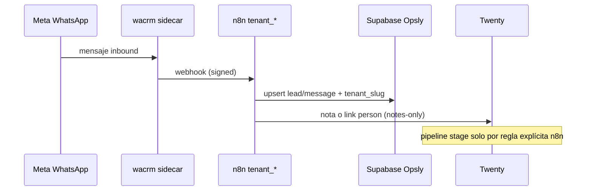

# wacrm + Twenty — contrato híbrido (WhatsApp + CRM)

**Regla:** un dueño por dato. wacrm **no** reemplaza Twenty. Twenty **no** es inbox WhatsApp.

## División de responsabilidades

| Sistema | Dueño de | Prohibido |
|---------|----------|-----------|
| **wacrm** (sidecar opcional) | Inbox WA, hilos, asignación agentes, UI atención, envío/recibo Meta Cloud API | Pipeline comercial, etapas de deal, fuente maestra de leads |
| **Twenty** | Personas, oportunidades, pipeline, etapa comercial | Copia de mensajes WA línea por línea (usar nota/resumen) |
| **Supabase Opsly** | `platform.leads`, mensajes operativos, `tenant_slug`, auditoría | Espejar DB interna de wacrm |
| **n8n** | Webhook wacrm → evento → upsert Supabase → nota Twenty | Lógica de negocio duplicada en app |

## Flujo canónico

## Sincronización Twenty (modos)

| Modo | Cuándo | Qué hace n8n |
|------|--------|----------------|
| `none` | Piloto solo inbox | Solo Supabase |
| `notes-only` | **Default recomendado** | Crea/actualiza Person; nota con resumen + `wa_thread_id` |
| `person-link` | Tras validar phone match | Igual + `twenty_person_id` en Supabase |

**No usar** el pipeline Kanban interno de wacrm en producción Opsly.

## Flags por tenant (Doppler)

| Variable | Default | Descripción |
|----------|---------|-------------|
| `WACRM_PESKIDS_ENABLED` | `false` | Activa integración wacrm Peskids |
| `WACRM_PESKIDS_SERVER_URL` | — | URL pública sidecar (`https://wa-peskids.op-sly.com`) |
| `WACRM_PESKIDS_WEBHOOK_SECRET` | — | HMAC n8n ↔ wacrm |
| `WACRM_PESKIDS_SYNC_TWENTY` | `notes-only` | Modo sync Twenty |
| `WACRM_INTCLOUDSYSOPS_*` | igual | ICSO / agency tenants |

Convive con Twenty (`PESKIDS_TWENTY_ENABLED`) y **excluye** uso simultáneo como proveedor WA primario con Jelou/OpenWA salvo ADR.

## Coexistencia con Jelou / OpenWA

| Proveedor | Estado en repo | Con wacrm |
|-----------|----------------|-----------|
| Jelou | Webhook Peskids legacy | **Uno activo:** `WACRM_*_ENABLED=true` → no auto-send Jelou |
| OpenWA | Sidecar `lib/openwa` | Mismo slot; elegir por flag + ADR |
| Meta directo | Documentado en WHATSAPP-CHANNEL | wacrm ya usa Cloud API |

## Activación (orden)

1. Twenty estable (`bootstrap-twenty.sh`, smoke CRM)
2. `./scripts/tenants/bootstrap-wacrm.sh --tenant peskids --dry-run`
3. Meta Business + número del cliente
4. wacrm sidecar + webhook → n8n
5. `./scripts/tenants/wacrm-smoke.sh --tenant peskids`
6. `WACRM_*_ENABLED=true` solo tras smoke verde

## Referencias

- **Peskids piloto (cutover):** `docs/tenants/peskids/WACRM-TWENTY-CUTOVER.md`
- **ICSO paquete reusable:** `docs/tenants/intcloudsysops/WHATSAPP-FIRST-PACKAGE.md`
- Patrón: `config/patterns/opsly/wacrm-channel.json`
- Peskids WA policy: `docs/tenants/peskids/WHATSAPP-CHANNEL.md`
- Peskids wacrm ops: `docs/tenants/peskids/WACRM-CHANNEL.md`
- ICSO oferta: `docs/tenants/intcloudsysops/WACRM-OFFERING.md`
- Twenty cutover: `docs/blueprints/TWENTY-CRM-CUTOVER-CHECKLIST.md`
