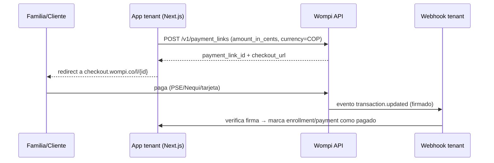

# Wompi (Colombia) — contrato de pasarela de pagos

**Regla:** Wompi **coexiste** con Stripe, no lo reemplaza. La familia elige el proveedor en el checkout; el tenant elige cuáles habilitar.

## División de responsabilidades

| Sistema | Dueño de | Prohibido |
|---------|----------|-----------|
| **Stripe** | Pagos internacionales con tarjeta | — |
| **Wompi** (Bancolombia) | Pagos locales Colombia: PSE, Nequi, tarjetas locales | Reemplazar Stripe sin decisión explícita del tenant |
| **Módulo `@intcloudsysops/wompi-gateway`** | Cliente HTTP genérico + verificación de firma de webhook | Lógica de negocio específica de cada app (eso vive en `apps/*/lib/services/`) |
| **`apps/<tenant>/lib/services/*-payment.service.ts`** | Tablas de negocio (enrollments, payments) por tenant | Duplicar el algoritmo de firma o las URLs base de Wompi |

## Flujo canónico (payment links)

## Verificación de firma (obligatorio, no opcional)

SHA256 de la concatenación de: valores de `signature.properties` (dot-paths dentro de `data`, **en el orden dado — nunca hardcodear cuáles propiedades esperar**, Wompi documenta que la lista puede variar por tipo de evento) + `timestamp` + el secreto de eventos del comercio. Comparar contra `signature.checksum`.

Implementado en `lib/wompi-gateway/src/client.ts` → `verifyWompiWebhookSignature()`. No reimplementar por tenant.

## Flags por tenant (Doppler)

| Variable | Default | Descripción |
|----------|---------|-------------|
| `WOMPI_{SLUG}_ENABLED` | `false` | Activa Wompi para ese tenant |
| `WOMPI_{SLUG}_PRIVATE_KEY` | — | `prv_test_...` / `prv_prod_...` — el prefijo decide sandbox vs producción, no hace falta variable de entorno aparte |
| `WOMPI_{SLUG}_PUBLIC_KEY` | — | Para widgets client-side si se usan a futuro |
| `WOMPI_{SLUG}_EVENTS_SECRET` | — | Secreto de eventos del dashboard Wompi, para verificar webhooks |

Ejemplo Peskids: `WOMPI_PESKIDS_ENABLED`, `WOMPI_PESKIDS_PRIVATE_KEY`, etc.

## Pendiente de verificación en vivo (antes de producción)

⚠️ `markEnrollmentPaidFromWompi` (en cada app tenant) enlaza el enrollment con la transacción entrante buscando `transaction.payment_link_id` (con fallback a `transaction.reference`) contra el `payment_link_id` guardado al crear el checkout. **Confirmar contra una transacción real de sandbox** que `payment_link_id` efectivamente viene en el payload antes de activar `WOMPI_{SLUG}_ENABLED=true` en producción — no se pudo verificar el shape exacto de una transacción originada desde un payment link sin acceso a la documentación completa en este entorno.

## Coexistencia con Stripe

No hay conflicto: cada `class_enrollments`/`payments` row tiene su propio `payment_provider`/`provider` (`'stripe' | 'wompi'`). El checkout (`POST /api/payments/checkout`) recibe `provider` en el body; default `'stripe'` si no se especifica, así ningún tenant existente cambia de comportamiento sin pedirlo.

## Activación (orden)

1. Crear comercio en Wompi (Bancolombia), obtener llaves sandbox (`prv_test_...`)
2. `WOMPI_{SLUG}_ENABLED=true` + llaves en Doppler (sandbox primero)
3. Probar un payment link + pago simulado en sandbox
4. Configurar el webhook de eventos en el dashboard Wompi apuntando a `/api/webhooks/wompi` del tenant
5. **Confirmar el shape real del evento `transaction.updated`** (ver pendiente arriba)
6. Cambiar a llaves `prv_prod_...` solo tras smoke verde en sandbox

## Referencias

- Módulo: `lib/wompi-gateway/` (`@intcloudsysops/wompi-gateway`)
- Patrón: `config/patterns/opsly/wompi-gateway.json`
- Registro: `config/modules.json` → `wompi-gateway`
- Implementación piloto: `apps/peskids/lib/services/wompi-payment.service.ts`
- Documentación oficial: [Wompi Docs — Eventos](https://docs.wompi.co/en/docs/colombia/eventos/), [Links de pago](https://docs.wompi.co/en/docs/colombia/links-de-pago/)
