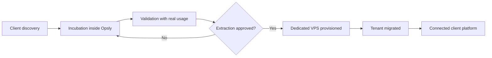

# Opsly Operational Blueprint - Client Incubation Template

Reusable template for onboarding a new client into Opsly, validating the MVP inside the Opsly control plane, and extracting to a dedicated client-owned platform when the business case is proven. This is the canonical starting point for future client platforms; Peskids is the reference pilot that validates it.

## Intended Use

Use this template for every new client that should follow the same incubation model as Peskids:

1. Incubate inside Opsly.
2. Validate with real usage.
3. Extract only after owner approval and business value proof.
4. Provision a dedicated VPS and client-owned stack.
5. Keep Opsly as control plane, governance, and agent coordinator.

## What is reusable

- Tenant lifecycle stages.
- Staff invite flows.
- Client Google sign-in.
- Approval-first AI flows.
- Lead / feedback / follow-up workflow patterns.
- Provisioning standard for dedicated VPS.
- Migration checklist and rollback procedure.
- Trust and ownership boundaries.

## What must change per client

- Tenant slug.
- Domain and public URLs.
- Brand, content, and visual identity.
- Roles and staff roster.
- Integrations and credentials.
- Data model extensions.
- Commercial package and support scope.

## Lifecycle

### Stage 1 - Discovery

- Define the business problem.
- Confirm the owner.
- Confirm the tenant slug and public brand.
- Confirm the first workflow and the first approval point.

### Stage 2 - Incubation

- Tenant runs inside Opsly infrastructure.
- Shared control plane and shared observability.
- Shared templates and automation catalog.
- Fast iteration, but with tenant isolation.

### Stage 3 - Validation

- Real leads, real feedback, real operational metrics.
- Owner reviews the dashboard and the automation output.
- AI can prepare drafts, but humans approve outward actions.

### Stage 4 - Extraction Candidate

- Usage is stable.
- Business value is proven.
- Owner approves extraction.
- Migration checklist is complete.

### Stage 5 - Dedicated VPS Provisioning

- Ubuntu LTS.
- Docker Compose.
- Traefik.
- n8n.
- Uptime Kuma.
- Opsly agent runtime.
- Backups and monitoring.

### Stage 6 - Tenant Migration

- Move app, workflows, data, and configs.
- Do not move Opsly core or shared control plane.
- Cut over only after validation and rollback are ready.

### Stage 7 - Connected Client Platform

- Client owns VPS, domain, database, integrations, and data.
- Opsly keeps governance, templates, monitoring, and agent coordination.

## Role split

### Internal staff

- Admin, support, professors, operators.
- Invite-only access.
- Passkey or MFA encouraged.

### Clients and families

- Google sign-in or client-approved login.
- Tenant-scoped data only.
- No access to internal control plane routes.

## Security baseline

- Zero-trust backend checks.
- Tenant slug must match session.
- Role must match route.
- Public routes must be rate limited.
- No secrets in repo or frontend.
- All approvals must be logged.

## Deliverables for each client

- Tenant README.
- Brand and workflow package.
- Invitation and auth rules.
- Provisioning standard.
- Migration checklist.
- Client handoff runbook.

## Exit criteria

- Owner can use the system without Opsly explaining every step.
- The client can own the domain and credentials.
- The client can operate during an Opsly outage.
- Rollback has been tested.

## Reference pilot

Peskids is the reference pilot for this template. Future clients should reuse the same lifecycle, role split, and migration rules instead of inventing a new one.

---

## Enlaces relacionados

- [[blueprints/opsly-operational-blueprint/README|opsly-operational-blueprint]]
- [[brain/README|Brain Central]]
