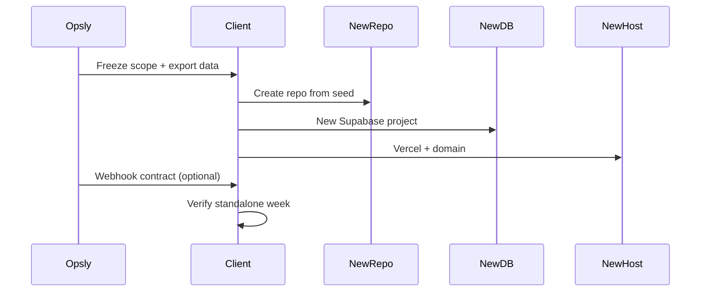

# Opsly Operational Blueprint — Extraction Pattern

Cómo sacar un tenant incubado a **plataforma independiente** sin romper al cliente ni a Opsly.

## Principio

> El cliente debe poder operar **si Opsly está caído**. Opsly pasa a ser opcional.

## Fases de extracción



## Paso 1 — Congelar alcance

- Lista de workflows que **migran** vs **se rehacen**.
- Congelar cambios en tenant Opsly salvo hotfix.
- Fecha de cutover acordada.

## Paso 2 — Repo independiente

**Copiar solo:**

- Docs: MVP, DATA-MODEL, WORKFLOWS, política IA.
- Plantillas: forms, emails, report HTML.
- Componentes UI **genéricos** (sin secretos Opsly).
- `package.json` mínimo Next si aplica.

**No copiar:**

- `.env`, tokens Doppler, `config/tenants/*.json` con credenciales.
- Código orchestrator/MCP/BullMQ.
- Migraciones `platform.*` del monorepo Opsly.

Plantilla orientativa: `docs/tenants/<slug>/FUTURE-REPO-SEED.md` (ej. peskids).

## Paso 3 — Base de datos propia

1. Crear proyecto Supabase (cuenta **cliente**).
2. Migrar schema **tenant** (no platform multi-tenant).
3. Importar datos exportados (CSV o pg_restore acotado).
4. Configurar RLS por rol cliente.
5. Rotar **todas** las keys; no reutilizar service role de Opsly.

## Paso 4 — Hosting y dominio

| Recurso | Owner |
|---------|-------|
| Dominio DNS | Cliente |
| Vercel / hosting app | Cliente |
| n8n (si aplica) | Cliente VPS o n8n Cloud |
| WhatsApp / Meta | Cliente |

## Paso 5 — Contrato API / webhooks (opcional)

Si el cliente quiere seguir conectado a Opsly:

```yaml
# Ejemplo conceptual — no implementar en runtime sin ADR
events:
  - lead.created
  - feedback.submitted
  - report.weekly.generated
delivery:
  method: HTTPS webhook
  auth: HMAC shared secret (cliente rota)
  retry: 3 with backoff
```

**Opsly no** debe ser dependencia en el path crítico del negocio.

## Paso 6 — Verificación “Opsly down”

Durante 5–7 días:

- [ ] Leads entran sin Opsly.
- [ ] Staff responde feedback sin Opsly.
- [ ] Reportes se generan (aunque sea manual).
- [ ] Dominio y SSL del cliente OK.
- [ ] Backups del nuevo Supabase configurados.

## Paso 7 — Decommission en Opsly

Solo tras sign-off cliente:

1. Export final archivado (cliente guarda copia).
2. Suspender stack `tenant_<slug>` (no borrar día 1).
3. Retirar DNS si apuntaba a Opsly.
4. Actualizar inventario `docs/tenants/`.

## Riesgos y mitigaciones

| Riesgo | Mitigación |
|--------|------------|
| Pérdida de datos | Export doble + ventana paralela |
| Webhooks rotos | Lista de integraciones + prueba |
| Lock-in n8n | Export JSON workflows |
| IA enviando solo | Política approval-first desde día 1 |

## Post-extracción: Connected Client

- Métricas agregadas vía webhook read-only.
- Soporte Opsly como **servicio**, no runtime obligatorio.

Ver [TENANT-INCUBATION.md](./TENANT-INCUBATION.md) etapa **Connected Client Platform**.

---

## Enlaces relacionados

- [[blueprints/opsly-operational-blueprint/README|opsly-operational-blueprint]]
- [[brain/README|Brain Central]]
