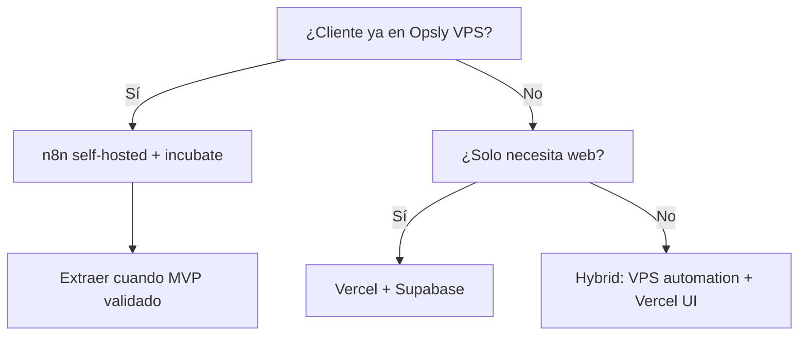

# Opsly Operational Blueprint — Provider Matrix

Guía de elección. **No** hay un solo proveedor obligatorio.

## Hosting / frontend

### Vercel vs VPS (DigitalOcean)

| | Vercel | VPS Opsly |
|--|--------|-----------|
| **Cuándo usar** | App Next.js, previews PR, PyME sin ops | n8n + uptime por tenant ya en Opsly |
| **Cuándo no** | n8n pesado 24/7, procesos bash | Equipo sin capacidad mantener VPS |
| **Lock-in** | Medio (features Vercel) | Bajo (Docker estándar) |
| **Costo** | Bajo–medio por tráfico | ~$12–50/mes fijo orientativo |
| **Migración** | Export Next → otro Node host | `docker compose` a otro VPS |

**Default incubación:** VPS para n8n; Vercel post-extracción para producto.

---

## Database

### Supabase vs Postgres custom

| | Supabase | Postgres (Neon/DO/RDS) |
|--|----------|------------------------|
| **Cuándo usar** | MVP rápido, Auth+RLS integrado | Control total, compliance específico |
| **Cuándo no** | Región no disponible | Sin tiempo para operar DB |
| **Lock-in** | Medio (Auth+Storage) | Bajo |
| **Costo** | Free tier → escala | Variable |
| **Migración** | pg_dump, export Auth planificado | Estándar SQL |

---

## Automation

### n8n self-hosted vs n8n Cloud

| | Self-hosted (VPS) | n8n Cloud |
|--|-------------------|-----------|
| **Cuándo usar** | Ya en Opsly tenant stack | Cliente sin VPS, poco volumen |
| **Cuándo no** | Sin admin | Muchos workflows críticos sin export |
| **Lock-in** | Bajo (JSON export) | Medio |
| **Costo** | Infra compartida | Suscripción n8n |
| **Migración** | Export workflows JSON | Export + reimport |

---

## Conversational

### Jelou vs WhatsApp Cloud API vs GoHighLevel

| | Jelou | Meta Cloud API | GoHighLevel |
|--|-------|----------------|-------------|
| **Cuándo usar** | LATAM, operación delegada | Control directo Meta | Marketing agencies US |
| **Cuándo no** | Presupuesto muy bajo | Sin bandwidth compliance | Quieren stack mínimo |
| **Lock-in** | Medio–alto | Medio | Alto |
| **Costo** | Por conversación + fee | Meta pricing | SaaS mensual |
| **Migración** | Export contactos, templates | Número + templates Meta | Difícil; evitar si posible |

**MVP:** WhatsApp manual; API solo post-approval policy.

---

## AI

### OpenAI vs Claude vs Ollama

| | OpenAI | Claude | Ollama (local) |
|--|--------|--------|----------------|
| **Cuándo usar** | General, tools ecosystem | Documentos largos | Costo $0, tareas simples |
| **Cuándo no** | Solo local air-gap | Presupuesto ultra bajo sin GPU | Calidad crítica sin fallback |
| **Lock-in** | Bajo (API estándar) | Bajo | Bajo |
| **Costo** | Por token | Por token | Hardware existente |
| **Migración** | Cambiar endpoint en gateway | Idem | Model swap |

**Opsly:** LLM Gateway unifica; ver `apps/llm-gateway`.

---

## Payments

### Wompi / Mercado Pago / Stripe

| | Wompi / MP (LATAM) | Stripe |
|--|-------------------|--------|
| **Cuándo usar** | Colombia/LATAM local | Global, suscripciones SaaS |
| **Cuándo no** | Solo US/EU | Sin soporte país cliente |
| **Lock-in** | Medio | Medio |
| **Costo** | % transacción | % + fees |
| **Migración** | Export clientes, nuevo checkout | Stripe export + PCI scope |

**MVP:** a menudo **fuera** de alcance; manual o link de pago.

---

## Email / workspace

### Google Workspace vs Gmail básico

| | Workspace | Gmail free / forwarding |
|--|-----------|-------------------------|
| **Cuándo usar** | Equipo 2+, dominio propio | Solopreneur |
| **Cuándo no** | Costo fijo molesto | Necesidad SLA email |
| **Lock-in** | Bajo | Bajo |
| **Costo** | ~$6/user/mes | $0 |
| **Migración** | MX records | Cambiar MX |

---

## Matriz de decisión rápida

## Regla de oro

Documentar en el tenant **qué proveedor usa cada capa** y **cómo salir** en una página. Actualizar al cambiar proveedor.
