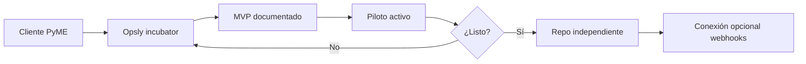

# Opsly Operational Blueprint

Blueprint operativo reutilizable para **pequeños negocios**, **incubación de clientes** y **futuras plataformas independientes** en Opsly. No es un producto terminado ni un clon de blueprints enterprise de Google Cloud.

## Qué es

Un conjunto de **principios, capas, módulos y patrones** que el equipo Opsly usa para:

- Diseñar operaciones digitales **simples y modulares**
- Incubar tenants (p. ej. Peskids) dentro de Opsly con trazabilidad
- Extraer después un **producto independiente** sin rehacer todo desde cero
- Elegir proveedores con **bajo lock-in** y costos acotados
- Repetir el mismo modelo para más clientes sin reescribir la arquitectura

Inspiración de buenas prácticas (seguridad, observabilidad, confiabilidad, modularidad, documentación) — **no** copiar arquitecturas enterprise ni landing zones multi-cuenta.

## Qué NO es

| No es | Por qué |
|-------|---------|
| Catálogo de servicios GCP/AWS | Opsly no vende infra hyperscaler |
| SaaS multi-tenant cerrado | El cliente debe poder salir con sus datos |
| Framework de código obligatorio | Evita acoplar runtime Opsly al negocio del cliente |
| Pack de Terraform enterprise | Demasiado pesado para PyMEs |
| Promesa de “IA autónoma” | Política **approval-first** |
| Sustituto de contrato legal/comercial | Ver [COMMERCIAL-PACKAGES.md](./COMMERCIAL-PACKAGES.md) como orientación |

## Diferencia vs blueprints enterprise (Google y similares)

| Enterprise (inspiración) | Opsly Blueprint (adaptación) |
|--------------------------|------------------------------|
| Landing zones, org policies | Checklist de dueño de cuentas y permisos mínimos |
| SLOs multi-región | Uptime Kuma + health URLs + reporte semanal |
| Service mesh | Traefik + compose por tenant; sin mesh |
| 50 microservicios | n8n + API + dashboard; pocos componentes |
| Equipo platform 24/7 | Operación lean; humano en el loop |
| Billing unificado cloud | Pass-through de herramientas + paquete Opsly claro |

## Cómo apoya incubación y extracción

1. **Incubar** — tenant con stack aislado, workflows y docs en `docs/tenants/<slug>/`
2. **Validar** — MVP, checklist, smoke sin tocar core Opsly
3. **Extraer** — copiar módulos/docs seguros; Supabase y dominio propios
4. **Conectar** — eventos opcionales hacia Opsly (metering, soporte)

Peskids es el **piloto de referencia** que valida este blueprint. Las futuras plataformas no deben inventar un modelo nuevo: deben partir de la [CLIENT-INCUBATION-TEMPLATE.md](./CLIENT-INCUBATION-TEMPLATE.md) y solo cambiar lo específico del cliente.

## Mapa del blueprint

| Documento | Contenido |
|-----------|-----------|
| [PRINCIPLES.md](./PRINCIPLES.md) | Reglas de diseño |
| [REFERENCE-ARCHITECTURE.md](./REFERENCE-ARCHITECTURE.md) | Capas y diagramas |
| [MODULES.md](./MODULES.md) | Módulos reutilizables |
| [PROVIDER-MATRIX.md](./PROVIDER-MATRIX.md) | Elección de proveedores |
| [TENANT-INCUBATION.md](./TENANT-INCUBATION.md) | Ciclo de vida del tenant |
| [CLIENT-INCUBATION-TEMPLATE.md](./CLIENT-INCUBATION-TEMPLATE.md) | Plantilla reusable para nuevos clientes |
| [EXTRACTION-PATTERN.md](./EXTRACTION-PATTERN.md) | Salida a plataforma propia |
| [SECURITY-AND-TRUST.md](./SECURITY-AND-TRUST.md) | Confianza y datos |
| [COMMERCIAL-PACKAGES.md](./COMMERCIAL-PACKAGES.md) | Paquetes comerciales |
| [NICHE-PLAYBOOKS.md](./NICHE-PLAYBOOKS.md) | Aplicación por nicho |
| [IMPLEMENTATION-CHECKLIST.md](./IMPLEMENTATION-CHECKLIST.md) | Checklist de implementación |
| [CLIENT-FACING-EXPLANATION.md](./CLIENT-FACING-EXPLANATION.md) | Explicación al cliente (ES) |
| [TEAM-FACING-EXPLANATION.md](./TEAM-FACING-EXPLANATION.md) | Explicación al equipo (ES) |

## Advertencias

- **No sobre-ingenierizar:** si un Google Sheet resuelve el MVP, úsalo hasta que duela.
- **No lock-in:** cada capa debe tener nota de migración en [PROVIDER-MATRIX.md](./PROVIDER-MATRIX.md).
- **No tocar core Opsly** al aplicar el blueprint a un cliente — extender por docs, config tenant y stacks aislados.

## Piloto de referencia

[Peskids](../../tenants/peskids/README.md) valida este blueprint en un tenant real (incubar → validar → extraer). La plantilla de cliente vive en [CLIENT-INCUBATION-TEMPLATE.md](./CLIENT-INCUBATION-TEMPLATE.md) y reutiliza la misma lógica para futuros tenants. El blueprint sigue en **draft v0.1**; las lecciones de Peskids alimentan `v0.2`, no convierten el borrador en canon.

## Estado

**v0.1 — borrador vivo.** Revisar con producto y operaciones antes de tratarlo como canon. Las lecciones de Peskids alimentan la siguiente revisión.
