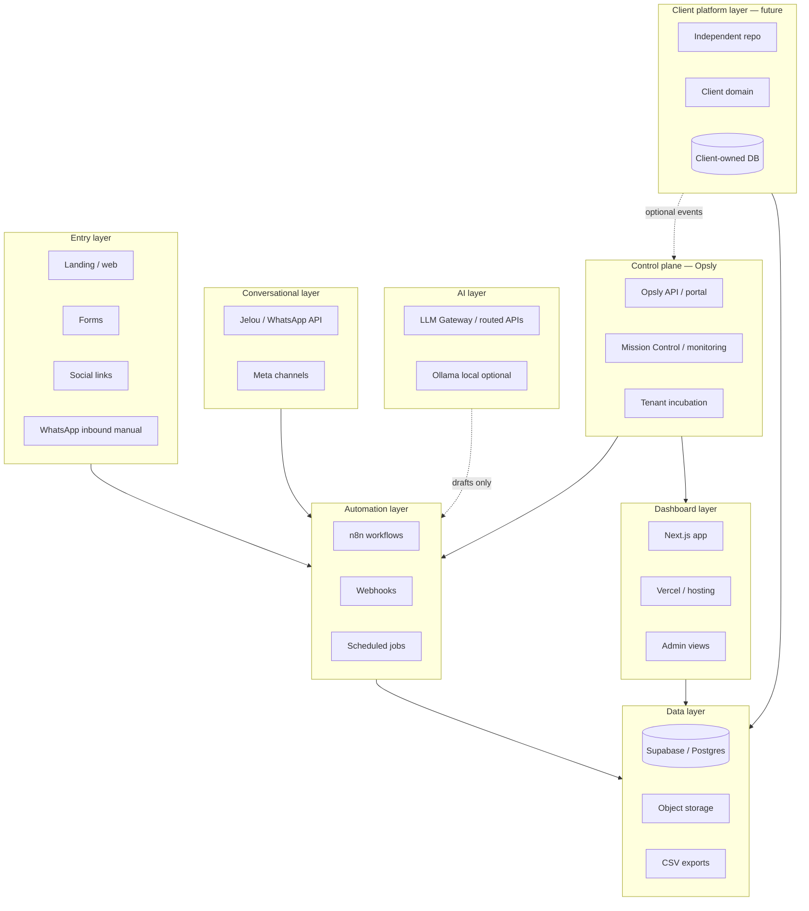
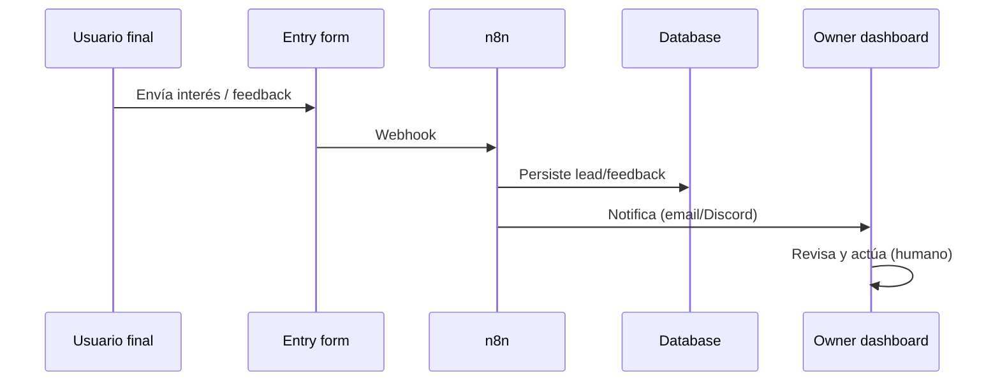
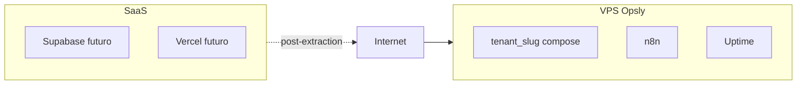

# Opsly Operational Blueprint — Reference Architecture

Arquitectura de **referencia**, no despliegue obligatorio. Cada capa es **opcional y sustituible**.

## Vista por capas

## Capas (definición)

### Entry layer

**Qué:** primer contacto del mercado con el negocio.

| Elemento | Herramientas típicas | Notas |
|----------|---------------------|--------|
| Web / landing | Vercel, Webflow, WordPress | Formulario → webhook |
| Forms | Tally, Typeform, nativo | Evitar 5 formularios distintos |
| Social | Instagram, Facebook | Enlaces en bio; no automatizar DMs en MVP |
| WhatsApp | Manual → luego Jelou | No API en MVP salvo acuerdo explícito |

### Data layer

**Qué:** sistema de registro para leads, clientes, feedback, operaciones.

| Elemento | Default PyME | Alternativa |
|----------|--------------|-------------|
| DB | Supabase | Postgres managed, Neon |
| Auth | Supabase Auth | Clerk, Auth0 (si justificado) |
| Files | Supabase Storage / Drive | S3-compatible |
| Export | SQL + CSV scheduled | Derecho del cliente |

### Automation layer

**Qué:** conecta entradas, notificaciones y reportes sin código pesado.

| Elemento | Default incubación Opsly | Riesgo |
|----------|-------------------------|--------|
| n8n self-hosted en VPS tenant | Alto valor, costo ops | Medio |
| Webhooks | Bajo acoplamiento | Bajo |
| Cron semanal | Reportes | Bajo |

### Conversational layer

**Qué:** mensajería bidireccional (post-MVP típico).

- Jelou, WhatsApp Cloud API, o CRM conversacional (GoHighLevel) según [PROVIDER-MATRIX.md](./PROVIDER-MATRIX.md).
- Siempre **approval-first** para salientes.

### AI layer

**Qué:** resúmenes, borradores, clasificación sugerida.

- En incubación Opsly: LLM Gateway + `tenant_slug` + política documentada.
- Ollama local para costo $0 en tareas simples (worker Mac / opslyquantum).
- **No** es cerebro autónomo del negocio.

### Dashboard layer

**Qué:** lo que el dueño y equipo ven cada día.

- Next.js + Tailwind en Vercel (patrón recomendado post-extracción).
- En incubación: portal Opsly + hojas + n8n UI según fase.

### Control plane (Opsly)

**Qué:** plataforma que hospeda tenants, monitoreo y gobernanza.

- Compose por tenant (`tenant_<slug>`)
- Traefik, API, orchestrator (sin que el cliente dependa de él para operar)
- Mission Control / health / costos orientativos

### Client platform layer (futuro)

**Qué:** producto con marca y dominio del cliente.

- Repo independiente, Supabase propio, deploy propio
- Webhooks opcionales a Opsly

## Flujo de datos (MVP típico)

## Despliegue físico (incubación Opsly)

## Relación con documentación tenant

Por cliente incubado: `docs/tenants/<slug>/` implementa este blueprint (ej. [Peskids](../../tenants/peskids/ARCHITECTURE.md)).
