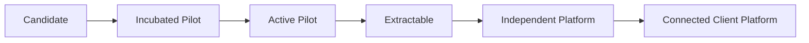

# Opsly Operational Blueprint — Tenant Incubation

Opsly actúa como **incubadora operativa**: el cliente valida procesos dentro del ecosistema Opsly antes de tener su propia plataforma.

## Qué significa incubar

| Incubación | No es |
|------------|-------|
| Stack compartido controlado (n8n, monitoreo) | Producto SaaS terminado |
| Documentación + workflows MVP | Lock-in permanente |
| Piloto con límites claros | Producción enterprise day-1 |
| Camino a extracción | Clonar GCP landing zones |

## Flujo de incubación



## Etapas

### Candidate

- Cliente potencial identificado (nicho, dueño, email).
- Sin stack desplegado o solo DNS reservado.
- **Salida:** decisión go/no-go incubación.

### Incubated Pilot

- Tenant en Opsly (`platform.tenants` o config documental).
- Docs MVP: problema, dashboard objetivo, política IA.
- Workflows mínimos (lead + feedback).
- **Ejemplo:** `docs/tenants/peskids/` (escuela de natación).

### Active Pilot

- Uso real 2–4 semanas.
- Smoke checks periódicos (uptime, formularios, cola aprobación).
- Métricas manuales: leads/semana, feedback, tiempo respuesta.
- **Regla:** no cambiar producción de otros tenants por experimentos.

### Extractable

- MVP validado con el dueño.
- DATA-MODEL estable.
- Cliente puede pagar dominio/hosting propio.
- EXTRACTION-PLAN escrito.

### Independent Platform

- Repo propio, Supabase propio, dominio propio.
- Opsly opcional (monitoring, consultoría).

### Connected Client Platform

- Webhooks/API hacia Opsly para métricas o soporte.
- Cliente opera si Opsly está caído.

## Actividades por etapa

| Actividad | Candidate | Incubated | Active | Extractable |
|-----------|-----------|-----------|--------|-------------|
| Discovery call | ✓ | ✓ | | |
| MVP doc | | ✓ | ✓ | ✓ |
| n8n workflows | | ✓ | ✓ | |
| Dashboard v0 | | ✓ | ✓ | ✓ |
| Weekly report | | | ✓ | ✓ |
| Extraction plan | | | | ✓ |

## Evitar disrupción en producción

1. **Cambios en tenant piloto** solo en ventana acordada.
2. **No** aplicar migraciones Supabase platform sin revisión humana.
3. **Dry-run** en scripts antes de `--yes`.
4. **Feature flags** documentales (qué está ON en el piloto).
5. Otros tenants (smiletripcare, localrank, etc.) **no** son conejillos de indias.

## Criterios de extracción (checklist)

- [ ] Dueño confirma que el flujo diario funciona sin Opsly explicando cada paso.
- [ ] Datos exportables (CSV/SQL) probados.
- [ ] Cuentas (dominio, Meta, email) a nombre del cliente.
- [ ] Presupuesto mensual de hosting acordado.
- [ ] Política IA y aprobaciones firmadas o aceptadas por email.
- [ ] Runbook “primer día sin Opsly” escrito.

Ver [EXTRACTION-PATTERN.md](./EXTRACTION-PATTERN.md).

## Smoke checks (piloto activo)

```bash
# Orientativo — adaptar por tenant; no ejecutar sin contexto VPS
# curl health tenant, verificar n8n login, form test lead, cola approval vacía o con items
```

Documentar resultados en runbook del tenant, no en este blueprint.

## Relación con docs existentes

- Pack tenant: `docs/tenants/production/TENANT-PRODUCTION-BASELINE.md`
- Subclientes: `docs/runbooks/SUBCLIENT-ONBOARDING-TEMPLATE.md`
- LegalVial (modelo distinto): `docs/runbooks/LEGALVIAL-LOCALRANK-MODEL.md`

Peskids es **tenant directo incubado**, no subcliente.

---

## Enlaces relacionados

- [[blueprints/opsly-operational-blueprint/README|opsly-operational-blueprint]]
- [[brain/README|Brain Central]]
