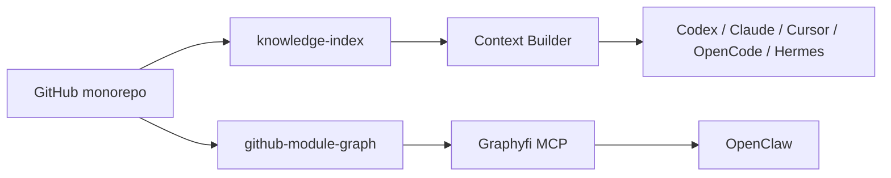

# Opsly Brain

Vault Obsidian canonico para conectar codigo, arquitectura, agentes, tenants,
workflows y decisiones.

## Mapa

| Area | Uso |
| --- | --- |
| `modules/` | Una nota por app/package/modulo GitHub |
| `agents/` | Roles, limites y handoffs de agentes |
| `tenants/` | Contexto operativo por tenant cuando aplique |
| `workflows/` | n8n, Hermes, OpenClaw y automatizaciones |
| `architecture/` | Mapas visuales derivados de ADRs y docs canonicas |
| `runbooks/` | Procedimientos operativos enlazados |
| `generated/` | Salidas regenerables, no editar a mano |

## Reglas

- GitHub sigue siendo la fuente de verdad del codigo.
- Las notas de `modules/` deben enlazar al repo path real y a docs relacionadas.
- Los grafos generados deben derivar de `config/github-module-graph.json`.
- No guardar secretos ni dumps de variables de entorno.

## Primer grafo objetivo

