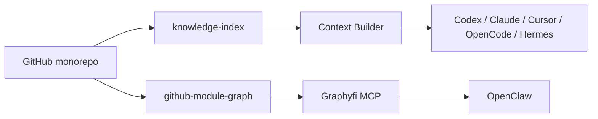

# Opsly Brain

Vault Obsidian canonico para conectar codigo, arquitectura, agentes, tenants,
workflows y decisiones.

## Entrada rapida

- [[brain/dashboard|Brain Dashboard]] — tablero ejecutivo del cerebro.
- [[brain/modules/README|Modules MOC]] — apps, paquetes y servicios del monorepo.
- [[brain/agents/README|Agents MOC]] — Codex, Claude, Cursor, OpenCode, Hermes y workers.
- [[brain/tenants/README|Tenants MOC]] — tenants y contexto comercial/operativo.
- [[brain/workflows/README|Workflows MOC]] — n8n, OpenClaw, Shield, billing y CRM.
- [[brain/architecture/README|Architecture MOC]] — decisiones y mapas tecnicos.

## Mapa

| Area | Uso |
| --- | --- |
| `modules/` | Una nota por app/package/modulo GitHub |
| `agents/` | Roles, limites y handoffs de agentes |
| `tenants/` | Contexto operativo por tenant cuando aplique |
| `workflows/` | n8n, Hermes, OpenClaw y automatizaciones |
| `architecture/` | Mapas visuales derivados de ADRs y docs canonicas |
| `runbooks/` | Procedimientos operativos enlazados |
| `generated/` | Salidas regenerables, no editar a mano |

## Reglas

- GitHub sigue siendo la fuente de verdad del codigo.
- Las notas de `modules/` deben enlazar al repo path real y a docs relacionadas.
- Los grafos generados deben derivar de `config/github-module-graph.json`.
- No guardar secretos ni dumps de variables de entorno.
- Cada nota de modulo debe tener frontmatter con `type`, `layer`, `owner`,
  `status`, `repo_path` y `related_docs`.
- Si un modulo no tiene nota, crear primero una nota minima antes de pedirle a
  un agente que trabaje de forma autonoma sobre ese modulo.

## Primer grafo objetivo

```mermaid
flowchart LR
  Repo["GitHub monorepo"] --> Index["knowledge-index"]
  Repo --> ModuleGraph["github-module-graph"]
  ModuleGraph --> Graphyfi["Graphyfi MCP"]
  Index --> ContextBuilder["Context Builder"]
  Graphyfi --> OpenClaw["OpenClaw"]
  ContextBuilder --> Agents["Codex / Claude / Cursor / OpenCode / Hermes"]
```
