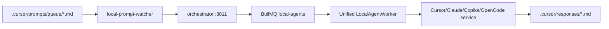

# Agents MOC

Mapa de agentes humanos, locales y externos que trabajan sobre Opsly.

## Contratos

- [[03-agents/AGENT-BRAIN-CONTRACT|Agent Brain Contract]]
- [[03-agents/AGENT-GUARDRAILS|Agent Guardrails]]
- [[03-agents/LOCAL-AGENT-EXECUTION|Local Agent Execution]]
- [[06-multi-agent/PARALLEL-EXECUTION-GUIDE|Parallel Execution Guide]]
- [[../../obsidian/research/agent-pattern-matrix|Agent Pattern Matrix]]
- [[../../obsidian/sources/opsly-agent-pattern-sources|Agent Pattern Sources]]

## Lectura de arranque

1. [[03-agents/AGENT-BRAIN-CONTRACT|Agent Brain Contract]]
2. [[03-agents/AGENT-STARTUP-PROMPT|Agent Startup Prompt]]
3. [[../../obsidian/TAXONOMY|Obsidian Taxonomy]]
4. [[../../obsidian/research/pattern-constellation|Pattern Constellation]]
5. [[../../obsidian/research/agent-pattern-matrix|Agent Pattern Matrix]]
6. [[../../obsidian/sources/opsly-agent-pattern-sources|Agent Pattern Sources]]
7. [[03-agents/AGENT-GUARDRAILS|Agent Guardrails]]
8. [[03-agents/LOCAL-AGENT-EXECUTION|Local Agent Execution]]

## Agentes locales

| Agente | Rol | Cola / servicio |
| --- | --- | --- |
| Cursor | implementacion local | `local_cursor`, `:5001` |
| Claude | arquitectura/razonamiento | `local_claude`, `:5002` |
| Copilot | revision/asistencia IDE | `local_copilot`, `:5003` |
| OpenCode | generacion/refactor | `local_opencode`, `:5004` |
| Hermes | metering/orquestacion IA | `hermes-orchestration` |

## Pattern library

- [[../../obsidian/research/agent-pattern-matrix|Agent Pattern Matrix]] — runtime Python, security defensiva, training y verticales monetizables.
- [[../../obsidian/sources/opsly-agent-pattern-sources|Agent Pattern Sources]] — fuente interna para el mapeo.

## Flujo obligatorio

