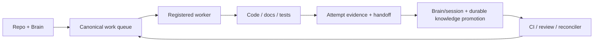

# Agents MOC

Mapa de agentes humanos, locales y externos que trabajan sobre Opsly.

## Contratos

- [[03-agents/AGENT-BRAIN-CONTRACT|Agent Brain Contract]]
- [[03-agents/AGENT-GUARDRAILS|Agent Guardrails]]
- [[03-agents/LOCAL-AGENT-EXECUTION|Local Agent Execution]]
- [[06-multi-agent/PARALLEL-EXECUTION-GUIDE|Parallel Execution Guide]]

## Regla de memoria operativa

Todo agente que cambie Opsly debe dejar el sistema mas facil de entender para el siguiente agente. El codigo/PR es la fuente de verdad del cambio; `docs/` explica el contrato durable; `docs/brain/` conserva contexto operativo navegable. No se permite memoria privada paralela como unica evidencia.

Cada intento de trabajo debe producir un handoff/evidence record asociado al `work_id`/`request_id`, incluso si falla. Como minimo debe registrar: agente/runtime, objetivo, issue/PR, branch y head SHA cuando existan, archivos/superficie tocada, decisiones y supuestos, comandos/tests y resultado, blockers/riesgos, estado terminal y siguiente paso.

Cuando el trabajo cambia conocimiento durable, el mismo PR debe actualizar la documentacion dueña y la nota Brain correspondiente (`modules/`, `architecture/`, `workflows/`, `agents/` o `tenants/`). Las notas de `sessions/` son diario/handoff y no sustituyen la documentacion canonica.

Antes de cerrar trabajo documental, regenerar `npm run index-knowledge` y, si se toco el vault, `npm run obsidian:file-index`. Si el agente no puede ejecutar esos comandos, debe dejarlo explicitamente en evidencia para que el reconciler lo trate como cierre pendiente, no como trabajo silenciosamente completo.

## Lectura de arranque

1. [[03-agents/AGENT-BRAIN-CONTRACT|Agent Brain Contract]]
2. [[03-agents/AGENT-STARTUP-PROMPT|Agent Startup Prompt]]
3. [[../../obsidian/TAXONOMY|Obsidian Taxonomy]]
4. [[03-agents/AGENT-GUARDRAILS|Agent Guardrails]]
5. [[03-agents/LOCAL-AGENT-EXECUTION|Local Agent Execution]]

## Agentes locales

| Agente | Rol | Cola / servicio |
| --- | --- | --- |
| Cursor | implementacion local | `local_cursor`, `:5001` |
| Claude | arquitectura/razonamiento | `local_claude`, `:5002` |
| Copilot | revision/asistencia IDE | `local_copilot`, `:5003` |
| OpenCode | generacion/refactor | `local_opencode`, `:5004` |
| Hermes | diagnostico/implementacion gobernada | registry / canonical work queue |
| OpenClaw | ejecucion/operacion gobernada | registry / canonical work queue |

## Handoff obligatorio

```text
work_id / request_id:
agent / runtime:
objective:
issue / PR / branch / head:
changed_surface:
decisions:
validation:
evidence:
risks_or_blockers:
terminal_state:
next_step:
brain_updates:
canonical_docs_updates:
```

Un retry conserva el mismo `work_id` y agrega un nuevo attempt; nunca borra el handoff anterior. Otro agente debe poder continuar leyendo repo + Brain + evidencia sin depender del chat o memoria privada del agente previo.

## Flujo obligatorio


