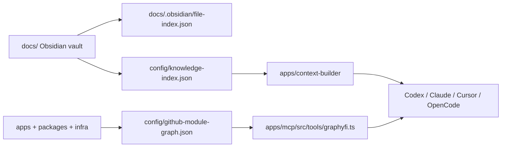

# Knowledge Graph

La triada de conocimiento de Opsly:

## Estado

- Obsidian MOCs: activo.
- `knowledge-index.json`: activo, regenerable.
- `github-module-graph.json`: pendiente de generacion completa.
- Graphyfi MCP: existe como tool, pendiente de consumir grafo real.

## Siguiente incremento

Generar `config/github-module-graph.json` desde:

- `apps/*`
- `packages/*`
- `lib/*`
- `infra/docker-compose*.yml`
- OpenAPI
- notas en [[brain/modules/README|Modules MOC]]

