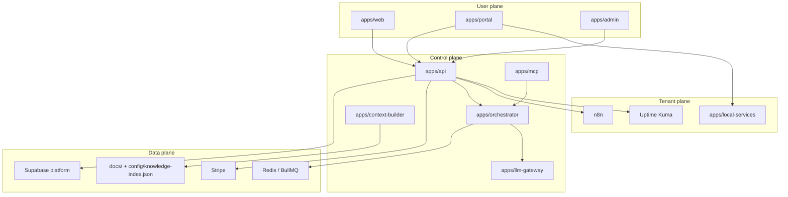

# System Map

## Modulos

- [[brain/modules/api|API Control Plane]]
- [[brain/modules/admin|Admin Console]]
- [[brain/modules/portal|Tenant Portal]]
- [[brain/modules/orchestrator|Orchestrator]]
- [[brain/modules/llm-gateway|LLM Gateway]]
- [[brain/modules/mcp|MCP Server]]

