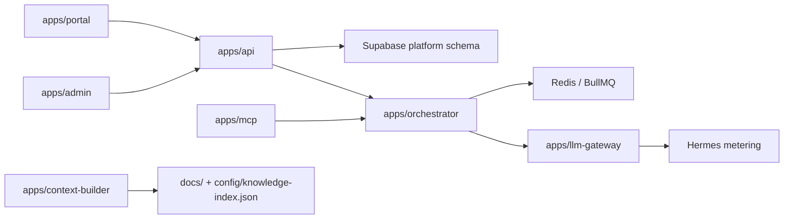

# Modules MOC

Mapa navegable de los modulos de codigo que mas conectan Opsly. Cada nota de
modulo debe enlazar rutas reales del repo, docs canonicas y dependencias.

## Control plane

- [[brain/modules/api|API Control Plane]]
- [[brain/modules/admin|Admin Console]]
- [[brain/modules/portal|Tenant Portal]]
- [[brain/modules/web|Public Web]]

## IA y agentes

- [[brain/modules/orchestrator|Orchestrator]]
- [[brain/modules/llm-gateway|LLM Gateway]]
- [[brain/modules/mcp|MCP Server]]
- [[brain/modules/context-builder|Context Builder]]
- [[brain/modules/notebooklm-agent|NotebookLM Agent]]

## Producto vertical

- [[brain/modules/local-services|Local Services]]
- [[brain/modules/peskids|Peskids]] — vertical academia de natación (tenant de referencia)

## Librerias compartidas

- Registry: [`config/modules.json`](../../config/modules.json)
- Docs: [[01-development/LIBRARY-MODULES|Library Modules]]
- Regla: si una capacidad se repite en dos apps, mover a `lib/*` o enlazar el
  modulo compartido existente.

## Dependencias de alto nivel

