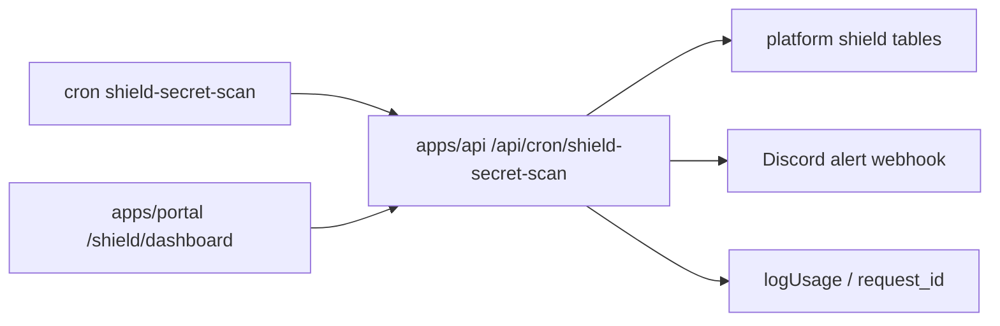

# Shield Workflow

Flujo de Opsly Guardian Grid: posture, secretos, alertas y dashboard.

## Camino

## Docs

- [[01-development/VISION|Vision]]
- [[brain/modules/api|API Control Plane]]
- [[brain/modules/portal|Tenant Portal]]

