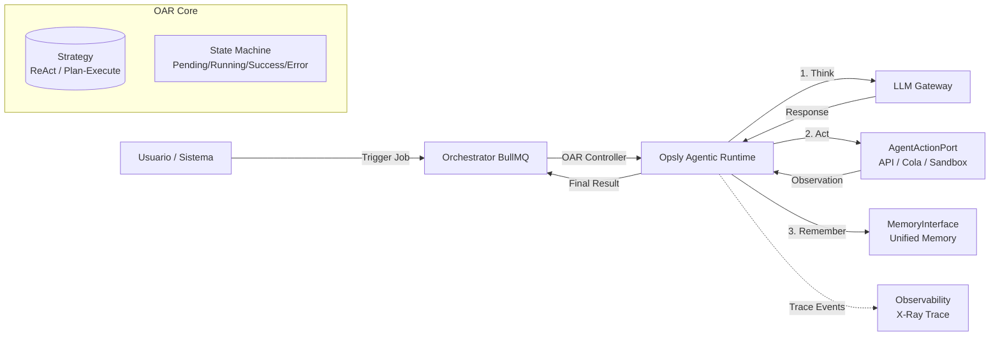

# Design Doc #1: Opsly Agentic Runtime (OAR)

**Status:** En implementación (runtime + intent `oar_react` en orchestrator)  
**Autor:** Opsly Architecture Team  
**Context:** Mejora de Producto #1 - Agentic Runtime

## Actualización técnica (2026-04-28) — SwarmOps / Hive Orchestration

Se añadió una base operativa de **Hive of Bots** en `apps/orchestrator/src/hive` alineada al OAR como patrón de coordinación multi-agente por subtareas.

### Capacidades nuevas

- **Queen orchestration:** `QueenBee` descompone objetivos en subtareas y asigna por rol (`coder`, `researcher`, `tester`, `deployer`, `doc-writer`, `security`).
- **Pheromone channel:** `PheromoneChannel` en Redis Pub/Sub para señales `subtask_assignment`, `task_complete`, `error`, `request_help`.
- **Hive shared state:** `HiveStateStore` mantiene estado global de tareas/bots en Redis para inspección y continuidad.
- **Worker + API interna:** job `hive_objective` y endpoint `POST /internal/hive/objective` con status por `taskId` (`GET /internal/hive/objective/:taskId`, alias `GET /internal/hive/task/:taskId`) y retry manual por subtarea (`POST /internal/hive/task/:taskId/retry/:subtaskId`).
- **Guardrail operacional:** inicialización centralizada del handler Hive antes de consultas/acciones internas de Hive.

### Estado de madurez

- **Hecho:** base funcional de coordinación/observación + retry/reasignación de subtareas fallidas (automático con límite y manual por endpoint).
- **Pendiente:** tests de integración E2E del ciclo completo y métricas explícitas de retry/fallback por task/subtask.

## Actualización técnica (2026-04-26) — CLI Meta-Orchestrator Bridge

Se implementó una primera capa operativa en `tools/cli` para conectar el diseño OAR con ejecución multi-modo y pipeline seguro. Esta capa no reemplaza `apps/orchestrator`; actúa como **control shell** para acelerar experimentación y validación de patrones de runtime.

### Capacidades nuevas alineadas con OAR

- **Mode System dinámico (CLI):** `devops`, `developer`, `security`, `doc`, `architect`, `hacker` con verificación de herramientas y auto-instalación segura en `dry-run`.
- **Pipeline seguro:** comando `pipeline-run` con etapas `sandbox -> qa -> prod` y bloqueo de promoción a `prod` sin aprobación explícita.
- **Worker orchestration:** `workers-run` para descomposición de tareas y ejecución paralela (simulada por defecto).
- **Multi-agent control plane:** `multi-run` para fan-out de prompts a múltiples CLIs (`claude`, `opencode`, `cursor`, `copilot`) y consolidación de salida.
- **Guardrails base:** validación de paths sensibles y límites de intentos en `GuardianSystem`.

### Estado de madurez

- **Hecho (fase segura):** diseño ejecutable en `dry-run` con trazas locales y comandos operativos.
- **Pendiente (fase productiva):** promoción real no simulada con sandbox remoto (E2B/Blaxel), rollback automático y auditoría fuerte por política.

### Comandos de referencia

- `python3 tools/cli/main.py mode-switch --mode security --auto-install --dry-run`
- `python3 tools/cli/main.py pipeline-run --objective "security scan app" --mode security --no-approve-prod --dry-run`
- `python3 tools/cli/main.py workers-run --objective "analiza 4 modulos" --workers 3 --dry-run`
- `python3 tools/cli/main.py multi-run --prompt "review de seguridad" --providers "claude,opencode,cursor,copilot"`

## Actualización de gobierno (2026-04-21)

Para la evolución "Super Agente", el OAR se gobierna con dos roles internos:

- **`opsly_billy` (orquestador/ejecutor):** decide y ejecuta rutas internas o delegación a proveedores externos.
- **`opsly_lili` (supervisor/policy engine):** valida riesgo, costo, compliance y permisos antes de permitir ejecución.

Regla operativa: **ningún agente externo ejecuta directamente** sin pasar por Billy + validación de Lili.
La integración externa se implementa mediante adapters (contrato `runTask/getStatus/cancel/normalizeResult`) sin romper el contrato OAR actual (`MemoryInterface`, `AgentActionPort`).

## 1. Objetivo

Definir un **Runtime Estándar para Agentes** que normalice cómo Opsly ejecuta tareas complejas. En lugar de depender únicamente del "pensamiento implícito" de un LLM (ej. "piensa paso a paso"), el OAR impone **patrones de ejecución explícitos** (Loops) orquestados por código, garantizando previsibilidad, trazabilidad y capacidad de corrección.

El OAR es la capa que vive entre `apps/orchestrator` y `apps/llm-gateway`.

## 2. Arquitectura de Alto Nivel

El OAR introduce tres conceptos clave:

1. **Strategies (Estrategias):** Algoritmos de toma de decisiones (ej. `ReAct`, `PlanAndExecute`).
2. **Loop Controller:** El motor que ejecuta la estrategia paso a paso.
3. **Interfaces de Abstracción:** Para desacoplar el Runtime de la implementación específica de Memoria y Ejecución de Acciones.



## 3. Estrategias de Ejecución (The Loops)

El OAR soporta múltiples estrategias. La estrategia activa se selecciona basándose en el **Modo del Tenant** (del Mode System) o en la complejidad de la tarea.

### 3.1. ReAct Loop (Reason + Act)

- **Uso ideal:** Modos exploratorios o de debugging (**Hacker Mode**, **Optimizer Mode**).
- **Flujo:**
  1. **Thought:** El LLM razona sobre el estado actual.
  2. **Action:** El LLM elige una acción vía `AgentActionPort` (ej. `execute_terminal`, `fs_read_file`).
  3. **Observation:** El sistema ejecuta la acción y devuelve el resultado.
  4. **Loop:** Se repite hasta que el LLM decide que ha terminado (`FINAL_ANSWER`).
- **Pros:** Rápido, reactivo. Bueno para tareas donde no se conoce el camino de antemano.

### 3.2. Plan & Execute

- **Uso ideal:** Tareas complejas y estructuradas (**Architect Mode**, **Developer Mode**).
- **Flujo:**
  1. **Planning:** El LLM genera una lista de pasos ordenados (JSON estructurado).
  2. **Execution:** El OAR ejecuta los pasos **secuencialmente** a través del puerto de acciones.
     - _Nota:_ El LLM tiene permiso para revisar el plan ("Replanning") si un step falla.
  3. **Synthesis:** Al final, se genera un resumen de lo hecho.
- **Pros:** Más predecible, fácil de auditar paso a paso (Ideal para "X-Ray").

### 3.3. Reflection Loop (Self-Correction)

- **Uso ideal:** Tareas críticas que requieren alta precisión (**Security Mode**, **Quantum Mode**).
- **Flujo:**
  1. **Initial Attempt:** Se ejecuta la tarea (usando Plan & Execute o ReAct).
  2. **Critique:** Un LLM separado (o el mismo con un prompt diferente) revisa el resultado buscando errores, vulnerabilidades o inconsistencias.
  3. **Correction:** Si se encuentran errores, se envían de vuelta al OAR para arreglarlos.
  4. **Finalize:** Se repite hasta que el crítico aprueba el resultado o se alcanza un límite de iteraciones.

## 4. Interfaces de Abstracción (El Contrato)

Para que el Runtime funcione sin acoplarse a tu infraestructura actual, define estas interfaces estrictas.

### 4.1. `MemoryInterface` (Puente a la Mejora #2)

El Runtime no habla directamente con Redis o Supabase. Pide memoria a través de esta interfaz. **Importante:** Todas las operaciones están scoperadas por `tenant_slug`.

```typescript
// apps/orchestrator/src/runtime/interfaces/memory.interface.ts

export interface MemoryInterface {
  /**
   * Lee el contexto de trabajo actual (short-term memory).
   */
  getWorkingContext(tenantSlug: string, sessionId: string): Promise<Record<string, unknown>>;

  /**
   * Añade un hecho observado a la memoria episódica (logs de ejecución).
   */
  appendObservation(
    tenantSlug: string,
    sessionId: string,
    step: number,
    content: string
  ): Promise<void>;

  /**
   * Consulta memoria semántica (RAG) basada en la consulta actual.
   * (Implementación futura con pgvector).
   */
  querySemantic(tenantSlug: string, query: string, limit?: number): Promise<MemoryFragment[]>;
}

export interface MemoryFragment {
  source: string; // 'docs/adr/...', 'git-diff', 'user-conversation'
  content: string;
  relevanceScore: number;
}
```

### 4.2. `AgentActionPort` (Abstracción de Ejecución)

Renombrado desde `ToolExecutorInterface` para reflejar que en Opsly las acciones pueden ser llamadas HTTP a la API interna, encolado de trabajos o llamadas MCP, no solo un SDK de MCP directo.

```typescript
export interface AgentActionPort {
  /**
   * Ejecuta una acción atómica en nombre del agente.
   * El puerto decide si es HTTP a API, un Job en BullMQ o un MCP Tool call.
   */
  executeAction(
    tenantSlug: string,
    actionName: string,
    args: Record<string, unknown>
  ): Promise<ToolResult>;
}

export interface ToolResult {
  success: boolean;
  data?: unknown;
  error?: string;
  observation: string; // Output legible para el LLM
}
```

## 5. Máquina de Estados del Ciclo de Vida

Cada tarea (Job de BullMQ) gestionada por el OAR pasa por estos estados:

1. **PENDING:** Job recibido, esperando ser procesado.
2. **STRATEGIZING:** Decidiendo qué algoritmo usar (ej. si es Security, forzar Reflection).
3. **THINKING:** LLM generando el próximo paso (o el plan completo).
4. **ACTING:** Ejecutando la acción vía `AgentActionPort`.
5. **OBSERVING:** Procesando el resultado de la acción.
6. **REFLECTING:** (Opcional) Validando resultados.
7. **COMPLETED:** Tarea finalizada con éxito.
8. **FAILED:** Tarea fallida (máximo de iteraciones alcanzado o error crítico).

## 6. Integración con el Mode System

El `ModeContext` (que persistes en Redis) inyecta configuración al OAR:

| Modo          | Estrategia por Defecto        | Configuración OAR                                                         |
| :------------ | :---------------------------- | :------------------------------------------------------------------------ |
| **Architect** | `PlanAndExecute`              | `maxSteps: 20`, `allowReplanning: true`                                   |
| **Developer** | `PlanAndExecute`              | `maxSteps: 15`, `toolTimeout: 30s`                                        |
| **Hacker**    | `ReAct`                       | `maxSteps: 50`, `fastMode: true`                                          |
| **Security**  | `PlanAndExecute + Reflection` | `maxReflections: 2`, `criticalChecks: true`                               |
| **Quantum**   | `Ensemble` (Special)          | Delega a `execute_quantum` tool, pero usa OAR para orquestar la síntesis. |

## 7. Plan de Implementación

1. **Fase 1: Skeleton:** Crear la carpeta `apps/orchestrator/src/runtime/`. Definir las interfaces `MemoryInterface` y `AgentActionPort` con tipos estrictos (`unknown`). — **Hecho**
2. **Fase 2: ReAct Engine:** Implementar el primer loop (ReAct) conectando al `llm-gateway` actual (`POST /v1/text` vía `runtime/llm/oar-text-completion-client.ts`). — **Hecho**
3. **Fase 3: Action Port Adapter:** Adapter `OpslyActionAdapter` (API + BullMQ) + `StubAgentActionPort` para MVP sin herramientas reales. — **Parcial (adapter + stub)**
4. **Fase 4: Plan-Execute:** Implementar la extracción de planes JSON y la ejecución secuencial. — **Código en** `plan-execute-engine.ts`
5. **Fase 5: Reflection Hook:** Añadir el paso de validación post-ejecución. — **Código en** `reflection-engine.ts`
6. **Fase 6: Tracing:** Emitir eventos a un exchange de Redis para que `Langfuse` (o el servicio de observabilidad) construya la traza "X-Ray". — **Parcial** (`OarTracer` + Pub/Sub `opsly:oar:trace`)
7. **Integración control plane:** Intent `oar_react` en `processIntent` (`apps/orchestrator/src/engine.ts`): memoria en proceso, acciones stub, sin encolar jobs BullMQ salvo otros intents.

## Referencias

- **Mode System:** `apps/mcp/src/modes/registry.ts` _(ruta objetivo; implementación según roadmap Mode System + Quantum)._
- **Design Doc #2:** Unified Memory (pendiente).
- **[ADR-027](../adr/ADR-027-hybrid-compute-plane-k8s.md):** Hybrid Control Plane vs Compute Plane (K8s Strategy).
- **[ADR-020](../adr/ADR-020-orchestrator-worker-separation.md):** Separación orchestrator / worker.
- **[ADR-011](../adr/ADR-011-event-driven-orchestrator.md):** Orquestador event-driven.
