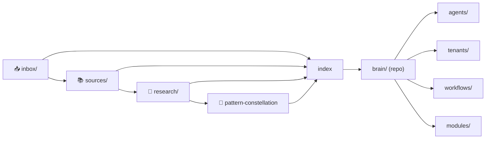

# Obsidian Brain — Índice

Este vault es un **segundo cerebro** conectado al repo `intcloudsysops`. Cada idea nueva tiene:
- **Origen** (fuente verificable)
- **Enlace a un MOC** (`[[obsidian/...]]`)
- **Enlace a brain/** (conexión con el repo canonico)

## Regla anti-huerfanos

> Ninguna nota nueva sin `[[obsidian/index]]` o un MOC + enlace a fuente o nota del tema.

## Mapa



## Taxonomía

- [[obsidian/TAXONOMY|Taxonomía de nodos]] — tipos de nota, reglas de promoción y flujo del cerebro.

## Dominios

| Dominio | MOC | Descripcion |
| --- | --- | --- |
| Captura | [[obsidian/inbox/MOC]] | Notas rapidas sin pulir |
| Fuentes | [[obsidian/sources/MOC]] | Una nota por URL/documento |
| Investigacion | [[obsidian/research/MOC]] | Ideas atómicas derivadas |
| Research radar | [[obsidian/research/README]] | Entrada corta para patrones y síntesis |
| Constelacion | [[obsidian/research/pattern-constellation]] | Hub principal de patrones reutilizables |
| Taxonomía | [[obsidian/TAXONOMY]] | Reglas para clasificar nodos y patrones |
| Opsly | [[brain/README]] | MOC raiz del monorepo |

## Plantillas

- `templates/source-note.md` — fuente verificable
- `templates/evergreen-claim.md` — claim atómico
- `templates/moc-research.md` — MOC de tema

## Conexion con agentes

- **Cursor**: prompt copiable en `docs/02-tools/OBSIDIAN-RESEARCH-BRAIN.md`
- **Repo-first RAG**: `npm run index-knowledge` actualiza `config/knowledge-index.json`
- **NotebookLM**: experiment Business+ segun `NOTEBOOKLM_ENABLED`

## Archivos sin enlazar

Revisar periodically con Dataview para encontrar nodos huérfanos:

```
dv.pages().where(p => p.file.path.includes("obsidian/sources/archive"))
  .where(p => p.outlinks.length < 1)
```

## Enlaces canonicos

- Repo: [[AGENTS.md]], [[VISION.md]], [[ROADMAP.md]]
- Docs: [[docs/README]], [[docs/QUICK-REFERENCE.md]]
- Agentes: [[brain/agents/README]], [[brain/modules/README]]
- Tenants: [[brain/tenants/README]], [[brain/workflows/README]]
- Taxonomía: [[obsidian/TAXONOMY]]
- Research: [[obsidian/research/README]]
- Hub patrones: [[obsidian/research/pattern-constellation]]
