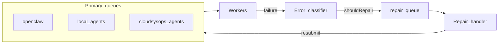

# Repair queue y fallover (diseño — Opsly)

**Estado:** diseño / contrato; la implementación será incremental en [`apps/orchestrator`](../../apps/orchestrator).  
**Última actualización:** 2026-04-30

---

## Objetivo

Cuando un job falle por causas **recuperables con intervención** (p. ej. créditos agotados, configuración incorrecta detectable), en lugar de solo reintentar a ciegas, **encolar un trabajo de reparación** con contexto suficiente para que un operador o un worker “repair” (p. ej. Cursor/humano vía API) corrija y **vuelva a encolar** el trabajo original con trazabilidad.

---

## Principios (no negociables)

1. **Un solo control plane:** BullMQ + Redis en el orchestrator existente — ver [`docs/00-architecture/ORCHESTRATOR.md`](../00-architecture/ORCHESTRATOR.md). No introducir un servidor Express paralelo (`apps/agent-server`).
2. **Trazabilidad:** `tenant_slug`, `request_id`, `idempotency_key` en payloads de job (convención actual).
3. **LLM:** cualquier análisis automático de error pasa por **LLM Gateway**, no llamadas directas a proveedores desde lógica dispersa.
4. **Límites:** máximo de ciclos repair → primario (evitar bucles); circuito abierto si el mismo `idempotency_key` falla repetidamente.

---

## Modelo conceptual

- **Classifier:** categorías (créditos, rate limit, timeout, error de código/config, irrecuperable). Solo “repair” cuando tenga sentido y haya política explícita.
- **Cola `repair`:** nombre BullMQ a fijar en implementación (ej. `openclaw-repair`); payload = job original + último error + `repairHistory` acotado en tamaño.

---

## Superficie HTTP (cuando se implemente)

- Endpoints pueden vivir en el **health server** del orchestrator (patrón actual de `/internal/*`) o detrás de **API** con auth admin — decisión en ADR al implementar.
- Cualquier lista o mutación de repair jobs debe exigir **misma barra de identidad** que el resto de operaciones internas (`PLATFORM_ADMIN_TOKEN` / Zero-Trust según ruta).

---

## Relación con el índice maestro

Rutas de producto (A/B/C): [`docs/design/AGENT-ORCHESTRATION-INDEX.md`](../design/AGENT-ORCHESTRATION-INDEX.md).
