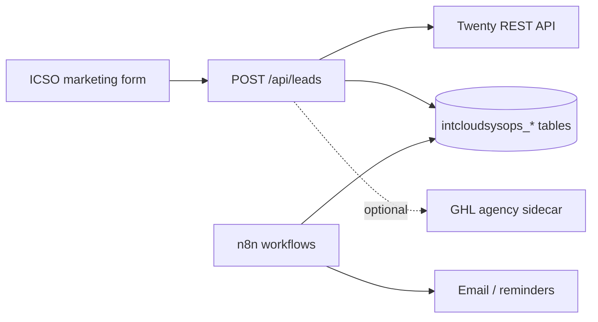

# Intcloudsysops (ICSO) — Twenty CRM

## Objetivo

Migrar el intake comercial de **GoHighLevel (agencia)** a **Twenty CRM + Supabase + n8n**, sin afectar otros tenants (Peskids usa flags y credenciales distintas).

## Estado en repo (2026-06-09)

| Componente | Estado |
|-----------|--------|
| Captura web `POST /api/leads` (apps/icso) | Twenty (opcional) + **Supabase obligatorio** + GHL sidecar con flag |
| Tablas operativas | `intcloudsysops_accounts`, `intcloudsysops_contacts`, `intcloudsysops_deals`, `intcloudsysops_followups` |
| Migración external ids | `0083_intcloudsysops_crm_external_ids.sql` |
| Pipeline local | `intcloudsysops_deals.stage` + `IcsoPipelineService` |
| Follow-up stale | `IcsoFollowupService` → `intcloudsysops_followups` |
| GHL legacy | `INTCLOUDSYSOPS_GHL_ENABLED=false` por defecto |

## Arquitectura



## Variables Doppler (`ops-intcloudsysops/prd`)

```bash
# Twenty (primario)
doppler secrets set \
  TWENTY_INTCLOUDSYSOPS_API_URL="https://crm-intcloudsysops.op-sly.com" \
  TWENTY_INTCLOUDSYSOPS_API_KEY="..." \
  INTCLOUDSYSOPS_TWENTY_ENABLED="true" \
  --project ops-intcloudsysops --config prd

# Supabase (fuente operativa — compartida plataforma)
# NEXT_PUBLIC_SUPABASE_URL, SUPABASE_SERVICE_ROLE_KEY (ya en prd)

# Discovery booking (sin GHL)
doppler secrets set NEXT_PUBLIC_ICSO_DISCOVERY_BOOKING_URL="https://..." --project ops-intcloudsysops --config prd

# Legacy GHL (solo transición)
doppler secrets set INTCLOUDSYSOPS_GHL_ENABLED="false" --project ops-intcloudsysops --config prd
```

## Checklist de apagado GHL (ICSO)

- [ ] `INTCLOUDSYSOPS_GHL_ENABLED=false` en prd y redeploy ICSO
- [ ] Smoke `POST /api/leads` → `contactId` UUID local (no GHL id)
- [ ] Import histórico GHL → Twenty completado
- [ ] `NEXT_PUBLIC_ICSO_DISCOVERY_BOOKING_URL` apunta a calendario Twenty/n8n
- [ ] n8n follow-up workflow usa `intcloudsysops_followups` (no GHL tasks)
- [ ] Cancelar suscripción GHL agencia tras ventana de observación

## Referencias

- Legacy GHL: [`GOHIGHLEVEL-CONTRACT.md`](GOHIGHLEVEL-CONTRACT.md)
- Patrón Peskids: [`../peskids/TWENTY-CRM.md`](../peskids/TWENTY-CRM.md)
- Data model: [`DATA-MODEL.md`](DATA-MODEL.md)
