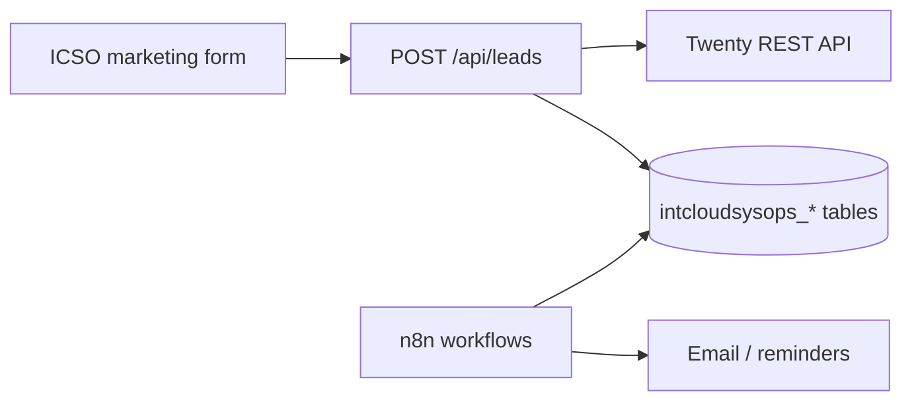

# Intcloudsysops (ICSO) — Twenty CRM

## Objetivo

Intake comercial de ICSO en **Twenty CRM + Supabase + n8n**. La suscripción GoHighLevel de agencia fue **cancelada**; no hay dual-write ni scripts de provision GHL para este tenant.

## Estado en repo (2026-08-02)

| Componente | Estado |
|-----------|--------|
| Captura web `POST /api/leads` (apps/icso) | **Supabase obligatorio** + Twenty cuando está configurado |
| Tablas operativas | `intcloudsysops_accounts`, `intcloudsysops_contacts`, `intcloudsysops_deals`, `intcloudsysops_followups` |
| Migración external ids | `0083_intcloudsysops_crm_external_ids.sql` |
| Pipeline local | `intcloudsysops_deals.stage` + `IcsoPipelineService` |
| Follow-up stale | `IcsoFollowupService` → `intcloudsysops_followups` |
| GHL agency | **Retirado** (código sidecar + scripts borrados) |

## Arquitectura



## Variables Doppler (`ops-intcloudsysops/prd`)

```bash
# Twenty (primario)
doppler secrets set \
  TWENTY_INTCLOUDSYSOPS_API_URL="https://crm-intcloudsysops.op-sly.com" \
  TWENTY_INTCLOUDSYSOPS_API_KEY="..." \
  INTCLOUDSYSOPS_TWENTY_ENABLED="true" \
  --project ops-intcloudsysops --config prd

# Discovery booking
doppler secrets set NEXT_PUBLIC_ICSO_DISCOVERY_BOOKING_URL="https://..." --project ops-intcloudsysops --config prd
```

Rotar/borrar secretos legacy `INTCLOUDSYSOPS_GHL_*` / agency API keys si aún existen en Doppler.

## Checklist post-cutover

- [x] Código ICSO sin imports GHL
- [ ] Smoke `POST /api/leads` → `contactId` UUID local + Twenty ids
- [ ] `NEXT_PUBLIC_ICSO_DISCOVERY_BOOKING_URL` apunta a calendario Twenty/n8n
- [ ] n8n follow-up usa `intcloudsysops_followups`
- [ ] Secretos GHL agencia eliminados de Doppler

## Referencias

- Patrón Peskids (GHL aún posible allí): [`../peskids/TWENTY-CRM.md`](../peskids/TWENTY-CRM.md)
- Data model: [`DATA-MODEL.md`](DATA-MODEL.md)
