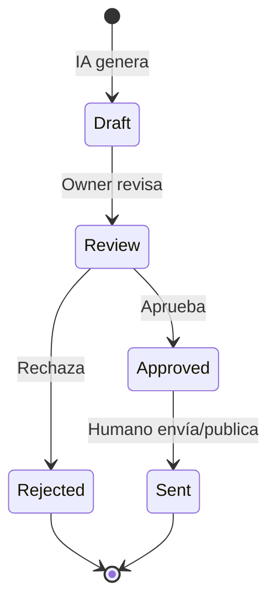

# Peskids — política de IA (approval-first)

Aplica a cualquier uso de LLM vía **Opsly LLM Gateway**, n8n con nodos IA, o futuro producto Peskids. Alineado a guardrails Opsly: `tenant_slug`, trazabilidad, sin runtime core modificado en incubación.

## Principio

La IA **asiste**; las personas **deciden y ejecutan** acciones que afectan a padres, estudiantes, docentes o imagen pública.

## Permitido (sin envío automático)

| Capacidad | Uso | Salida |
|-----------|-----|--------|
| Resumir | Hilos de feedback, notas de reunión, listas de leads | Texto interno para owner |
| Sugerir respuestas | Email o mensaje a padre | Borrador en estado `draft` |
| Sugerir contenido | Posts, newsletters | Borrador en `content_ideas` |
| Generar reportes | Narrativa del informe semanal | Borrador antes de envío |
| Clasificar | Intención de lead, urgencia | Etiqueta sugerida en metadata |
| Detectar anomalías | Pico de feedback negativo | Alerta al owner |

Toda salida IA debe llevar:

- `ai_generated: true`
- `model` / `request_id` si pasa por LLM Gateway
- Timestamp y versión de prompt (cuando aplique)

## Prohibido (MVP e incubación)

| Acción | Razón |
|--------|--------|
| Enviar mensajes a padres/clientes sin aprobación humana explícita | Riesgo reputacional y legal |
| Publicar en redes sociales automáticamente | Misma razón |
| Crear/editar/borrar registros de estudiantes o padres sin ticket aprobado | Integridad de datos |
| Iniciar conversaciones WhatsApp (Jelou) | Fuera de alcance; canal sensible |
| Ejecutar scripts shell / deploy desde sugerencia IA | Zona roja Opsly |
| Auto-aprobar follow-ups o cerrar leads | Debe ser acción humana |

## Flujo de aprobación recomendado

Estados mínimos en DB futura: `draft` → `approved` → `sent` (mensajes) o `published` (contenido).

## Integración Opsly LLM

- Perfil tenant: `hybrid` (local primero cuando esté disponible en worker).
- Presupuesto: respetar límites `startup` en gateway.
- No llamadas LLM directas fuera de OpenClaw/LLM Gateway en código nuevo.

## n8n + nodos IA

- Nodo IA solo en ramas que **escriben** a campos `ai_*` o notificaciones internas.
- Rama de envío externo debe tener nodo **manual gate** (webhook de aprobación, o export a cola owner).

## Auditoría

Registrar en log interno (futuro):

- Quién aprobó (`approved_by`)
- Qué borrador (`draft_id`)
- Cuándo se envió (`sent_at`)

## Excepciones

Cualquier excepción (p. ej. auto-ack “recibimos tu mensaje”) requiere:

1. Documento firmado por owner en `docs/tenants/peskids/`
2. Texto fijo pre-aprobado (sin generación IA)
3. Sin datos sensibles en el ack

## Revisión

Revisar esta política al activar WhatsApp o al extraer `peskids-platform`.

---

## Enlaces relacionados

- [[tenants/peskids/README|peskids]]
- [[brain/README|Brain Central]]
