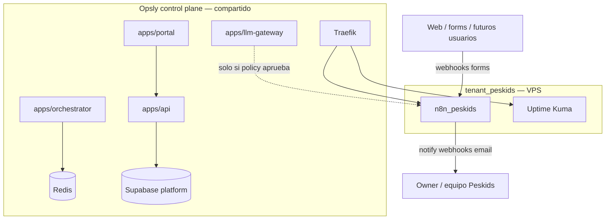
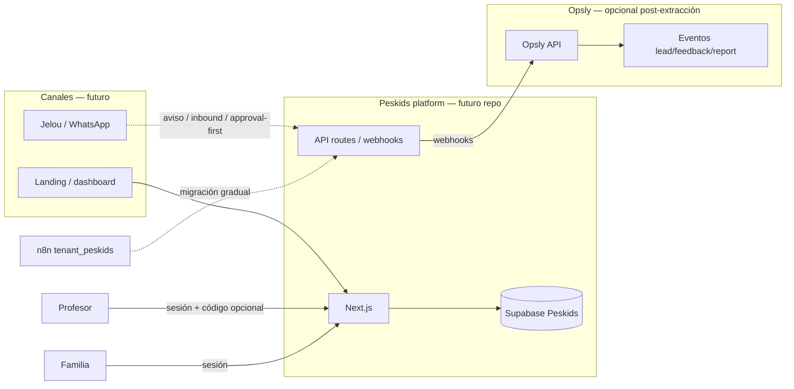

# Peskids — arquitectura (incubación → extracción)

## Vista actual (incubado en Opsly)

### Componentes

| Capa | Componente | Rol para Peskids |
|------|------------|------------------|
| Opsly | `platform.tenants` row `peskids` | Identidad, plan, owner |
| Opsly | Portal (opcional) | Login owner si el flujo lo requiere; no es fallback de staff Peskids |
| VPS | `tenant_peskids` Compose | Aislamiento por slug |
| VPS | n8n | Automatización workflows |
| VPS | Uptime Kuma | Salud URLs |
| Repo | `config/tenants/peskids.json` | Metadatos declarativos (en revisión) |
| Repo | CRM JSON en `.n8n/1-workflows/crm/` | Plantillas instalables por tenant |

**No modificar** en incubación: orchestrator core, OpenClaw, BullMQ workers globales, auth core.

## Vista objetivo (producto Peskids + puente Opsly)

## Conexión Opsly ↔ Peskids (post-extracción)

| Dirección | Mecanismo | Ejemplo |
|-----------|-----------|---------|
| Peskids → Opsly | HTTPS webhooks + API key por tenant | `lead.created` |
| Opsly → Peskids | Suscripción a eventos o polling documentado | métricas de uso LLM (opcional) |
| Datos | **No** compartir schema `platform` con schema producto | Migración explícita |

Eventos canónicos: [EXTRACTION-PLAN.md](./EXTRACTION-PLAN.md).

## Dominios y URLs

| Uso | Patrón actual (Opsly staging) | Futuro Peskids |
|-----|------------------------------|----------------|
| n8n | `n8n-peskids.{PLATFORM_DOMAIN}` | Puede migrar a subdominio propio |
| Uptime | `uptime-peskids.{PLATFORM_DOMAIN}` | Idem |
| App producto | — | `app.peskids.com` (TBD con owner) |
| Invitación staff | `https://peskids.op-sly.com/invite/[token]` | Siempre tenant-scoped |
| Login staff | `https://peskids.op-sly.com/admin/login` | Siempre tenant-scoped |
| Recovery staff | `https://peskids.op-sly.com/auth/recovery` | Nunca portal genérico por defecto |

Sin hardcodear dominios en código; usar env (`PLATFORM_DOMAIN`, `TENANT_BASE_DOMAIN`).

## Seguridad y aislamiento

- Mismo host VPS que otros tenants (riesgo operativo compartido — ver baseline prod).
- Secretos por tenant en **Doppler** (nombres estables); no en repo.
- Invitaciones y recovery: siempre `tenant_slug: peskids` + metadata explícita; no inferir destino desde el email.
- Jobs/eventos futuros: siempre `tenant_slug: peskids` + `request_id`.
- Subcliente: **no aplica** (sin `parent_tenant_slug`).

## Decisiones pendientes (arquitectura)

1. ¿Supabase dedicado Peskids vs schema `tenant_peskids` en proyecto compartido?
2. ¿n8n permanece en Opsly VPS o se replica en deploy Vercel/serverless?
3. ¿Jelou como canal primario post-MVP?
4. Contrato de eventos con Opsly (auth, retry, idempotencia).
5. **Aceptado:** dashboards autenticados son la superficie de acción; WhatsApp
   notifica y conversa, pero no es autoridad para cambiar estados.

---

## Enlaces relacionados

- [[tenants/peskids/README|peskids]]
- [[brain/README|Brain Central]]
