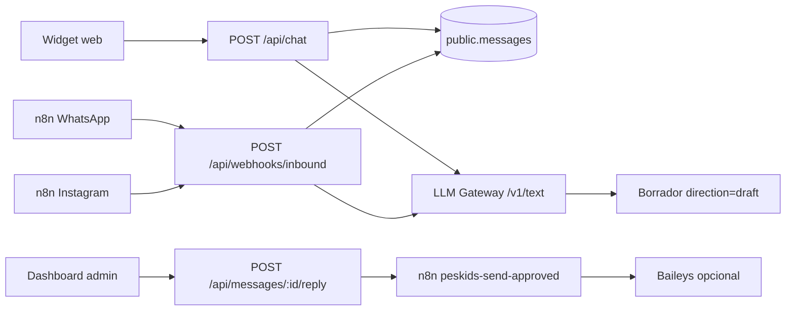

# Peskids — Chatbox inteligente + n8n

## Flujo



## Componentes en repo

| Pieza | Ruta |
|-------|------|
| Widget chat | `apps/peskids/components/chat/peskids-chat-widget.tsx` |
| API pública | `apps/peskids/app/api/chat/route.ts` |
| Inbound unificado | `apps/peskids/app/api/webhooks/inbound/route.ts` |
| Borrador interno (n8n) | `apps/peskids/app/api/internal/messages/draft/route.ts` |
| Panel respuestas | `apps/peskids/components/admin/message-inbox-panel.tsx` |
| Migración hilos | `apps/peskids/migrations/004_message_threads.sql` |

## Workflows n8n (`.n8n/1-workflows/peskids/`)

| Archivo | Webhook | Uso |
|---------|---------|-----|
| `whatsapp-receiver.json` | `peskids-whatsapp` | Baileys → inbound + borrador IA |
| `instagram-webhook-receiver.json` | `peskids-instagram` | Mismo inbound (ya no escribe directo a Supabase) |
| `message-pipeline.json` | `peskids-message-pipeline` | Notificación opcional post-mensaje |
| `send-approved.json` | `peskids-send-approved` | Envío tras aprobar en admin |

Instalar en VPS:

```bash
cd /opt/opsly
./scripts/install-peskids-n8n-workflows.sh --force
```

Activar workflows en UI n8n del tenant (`n8n_peskids`) si el webhook sigue en 404.

## Variables (Doppler / `runtime/peskids.env`)

- `LLM_GATEWAY_URL` — p. ej. `http://opsly_llm_gateway:3010` en Docker, o túnel Tailscale al worker
- `PESKIDS_INBOUND_WEBHOOK_SECRET` — mismo valor en n8n (`x-webhook-secret`)
- `N8N_WEBHOOK_BASE_URL` — `https://n8n-peskids.op-sly.com/webhook` o interno `http://n8n_peskids:5678/webhook`
- `BAILEYS_SEND_URL` — opcional, endpoint de envío WhatsApp

## Migración Supabase

Aplicar `004_message_threads.sql` en el proyecto Supabase del tenant antes de desplegar la app nueva.

## Política IA

Ver [`AI-APPROVAL-POLICY.md`](AI-APPROVAL-POLICY.md): el widget muestra texto **orientativo**; WhatsApp/Instagram solo se envían tras **Aprobar y enviar** en el dashboard.
