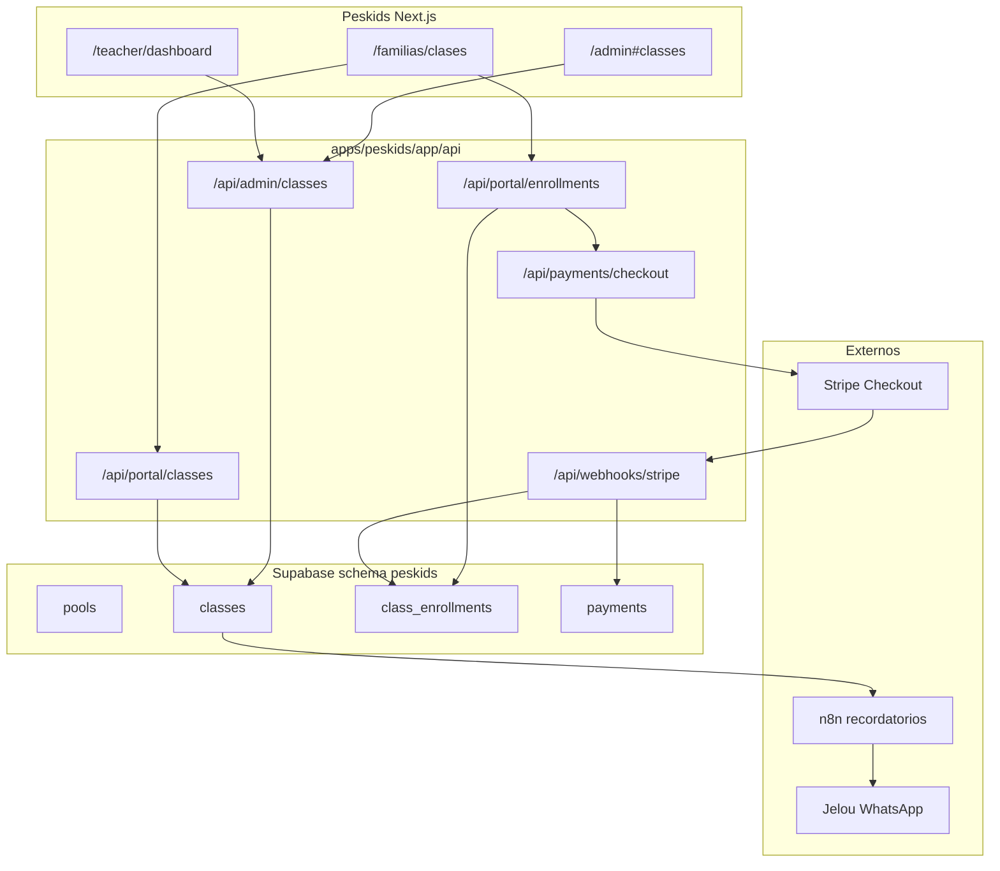

# Peskids — Spec técnica: Clases, calendario, pagos y operación

> **Alcance:** Opción A (Operación) — MVP vendible en 3–4 semanas.  
> **Fuente de verdad auth:** `user_metadata.role` + `tenant_slug=peskids` vía [`apps/peskids/lib/staff-user.ts`](../../../apps/peskids/lib/staff-user.ts).  
> **Patrón API:** [`validateStaffSession`](../../../apps/peskids/lib/staff-auth.ts) + `errorJson` / `successJson` + Zod.

---

## 1. Objetivo

Permitir que Peskids **opere el negocio diario** sin Excel ni WhatsApp manual para horarios:

1. Admin crea clases (profesor, piscina, horario, cupos, precio).
2. Familias ven y reservan clases (portal autenticado).
3. Docentes ven agenda del día y marcan asistencia.
4. Pagos online confirman inscripción (Stripe MVP).
5. Recordatorios automáticos (extiende `peskids.notifications` existente).

**Fuera de MVP (v2):** recurrencia compleja, contabilidad, app nativa, BI Metabase.

---

## 2. Arquitectura



---

## 3. Modelo de datos

Schema **`peskids`** (consistente con migraciones `007`–`008`). `tenant_slug` en todas las tablas nuevas.

### 3.1 Enumeraciones

| Tipo | Valores |
|------|---------|
| `swim_level` | `1` … `6` (mapeo UI: Tiburones, Delfines, …) |
| `location_kind` | `llanogrande`, `domicilio` |
| `class_status` | `scheduled`, `cancelled`, `completed` |
| `enrollment_status` | `reserved`, `confirmed`, `cancelled`, `no_show`, `attended`, `waitlisted` |
| `payment_status` | `pending`, `paid`, `failed`, `refunded` |
| `attendance_status` | `present`, `absent`, `excused` |

### 3.2 Tablas

#### `peskids.pools`

| Columna | Tipo | Notas |
|---------|------|--------|
| id | uuid PK | |
| tenant_slug | text | default `peskids` |
| name | text | ej. Piscina 1 |
| location | location_kind | |
| max_capacity | int | aforo físico |
| active | boolean | default true |
| created_at | timestamptz | |

#### `peskids.classes`

| Columna | Tipo | Notas |
|---------|------|--------|
| id | uuid PK | |
| tenant_slug | text | |
| title | text | ej. Tiburones · sábado 9:00 |
| level | smallint | 1–6 CHECK |
| professor_user_id | uuid | FK → `auth.users` (staff teacher) |
| pool_id | uuid FK | → pools |
| location | location_kind | denormalizado para filtros |
| starts_at | timestamptz | |
| ends_at | timestamptz | CHECK ends_at > starts_at |
| capacity | int | cupos vendibles ≤ pool.max_capacity |
| price_cents | int | COP en centavos (Stripe) |
| currency | text | default `cop` |
| status | class_status | |
| cancelled_reason | text | nullable |
| series_id | uuid | nullable — v2 recurrencia |
| created_by | uuid | admin user |
| created_at / updated_at | timestamptz | |

**Índices:**

```sql
CREATE INDEX idx_classes_tenant_starts ON peskids.classes (tenant_slug, starts_at);
CREATE INDEX idx_classes_professor_starts ON peskids.classes (professor_user_id, starts_at);
CREATE INDEX idx_classes_pool_starts ON peskids.classes (pool_id, starts_at);
CREATE INDEX idx_classes_status ON peskids.classes (status) WHERE status = 'scheduled';
```

#### `peskids.class_enrollments`

| Columna | Tipo | Notas |
|---------|------|--------|
| id | uuid PK | |
| tenant_slug | text | |
| class_id | uuid FK | |
| student_id | uuid FK | → `public.students` (existente) |
| family_user_id | uuid | quien reservó (auth.users familia) |
| status | enrollment_status | |
| payment_status | payment_status | |
| attendance | attendance_status | nullable hasta clase |
| joined_at | timestamptz | |
| cancelled_at | timestamptz | nullable |
| stripe_checkout_session_id | text | nullable |

**Unicidad:** `(class_id, student_id)` WHERE status NOT IN (`cancelled`).

#### `peskids.payments` (MVP)

| Columna | Tipo | Notas |
|---------|------|--------|
| id | uuid PK | |
| tenant_slug | text | |
| family_user_id | uuid | |
| enrollment_id | uuid FK | nullable si pago mensual v2 |
| amount_cents | int | |
| currency | text | |
| status | payment_status | |
| stripe_payment_intent_id | text | |
| stripe_checkout_session_id | text | |
| paid_at | timestamptz | nullable |
| metadata | jsonb | |
| created_at | timestamptz | |

### 3.3 Migración SQL (borrador)

Archivo propuesto: `apps/peskids/migrations/009_classes_calendar_payments.sql`

```sql
-- Peskids: classes, enrollments, payments (MVP operación)
CREATE SCHEMA IF NOT EXISTS peskids;

CREATE TABLE IF NOT EXISTS peskids.pools (
  id uuid PRIMARY KEY DEFAULT gen_random_uuid(),
  tenant_slug text NOT NULL DEFAULT 'peskids',
  name text NOT NULL,
  location text NOT NULL CHECK (location IN ('llanogrande', 'domicilio')),
  max_capacity integer NOT NULL CHECK (max_capacity > 0),
  active boolean NOT NULL DEFAULT true,
  created_at timestamptz NOT NULL DEFAULT now()
);

CREATE TABLE IF NOT EXISTS peskids.classes (
  id uuid PRIMARY KEY DEFAULT gen_random_uuid(),
  tenant_slug text NOT NULL DEFAULT 'peskids',
  title text NOT NULL,
  level smallint NOT NULL CHECK (level BETWEEN 1 AND 6),
  professor_user_id uuid NOT NULL,
  pool_id uuid NOT NULL REFERENCES peskids.pools(id),
  location text NOT NULL CHECK (location IN ('llanogrande', 'domicilio')),
  starts_at timestamptz NOT NULL,
  ends_at timestamptz NOT NULL,
  capacity integer NOT NULL CHECK (capacity > 0),
  price_cents integer NOT NULL CHECK (price_cents >= 0),
  currency text NOT NULL DEFAULT 'cop',
  status text NOT NULL DEFAULT 'scheduled'
    CHECK (status IN ('scheduled', 'cancelled', 'completed')),
  cancelled_reason text,
  series_id uuid,
  created_by uuid,
  created_at timestamptz NOT NULL DEFAULT now(),
  updated_at timestamptz NOT NULL DEFAULT now(),
  CONSTRAINT classes_time_order CHECK (ends_at > starts_at)
);

CREATE TABLE IF NOT EXISTS peskids.class_enrollments (
  id uuid PRIMARY KEY DEFAULT gen_random_uuid(),
  tenant_slug text NOT NULL DEFAULT 'peskids',
  class_id uuid NOT NULL REFERENCES peskids.classes(id) ON DELETE CASCADE,
  student_id uuid NOT NULL REFERENCES public.students(id),
  family_user_id uuid NOT NULL,
  status text NOT NULL DEFAULT 'reserved'
    CHECK (status IN ('reserved', 'confirmed', 'cancelled', 'no_show', 'attended', 'waitlisted')),
  payment_status text NOT NULL DEFAULT 'pending'
    CHECK (payment_status IN ('pending', 'paid', 'failed', 'refunded')),
  attendance text CHECK (attendance IN ('present', 'absent', 'excused')),
  joined_at timestamptz NOT NULL DEFAULT now(),
  cancelled_at timestamptz,
  stripe_checkout_session_id text
);

CREATE UNIQUE INDEX IF NOT EXISTS idx_enrollment_active_student
  ON peskids.class_enrollments (class_id, student_id)
  WHERE status NOT IN ('cancelled');

CREATE TABLE IF NOT EXISTS peskids.payments (
  id uuid PRIMARY KEY DEFAULT gen_random_uuid(),
  tenant_slug text NOT NULL DEFAULT 'peskids',
  family_user_id uuid NOT NULL,
  enrollment_id uuid REFERENCES peskids.class_enrollments(id),
  amount_cents integer NOT NULL CHECK (amount_cents >= 0),
  currency text NOT NULL DEFAULT 'cop',
  status text NOT NULL DEFAULT 'pending'
    CHECK (status IN ('pending', 'paid', 'failed', 'refunded')),
  stripe_payment_intent_id text,
  stripe_checkout_session_id text,
  paid_at timestamptz,
  metadata jsonb NOT NULL DEFAULT '{}'::jsonb,
  created_at timestamptz NOT NULL DEFAULT now()
);

-- RLS: service role + políticas por rol (aplicar en PR separado tras revisión humana)
ALTER TABLE peskids.pools ENABLE ROW LEVEL SECURITY;
ALTER TABLE peskids.classes ENABLE ROW LEVEL SECURITY;
ALTER TABLE peskids.class_enrollments ENABLE ROW LEVEL SECURITY;
ALTER TABLE peskids.payments ENABLE ROW LEVEL SECURITY;
```

> **Zona ámbar:** migración aplicable a prod requiere PR + revisión humana según [`docs/03-agents/AGENT-GUARDRAILS.md`](../../03-agents/AGENT-GUARDRAILS.md).

---

## 4. Reglas de negocio

| Regla | Implementación |
|-------|----------------|
| Sin solapamiento profesor | Query overlap: mismo `professor_user_id`, `status=scheduled`, rangos `[starts_at, ends_at)` intersectan |
| Sin overbooking piscina | `COUNT(enrollments activos) < capacity` antes de confirmar reserva |
| Cancelación admin | Soft: `status=cancelled` + notificar familias inscritas |
| Cancelación familia | Permitida hasta **24h** antes (`starts_at - now() >= 24h`) en MVP |
| Precio 0 | Permitido (clase cortesía); salta Stripe, `payment_status=paid` directo |
| Descuento referido | Aplicar `referral_discount_cents` de `public.leads` al calcular `amount_cents` (v1.1) |
| Teacher solo ve sus clases | Filtro `professor_user_id = auth.uid()` |

---

## 5. Contratos API

Prefijo base: `https://peskids.op-sly.com`. Respuestas siguen `{ ok, request_id, ... }` o `{ ok: false, error, request_id }`.

### 5.1 Admin — clases

**Auth:** `validateStaffSession` + `isAdminSurfaceUser` (create/update/cancel) o `isTeacherSurfaceUser` (read own + attendance).

#### `GET /api/admin/classes`

Query: `from` (ISO), `to` (ISO), `professor_user_id?`, `pool_id?`, `status?`

```json
{
  "ok": true,
  "request_id": "…",
  "classes": [
    {
      "id": "uuid",
      "title": "Delfines · Lunes 17:00",
      "level": 3,
      "professor": { "user_id": "uuid", "name": "Laura" },
      "pool": { "id": "uuid", "name": "Piscina 1" },
      "location": "llanogrande",
      "starts_at": "2026-06-02T22:00:00.000Z",
      "ends_at": "2026-06-02T23:00:00.000Z",
      "capacity": 8,
      "enrolled_count": 5,
      "price_cents": 8500000,
      "currency": "cop",
      "status": "scheduled"
    }
  ]
}
```

#### `POST /api/admin/classes`

Body (Zod):

```typescript
const createClassSchema = z.object({
  title: z.string().min(3).max(120),
  level: z.number().int().min(1).max(6),
  professor_user_id: z.string().uuid(),
  pool_id: z.string().uuid(),
  location: z.enum(['llanogrande', 'domicilio']),
  starts_at: z.string().datetime(),
  ends_at: z.string().datetime(),
  capacity: z.number().int().positive(),
  price_cents: z.number().int().nonnegative(),
});
```

Errores: `409` solapamiento profesor/piscina; `400` validación.

#### `PATCH /api/admin/classes/{id}`

Campos parciales; cancelar con `{ "status": "cancelled", "cancelled_reason": "…" }`.

#### `GET /api/admin/classes/{id}/enrollments`

Lista inscritos + `payment_status` + contacto familia (solo staff).

#### `PATCH /api/admin/classes/{id}/attendance`

Body: `{ "updates": [{ "enrollment_id": "uuid", "attendance": "present" }] }`  
Auth: professor asignado o admin.

### 5.2 Portal familia

**Auth:** Supabase session familia (`/api/families/access` magic link existente) — extender claims.

#### `GET /api/portal/classes`

Query: `from`, `to`, `level?` — solo clases `scheduled` con cupos > 0.

#### `POST /api/portal/enrollments`

```json
{
  "class_id": "uuid",
  "student_id": "uuid"
}
```

Respuesta `201`:

```json
{
  "ok": true,
  "enrollment_id": "uuid",
  "payment_required": true,
  "checkout_url": "https://checkout.stripe.com/…"
}
```

#### `DELETE /api/portal/enrollments/{id}`

Cancelación familia (regla 24h).

#### `GET /api/portal/enrollments/mine`

Próximas clases del usuario + historial paginado.

### 5.3 Pagos

#### `POST /api/payments/checkout`

Body: `{ "enrollment_id": "uuid" }` → crea Stripe Checkout Session (metadata: `tenant_slug`, `enrollment_id`).

#### `POST /api/webhooks/stripe`

Idempotente: `checkout.session.completed` → `payments.status=paid`, `enrollment.payment_status=paid`, `enrollment.status=confirmed`.

**Env Doppler:** `STRIPE_SECRET_KEY`, `STRIPE_WEBHOOK_SECRET`, `STRIPE_PRICE_CURRENCY=cop` (validar cuenta Stripe Colombia del cliente).

### 5.4 Dashboard KPIs (extensión)

#### `GET /api/dashboard?range=week|month`

Añadir al payload existente:

```json
{
  "operations": {
    "classes_today": 4,
    "enrollments_today": 28,
    "attendance_rate_pct": 92,
    "revenue_month_cents": 125000000,
    "pending_payments_cents": 8500000
  }
}
```

---

## 6. UI — wireframes alineados al admin shell

Nav actual en [`admin-shell.tsx`](../../../apps/peskids/components/admin/admin-shell.tsx). **No crear rutas `/admin/equipo`** — mantener hash o añadir rutas dedicadas.

### 6.1 Admin

| Destino | Tipo | Descripción |
|---------|------|-------------|
| `/admin#classes` | Hash panel | Lista + botón «Nueva clase» (MVP rápido) |
| `/admin/classes` | Ruta (v1.1) | Calendario semanal FullCalendar |
| `/admin/classes/new` | Ruta | Wizard 3 pasos: datos → horario → confirmar |
| `/admin/classes/[id]` | Ruta | Detalle + inscritos + cancelar |

**Wireframe — `#classes` (lista)**

```
┌─────────────────────────────────────────────────────────────┐
│ Peskids Admin          [Clases] Leads Feedback …   🔔 ↻   │
├─────────────────────────────────────────────────────────────┤
│ Clases                                    [+ Nueva clase]   │
│ [Semana ◀ ▶]  [Lista | Calendario]   Filtro: Prof ▾ Nivel ▾│
├─────────────────────────────────────────────────────────────┤
│ Sáb 31 · 09:00  Tiburones    Piscina 1   Laura   5/8  $85k│
│ Sáb 31 · 10:30  Delfines     Piscina 2   Carlos  8/8 LLENO│
│ Lun 02 · 17:00  Level 4      Domicilio   Laura   3/6  $95k│
└─────────────────────────────────────────────────────────────┘
```

**Wireframe — crear clase**

```
Paso 1/3 — Datos
  Nivel [1-6 ▾]  Profesor [Laura ▾]  Piscina [Piscina 1 ▾]
  Ubicación (●) Llanogrande ( ) Domicilio
  Cupos [8]  Precio COP [85000]

Paso 2/3 — Horario
  [Calendario mini — click día + selector hora inicio/fin]
  ⚠ Profesor ocupado 10:00–11:00 (si overlap)

Paso 3/3 — Confirmar
  Resumen → [Publicar clase]
```

### 6.2 Teacher

Reemplazar [`teacher-weekly-static-data.ts`](../../../apps/peskids/components/teacher/teacher-weekly-static-data.ts) por fetch `GET /api/admin/classes?professor_user_id=self&from=today`.

```
/teacher/dashboard
├── Hoy: 3 clases
├── Card por clase → [Marcar asistencia]
└── Link → /teacher/classes/[id]/attendance
```

### 6.3 Familia

Migrar `/familias` de showcase a portal real (post-login):

```
/familias/clases     — calendario + «Reservar»
/familias/reservas   — mis inscripciones + cancelar
/familias/pagos      — historial (v1.1)
```

---

## 7. Notificaciones (extensión)

Eventos nuevos en `peskids.notification_preferences.events`:

| Evento | Canal | Timing |
|--------|-------|--------|
| `class_reminder_24h` | email, whatsapp, in_app | cron n8n hourly |
| `enrollment_confirmed` | email, in_app | inmediato post-pago |
| `class_cancelled` | email, whatsapp | inmediato |
| `payment_pending` | email | +2 días |

Workflow n8n: trigger Supabase webhook o poll `classes.starts_at` — reutilizar patrón CRM en `n8n_peskids`.

---

## 8. Servicios / módulos nuevos

```
apps/peskids/lib/
├── services/
│   ├── class.service.ts       # CRUD + overlap checks
│   ├── enrollment.service.ts  # reservar / cancelar
│   └── payment.service.ts     # Stripe checkout + webhook handler
├── validation/
│   └── class.schema.ts
└── __tests__/
    ├── class.service.test.ts
    └── enrollment.service.test.ts
```

---

## 9. Criterios de aceptación (MVP)

- [ ] Admin crea clase; aparece en lista y calendario.
- [ ] Sistema rechaza solapamiento mismo profesor.
- [ ] Familia autenticada reserva cupo disponible.
- [ ] Stripe checkout confirma pago; enrollment pasa a `confirmed`.
- [ ] Teacher marca asistencia; admin ve tasa en dashboard.
- [ ] Recordatorio 24h dispara al menos email (WhatsApp si Jelou configurado).
- [ ] `npm run type-check --workspace=@intcloudsysops/peskids` verde.
- [ ] Smoke script ampliado: `test-peskids-operations-e2e.sh`.

---

## 10. Dependencias y riesgos

| Riesgo | Mitigación |
|--------|------------|
| Stripe COP no habilitado | Fallback link manual + admin marca `paid` |
| `students` sin link a familia auth | Migración: `family_user_id` en students o tabla `parent_accounts` |
| Teacher UUID vs tabla teachers | MVP: `professor_user_id` = Supabase auth id del invite teacher |
| Prod migration | PR + dry-run `supabase db push --dry-run` |

---

## Enlaces

- [CLIENT-DECK-OPERATIONS-2026-05.md](./CLIENT-DECK-OPERATIONS-2026-05.md)
- [SPRINT-BACKLOG-OPERATIONS-2026.md](./SPRINT-BACKLOG-OPERATIONS-2026.md)
- [DATA-MODEL.md](./DATA-MODEL.md) (borrador previo — superseded parcialmente por este doc)
