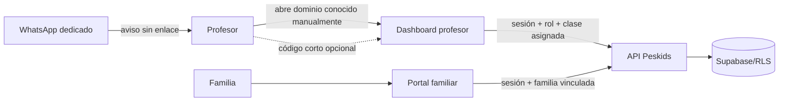

# Peskids — validación de dashboards y canal de confianza

## Hallazgo

El código actual ya contiene dos superficies distintas:

- `/teacher/dashboard`: agenda semanal, clases de hoy, asistencia por alumno,
  notas de clase y reagendamiento.
- `/familias`: agenda familiar, alumnos vinculados, reservas, progreso/formularios
  y pagos pendientes.

No deben crearse dashboards paralelos para resolver la desconfianza hacia los
enlaces de WhatsApp.

## Evidencia ejecutada

Se ejecutaron las pruebas de agenda, autenticación/acceso familiar y servicios
de dashboard: **6 archivos y 19 pruebas pasaron**.

Esto no equivale todavía a una prueba de navegador con una cuenta QA real.

## Diseño aprobado para el siguiente incremento

## Pendiente antes de activar

- Prueba QA real de login profesor y familia en navegador.
- Validar responsive y estados vacíos/error de ambos paneles.
- Implementar código de un solo uso si el cliente lo quiere; no usar tokens
  permanentes en WhatsApp.
- Definir proveedor oficial, número dedicado, opt-in y opt-out.
- Probar notificación `notify_only` sin modificar producción.
- Conectar confirmación de clase a la clase asignada, no a un mensaje libre.
